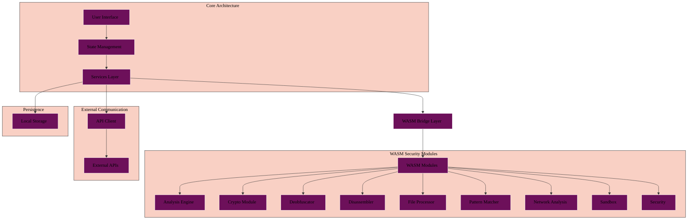

# Athena - AI-Powered Malware Analysis Assistant

<div align="center">
  

  [](https://deepwiki.com/radicalkjax/Athena)
</div>

Athena is a cross-platform application designed to help security researchers analyze and deobfuscate malware using various AI models. It provides a secure environment for malware analysis with features like isolated container execution and integration with the Metasploit database.

The foundation of Athena's idea and research comes from this research paper by Kali Jackson: [Deep Learning for Malware Analysis](https://radicalkjax.com/2025/04/21/deep-learning-for-malware-analysis.html).

## 📋 Navigation

<table>
<tr>
<td width="50%" valign="top">

### Table of Contents

- [📄 Overview](#-overview)
- [✨ Features](#-features)
- [🚀 Getting Started](#-getting-started)
  - [Prerequisites](#prerequisites)
  - [Installation](#installation)
  - [Configuration](#configuration)
- [📖 User Guide](#-user-guide)
- [🏗️ Architecture](#️-architecture)
- [📚 Documentation](#-documentation)
- [📱 Screenshots](#-screenshots)

</td>
<td width="50%" valign="top">

### 📚 Documentation

- [🚀 Quick Start Guide](./docs/QUICKSTART.md)
- [📘 Getting Started Guide](./docs/GETTING_STARTED.md)
- [📗 User Guide](./docs/USER_GUIDE.md)
- [📐 Architecture Documentation](./docs/ARCHITECTURE.md)
- [🔌 API Integration](./docs/API_INTEGRATION.md)
- [🔒 Container Isolation](./docs/CONTAINER_ISOLATION.md)
- [🔧 Troubleshooting Guide](./docs/TROUBLESHOOTING.md)
- [📊 Container Monitoring](./docs/components/CONTAINER_MONITORING.md)
- [🎨 Font Configuration](./docs/FONT_CONFIGURATION.md)

**Component Documentation:**
- [AIModelSelector](./docs/components/AI_MODEL_SELECTOR.md)
- [AnalysisOptionsPanel](./docs/components/ANALYSIS_OPTIONS_PANEL.md)
- [AnalysisResults](./docs/components/ANALYSIS_RESULTS.md)
- [ContainerConfigSelector](./docs/components/CONTAINER_CONFIG_SELECTOR.md)
- [FileUploader](./docs/components/FILE_UPLOADER.md)
- [ContainerMonitoring](./docs/components/CONTAINER_MONITORING.md)

</td>
</tr>
</table>

## 🔍 Overview

> **Status:** Implementation complete as of December 2025. All core features (9 WASM modules, 6 AI providers, Docker sandbox, 70+ Tauri commands) are fully implemented and tested. Currently in the testing and stabilization phase before production deployment.

Athena is a high-performance native desktop application built with **Tauri 2.0**:

- **Platform Support**:
  - **Desktop**: Windows, macOS (✅ verified), Linux
- **Technology Stack**:
  - **Backend**: Rust for performance and security
  - **Frontend**: SolidJS for reactive UI
  - **Analysis**: WebAssembly (WASM) modules for high-performance malware analysis
- **Launch**: Use `./athena.sh` to start the desktop application

Athena leverages multiple AI providers including OpenAI, Claude, DeepSeek, Gemini, Mistral, and Groq to analyze malicious code, deobfuscate it, and identify potential vulnerabilities.

The application is designed with security in mind, providing isolated container execution for safer analysis of potentially harmful code. It also integrates with the Metasploit database to provide additional context about identified vulnerabilities.

### 🤖 Rust: Building for the AI/Agentic Era

Athena's choice of Rust as the core backend technology positions the platform for the future of AI and agentic systems:

- **Memory Safety Without Garbage Collection**: Rust's ownership model provides deterministic memory management crucial for AI workloads where predictable performance matters. No unexpected GC pauses during time-sensitive malware analysis.

- **Fearless Concurrency**: Rust's type system prevents data races at compile time, enabling safe parallel processing of multiple AI model requests, WASM module execution, and concurrent malware analysis without locks or runtime overhead.

- **Zero-Cost Abstractions**: High-level abstractions compile down to efficient machine code, allowing AI agents to interact with low-level malware analysis operations without performance penalties.

- **WebAssembly Integration**: Rust's first-class WASM support enables sandboxed execution of AI-generated analysis code and untrusted binaries with cryptographic verification and component model isolation.

- **Type Safety for AI Interoperability**: Strong typing ensures AI-generated code integrations are verified at compile time, preventing runtime errors when AI agents orchestrate complex analysis workflows.

- **Cross-Platform Native Performance**: Single codebase deploys to desktop (Windows, macOS, Linux) with native performance, allowing AI agents to operate consistently across platforms.

- **Ecosystem for AI/ML**: Growing Rust ecosystem for machine learning (burn, candle, linfa) enables future on-device AI model inference, keeping sensitive malware analysis data local and secure.

By building on Rust, Athena is prepared for future enhancements like autonomous AI agents that can orchestrate multi-stage malware analysis, generate custom YARA rules, and adapt detection strategies—all while maintaining the security guarantees critical for malware analysis platforms.

### Athena Desktop Application

<div align="center">
  
  <p><em>AI-powered malware analysis platform with WASM-based security modules and real-time analysis</em></p>
</div>

## ✨ Features

- **🎨 Simple Launcher Script**: The `./athena.sh` script provides easy access to:
  - Development mode with hot reload
  - Production builds for all platforms
  - Pre-flight system checks
  - Test execution
- **⚡ WebAssembly (WASM) Integration**: 9 high-performance security analysis modules:
  - **Analysis Engine**: Core malware analysis with CFG, decompiler, and emulator
  - **Crypto Module**: Hash functions, AES/RSA encryption, S-box detection
  - **Deobfuscator**: Multi-technique deobfuscation with control flow analysis
  - **Disassembler**: x86/x64/ARM instruction decoding with metadata
  - **File Processor**: PE/ELF/Mach-O parsing with library extraction
  - **Pattern Matcher**: YARA-x integration for signature-based detection
  - **Network Analysis**: DNS/HTTP/TLS/HTTP2 protocol parsing
  - **Sandbox**: Syscall tracking and behavioral analysis
  - **Security**: Signature verification and threat classification
  - Built with Wasmtime Component Model for isolation and performance
- **Multiple AI Models**: Connect to 6 AI providers with resilience patterns:
  - OpenAI
  - Claude (Anthropic)
  - DeepSeek
  - Gemini (Google)
  - Mistral
  - Groq
  - Features: Circuit breaker, retry with exponential backoff, ensemble analysis
- **Secure Container Analysis**: Run malware in an isolated container environment for safer analysis
  - Support for Windows, Linux, and macOS containers
  - Configurable resource limits (CPU, memory, disk)
  - Isolated network environment
  - Real-time container monitoring
- **Advanced Analysis Options**: Configure analysis depth and focus areas
- **Persistent Storage**: SQLite database for storing:
  - Workflow configurations and job status
  - Analysis results and metadata
  - Local caching (with optional Redis for distributed caching)
- **Container Monitoring**: Comprehensive monitoring of container activity:
  - Resource usage (CPU, memory, disk, network)
  - Network connections and traffic
  - File system operations
  - Process creation and execution
  - Suspicious activity detection
- **Metasploit Integration**: Access the Metasploit database to identify vulnerabilities and related exploits
- **Deobfuscation**: Convert obfuscated malicious code into readable, understandable code
- **Vulnerability Detection**: Identify potential security vulnerabilities in the analyzed code
- **Cross-Platform Desktop**: Native applications for Windows, macOS, and Linux

## 🚀 Getting Started

### Prerequisites

Before you begin, ensure you have the following installed:

- [Rust](https://rustup.rs/) (latest stable) - **Required for Tauri backend**
- [Node.js](https://nodejs.org/) (v16 or later) - **Only for building the SolidJS frontend**
- [npm](https://www.npmjs.com/) (v8 or later) - **Only for managing frontend dependencies**
- [Tauri Prerequisites](https://tauri.app/v1/guides/getting-started/prerequisites) for your platform
- [Docker](https://www.docker.com/products/docker-desktop/) (optional) - Only needed if you want Redis caching
- API keys for the AI providers you want to use (at least one required):
  - [OpenAI API key](https://platform.openai.com/account/api-keys)
  - [Claude API key](https://console.anthropic.com/account/keys)
  - [DeepSeek API key](https://platform.deepseek.com/)
  - [Gemini API key](https://aistudio.google.com/app/apikey)
  - [Mistral API key](https://console.mistral.ai/api-keys/)
  - [Groq API key](https://console.groq.com/keys)

**Note:** Athena is now a **100% Tauri-only application**. The Node.js backend has been completely removed. Node.js is only used for building the frontend UI during development.

### Installation

1. Clone the repository:
   ```bash
   git clone https://github.com/yourusername/athena.git
   cd athena
   ```

2. **Launch Athena** (recommended):
   ```bash
   ./athena.sh
   ```

   This starts Athena in development mode with hot reload.

   **Other commands:**
   ```bash
   ./athena.sh build   # Build production application
   ./athena.sh test    # Run all tests
   ./athena.sh check   # Verify system requirements
   ```

3. **Manual setup** (if you prefer):
   ```bash
   cd athena-v2
   npm install
   npm run tauri:dev      # Development mode
   npm run tauri:build    # Production build
   ```

4. **Environment variables**:
   - Copy `.env.example` to `.env` in the root directory
   - Add your API keys (see [Configuration](#configuration))
   - Or use the API key validation script:
     ```bash
     node scripts/check-api-keys.js
     ```

### Configuration

Athena uses environment variables to securely store API keys and database configuration.

1. Create a `.env` file in the root of the Athena directory (this file is already gitignored)
2. Add your API keys and database configuration to the `.env` file using the following format:

```
# API Keys for AI Providers (at least one required)
OPENAI_API_KEY=your_openai_api_key_here
CLAUDE_API_KEY=your_claude_api_key_here
DEEPSEEK_API_KEY=your_deepseek_api_key_here
GEMINI_API_KEY=your_gemini_api_key_here
MISTRAL_API_KEY=your_mistral_api_key_here
GROQ_API_KEY=your_groq_api_key_here

# Redis Configuration (optional - for caching)
REDIS_HOST=localhost
REDIS_PORT=6379
# REDIS_PASSWORD=your_redis_password_here (if using password authentication)
```

3. You can use the provided `.env.example` file as a template
4. The database is configured using the environment variables above

## 📖 User Guide

### Starting the Application

**Simplest approach** - Use the launcher script:
```bash
./athena.sh
```

This will:
- Check system requirements
- Install dependencies if needed
- Start the Tauri desktop application in development mode

**Other commands:**
```bash
./athena.sh build   # Build production application
./athena.sh test    # Run all tests
./athena.sh check   # Verify system requirements
```

**Manual commands** (if you prefer):
```bash
cd athena-v2
npm run tauri:dev      # Development mode (hot reload)
npm run tauri:build    # Production build
```

**Platform-specific builds**:
```bash
# macOS (universal binary)
npm run tauri:build:macos

# Windows
npm run tauri:build:windows

# Linux
npm run tauri:build:linux
```

### Analyzing Malware

1. **Select an AI Model**: Choose from available AI models in the dropdown
2. **Upload a File**: Click the "Upload" button to select a malware file for analysis
3. **Configure Analysis Options**: 
   - **Container Isolation**: Enable to run analysis in an isolated container environment
   - **Container Configuration**: Select the container type (Windows, Linux, or macOS) and configure resource limits
   - **Analysis Depth**: Choose between quick scan or deep analysis
4. **Start Analysis**: Click the "Analyze" button to begin the analysis process
5. **View Results**: Once analysis is complete, view the results in the three tabs:
   - Deobfuscated Code: Shows the cleaned, readable version of the malware code
   - Analysis Report: Provides a detailed report of the analysis findings
   - Vulnerabilities: Lists detected vulnerabilities with severity ratings and details

## 🏗️ Architecture

Athena follows a modular architecture with clear separation of concerns. The application is built using Tauri 2.0 with a Rust backend and SolidJS frontend, enabling high-performance cross-platform compatibility. The core analysis capabilities are powered by high-performance WebAssembly modules.



For more detailed architecture information, see the [Architecture Documentation](./docs/ARCHITECTURE.md).

## 📚 Documentation

Athena comes with comprehensive documentation to help you understand and use the application effectively:

### 🗺️ **[📖 Documentation Hub](./docs/README.md)** ← **Start Here!**
*Complete navigation guide with visual maps, role-based workflows, and quick access to all documentation.*

### 🚀 Quick Access
- **[⚡ QUICKSTART](./docs/QUICKSTART.md)** - Get running in 2 minutes
- **[🔧 Getting Started](./docs/GETTING_STARTED.md)** - Complete setup and configuration guide  
- **[👤 User Guide](./docs/USER_GUIDE.md)** - How to use all features effectively
- **[🐛 Troubleshooting](./docs/TROUBLESHOOTING.md)** - Visual decision trees for common issues

### 🏗️ Technical Documentation
- **[📐 Architecture](./docs/ARCHITECTURE.md)** - System design and component overview
- **[⚡ WASM Architecture](./docs/WASM_ARCHITECTURE.md)** - WebAssembly modules and integration
- **[🤖 Ensemble Architecture](./docs/ENSEMBLE_ARCHITECTURE.md)** - Multi-agent ensemble approach
- **[🔌 API Integration](./docs/API_INTEGRATION.md)** - AI provider integration patterns
- **[🛡️ Container Isolation](./docs/CONTAINER_ISOLATION.md)** - Security and sandboxing
- **[⚡ Performance](./docs/performance/)** - Optimization, caching, and monitoring
- **[🧪 Testing](./docs/testing/)** - Test strategies and execution

### Component Documentation

- [AIModelSelector](./docs/components/AI_MODEL_SELECTOR.md) - Documentation for the AI model selection component
- [AnalysisOptionsPanel](./docs/components/ANALYSIS_OPTIONS_PANEL.md) - Documentation for the analysis options panel component
- [AnalysisResults](./docs/components/ANALYSIS_RESULTS.md) - Documentation for the analysis results component
- [ContainerConfigSelector](./docs/components/CONTAINER_CONFIG_SELECTOR.md) - Documentation for the container configuration component
- [FileUploader](./docs/components/FILE_UPLOADER.md) - Documentation for the file upload component
- [ContainerMonitoring](./docs/components/CONTAINER_MONITORING.md) - Documentation for the container monitoring component

