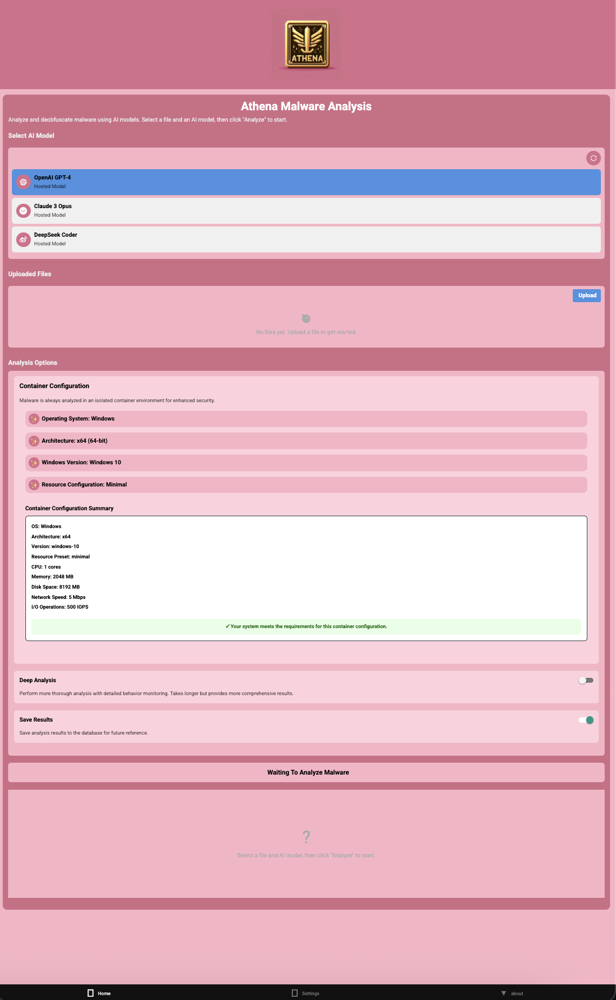
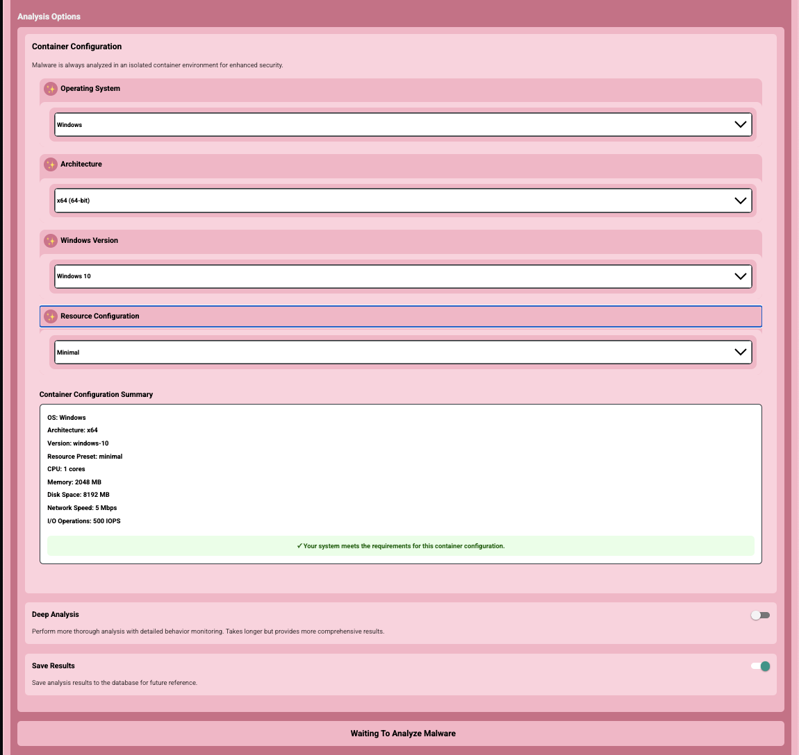

# Athena - AI-Powered Malware Analysis Assistant

<div align="center">
  
</div>

Athena is a cross-platform application designed to help security researchers analyze and deobfuscate malware using various AI models. It provides a secure environment for malware analysis with features like isolated container execution and integration with the Metasploit database.

The foundation of Athena's idea and research comes from this research paper by Kali Jackson: [Deep Learning for Malware Analysis](https://radicalkjax.com/2025/04/21/deep-learning-for-malware-analysis.html).

## 📋 Navigation

<table>
<tr>
<td width="50%" valign="top">

### Table of Contents

- [📄 Overview](#-overview)
- [✨ Features](#-features)
- [🚀 Getting Started](#-getting-started)
  - [Prerequisites](#prerequisites)
  - [Installation](#installation)
  - [Configuration](#configuration)
- [📖 User Guide](#-user-guide)
- [🏗️ Architecture](#️-architecture)
- [📚 Documentation](#-documentation)
- [📱 Screenshots](#-screenshots)

</td>
<td width="50%" valign="top">

### 📚 Documentation

- [🚀 Quick Start Guide](./docs/QUICKSTART.md)
- [📘 Getting Started Guide](./docs/GETTING_STARTED.md)
- [📗 User Guide](./docs/USER_GUIDE.md)
- [📐 Architecture Documentation](./docs/ARCHITECTURE.md)
- [🔌 API Integration](./docs/API_INTEGRATION.md)
- [🔒 Container Isolation](./docs/CONTAINER_ISOLATION.md)
- [🔧 Troubleshooting Guide](./docs/TROUBLESHOOTING.md)
- [📊 Container Monitoring](./docs/components/CONTAINER_MONITORING.md)
- [🎨 Font Configuration](./docs/FONT_CONFIGURATION.md)

**Component Documentation:**
- [AIModelSelector](./docs/components/AI_MODEL_SELECTOR.md)
- [AnalysisOptionsPanel](./docs/components/ANALYSIS_OPTIONS_PANEL.md)
- [AnalysisResults](./docs/components/ANALYSIS_RESULTS.md)
- [ContainerConfigSelector](./docs/components/CONTAINER_CONFIG_SELECTOR.md)
- [FileUploader](./docs/components/FILE_UPLOADER.md)
- [ContainerMonitoring](./docs/components/CONTAINER_MONITORING.md)

</td>
</tr>
</table>

## 🔍 Overview

> **IMPORTANT DISCLAIMER:** The containerization and analysis components described in this documentation are still being designed and developed. Their current implementation and documentation are not reflective of what the final design could be. This documentation represents a conceptual overview and may change significantly as development progresses.

Athena is built using React Native with Expo, enabling cross-platform compatibility across iOS, Android, and web platforms. It leverages the power of AI models like OpenAI's GPT-4, Claude 3 Opus, and DeepSeek Coder to analyze malicious code, deobfuscate it, and identify potential vulnerabilities.

The application is designed with security in mind, providing isolated container execution for safer analysis of potentially harmful code. It also integrates with the Metasploit database to provide additional context about identified vulnerabilities.

## ✨ Features

- **🎨 Beautiful Interactive CLI**: New `/scripts/athena` command provides a gorgeous menu-driven interface with:
  - Visual ASCII art banner with trans colors
  - One-click access to all Athena features  
  - Automated setup and configuration
  - System health checks and maintenance tools
- **⚡ WebAssembly (WASM) Integration**: High-performance security analysis modules:
  - **Analysis Engine**: Core malware analysis and threat detection
  - **Crypto Module**: Advanced cryptographic operations and hash verification
  - **Deobfuscator**: Real-time code deobfuscation and unpacking
  - **File Processor**: Binary parsing and format analysis
  - **Pattern Matcher**: Signature-based malware detection
  - **Network Analysis**: Protocol parsing and traffic analysis
  - **Sandbox**: Isolated WASM-based execution environment
  - All modules optimized with Binaryen for maximum performance
- **Multiple AI Models**: Connect to different AI models including:
  - OpenAI GPT-4
  - Claude 3 Opus
  - DeepSeek Coder
- **Secure Container Analysis**: Run malware in an isolated container environment for safer analysis
  - Support for Windows, Linux, and macOS containers
  - Configurable resource limits (CPU, memory, disk)
  - Isolated network environment
  - Real-time container monitoring
- **Advanced Analysis Options**: Configure analysis depth and focus areas
- **Persistent Storage**: PostgreSQL database for storing:
  - Container configurations
  - Analysis results
  - Monitoring data
  - Activity logs
- **Container Monitoring**: Comprehensive monitoring of container activity:
  - Resource usage (CPU, memory, disk, network)
  - Network connections and traffic
  - File system operations
  - Process creation and execution
  - Suspicious activity detection
- **Metasploit Integration**: Access the Metasploit database to identify vulnerabilities and related exploits
- **Deobfuscation**: Convert obfuscated malicious code into readable, understandable code
- **Vulnerability Detection**: Identify potential security vulnerabilities in the analyzed code
- **Cross-Platform**: Works on iOS, Android, and web platforms

## 🚀 Getting Started

### Prerequisites

Before you begin, ensure you have the following installed:

- [Node.js](https://nodejs.org/) (v16 or later)
- [npm](https://www.npmjs.com/) (v8 or later)
- [Expo CLI](https://docs.expo.dev/get-started/installation/) (for development)
- [Docker](https://www.docker.com/products/docker-desktop/) and [Docker Compose](https://docs.docker.com/compose/install/) (for database setup)
- [PostgreSQL](https://www.postgresql.org/download/) (optional, if not using Docker)
- API keys for the AI models you want to use:
  - [OpenAI API key](https://platform.openai.com/account/api-keys)
  - [Claude API key](https://console.anthropic.com/account/keys)
  - [DeepSeek API key](https://platform.deepseek.com/)

### Installation

1. Clone the repository:
   ```bash
   git clone https://github.com/yourusername/athena.git
   cd athena
   ```

2. **Launch Interactive CLI** (recommended):
   ```bash
   ./scripts/athena
   ```
   
   The beautiful interactive CLI will:
   - Show you a visual menu with all options
   - Auto-detect and run setup on first use
   - Guide you through API key configuration
   - Provide easy access to all Athena features
   
   **Quick Start: Select Option 1 (🚀 Start Athena Web)**
   - Build and launch the web application
   
   **That's it!** The script handles everything automatically.

3. **Optional: Manual setup** (if you prefer manual control):
   ```bash
   ./scripts/run.sh setup  # Force setup only
   npm install
   cd Athena
   npm install
   npm install buffer process --save
   ```

4. **Environment variables** (optional):
   - The script creates a `.env` file automatically from the template
   - Edit `Athena/.env` to add your API keys (see [Configuration](#configuration))
   - Or use the API key validation script:
     ```bash
     node scripts/check-api-keys.js
     ```

### Configuration

Athena uses environment variables to securely store API keys and database configuration.

1. Create a `.env` file in the root of the Athena directory (this file is already gitignored)
2. Add your API keys and database configuration to the `.env` file using the following format:

```
# API Keys for AI Models
OPENAI_API_KEY=your_openai_api_key_here
CLAUDE_API_KEY=your_claude_api_key_here
DEEPSEEK_API_KEY=your_deepseek_api_key_here

# Optional: Override API Base URLs if needed
# OPENAI_API_BASE_URL=https://api.openai.com/v1
# CLAUDE_API_BASE_URL=https://api.anthropic.com/v1
# DEEPSEEK_API_BASE_URL=https://api.deepseek.com/v1

# Database Configuration
DB_HOST=localhost
DB_PORT=5432
DB_NAME=athena_db
DB_USER=postgres
DB_PASSWORD=postgres
DB_DIALECT=postgres

# pgAdmin Configuration (for Docker setup)
PGADMIN_EMAIL=admin@athena.local
PGADMIN_PASSWORD=admin
PGADMIN_PORT=5050
```

3. You can use the provided `.env.example` file as a template
4. The database is configured using the environment variables above

## 📖 User Guide

### Starting the Application

**Simplest approach** - Just run one command:
```bash
./scripts/run.sh
```

This unified script will:
- 🔍 **Auto-detect** if setup is needed (first time or missing dependencies)
- 🔧 **Auto-setup** all dependencies and configuration if needed
- 🔄 **Check for updates** if already set up
- 🚀 **Build and launch** the web application automatically

**Advanced options** - You can also specify different platforms:
```bash
# Web version (default) - Recommended
./scripts/run.sh web

# iOS version (requires macOS + Xcode)
./scripts/run.sh ios

# Android version (requires Android SDK)
./scripts/run.sh android

# Expo version (currently not working)
./scripts/run.sh expo

# Force setup only (without running)
./scripts/run.sh setup
```

**Manual commands** (if you prefer manual control):
```bash
cd Athena
npm run build:web
npx serve dist
```

> **Note:** The Expo launch method is currently not working. Please use the web version with `./scripts/run.sh` instead.

When working, this would start the Expo development server, allowing you to run the app on:
- iOS simulator
- Android emulator
- Web browser
- Expo Go app on a physical device

### Analyzing Malware

1. **Select an AI Model**: Choose from available AI models in the dropdown
2. **Upload a File**: Click the "Upload" button to select a malware file for analysis
3. **Configure Analysis Options**: 
   - **Container Isolation**: Enable to run analysis in an isolated container environment
   - **Container Configuration**: Select the container type (Windows, Linux, or macOS) and configure resource limits
   - **Analysis Depth**: Choose between quick scan or deep analysis
4. **Start Analysis**: Click the "Analyze" button to begin the analysis process
5. **View Results**: Once analysis is complete, view the results in the three tabs:
   - Deobfuscated Code: Shows the cleaned, readable version of the malware code
   - Analysis Report: Provides a detailed report of the analysis findings
   - Vulnerabilities: Lists detected vulnerabilities with severity ratings and details

## 🏗️ Architecture

Athena follows a modular architecture with clear separation of concerns. The application is built using React Native with Expo, enabling cross-platform compatibility across iOS, Android, and web platforms. The core analysis capabilities are powered by high-performance WebAssembly modules.


For more detailed architecture information, see the [Architecture Documentation](./docs/ARCHITECTURE.md).

## 📚 Documentation

Athena comes with comprehensive documentation to help you understand and use the application effectively:

### 🗺️ **[📖 Documentation Hub](./docs/README.md)** ← **Start Here!**
*Complete navigation guide with visual maps, role-based workflows, and quick access to all documentation.*

### 🚀 Quick Access
- **[⚡ QUICKSTART](./docs/QUICKSTART.md)** - Get running in 2 minutes with the new interactive CLI
- **[🔧 Getting Started](./docs/GETTING_STARTED.md)** - Complete setup and configuration guide  
- **[👤 User Guide](./docs/USER_GUIDE.md)** - How to use all features effectively
- **[🐛 Troubleshooting](./docs/TROUBLESHOOTING.md)** - Visual decision trees for common issues

### 🏗️ Technical Documentation
- **[📐 Architecture](./docs/ARCHITECTURE.md)** - System design and component overview
- **[⚡ WASM Architecture](./docs/WASM_ARCHITECTURE.md)** - WebAssembly modules and integration
- **[🤖 Ensemble Architecture](./docs/ENSEMBLE_ARCHITECTURE.md)** - Multi-agent ensemble approach
- **[🔌 API Integration](./docs/API_INTEGRATION.md)** - AI provider integration patterns
- **[🛡️ Container Isolation](./docs/CONTAINER_ISOLATION.md)** - Security and sandboxing
- **[⚡ Performance](./docs/performance/)** - Optimization, caching, and monitoring
- **[🧪 Testing](./docs/testing/)** - Test strategies and execution

### Component Documentation

- [AIModelSelector](./docs/components/AI_MODEL_SELECTOR.md) - Documentation for the AI model selection component
- [AnalysisOptionsPanel](./docs/components/ANALYSIS_OPTIONS_PANEL.md) - Documentation for the analysis options panel component
- [AnalysisResults](./docs/components/ANALYSIS_RESULTS.md) - Documentation for the analysis results component
- [ContainerConfigSelector](./docs/components/CONTAINER_CONFIG_SELECTOR.md) - Documentation for the container configuration component
- [FileUploader](./docs/components/FILE_UPLOADER.md) - Documentation for the file upload component
- [ContainerMonitoring](./docs/components/CONTAINER_MONITORING.md) - Documentation for the container monitoring component

## 📱 Screenshots

<div align="center">
  <table>
    <tr>
      <td align="center"><b>Home Screen</b></td>
      <td align="center"><b>About Screen</b></td>
      <td align="center"><b>Settings Screen</b></td>
      <td align="center"><b>Expanded Container Config View</b></td>
    </tr>
    <tr>
      <td></td>
      <td></td>
      <td></td>
      <td></td>
    </tr>
    <tr>
      <td>Main interface for analyzing malware files</td>
      <td>Information about Athena's features</td>
      <td>Configuration of API keys and settings</td>
      <td>Detailed container configuration options</td>
    </tr>
  </table>
</div>
