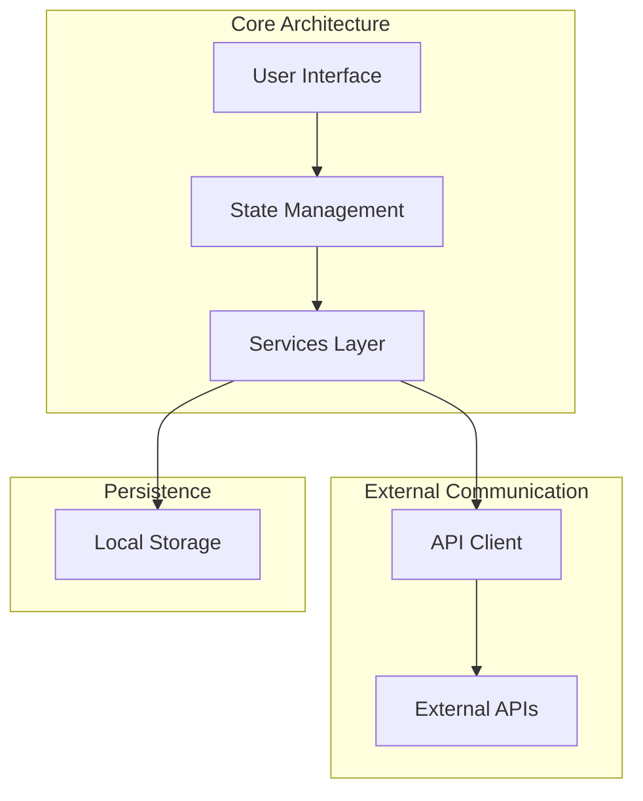

# Athena - AI-Powered Malware Analysis Assistant

<div align="center">
  
</div>

Athena is a cross-platform application designed to help security researchers analyze and deobfuscate malware using various AI models. It provides a secure environment for malware analysis with features like isolated container execution and integration with the Metasploit database.

The foundation of Athena's idea and research comes from this research paper by Kali Jackson: [Deep Learning for Malware Analysis](https://radicalkjax.com/2025/04/21/deep-learning-for-malware-analysis.html).

## 📋 Navigation

<div style="display: flex; justify-content: center; margin: 20px 0;">
  <div style="display: flex; width: 90%; max-width: 1200px; background-color: #f8f9fa; border-radius: 8px; overflow: hidden; box-shadow: 0 2px 10px rgba(0,0,0,0.1);">
    
    <!-- Left Column: Table of Contents -->
    <div style="flex: 1; padding: 20px; border-right: 1px solid #e1e4e8;">
      <h3 style="margin-top: 0; color: #24292e; font-size: 1.3em; border-bottom: 2px solid #0366d6; padding-bottom: 8px; margin-bottom: 16px;">
        Table of Contents
      </h3>
      <ul style="list-style-type: none; padding-left: 0; margin-top: 0;">
        <li style="margin-bottom: 8px;">📄 <a href="#-overview" style="text-decoration: none; color: #0366d6;">Overview</a></li>
        <li style="margin-bottom: 8px;">✨ <a href="#-features" style="text-decoration: none; color: #0366d6;">Features</a></li>
        <li style="margin-bottom: 8px;">🚀 <a href="#-getting-started" style="text-decoration: none; color: #0366d6;">Getting Started</a>
          <ul style="list-style-type: none; padding-left: 20px; margin-top: 8px;">
            <li style="margin-bottom: 6px;">◦ <a href="#prerequisites" style="text-decoration: none; color: #0366d6;">Prerequisites</a></li>
            <li style="margin-bottom: 6px;">◦ <a href="#installation" style="text-decoration: none; color: #0366d6;">Installation</a></li>
            <li style="margin-bottom: 6px;">◦ <a href="#configuration" style="text-decoration: none; color: #0366d6;">Configuration</a></li>
          </ul>
        </li>
        <li style="margin-bottom: 8px;">📖 <a href="#-user-guide" style="text-decoration: none; color: #0366d6;">User Guide</a></li>
        <li style="margin-bottom: 8px;">🏗️ <a href="#️-architecture" style="text-decoration: none; color: #0366d6;">Architecture</a></li>
        <li style="margin-bottom: 8px;">📚 <a href="#-documentation" style="text-decoration: none; color: #0366d6;">Documentation</a></li>
        <li style="margin-bottom: 8px;">📱 <a href="#-screenshots" style="text-decoration: none; color: #0366d6;">Screenshots</a></li>
      </ul>
    </div>
    
    <!-- Right Column: Documentation -->
    <div style="flex: 1; padding: 20px;">
      <h3 style="margin-top: 0; color: #24292e; font-size: 1.3em; border-bottom: 2px solid #0366d6; padding-bottom: 8px; margin-bottom: 16px;">
        📚 Documentation
      </h3>
      <ul style="list-style-type: none; padding-left: 0; margin-top: 0;">
        <li style="margin-bottom: 8px;">📘 <a href="./docs/GETTING_STARTED.md" style="text-decoration: none; color: #0366d6;">Getting Started Guide</a></li>
        <li style="margin-bottom: 8px;">📗 <a href="./docs/USER_GUIDE.md" style="text-decoration: none; color: #0366d6;">User Guide</a></li>
        <li style="margin-bottom: 8px;">📐 <a href="./docs/ARCHITECTURE.md" style="text-decoration: none; color: #0366d6;">Architecture Documentation</a></li>
        <li style="margin-bottom: 8px;">🔌 <a href="./docs/API_INTEGRATION.md" style="text-decoration: none; color: #0366d6;">API Integration</a></li>
        <li style="margin-bottom: 8px;">🔒 <a href="./docs/CONTAINER_ISOLATION.md" style="text-decoration: none; color: #0366d6;">Container Isolation</a></li>
        <li style="margin-bottom: 8px;">💾 <a href="./Athena/docs/DATABASE_SETUP.md" style="text-decoration: none; color: #0366d6;">Database Setup</a></li>
        <li style="margin-bottom: 8px;">📊 <a href="./Athena/docs/CONTAINER_MONITORING.md" style="text-decoration: none; color: #0366d6;">Container Monitoring</a></li>
        <li style="margin-bottom: 8px; margin-top: 16px;">
          <strong style="display: block; margin-bottom: 8px; color: #24292e;">Component Documentation:</strong>
          <ul style="list-style-type: none; padding-left: 20px;">
            <li style="margin-bottom: 6px;">◦ <a href="./docs/components/AI_MODEL_SELECTOR.md" style="text-decoration: none; color: #0366d6;">AIModelSelector</a></li>
            <li style="margin-bottom: 6px;">◦ <a href="./docs/components/ANALYSIS_OPTIONS_PANEL.md" style="text-decoration: none; color: #0366d6;">AnalysisOptionsPanel</a></li>
            <li style="margin-bottom: 6px;">◦ <a href="./docs/components/ANALYSIS_RESULTS.md" style="text-decoration: none; color: #0366d6;">AnalysisResults</a></li>
            <li style="margin-bottom: 6px;">◦ <a href="./docs/components/CONTAINER_CONFIG_SELECTOR.md" style="text-decoration: none; color: #0366d6;">ContainerConfigSelector</a></li>
            <li style="margin-bottom: 6px;">◦ <a href="./docs/components/FILE_UPLOADER.md" style="text-decoration: none; color: #0366d6;">FileUploader</a></li>
            <li style="margin-bottom: 6px;">◦ <a href="./Athena/docs/components/CONTAINER_MONITORING.md" style="text-decoration: none; color: #0366d6;">ContainerMonitoring</a></li>
          </ul>
        </li>
      </ul>
    </div>
  </div>
</div>

## 🔍 Overview

> **IMPORTANT DISCLAIMER:** The containerization and analysis components described in this documentation are still being designed and developed. Their current implementation and documentation are not reflective of what the final design could be. This documentation represents a conceptual overview and may change significantly as development progresses.

Athena is built using React Native with Expo, enabling cross-platform compatibility across iOS, Android, and web platforms. It leverages the power of AI models like OpenAI's GPT-4, Claude 3 Opus, and DeepSeek Coder to analyze malicious code, deobfuscate it, and identify potential vulnerabilities.

The application is designed with security in mind, providing isolated container execution for safer analysis of potentially harmful code. It also integrates with the Metasploit database to provide additional context about identified vulnerabilities.

## ✨ Features

- **Multiple AI Models**: Connect to different AI models including:
  - OpenAI GPT-4
  - Claude 3 Opus
  - DeepSeek Coder
- **Secure Container Analysis**: Run malware in an isolated container environment for safer analysis
  - Support for Windows, Linux, and macOS containers
  - Configurable resource limits (CPU, memory, disk)
  - Isolated network environment
  - Real-time container monitoring
- **Advanced Analysis Options**: Configure analysis depth and focus areas
- **Persistent Storage**: PostgreSQL database for storing:
  - Container configurations
  - Analysis results
  - Monitoring data
  - Activity logs
- **Container Monitoring**: Comprehensive monitoring of container activity:
  - Resource usage (CPU, memory, disk, network)
  - Network connections and traffic
  - File system operations
  - Process creation and execution
  - Suspicious activity detection
- **Metasploit Integration**: Access the Metasploit database to identify vulnerabilities and related exploits
- **Deobfuscation**: Convert obfuscated malicious code into readable, understandable code
- **Vulnerability Detection**: Identify potential security vulnerabilities in the analyzed code
- **Cross-Platform**: Works on iOS, Android, and web platforms

## 🚀 Getting Started

### Prerequisites

Before you begin, ensure you have the following installed:

- [Node.js](https://nodejs.org/) (v16 or later)
- [npm](https://www.npmjs.com/) (v8 or later)
- [Expo CLI](https://docs.expo.dev/get-started/installation/) (for development)
- [Docker](https://www.docker.com/products/docker-desktop/) and [Docker Compose](https://docs.docker.com/compose/install/) (for database setup)
- [PostgreSQL](https://www.postgresql.org/download/) (optional, if not using Docker)
- API keys for the AI models you want to use:
  - [OpenAI API key](https://platform.openai.com/account/api-keys)
  - [Claude API key](https://console.anthropic.com/account/keys)
  - [DeepSeek API key](https://platform.deepseek.com/)

### Installation

1. Clone the repository:
   ```bash
   git clone https://github.com/yourusername/athena.git
   cd athena
   ```

2. Use the setup script (recommended):
   ```bash
   chmod +x scripts/setup.sh
   ./scripts/setup.sh
   ```
   
   Or manually install dependencies:
   ```bash
   npm install
   ```

3. Set up environment variables:
   - Create a `.env` file in the Athena directory
   - Add your API keys (see [Configuration](#configuration) for details)
   - Or use the API key validation script:
     ```bash
     node scripts/check-api-keys.js
     ```

### Configuration

Athena uses environment variables to securely store API keys and database configuration.

1. Create a `.env` file in the root of the Athena directory (this file is already gitignored)
2. Add your API keys and database configuration to the `.env` file using the following format:

```
# API Keys for AI Models
OPENAI_API_KEY=your_openai_api_key_here
CLAUDE_API_KEY=your_claude_api_key_here
DEEPSEEK_API_KEY=your_deepseek_api_key_here

# Optional: Override API Base URLs if needed
# OPENAI_API_BASE_URL=https://api.openai.com/v1
# CLAUDE_API_BASE_URL=https://api.anthropic.com/v1
# DEEPSEEK_API_BASE_URL=https://api.deepseek.com/v1

# Database Configuration
DB_HOST=localhost
DB_PORT=5432
DB_NAME=athena_db
DB_USER=postgres
DB_PASSWORD=postgres
DB_DIALECT=postgres

# pgAdmin Configuration (for Docker setup)
PGADMIN_EMAIL=admin@athena.local
PGADMIN_PASSWORD=admin
PGADMIN_PORT=5050
```

3. You can use the provided `.env.example` file as a template
4. For database setup, see the [Database Setup Documentation](./Athena/docs/DATABASE_SETUP.md)

## 📖 User Guide

### Starting the Application

You can use the run script to start the application in different modes:
```bash
# Run in web mode (default)
./scripts/run.sh

# Run in iOS mode (requires macOS)
./scripts/run.sh ios

# Run in Android mode
./scripts/run.sh android

# Run using Expo
./scripts/run.sh expo
```

Or you can use the standard commands:

For web development (recommended approach):
```bash
npx serve dist
```

This command serves the built app from the dist directory using a static file server.

For mobile development (Note: Currently not working):
```bash
npx expo start
```

> **Note:** The Expo launch method is currently not working. Please use the web version with `npx serve dist` instead.

When working, this would start the Expo development server, allowing you to run the app on:
- iOS simulator
- Android emulator
- Web browser
- Expo Go app on a physical device

### Analyzing Malware

1. **Select an AI Model**: Choose from available AI models in the dropdown
2. **Upload a File**: Click the "Upload" button to select a malware file for analysis
3. **Configure Analysis Options**: 
   - **Container Isolation**: Enable to run analysis in an isolated container environment
   - **Container Configuration**: Select the container type (Windows, Linux, or macOS) and configure resource limits
   - **Analysis Depth**: Choose between quick scan or deep analysis
4. **Start Analysis**: Click the "Analyze" button to begin the analysis process
5. **View Results**: Once analysis is complete, view the results in the three tabs:
   - Deobfuscated Code: Shows the cleaned, readable version of the malware code
   - Analysis Report: Provides a detailed report of the analysis findings
   - Vulnerabilities: Lists detected vulnerabilities with severity ratings and details

## 🏗️ Architecture

Athena follows a modular architecture with clear separation of concerns. The application is built using React Native with Expo, enabling cross-platform compatibility across iOS, Android, and web platforms.



For more detailed architecture information, see the [Architecture Documentation](./docs/ARCHITECTURE.md).

## 📚 Documentation

Athena comes with comprehensive documentation to help you understand and use the application effectively:

- [Getting Started](./docs/GETTING_STARTED.md) - Step-by-step guide to set up and start using Athena
- [User Guide](./docs/USER_GUIDE.md) - Detailed instructions for using Athena
- [Architecture Documentation](./docs/ARCHITECTURE.md) - Overview of Athena's architecture and components
- [API Integration](./docs/API_INTEGRATION.md) - Details about AI model API integration
- [Container Isolation](./docs/CONTAINER_ISOLATION.md) - Information about the container isolation feature
- [Database Setup](./Athena/docs/DATABASE_SETUP.md) - Instructions for setting up and using the PostgreSQL database
- [Container Monitoring](./Athena/docs/CONTAINER_MONITORING.md) - Details about the container monitoring system

### Component Documentation

- [AIModelSelector](./docs/components/AI_MODEL_SELECTOR.md) - Documentation for the AI model selection component
- [AnalysisOptionsPanel](./docs/components/ANALYSIS_OPTIONS_PANEL.md) - Documentation for the analysis options panel component
- [AnalysisResults](./docs/components/ANALYSIS_RESULTS.md) - Documentation for the analysis results component
- [ContainerConfigSelector](./docs/components/CONTAINER_CONFIG_SELECTOR.md) - Documentation for the container configuration component
- [FileUploader](./docs/components/FILE_UPLOADER.md) - Documentation for the file upload component
- [ContainerMonitoring](./Athena/docs/components/CONTAINER_MONITORING.md) - Documentation for the container monitoring component

## 📱 Screenshots

<div align="center">
  <table>
    <tr>
      <td align="center"><b>Home Screen</b></td>
      <td align="center"><b>About Screen</b></td>
      <td align="center"><b>Settings Screen</b></td>
      <td align="center"><b>Expanded Container Config View</b></td>
    </tr>
    <tr>
      <td></td>
      <td></td>
      <td></td>
      <td></td>
    </tr>
    <tr>
      <td>Main interface for analyzing malware files</td>
      <td>Information about Athena's features</td>
      <td>Configuration of API keys and settings</td>
      <td>Detailed container configuration options</td>
    </tr>
  </table>
</div>
