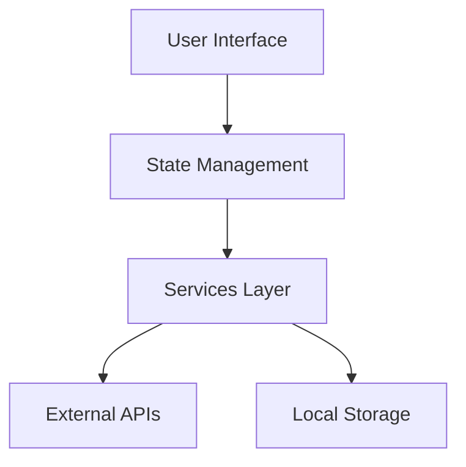

# Athena - AI-Powered Malware Analysis Assistant


Athena is a cross-platform application designed to help security researchers analyze and deobfuscate malware using various AI models. It provides a secure environment for malware analysis with features like isolated container execution and integration with the Metasploit database.

## 📋 Table of Contents

- [Overview](#overview)
- [Features](#features)
- [Screenshots](#screenshots)
- [Getting Started](#getting-started)
  - [Prerequisites](#prerequisites)
  - [Installation](#installation)
  - [Configuration](#configuration)
- [Usage Guide](#usage-guide)
- [Architecture](#architecture)
- [Documentation](#documentation)
- [License](#license)

## 🔍 Overview

> **IMPORTANT DISCLAIMER:** The containerization and analysis components described in this documentation are still being designed and developed. Their current implementation and documentation are not reflective of what the final design could be. This documentation represents a conceptual overview and may change significantly as development progresses.

Athena is built using React Native with Expo, enabling cross-platform compatibility across iOS, Android, and web platforms. It leverages the power of AI models like OpenAI's GPT-4, Claude 3 Opus, and DeepSeek Coder to analyze malicious code, deobfuscate it, and identify potential vulnerabilities.

The application is designed with security in mind, providing isolated container execution for safer analysis of potentially harmful code. It also integrates with the Metasploit database to provide additional context about identified vulnerabilities.

## ✨ Features

- **Multiple AI Models**: Connect to different AI models including:
  - OpenAI GPT-4
  - Claude 3 Opus
  - DeepSeek Coder
- **Secure Container Analysis**: Run malware in an isolated container environment for safer analysis
- **Metasploit Integration**: Access the Metasploit database to identify vulnerabilities and related exploits
- **Deobfuscation**: Convert obfuscated malicious code into readable, understandable code
- **Vulnerability Detection**: Identify potential security vulnerabilities in the analyzed code
- **Cross-Platform**: Works on iOS, Android, and web platforms

## 📱 Screenshots

### Home Screen


The Home screen is the main interface for analyzing malware files. It features:
- AI Model selection
- File upload functionality
- Container isolation option
- Analysis button
- Results display area

### About Screen


The About screen provides information about Athena and its features:
- Overview of Athena's purpose
- Detailed information about AI models
- Secure container analysis features
- Metasploit integration details
- Security features

### Settings Screen


The Settings screen allows configuration of API keys and other settings:
- OpenAI API key configuration
- Claude API key configuration
- DeepSeek API key configuration
- Local model settings
- Save and clear options

## 🚀 Getting Started

### Prerequisites

Before you begin, ensure you have the following installed:

- [Node.js](https://nodejs.org/) (v16 or later)
- [npm](https://www.npmjs.com/) (v8 or later)
- [Expo CLI](https://docs.expo.dev/get-started/installation/) (for development)
- API keys for the AI models you want to use:
  - [OpenAI API key](https://platform.openai.com/account/api-keys)
  - [Claude API key](https://console.anthropic.com/account/keys)
  - [DeepSeek API key](https://platform.deepseek.com/)

### Installation

1. Clone the repository:
   ```bash
   git clone https://github.com/yourusername/athena.git
   cd athena
   ```

2. Use the setup script (recommended):
   ```bash
   chmod +x scripts/setup.sh
   ./scripts/setup.sh
   ```
   
   Or manually install dependencies:
   ```bash
   npm install
   ```

3. Set up environment variables:
   - Create a `.env` file in the Athena directory
   - Add your API keys (see [Configuration](#configuration) for details)
   - Or use the API key validation script:
     ```bash
     node scripts/check-api-keys.js
     ```

### Configuration

Athena uses environment variables to securely store API keys for various AI services.

1. Create a `.env` file in the root of the Athena directory (this file is already gitignored)
2. Add your API keys to the `.env` file using the following format:

```
# API Keys for AI Models
OPENAI_API_KEY=your_openai_api_key_here
CLAUDE_API_KEY=your_claude_api_key_here
DEEPSEEK_API_KEY=your_deepseek_api_key_here

# Optional: Override API Base URLs if needed
# OPENAI_API_BASE_URL=https://api.openai.com/v1
# CLAUDE_API_BASE_URL=https://api.anthropic.com/v1
# DEEPSEEK_API_BASE_URL=https://api.deepseek.com/v1
```

3. You can use the provided `.env.example` file as a template

## 📖 Usage Guide

### Starting the Application

You can use the run script to start the application in different modes:
```bash
# Run in web mode (default)
./scripts/run.sh

# Run in iOS mode (requires macOS)
./scripts/run.sh ios

# Run in Android mode
./scripts/run.sh android

# Run using Expo
./scripts/run.sh expo
```

Or you can use the standard commands:

For web development (recommended approach):
```bash
npm run start:web
```

This command builds the app with environment variables properly bundled and serves it using a static file server.

For mobile development:
```bash
npx expo start
```

This will start the Expo development server, allowing you to run the app on:
- iOS simulator
- Android emulator
- Web browser
- Expo Go app on a physical device

### Analyzing Malware

1. **Select an AI Model**: Choose from available AI models in the dropdown
2. **Upload a File**: Click the "Upload" button to select a malware file for analysis
3. **Configure Analysis Options**: Choose whether to use container isolation
4. **Start Analysis**: Click the "Analyze" button to begin the analysis process
5. **View Results**: Once analysis is complete, view the results in the three tabs:
   - Deobfuscated Code: Shows the cleaned, readable version of the malware code
   - Analysis Report: Provides a detailed report of the analysis findings
   - Vulnerabilities: Lists detected vulnerabilities with severity ratings and details

## 🏗️ Architecture

Athena follows a modular architecture with clear separation of concerns. The application is built using React Native with Expo, enabling cross-platform compatibility across iOS, Android, and web platforms.



For more detailed architecture information, see the [Architecture Documentation](./docs/ARCHITECTURE.md).

## 📚 Documentation

Athena comes with comprehensive documentation to help you understand and use the application effectively:

- [Getting Started](./docs/GETTING_STARTED.md) - Step-by-step guide to set up and start using Athena
- [User Guide](./docs/USER_GUIDE.md) - Detailed instructions for using Athena
- [Architecture Documentation](./docs/ARCHITECTURE.md) - Overview of Athena's architecture and components
- [API Integration](./docs/API_INTEGRATION.md) - Details about AI model API integration
- [Container Isolation](./docs/CONTAINER_ISOLATION.md) - Information about the container isolation feature

### Component Documentation

- [AIModelSelector](./docs/components/AI_MODEL_SELECTOR.md) - Documentation for the AI model selection component
- [FileUploader](./docs/components/FILE_UPLOADER.md) - Documentation for the file upload component
- [AnalysisResults](./docs/components/ANALYSIS_RESULTS.md) - Documentation for the analysis results component
