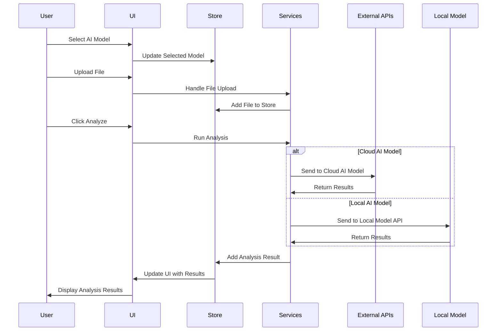
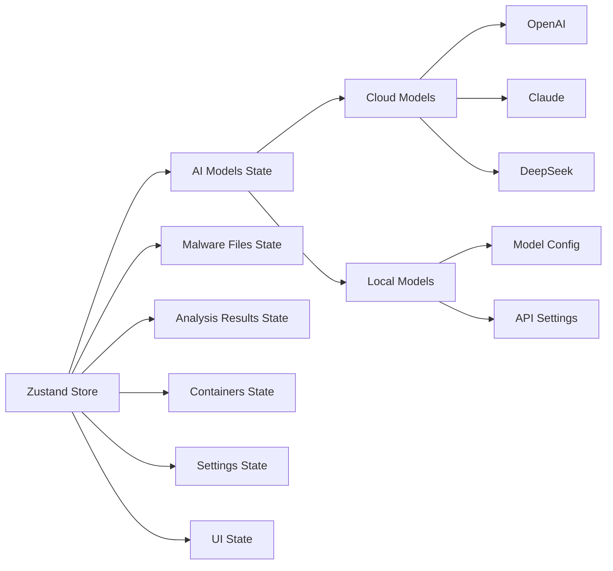
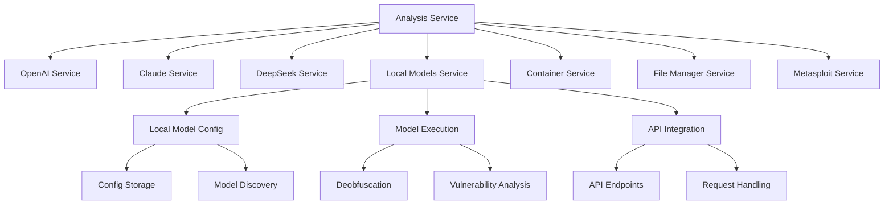
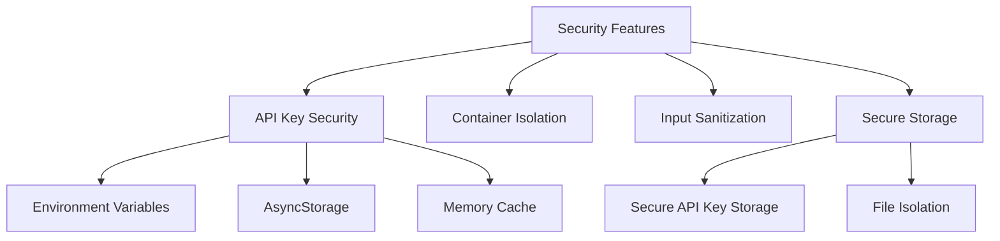

# Athena - AI-Powered Malware Analysis Assistant

Athena is a React Native application designed to help security researchers analyze and deobfuscate malware using various AI models. It provides a secure environment for malware analysis with features like isolated container execution and integration with the Metasploit database.

## Features

> **Note:** Local model functionality is currently disabled to focus on connecting to online AI agents. The codebase includes the infrastructure for local models, but this feature is not active in the current version.

- **Multiple AI Models**: Connect to different AI models including OpenAI GPT-4, Claude 3 Opus, and DeepSeek Coder
- **Secure Container Analysis**: Run malware in an isolated container environment for safer analysis
- **Metasploit Integration**: Access the Metasploit database to identify vulnerabilities and related exploits
- **Deobfuscation**: Convert obfuscated malicious code into readable, understandable code
- **Vulnerability Detection**: Identify potential security vulnerabilities in the analyzed code
- **Cross-Platform**: Works on iOS, Android, and web platforms

## Application Screenshots

### Home Screen


The Home screen is the main interface for analyzing malware files. It features:
- AI Model selection
- File upload functionality
- Container isolation option
- Analysis button
- Results display area

### About Screen


The About screen provides information about Athena and its features:
- Overview of Athena's purpose
- Detailed information about AI models
- Secure container analysis features
- Metasploit integration details
- Security features

### Settings Screen


The Settings screen allows configuration of API keys and other settings:
- OpenAI API key configuration
- Claude API key configuration
- DeepSeek API key configuration
- Local model settings
- Save and clear options

## Getting Started

1. Install dependencies:
   ```bash
   npm install
   ```

2. Set up environment variables for API keys:
   - Create a `.env` file in the Athena directory
   - Add your API keys (see [Environment Variables](./Athena/README.md#environment-variables) for details)
   - You can use the provided `.env.example` file as a template

3. Start the app:
   ```bash
   npx expo start
   ```

4. Open the app in your preferred environment:
   - iOS simulator
   - Android emulator
   - Web browser
   - Expo Go app on a physical device

> **Note:** API keys can be set either through environment variables or in the Settings screen of the app. Using environment variables is recommended for development.

## Technical Documentation

### Architecture Overview

Athena follows a modular architecture with clear separation of concerns. The application is built using React Native with Expo, enabling cross-platform compatibility across iOS, Android, and web platforms.


### Data Flow

The application follows a unidirectional data flow pattern, where user actions trigger state changes through the Zustand store, which then propagate to the UI components.



### Component Structure

Athena is built with a component-based architecture, with reusable UI components that can be composed to create complex interfaces.


### State Management

Athena uses Zustand for state management, providing a simple and efficient way to manage application state.



### Services Layer

The services layer provides a clean API for interacting with external systems and performing business logic.



### Cross-Platform Implementation

Athena is designed to work across multiple platforms, with platform-specific implementations where necessary.


### Security Architecture

Athena implements several security measures to protect sensitive data and provide a secure environment for malware analysis.



The API key security implementation uses a multi-layered approach:
1. **Environment Variables**: API keys are primarily stored in `.env` files which are excluded from version control
2. **AsyncStorage**: For keys entered through the UI, secure AsyncStorage is used for persistence
3. **Memory Cache**: During runtime, keys are cached in memory for efficient access
4. **Fallback Mechanism**: The system checks environment variables first, then AsyncStorage if needed

## Key Components

### FileUploader

The FileUploader component handles file selection and management, with separate implementations for web and native platforms.

- **Web Implementation**: Uses the browser's File API to select files
- **Native Implementation**: Uses Expo's DocumentPicker and FileSystem APIs

### AIModelSelector

The AIModelSelector component allows users to select from available AI models for analysis.

- Displays a list of configured AI models (cloud and local)
- Checks for API key availability for cloud models
- Verifies connectivity for local models
- Allows selection of a model for analysis
- Provides configuration options for local models including:
  - Model path
  - API URL and port
  - Model type (llama, gpt4all, deepseek, other)

### AnalysisResults

The AnalysisResults component displays the results of malware analysis in three tabs:

- **Deobfuscated Code**: Shows the cleaned, readable version of the malware code
- **Analysis Report**: Provides a detailed report of the analysis findings
- **Vulnerabilities**: Lists detected vulnerabilities with severity ratings and details

## Analysis Process

1. **File Selection**: User selects a malware file for analysis
2. **AI Model Selection**: User selects an AI model for analysis (cloud-based or local)
3. **Container Configuration**: User decides whether to use container isolation
4. **Analysis Execution**:
   - If container isolation is enabled, the file is uploaded to a secure container
   - For cloud models:
     - The file is sent to the appropriate cloud API (OpenAI, Claude, or DeepSeek)
     - The API analyzes the file and returns results
   - For local models:
     - The file is sent to the local model API running on the specified port
     - The local model performs analysis using the configured model
     - Results are returned via the local API endpoint
   - Deobfuscation is performed to make the code readable
   - Vulnerability analysis identifies potential security issues
5. **Results Display**: The analysis results are displayed to the user in the AnalysisResults component

## License

This project is intended to serve the infosec community. No more wasted hours ripping apart and reordering code. Let Athena guide your way and unwravel the mysteries of obfuscated code so that you can be the best researcher you can be.
