# API CORS Handling Documentation

## Table of Contents

- [Overview](#overview)
- [CORS Architecture](#cors-architecture)
- [Problem & Solution](#problem--solution)
- [Implementation Details](#implementation-details)
- [Development Setup](#development-setup)
- [Production Configuration](#production-configuration)
- [Error Handling](#error-handling)
- [Monitoring & Debugging](#monitoring--debugging)
- [Best Practices](#best-practices)
- [Troubleshooting](#troubleshooting)

## Overview

Athena's API integration layer provides a robust solution for handling Cross-Origin Resource Sharing (CORS) issues during web development while maintaining seamless API access in production environments. The system implements intelligent proxy routing, automatic fallbacks, and comprehensive error handling.

### Key Features

- **Automatic Proxy Configuration** for development
- **Environment-Aware Routing** for production
- **Intelligent CORS Detection** and handling
- **Multi-Provider Support** with fallback
- **Request Caching** and optimization
- **Health Monitoring** for all providers

## CORS Architecture

### Complete CORS Handling Architecture

```mermaid
%%{init: {
  'theme': 'base',
  'themeVariables': {
    'primaryColor': '#6d105a',
    'primaryTextColor': '#ffffff',
    'primaryBorderColor': '#ffffff',
    'lineColor': '#333333',
    'secondaryColor': '#e8f4d4',
    'secondaryTextColor': '#333333',
    'secondaryBorderColor': '#333333',
    'tertiaryColor': '#f9d0c4',
    'tertiaryTextColor': '#333333',
    'tertiaryBorderColor': '#333333',
    'background': '#ffffff',
    'mainBkg': '#6d105a',
    'secondBkg': '#e8f4d4',
    'tertiaryBkg': '#f9d0c4',
    'textColor': '#333333',
    'fontFamily': 'Arial, sans-serif'
  }
}}%%
graph TB
    subgraph "Client Applications"
        Browser[Web Browser<br/>━━━━━━━━<br/>• React App<br/>• Same-Origin Policy<br/>• CORS Restrictions]
        Mobile[Mobile App<br/>━━━━━━━━<br/>• React Native<br/>• No CORS Issues<br/>• Direct API Access]
        Desktop[Desktop App<br/>━━━━━━━━<br/>• Electron/Tauri<br/>• Configurable<br/>• Hybrid Access]
    end
    
    subgraph "CORS Detection & Routing"
        Detector[CORS Detector<br/>━━━━━━━━<br/>• Environment Check<br/>• Platform Detection<br/>• Route Decision]
        Proxy[Development Proxy<br/>━━━━━━━━<br/>• Webpack DevServer<br/>• URL Rewriting<br/>• Header Injection]
        Router[Production Router<br/>━━━━━━━━<br/>• Direct Routes<br/>• Backend Gateway<br/>• CDN Distribution]
    end
    
    subgraph "API Gateway Layer"
        Gateway[API Gateway<br/>━━━━━━━━<br/>• Request Management<br/>• Authentication<br/>• Rate Limiting]
        Cache[Cache Manager<br/>━━━━━━━━<br/>• Response Cache<br/>• TTL Management<br/>• Invalidation]
        ErrorHandler[Error Handler<br/>━━━━━━━━<br/>• CORS Detection<br/>• Retry Logic<br/>• Fallback Strategy]
        Monitor[Health Monitor<br/>━━━━━━━━<br/>• Provider Status<br/>• Error Tracking<br/>• Performance Metrics]
    end
    
    subgraph "External Services"
        OpenAI[OpenAI API<br/>━━━━━━━━<br/>• GPT Models<br/>• Embeddings<br/>• CORS: No]
        Claude[Claude API<br/>━━━━━━━━<br/>• Claude Models<br/>• Analysis<br/>• CORS: No]
        DeepSeek[DeepSeek API<br/>━━━━━━━━<br/>• Code Models<br/>• Search<br/>• CORS: No]
        Local[Local Services<br/>━━━━━━━━<br/>• Metasploit<br/>• Containers<br/>• CORS: Configurable]
    end
    
    Browser --> Detector
    Mobile --> Router
    Desktop --> Detector
    
    Detector --> Proxy
    Detector --> Router
    
    Proxy --> Gateway
    Router --> Gateway
    
    Gateway --> Cache
    Gateway --> ErrorHandler
    Gateway --> Monitor
    
    ErrorHandler --> Monitor
    Cache --> Gateway
    
    Gateway --> OpenAI
    Gateway --> Claude
    Gateway --> DeepSeek
    Gateway --> Local
    
    style Browser fill:#6d105a
    style Proxy fill:#f9d0c4
    style Gateway fill:#e8f4d4
    style ErrorHandler fill:#f9d0c4
```



### Detailed Request Flow with CORS Handling


## Problem & Solution

### Understanding the CORS Problem

```mermaid
%%{init: {
  'theme': 'base',
  'themeVariables': {
    'primaryColor': '#6d105a',
    'primaryTextColor': '#ffffff',
    'primaryBorderColor': '#ffffff',
    'lineColor': '#333333',
    'secondaryColor': '#e8f4d4',
    'secondaryTextColor': '#333333',
    'secondaryBorderColor': '#333333',
    'tertiaryColor': '#f9d0c4',
    'tertiaryTextColor': '#333333',
    'tertiaryBorderColor': '#333333',
    'background': '#ffffff',
    'mainBkg': '#6d105a',
    'secondBkg': '#e8f4d4',
    'tertiaryBkg': '#f9d0c4',
    'textColor': '#333333',
    'fontFamily': 'Arial, sans-serif'
  }
}}%%
graph TB
    subgraph "Browser Security Model"
        Browser[Web Browser<br/>━━━━━━━━<br/>🌐 Origin: localhost:19006<br/>🔒 Same-Origin Policy<br/>⚠️ CORS Enforcement]
        
        subgraph "Allowed"
            Same1[Same Origin<br/>━━━━━━━━<br/>✅ localhost:19006/api<br/>✅ localhost:19006/data<br/>✅ Same protocol/port]
        end
        
        subgraph "Blocked by CORS"
            Diff1[Different Origins<br/>━━━━━━━━<br/>❌ api.openai.com<br/>❌ api.anthropic.com<br/>❌ api.deepseek.com]
        end
    end
    
    subgraph "Request Types"
        Simple[Simple Requests<br/>━━━━━━━━<br/>• GET, POST<br/>• Basic headers<br/>• No preflight]
        Preflight[Preflight Requests<br/>━━━━━━━━<br/>• PUT, DELETE<br/>• Custom headers<br/>• OPTIONS check]
    end
    
    subgraph "CORS Headers Required"
        Headers[Required Headers<br/>━━━━━━━━<br/>• Access-Control-Allow-Origin<br/>• Access-Control-Allow-Methods<br/>• Access-Control-Allow-Headers]
    end
    
    Browser --> Same1
    Browser --> Diff1
    
    Same1 --> Simple
    Diff1 --> Preflight
    
    Preflight --> Headers
    
    style Browser fill:#6d105a
    style Same1 fill:#e8f4d4
    style Diff1 fill:#f9d0c4
    style Headers fill:#f9d0c4
```



### CORS Error Manifestation


### Our Multi-Layer Solution Architecture

```mermaid
%%{init: {
  'theme': 'base',
  'themeVariables': {
    'primaryColor': '#6d105a',
    'primaryTextColor': '#ffffff',
    'primaryBorderColor': '#ffffff',
    'lineColor': '#333333',
    'secondaryColor': '#e8f4d4',
    'secondaryTextColor': '#333333',
    'secondaryBorderColor': '#333333',
    'tertiaryColor': '#f9d0c4',
    'tertiaryTextColor': '#333333',
    'tertiaryBorderColor': '#333333',
    'background': '#ffffff',
    'mainBkg': '#6d105a',
    'secondBkg': '#e8f4d4',
    'tertiaryBkg': '#f9d0c4',
    'textColor': '#333333',
    'fontFamily': 'Arial, sans-serif'
  }
}}%%
graph TB
    subgraph "Layer 1: Detection"
        Detect[Environment Detection<br/>━━━━━━━━<br/>• Platform Check<br/>• Dev/Prod Mode<br/>• CORS Risk Assessment]
    end
    
    subgraph "Layer 2: Routing"
        DevRoute[Development Routing<br/>━━━━━━━━<br/>• Proxy all requests<br/>• URL rewriting<br/>• Header injection]
        ProdRoute[Production Routing<br/>━━━━━━━━<br/>• Direct for native<br/>• Gateway for web<br/>• CDN distribution]
    end
    
    subgraph "Layer 3: Transformation"
        URLTrans[URL Transformation<br/>━━━━━━━━<br/>• /api/openai → api.openai.com<br/>• /api/claude → api.anthropic.com<br/>• /api/deepseek → api.deepseek.com]
        HeaderTrans[Header Management<br/>━━━━━━━━<br/>• Add Authorization<br/>• Set Content-Type<br/>• Custom headers]
    end
    
    subgraph "Layer 4: Error Recovery"
        CORSDetect[CORS Detection<br/>━━━━━━━━<br/>• Network errors<br/>• Missing response<br/>• Error patterns]
        Recovery[Recovery Strategy<br/>━━━━━━━━<br/>• Retry with proxy<br/>• Fallback provider<br/>• Use cached data]
    end
    
    Detect --> DevRoute
    Detect --> ProdRoute
    
    DevRoute --> URLTrans
    ProdRoute --> URLTrans
    
    URLTrans --> HeaderTrans
    
    HeaderTrans --> CORSDetect
    CORSDetect --> Recovery
    
    style Detect fill:#6d105a
    style DevRoute fill:#f9d0c4
    style URLTrans fill:#e8f4d4
    style CORSDetect fill:#f9d0c4
```



### Development Proxy Configuration


#### 2. Environment-Aware Routing

```typescript
// Automatic environment detection
const getBaseURL = (provider: string, env: Environment): string => {
  if (env.isWeb && env.isDevelopment) {
    // Use proxy paths for web development
    return `/api/${provider}`;
  } else {
    // Use direct URLs for production/native
    return PROVIDER_URLS[provider];
  }
};
```

#### 3. Intelligent Error Handling


## Implementation Details

### API Gateway Architecture

```typescript
class APIGateway {
  private static instance: APIGateway;
  private clients: Map<string, AxiosInstance> = new Map();
  private cache: CacheManager;
  private errorHandler: APIErrorHandler;
  
  async request(
    config: APIConfig,
    endpoint: string,
    options?: RequestOptions
  ): Promise<any> {
    const client = this.getClient(config);
    const cacheKey = this.getCacheKey(config, endpoint, options);
    
    // Check cache first
    if (options?.method === 'GET') {
      const cached = await this.cache.get(cacheKey);
      if (cached) return cached;
    }
    
    try {
      const response = await client.request({
        url: endpoint,
        ...options
      });
      
      // Cache successful responses
      if (options?.method === 'GET') {
        await this.cache.set(cacheKey, response.data);
      }
      
      return response.data;
    } catch (error) {
      return this.errorHandler.handle(error, config);
    }
  }
}
```

### Proxy Configuration

```javascript
// webpack.config.js
const proxyConfig = {
  '/api/openai': {
    target: 'https://api.openai.com/v1',
    changeOrigin: true,
    pathRewrite: { '^/api/openai': '' },
    headers: {
      'User-Agent': 'Athena-Security-Platform/1.0'
    },
    onProxyReq: (proxyReq, req) => {
      // Add authentication headers
      if (req.headers.authorization) {
        proxyReq.setHeader('Authorization', req.headers.authorization);
      }
    },
    onError: (err, req, res) => {
      console.error('Proxy error:', err);
      res.status(502).json({
        error: 'Proxy connection failed',
        details: err.message
      });
    }
  }
  // Similar configs for Claude and DeepSeek...
};
```

### CORS Detection Logic

```typescript
class CORSDetector {
  static isCORSError(error: any): boolean {
    // Method 1: Network error with no response
    if (!error.response && error.request) {
      return this.checkNetworkError(error);
    }
    
    // Method 2: Explicit CORS error message
    if (error.message?.toLowerCase().includes('cors')) {
      return true;
    }
    
    // Method 3: Check error code patterns
    if (error.code === 'ERR_NETWORK' || error.code === 'ERR_FAILED') {
      return this.analyzeErrorContext(error);
    }
    
    // Method 4: Browser-specific CORS indicators
    return this.checkBrowserIndicators(error);
  }
  
  private static analyzeErrorContext(error: any): boolean {
    const url = error.config?.url || '';
    const isDifferentOrigin = this.isDifferentOrigin(url);
    const hasNoResponse = !error.response;
    const isWebEnvironment = typeof window !== 'undefined';
    
    return isDifferentOrigin && hasNoResponse && isWebEnvironment;
  }
}
```

## Development Setup

### Quick Start

```bash
# 1. Clone and install
git clone https://github.com/yourusername/athena.git
cd athena
npm install

# 2. Configure environment
cp .env.example .env
# Add your API keys to .env

# 3. Start with proxy enabled
npm run dev
# Proxy automatically configured for web development
```

### Verify Proxy Configuration

```mermaid
%%{init: {
  'theme': 'base',
  'themeVariables': {
    'primaryColor': '#6d105a',
    'primaryTextColor': '#ffffff',
    'primaryBorderColor': '#ffffff',
    'lineColor': '#333333',
    'secondaryColor': '#e8f4d4',
    'secondaryTextColor': '#333333',
    'secondaryBorderColor': '#333333',
    'tertiaryColor': '#f9d0c4',
    'tertiaryTextColor': '#333333',
    'tertiaryBorderColor': '#333333',
    'background': '#ffffff',
    'mainBkg': '#6d105a',
    'secondBkg': '#e8f4d4',
    'tertiaryBkg': '#f9d0c4',
    'textColor': '#333333',
    'fontFamily': 'Arial, sans-serif'
  }
}}%%
graph LR
    subgraph "Console Output"
        Start[npm run dev]
        Message[Proxy enabled for:<br/>- OpenAI<br/>- Claude<br/>- DeepSeek]
    end
    
    subgraph "Network Tab"
        Request[/api/openai/chat]
        Status[200 OK]
    end
    
    subgraph "Without Proxy"
        DirectReq[api.openai.com]
        CORSBlock[CORS Error ❌]
    end
    
    Start --> Message
    Message --> Request
    Request --> Status
    
    DirectReq --> CORSBlock
```

### Environment Variables

```bash
# .env configuration
OPENAI_API_KEY=sk-...
CLAUDE_API_KEY=sk-ant-...
DEEPSEEK_API_KEY=...

# Optional local services
METASPLOIT_API_URL=http://localhost:3790/api/v1
CONTAINER_API_URL=http://localhost:8080/api
LOCAL_MODEL_URL=http://localhost:11434/api

# Proxy configuration (auto-detected)
ENABLE_PROXY=auto  # auto, true, false
```

## Production Configuration

### Environment Configuration Matrix


### Deployment Architecture by Platform

```mermaid
%%{init: {
  'theme': 'base',
  'themeVariables': {
    'primaryColor': '#6d105a',
    'primaryTextColor': '#ffffff',
    'primaryBorderColor': '#ffffff',
    'lineColor': '#333333',
    'secondaryColor': '#e8f4d4',
    'secondaryTextColor': '#333333',
    'secondaryBorderColor': '#333333',
    'tertiaryColor': '#f9d0c4',
    'tertiaryTextColor': '#333333',
    'tertiaryBorderColor': '#333333',
    'background': '#ffffff',
    'mainBkg': '#6d105a',
    'secondBkg': '#e8f4d4',
    'tertiaryBkg': '#f9d0c4',
    'textColor': '#333333',
    'fontFamily': 'Arial, sans-serif'
  }
}}%%
graph TB
    subgraph "Web Production Stack"
        CloudFront[CloudFront CDN<br/>━━━━━━━━<br/>• Global Edge<br/>• DDoS Protection<br/>• Cache Headers]
        ALB[Application LB<br/>━━━━━━━━<br/>• SSL Termination<br/>• Health Checks<br/>• Auto Scaling]
        Gateway[API Gateway<br/>━━━━━━━━<br/>• Request Routing<br/>• CORS Headers<br/>• Rate Limiting]
        Lambda[Lambda Functions<br/>━━━━━━━━<br/>• Request Transform<br/>• Auth Injection<br/>• Response Cache]
    end
    
    subgraph "Mobile Production Stack"
        AppStore[App Stores<br/>━━━━━━━━<br/>• iOS App Store<br/>• Google Play<br/>• Version Control]
        DirectAPI[Direct API Access<br/>━━━━━━━━<br/>• No CORS Issues<br/>• Certificate Pinning<br/>• Network Security]
        OfflineCache[Offline Cache<br/>━━━━━━━━<br/>• SQLite Storage<br/>• Sync Logic<br/>• Conflict Resolution]
    end
    
    subgraph "External APIs"
        APIs[API Providers<br/>━━━━━━━━<br/>• OpenAI<br/>• Claude<br/>• DeepSeek<br/>• Local Models]
    end
    
    CloudFront --> ALB
    ALB --> Gateway
    Gateway --> Lambda
    Lambda --> APIs
    
    AppStore --> DirectAPI
    DirectAPI --> APIs
    DirectAPI --> OfflineCache
    
    style CloudFront fill:#6d105a
    style Gateway fill:#e8f4d4
    style DirectAPI fill:#e8f4d4
    style APIs fill:#f9d0c4
```



### Configuration by Platform

```typescript
const PLATFORM_CONFIG = {
  web: {
    production: {
      useBackendGateway: true,
      gatewayUrl: 'https://api.athena.com/gateway',
      enableCORS: false
    }
  },
  ios: {
    production: {
      useDirectAPI: true,
      enableCORS: false
    }
  },
  android: {
    production: {
      useDirectAPI: true,
      enableCORS: false
    }
  }
};
```

## Error Handling

### Comprehensive Error Handling Architecture

```mermaid
%%{init: {
  'theme': 'base',
  'themeVariables': {
    'primaryColor': '#6d105a',
    'primaryTextColor': '#ffffff',
    'primaryBorderColor': '#ffffff',
    'lineColor': '#333333',
    'secondaryColor': '#e8f4d4',
    'secondaryTextColor': '#333333',
    'secondaryBorderColor': '#333333',
    'tertiaryColor': '#f9d0c4',
    'tertiaryTextColor': '#333333',
    'tertiaryBorderColor': '#333333',
    'background': '#ffffff',
    'mainBkg': '#6d105a',
    'secondBkg': '#e8f4d4',
    'tertiaryBkg': '#f9d0c4',
    'textColor': '#333333',
    'fontFamily': 'Arial, sans-serif'
  }
}}%%
graph TB
    subgraph "Error Detection Layer"
        ErrorCapture[Error Capture<br/>━━━━━━━━<br/>• Try/Catch Blocks<br/>• Promise Rejection<br/>• Network Errors]
        ErrorAnalysis[Error Analysis<br/>━━━━━━━━<br/>• Error Type Detection<br/>• CORS Pattern Match<br/>• Context Extraction]
        ErrorClassify[Error Classification<br/>━━━━━━━━<br/>• CORS Errors<br/>• Network Errors<br/>• Auth Errors<br/>• API Errors]
    end
    
    subgraph "CORS Detection Logic"
        Pattern1[No Response<br/>━━━━━━━━<br/>• error.response = null<br/>• error.request exists<br/>• Web environment]
        Pattern2[Error Message<br/>━━━━━━━━<br/>• Contains "cors"<br/>• Contains "cross-origin"<br/>• Browser specific]
        Pattern3[Network Error<br/>━━━━━━━━<br/>• ERR_NETWORK<br/>• ERR_FAILED<br/>• Different origin]
        Pattern4[Status 0<br/>━━━━━━━━<br/>• status = 0<br/>• statusText = ""<br/>• Blocked request]
    end
    
    subgraph "Recovery Strategies"
        Strategy1[Proxy Retry<br/>━━━━━━━━<br/>• Force proxy route<br/>• Add CORS headers<br/>• Retry request]
        Strategy2[Provider Fallback<br/>━━━━━━━━<br/>• Try alt provider<br/>• Maintain context<br/>• Seamless switch]
        Strategy3[Cache Fallback<br/>━━━━━━━━<br/>• Use stale data<br/>• Show warning<br/>• Background retry]
        Strategy4[Offline Mode<br/>━━━━━━━━<br/>• Local models only<br/>• Queue requests<br/>• Sync when online]
    end
    
    subgraph "User Notification"
        Silent[Silent Handling<br/>━━━━━━━━<br/>• Auto retry<br/>• Use cache<br/>• No interruption]
        Toast[Toast Warning<br/>━━━━━━━━<br/>• Brief message<br/>• Action button<br/>• Auto dismiss]
        Modal[Modal Dialog<br/>━━━━━━━━<br/>• Detailed error<br/>• Multiple options<br/>• Help guide]
    end
    
    ErrorCapture --> ErrorAnalysis
    ErrorAnalysis --> ErrorClassify
    
    ErrorClassify --> Pattern1
    ErrorClassify --> Pattern2
    ErrorClassify --> Pattern3
    ErrorClassify --> Pattern4
    
    Pattern1 --> Strategy1
    Pattern2 --> Strategy2
    Pattern3 --> Strategy3
    Pattern4 --> Strategy4
    
    Strategy1 --> Silent
    Strategy2 --> Toast
    Strategy3 --> Toast
    Strategy4 --> Modal
    
    style ErrorCapture fill:#6d105a
    style Pattern1 fill:#f9d0c4
    style Strategy1 fill:#e8f4d4
    style Silent fill:#e8f4d4
    style Modal fill:#f9d0c4
```

### CORS Error Response Flow


### Error Recovery Strategy Matrix

```mermaid
%%{init: {
  'theme': 'base',
  'themeVariables': {
    'primaryColor': '#6d105a',
    'primaryTextColor': '#ffffff',
    'primaryBorderColor': '#ffffff',
    'lineColor': '#333333',
    'secondaryColor': '#e8f4d4',
    'secondaryTextColor': '#333333',
    'secondaryBorderColor': '#333333',
    'tertiaryColor': '#f9d0c4',
    'tertiaryTextColor': '#333333',
    'tertiaryBorderColor': '#333333',
    'background': '#ffffff',
    'mainBkg': '#6d105a',
    'secondBkg': '#e8f4d4',
    'tertiaryBkg': '#f9d0c4',
    'textColor': '#333333',
    'fontFamily': 'Arial, sans-serif'
  }
}}%%
graph TB
    subgraph "Error Conditions"
        E1[CORS Error<br/>━━━━━━━━<br/>🔴 Severity: High<br/>📊 Frequency: Common<br/>🌐 Web Only]
        E2[Network Error<br/>━━━━━━━━<br/>🟡 Severity: Medium<br/>📊 Frequency: Occasional<br/>📱 All Platforms]
        E3[Auth Error<br/>━━━━━━━━<br/>🟡 Severity: Medium<br/>📊 Frequency: Rare<br/>🔑 Config Issue]
        E4[Rate Limit<br/>━━━━━━━━<br/>🔵 Severity: Low<br/>📊 Frequency: Varies<br/>⏱️ Temporary]
    end
    
    subgraph "Recovery Actions"
        A1[Use Proxy<br/>━━━━━━━━<br/>✅ CORS Fix<br/>⚡ Immediate<br/>🔧 Dev Only]
        A2[Switch Provider<br/>━━━━━━━━<br/>✅ Redundancy<br/>🔄 Seamless<br/>💰 Cost Impact]
        A3[Use Cache<br/>━━━━━━━━<br/>✅ Instant<br/>⚠️ Stale Data<br/>💾 If Available]
        A4[Retry Later<br/>━━━━━━━━<br/>✅ Simple<br/>⏰ Delay<br/>📈 Backoff]
    end
    
    subgraph "User Experience"
        UX1[Transparent<br/>━━━━━━━━<br/>😊 No Impact<br/>🔇 Silent<br/>✨ Seamless]
        UX2[Minimal<br/>━━━━━━━━<br/>😐 Small Impact<br/>💬 Brief Toast<br/>🔄 Auto Retry]
        UX3[Informed<br/>━━━━━━━━<br/>😕 Noticeable<br/>📋 Details<br/>🎯 Actions]
        UX4[Assisted<br/>━━━━━━━━<br/>😟 Blocked<br/>📚 Full Guide<br/>🤝 Support]
    end
    
    E1 --> A1
    E1 --> A3
    E2 --> A4
    E2 --> A3
    E3 --> UX3
    E4 --> A2
    E4 --> A4
    
    A1 --> UX1
    A2 --> UX2
    A3 --> UX2
    A4 --> UX3
    
    style E1 fill:#f9d0c4
    style A1 fill:#e8f4d4
    style UX1 fill:#e8f4d4
    style UX4 fill:#f9d0c4
```



### User-Friendly Error Messages

```typescript
const CORS_ERROR_MESSAGES = {
  detection: "API connection blocked by browser security",
  suggestion: "This usually happens in development. Try:",
  actions: [
    "Restart the development server",
    "Clear browser cache and cookies",
    "Check if API keys are correctly set",
    "Ensure you're using the development build"
  ],
  fallback: "Using cached data when available"
};
```

### Error Recovery Strategies


## Monitoring & Debugging

### Comprehensive Monitoring Architecture

```mermaid
%%{init: {
  'theme': 'base',
  'themeVariables': {
    'primaryColor': '#6d105a',
    'primaryTextColor': '#ffffff',
    'primaryBorderColor': '#ffffff',
    'lineColor': '#333333',
    'secondaryColor': '#e8f4d4',
    'secondaryTextColor': '#333333',
    'secondaryBorderColor': '#333333',
    'tertiaryColor': '#f9d0c4',
    'tertiaryTextColor': '#333333',
    'tertiaryBorderColor': '#333333',
    'background': '#ffffff',
    'mainBkg': '#6d105a',
    'secondBkg': '#e8f4d4',
    'tertiaryBkg': '#f9d0c4',
    'textColor': '#333333',
    'fontFamily': 'Arial, sans-serif'
  }
}}%%
graph TB
    subgraph "Data Collection Layer"
        ReqInt[Request Interceptor<br/>━━━━━━━━<br/>• URL Capture<br/>• Header Logging<br/>• Timing Metrics]
        ResInt[Response Interceptor<br/>━━━━━━━━<br/>• Status Codes<br/>• Response Time<br/>• Error Details]
        ErrorInt[Error Interceptor<br/>━━━━━━━━<br/>• Error Type<br/>• Stack Trace<br/>• Context Data]
    end
    
    subgraph "Metrics Processing"
        Aggregator[Metrics Aggregator<br/>━━━━━━━━<br/>• Request Count<br/>• Error Count<br/>• Response Times]
        Analyzer[Pattern Analyzer<br/>━━━━━━━━<br/>• CORS Patterns<br/>• Error Trends<br/>• Performance Issues]
        Correlator[Event Correlator<br/>━━━━━━━━<br/>• User Sessions<br/>• Error Chains<br/>• Root Causes]
    end
    
    subgraph "Storage & Visualization"
        MetricsDB[Metrics Store<br/>━━━━━━━━<br/>• Time Series<br/>• Aggregations<br/>• Historical Data]
        Dashboard[Live Dashboard<br/>━━━━━━━━<br/>• Real-time Stats<br/>• Health Status<br/>• Error Alerts]
        Reports[Report Engine<br/>━━━━━━━━<br/>• Daily Summary<br/>• Error Reports<br/>• Performance Reports]
    end
    
    subgraph "Alert System"
        Thresholds[Alert Thresholds<br/>━━━━━━━━<br/>• Error Rate > 5%<br/>• Response > 3s<br/>• CORS > 10/min]
        Notifications[Notifications<br/>━━━━━━━━<br/>• Console Logs<br/>• UI Toasts<br/>• Dev Tools]
        Actions[Auto Actions<br/>━━━━━━━━<br/>• Enable Debug<br/>• Clear Cache<br/>• Switch Provider]
    end
    
    ReqInt --> Aggregator
    ResInt --> Aggregator
    ErrorInt --> Analyzer
    
    Aggregator --> MetricsDB
    Analyzer --> Correlator
    Correlator --> MetricsDB
    
    MetricsDB --> Dashboard
    MetricsDB --> Reports
    
    Analyzer --> Thresholds
    Thresholds --> Notifications
    Thresholds --> Actions
    
    style ReqInt fill:#6d105a
    style Aggregator fill:#e8f4d4
    style Dashboard fill:#f9d0c4
    style Notifications fill:#f9d0c4
```



### Real-time Health Monitoring Dashboard


### Debug Mode Flow


### Performance Metrics Collection

```mermaid
%%{init: {
  'theme': 'base',
  'themeVariables': {
    'primaryColor': '#6d105a',
    'primaryTextColor': '#ffffff',
    'primaryBorderColor': '#ffffff',
    'lineColor': '#333333',
    'secondaryColor': '#e8f4d4',
    'secondaryTextColor': '#333333',
    'secondaryBorderColor': '#333333',
    'tertiaryColor': '#f9d0c4',
    'tertiaryTextColor': '#333333',
    'tertiaryBorderColor': '#333333',
    'background': '#ffffff',
    'mainBkg': '#6d105a',
    'secondBkg': '#e8f4d4',
    'tertiaryBkg': '#f9d0c4',
    'textColor': '#333333',
    'fontFamily': 'Arial, sans-serif'
  }
}}%%
graph TB
    subgraph "Metric Types"
        Latency[Response Latency<br/>━━━━━━━━<br/>• Request Start<br/>• Response End<br/>• Total Duration]
        Errors[Error Metrics<br/>━━━━━━━━<br/>• Error Count<br/>• Error Types<br/>• Error Rate]
        Volume[Request Volume<br/>━━━━━━━━<br/>• Total Requests<br/>• Requests/sec<br/>• Peak Load]
        Cache[Cache Performance<br/>━━━━━━━━<br/>• Hit Rate<br/>• Miss Rate<br/>• Cache Size]
    end
    
    subgraph "Collection Points"
        Interceptors[Axios Interceptors<br/>━━━━━━━━<br/>• Request Hook<br/>• Response Hook<br/>• Error Hook]
        Middleware[Store Middleware<br/>━━━━━━━━<br/>• Action Logger<br/>• State Changes<br/>• Performance]
        Components[UI Components<br/>━━━━━━━━<br/>• Render Time<br/>• User Actions<br/>• Error Boundary]
    end
    
    subgraph "Analysis & Alerts"
        RealTime[Real-time Analysis<br/>━━━━━━━━<br/>• Moving Average<br/>• Trend Detection<br/>• Anomalies]
        Alerts[Alert Generation<br/>━━━━━━━━<br/>• Threshold Breach<br/>• Pattern Match<br/>• Degradation]
        Actions[Automated Actions<br/>━━━━━━━━<br/>• Circuit Break<br/>• Provider Switch<br/>• Cache Clear]
    end
    
    Latency --> Interceptors
    Errors --> Interceptors
    Volume --> Middleware
    Cache --> Components
    
    Interceptors --> RealTime
    Middleware --> RealTime
    Components --> RealTime
    
    RealTime --> Alerts
    Alerts --> Actions
    
    style Latency fill:#6d105a
    style Interceptors fill:#e8f4d4
    style RealTime fill:#f9d0c4
    style Alerts fill:#f9d0c4
```



## Best Practices

### 1. Always Use the API Gateway

```typescript
// ❌ Bad - Direct API call
const response = await fetch('https://api.openai.com/v1/chat/completions', {
  headers: { 'Authorization': `Bearer ${apiKey}` }
});

// ✅ Good - Use gateway with CORS handling
const { request } = useAPI({ provider: 'openai', apiKey });
const response = await request('/chat/completions', {
  method: 'POST',
  data: { messages }
});
```

### 2. Implement Graceful Degradation

```typescript
const AnalysisComponent = () => {
  const { data, error, loading } = useAPI({ provider: 'claude' });
  
  if (error?.code === 'CORS_ERROR') {
    // Try fallback provider
    return <FallbackAnalysis provider="openai" />;
  }
  
  if (error?.code === 'NETWORK_ERROR') {
    // Use cached results
    return <CachedResults />;
  }
  
  // Normal flow
  return <AnalysisResults data={data} />;
};
```

### 3. Monitor CORS Patterns

```typescript
useEffect(() => {
  const unsubscribe = apiStore.subscribe(
    state => state.corsErrors,
    (corsErrors) => {
      if (corsErrors > 5) {
        // Show persistent notification
        showCORSHelp();
      }
    }
  );
  
  return unsubscribe;
}, []);
```

### 4. Cache Strategically

```typescript
const apiConfig = {
  provider: 'openai',
  apiKey,
  cacheStrategy: {
    GET: {
      ttl: 300, // 5 minutes
      key: (url, params) => `${url}:${JSON.stringify(params)}`
    }
  }
};
```

## Troubleshooting

### CORS Troubleshooting Decision Tree

```mermaid
%%{init: {
  'theme': 'base',
  'themeVariables': {
    'primaryColor': '#6d105a',
    'primaryTextColor': '#ffffff',
    'primaryBorderColor': '#ffffff',
    'lineColor': '#333333',
    'secondaryColor': '#e8f4d4',
    'secondaryTextColor': '#333333',
    'secondaryBorderColor': '#333333',
    'tertiaryColor': '#f9d0c4',
    'tertiaryTextColor': '#333333',
    'tertiaryBorderColor': '#333333',
    'background': '#ffffff',
    'mainBkg': '#6d105a',
    'secondBkg': '#e8f4d4',
    'tertiaryBkg': '#f9d0c4',
    'textColor': '#333333',
    'fontFamily': 'Arial, sans-serif'
  }
}}%%
graph TB
    Start[CORS Issue Detected<br/>━━━━━━━━<br/>🔴 Error in Console]
    
    Start --> Q1{Environment?}
    
    Q1 -->|Development| Dev[Development Issues]
    Q1 -->|Production| Prod[Production Issues]
    
    Dev --> D1{Proxy Running?}
    D1 -->|No| DP1[Start Dev Server<br/>━━━━━━━━<br/>📝 npm run dev<br/>✅ Check proxy logs]
    D1 -->|Yes| D2{Correct URL?}
    
    D2 -->|No| DP2[Fix URL Pattern<br/>━━━━━━━━<br/>❌ api.openai.com<br/>✅ /api/openai]
    D2 -->|Yes| D3{Headers OK?}
    
    D3 -->|No| DP3[Check Auth<br/>━━━━━━━━<br/>🔑 API Keys set?<br/>📋 .env loaded?]
    D3 -->|Yes| DP4[Debug Mode<br/>━━━━━━━━<br/>🐛 Enable logging<br/>🔍 Check network]
    
    Prod --> P1{Platform?}
    P1 -->|Web| PW1[Check Gateway<br/>━━━━━━━━<br/>🌐 Gateway URL<br/>🔒 HTTPS only]
    P1 -->|Mobile| PM1[Direct Access<br/>━━━━━━━━<br/>📱 No CORS<br/>✅ Should work]
    
    style Start fill:#f9d0c4
    style DP1 fill:#e8f4d4
    style DP2 fill:#e8f4d4
    style DP3 fill:#f9d0c4
    style DP4 fill:#6d105a
```



### Common Issues Diagnosis and Solutions

```mermaid
%%{init: {
  'theme': 'base',
  'themeVariables': {
    'primaryColor': '#6d105a',
    'primaryTextColor': '#ffffff',
    'primaryBorderColor': '#ffffff',
    'lineColor': '#333333',
    'secondaryColor': '#e8f4d4',
    'secondaryTextColor': '#333333',
    'secondaryBorderColor': '#333333',
    'tertiaryColor': '#f9d0c4',
    'tertiaryTextColor': '#333333',
    'tertiaryBorderColor': '#333333',
    'background': '#ffffff',
    'mainBkg': '#6d105a',
    'secondBkg': '#e8f4d4',
    'tertiaryBkg': '#f9d0c4',
    'textColor': '#333333',
    'fontFamily': 'Arial, sans-serif'
  }
}}%%
graph TB
    subgraph "Issue 1: Proxy Not Working"
        I1[Symptom<br/>━━━━━━━━<br/>❌ CORS errors<br/>📝 Console shows<br/>blocked by CORS]
        C1[Check<br/>━━━━━━━━<br/>• Dev server running?<br/>• Port 19006?<br/>• Proxy config loaded?]
        S1[Solution<br/>━━━━━━━━<br/>✅ Restart server<br/>✅ Clear cache<br/>✅ Check webpack.config]
    end
    
    subgraph "Issue 2: Auth Failures"
        I2[Symptom<br/>━━━━━━━━<br/>❌ 401/403 errors<br/>🔑 Unauthorized<br/>Invalid API key]
        C2[Check<br/>━━━━━━━━<br/>• .env file exists?<br/>• Keys correct?<br/>• Headers sent?]
        S2[Solution<br/>━━━━━━━━<br/>✅ Verify API keys<br/>✅ Check env loading<br/>✅ Debug headers]
    end
    
    subgraph "Issue 3: Intermittent Failures"
        I3[Symptom<br/>━━━━━━━━<br/>⚠️ Random failures<br/>🔄 Works sometimes<br/>Inconsistent]
        C3[Check<br/>━━━━━━━━<br/>• Network stable?<br/>• Rate limits?<br/>• Cache issues?]
        S3[Solution<br/>━━━━━━━━<br/>✅ Add retry logic<br/>✅ Check rate limits<br/>✅ Clear all caches]
    end
    
    subgraph "Issue 4: Performance Issues"
        I4[Symptom<br/>━━━━━━━━<br/>🐌 Slow responses<br/>⏱️ High latency<br/>Timeouts]
        C4[Check<br/>━━━━━━━━<br/>• Proxy overhead?<br/>• Network speed?<br/>• API degraded?]
        S4[Solution<br/>━━━━━━━━<br/>✅ Enable caching<br/>✅ Use local models<br/>✅ Switch provider]
    end
    
    I1 --> C1 --> S1
    I2 --> C2 --> S2
    I3 --> C3 --> S3
    I4 --> C4 --> S4
    
    style I1 fill:#f9d0c4
    style I2 fill:#f9d0c4
    style I3 fill:#f9d0c4
    style I4 fill:#f9d0c4
    style S1 fill:#e8f4d4
    style S2 fill:#e8f4d4
    style S3 fill:#e8f4d4
    style S4 fill:#e8f4d4
```



### Debug Workflow

```mermaid
%%{init: {
  'theme': 'base',
  'themeVariables': {
    'primaryColor': '#6d105a',
    'primaryTextColor': '#ffffff',
    'primaryBorderColor': '#ffffff',
    'lineColor': '#333333',
    'secondaryColor': '#e8f4d4',
    'secondaryTextColor': '#333333',
    'secondaryBorderColor': '#333333',
    'tertiaryColor': '#f9d0c4',
    'tertiaryTextColor': '#333333',
    'tertiaryBorderColor': '#333333',
    'background': '#ffffff',
    'mainBkg': '#6d105a',
    'secondBkg': '#e8f4d4',
    'tertiaryBkg': '#f9d0c4',
    'textColor': '#333333',
    'fontFamily': 'Arial, sans-serif'
  }
}}%%
sequenceDiagram
    participant Dev as Developer
    participant Browser
    participant Console as Dev Console
    participant Network
    participant App
    
    rect rgb(255, 228, 225)
        Note over Dev,App: 1. Identify Issue
        Dev->>Browser: See CORS Error
        Browser->>Console: Show Error Message
        Note right of Console: Access to fetch at 'api.openai.com'<br/>from origin 'localhost:19006'<br/>has been blocked by CORS policy
    end
    
    rect rgb(255, 244, 225)
        Note over Dev,App: 2. Enable Debug Mode
        Dev->>Console: localStorage.setItem('DEBUG_CORS', 'true')
        Dev->>Browser: Reload Page
        App->>Console: [DEBUG] CORS Detection Enabled
    end
    
    rect rgb(225, 245, 225)
        Note over Dev,App: 3. Inspect Network
        Dev->>Network: Open Network Tab
        Dev->>App: Trigger Request
        App->>Network: Show Request Details
        Note right of Network: URL: /api/openai/chat ✅<br/>Status: (failed)<br/>Type: xhr
    end
    
    rect rgb(225, 229, 255)
        Note over Dev,App: 4. Check Configuration
        Dev->>Console: Check Proxy Config
        Console->>Dev: Show Active Proxies
        Note right of Dev: /api/openai → api.openai.com<br/>changeOrigin: true<br/>headers: configured
    end
    
    rect rgb(225, 245, 225)
        Note over Dev,App: 5. Apply Fix
        alt Proxy Issue
            Dev->>Console: npm run dev
            Console->>Dev: Proxy server started
        else Auth Issue
            Dev->>App: Update .env file
            App->>App: Reload environment
        else Cache Issue
            Dev->>Browser: Clear cache
            Browser->>App: Fresh load
        end
    end
```

### Quick Fix Command Reference

```mermaid
%%{init: {
  'theme': 'base',
  'themeVariables': {
    'primaryColor': '#6d105a',
    'primaryTextColor': '#ffffff',
    'primaryBorderColor': '#ffffff',
    'lineColor': '#333333',
    'secondaryColor': '#e8f4d4',
    'secondaryTextColor': '#333333',
    'secondaryBorderColor': '#333333',
    'tertiaryColor': '#f9d0c4',
    'tertiaryTextColor': '#333333',
    'tertiaryBorderColor': '#333333',
    'background': '#ffffff',
    'mainBkg': '#6d105a',
    'secondBkg': '#e8f4d4',
    'tertiaryBkg': '#f9d0c4',
    'textColor': '#333333',
    'fontFamily': 'Arial, sans-serif'
  }
}}%%
graph TB
    subgraph "Terminal Commands"
        T1[Check Status<br/>━━━━━━━━<br/>📝 ps aux | grep webpack<br/>📝 lsof -i :19006<br/>📝 npm ls webpack]
        T2[Restart Server<br/>━━━━━━━━<br/>📝 pkill -f webpack<br/>📝 npm run clean<br/>📝 npm run dev]
        T3[Test Proxy<br/>━━━━━━━━<br/>📝 curl localhost:19006/api/openai<br/>📝 Check response<br/>📝 Verify headers]
    end
    
    subgraph "Browser Commands"
        B1[Debug Mode<br/>━━━━━━━━<br/>📝 F12 → Console<br/>📝 DEBUG_CORS=true<br/>📝 Reload page]
        B2[Clear Cache<br/>━━━━━━━━<br/>📝 Ctrl+Shift+R<br/>📝 Clear site data<br/>📝 Reset localStorage]
        B3[Network Analysis<br/>━━━━━━━━<br/>📝 F12 → Network<br/>📝 Filter: XHR<br/>📝 Check headers]
    end
    
    subgraph "Config Checks"
        C1[Environment<br/>━━━━━━━━<br/>📝 cat .env<br/>📝 echo $OPENAI_API_KEY<br/>📝 Verify values]
        C2[Webpack Config<br/>━━━━━━━━<br/>📝 Check proxy rules<br/>📝 Verify paths<br/>📝 Test patterns]
        C3[API Gateway<br/>━━━━━━━━<br/>📝 Check base URLs<br/>📝 Verify routing<br/>📝 Test endpoints]
    end
    
    style T1 fill:#6d105a
    style T2 fill:#e8f4d4
    style B1 fill:#f9d0c4
    style C1 fill:#6d105a
```

### Debug Checklist

- [ ] Verify webpack dev server is running
- [ ] Check proxy configuration in webpack.config.js
- [ ] Confirm API keys are set in .env
- [ ] Inspect Network tab for request URLs
- [ ] Check browser console for CORS warnings
- [ ] Verify you're using development build
- [ ] Test with different browser
- [ ] Try incognito/private mode

### Emergency Fixes

```bash
# Quick reset
rm -rf node_modules/.cache
npm run dev

# Force proxy rebuild
npm run clean
npm install
npm run dev

# Test specific provider
curl -X POST http://localhost:19006/api/openai/chat/completions \
  -H "Authorization: Bearer $OPENAI_API_KEY" \
  -H "Content-Type: application/json" \
  -d '{"model":"gpt-3.5-turbo","messages":[{"role":"user","content":"test"}]}'
```

## Conclusion

The modernized CORS handling system provides:

- **Seamless Development**: Automatic proxy configuration
- **Production Ready**: Environment-aware routing
- **User Friendly**: Clear error messages and recovery
- **Monitoring**: Comprehensive health tracking
- **Performance**: Intelligent caching and optimization

For additional details, see:
- [API Integration Guide](/docs/API_INTEGRATION.md)
- [Architecture Documentation](/docs/ARCHITECTURE.md)
- [Troubleshooting Guide](/docs/TROUBLESHOOTING.md)