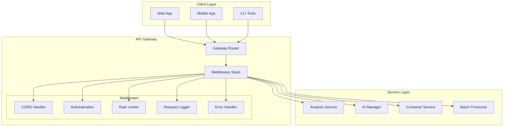
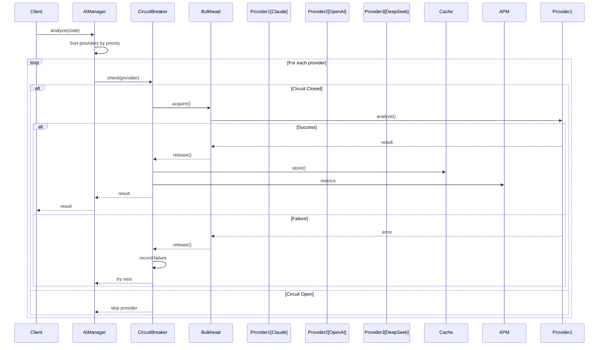
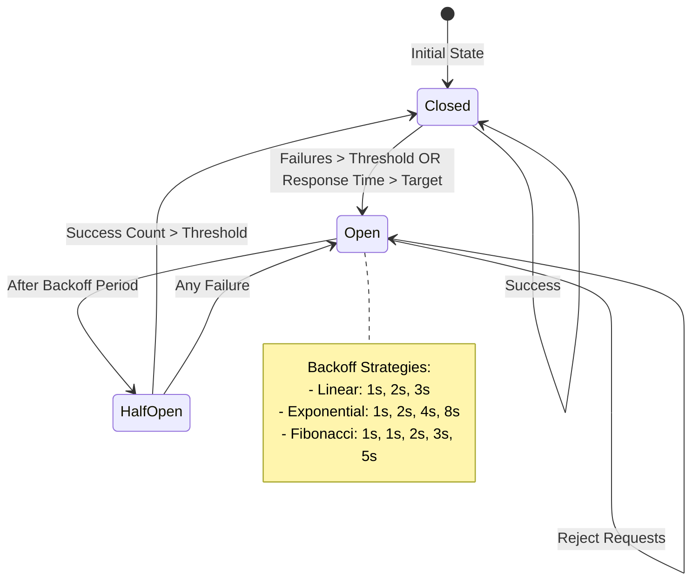
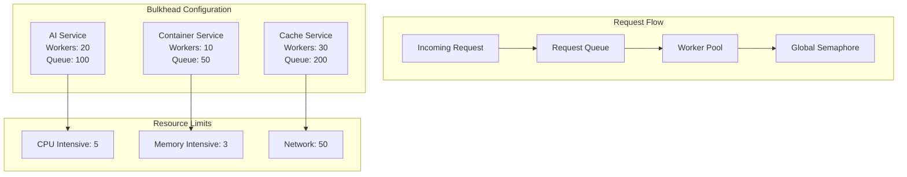
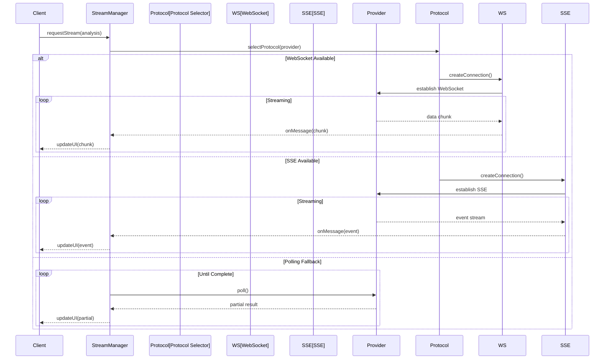
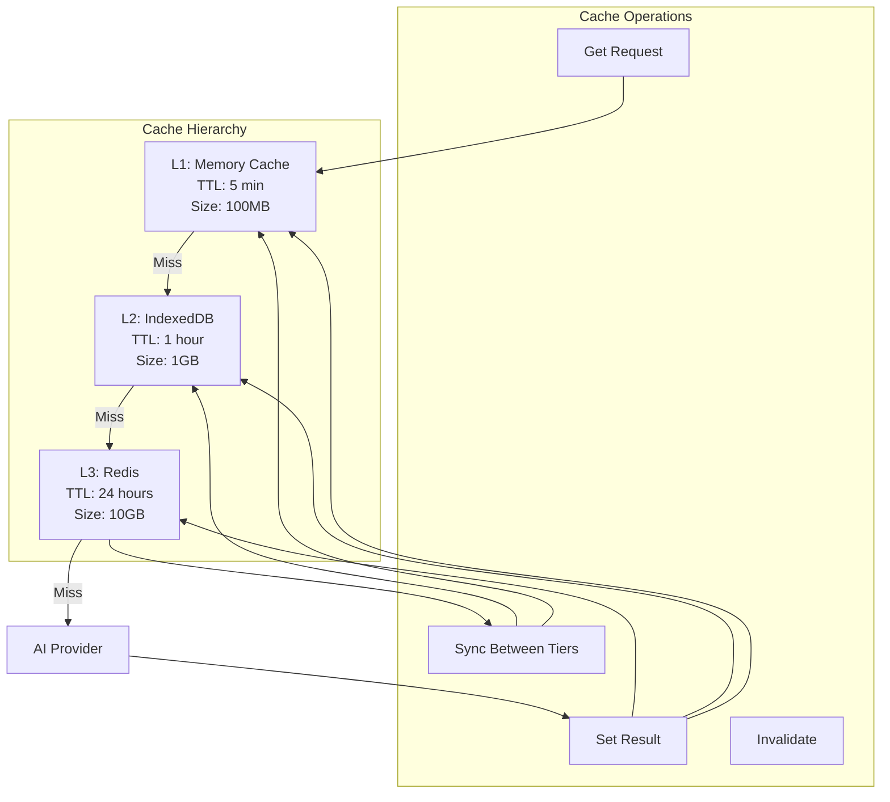
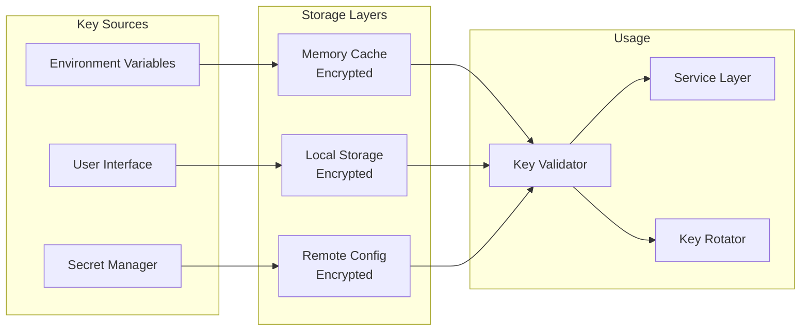
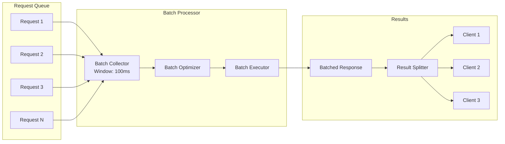
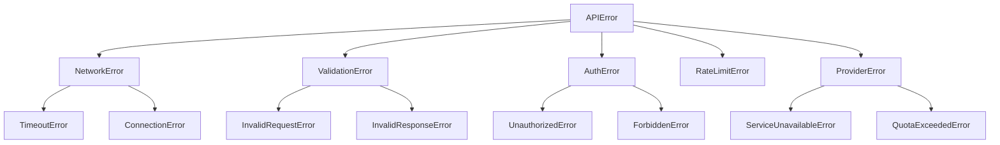
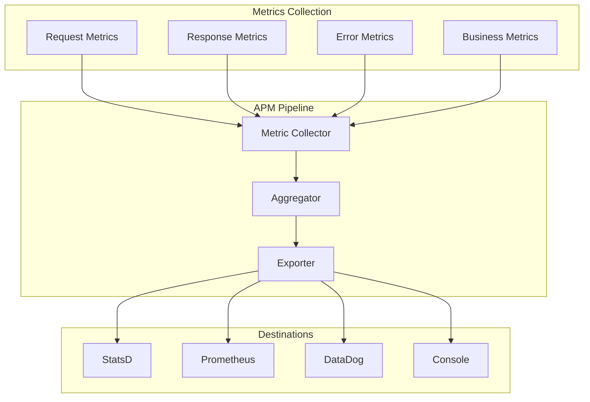

# API Integration Architecture

> **Note:** This documentation reflects the modernized API integration after 9 phases of improvements, including resilience patterns, streaming support, and enterprise-grade features.

## Table of Contents

- [Overview](#overview)
- [API Gateway Architecture](#api-gateway-architecture)
- [AI Provider Integration](#ai-provider-integration)
- [Resilience Patterns](#resilience-patterns)
- [Streaming Analysis](#streaming-analysis)
- [Caching Strategy](#caching-strategy)
- [Security & Authentication](#security--authentication)
- [Performance Optimization](#performance-optimization)
- [Error Handling](#error-handling)
- [Monitoring & Observability](#monitoring--observability)
- [Adding New Providers](#adding-new-providers)

## Overview

Athena's API integration architecture provides a robust, scalable foundation for interacting with multiple AI providers and internal services. The system implements enterprise-grade patterns including circuit breakers, bulkheads, distributed caching, and comprehensive monitoring.

### Key Features

- **Unified API Gateway** with CORS handling and rate limiting
- **Multi-Provider Support** with automatic failover
- **Streaming Analysis** via WebSocket and SSE
- **Resilience Patterns** for fault tolerance
- **Distributed Caching** with Redis
- **Real-time Monitoring** with APM integration

## API Gateway Architecture

The API Gateway serves as the single entry point for all client requests, providing consistent handling of cross-cutting concerns:



### Gateway Implementation

```typescript
// API Gateway with comprehensive middleware
class APIGateway {
  private static instance: APIGateway;
  private errorHandler: APIErrorHandler;
  private cache: AnalysisCacheManager;
  
  async handleRequest(endpoint: string, options: RequestOptions) {
    const span = apmManager.startSpan('api.request', {
      endpoint,
      method: options.method
    });
    
    try {
      // Check cache for GET requests
      if (options.method === 'GET') {
        const cached = await this.cache.get(this.getCacheKey(endpoint, options));
        if (cached) {
          span.tags.cache_hit = true;
          return cached;
        }
      }
      
      // Apply rate limiting
      await this.rateLimiter.check(endpoint);
      
      // Execute request with circuit breaker
      const result = await circuitBreakerFactory.execute(
        `api.${endpoint}`,
        async () => this.executeRequest(endpoint, options)
      );
      
      // Cache successful responses
      if (options.method === 'GET') {
        await this.cache.set(this.getCacheKey(endpoint, options), result);
      }
      
      return result;
    } catch (error) {
      return this.errorHandler.handle(error);
    } finally {
      apmManager.finishSpan(span);
    }
  }
}
```

## AI Provider Integration

The AI integration layer implements a sophisticated manager pattern with automatic failover, load balancing, and provider health monitoring:



### Provider Configuration

```typescript
interface AIProviderConfig {
  name: string;
  baseUrl: string;
  apiKey: string;
  models: ModelConfig[];
  limits: {
    maxTokens: number;
    maxRequests: number;
    maxConcurrent: number;
  };
  features: {
    streaming: boolean;
    batching: boolean;
    functionCalling: boolean;
  };
}

// Provider-specific configurations
const PROVIDER_CONFIGS: Record<string, AIProviderConfig> = {
  claude: {
    name: 'Claude',
    baseUrl: 'https://api.anthropic.com/v1',
    apiKey: env.api.claude.key,
    models: [
      { id: 'claude-3-opus', maxTokens: 200000 },
      { id: 'claude-3-sonnet', maxTokens: 200000 },
      { id: 'claude-3-haiku', maxTokens: 200000 }
    ],
    limits: {
      maxTokens: 200000,
      maxRequests: 1000,
      maxConcurrent: 20
    },
    features: {
      streaming: true,
      batching: false,
      functionCalling: true
    }
  },
  openai: {
    name: 'OpenAI',
    baseUrl: 'https://api.openai.com/v1',
    apiKey: env.api.openai.key,
    models: [
      { id: 'gpt-4-turbo', maxTokens: 128000 },
      { id: 'gpt-4', maxTokens: 8192 },
      { id: 'gpt-3.5-turbo', maxTokens: 16384 }
    ],
    limits: {
      maxTokens: 128000,
      maxRequests: 5000,
      maxConcurrent: 20
    },
    features: {
      streaming: true,
      batching: true,
      functionCalling: true
    }
  },
  deepseek: {
    name: 'DeepSeek',
    baseUrl: 'https://api.deepseek.com/v1',
    apiKey: env.api.deepseek.key,
    models: [
      { id: 'deepseek-coder', maxTokens: 16384 },
      { id: 'deepseek-chat', maxTokens: 32768 }
    ],
    limits: {
      maxTokens: 32768,
      maxRequests: 1000,
      maxConcurrent: 10
    },
    features: {
      streaming: false,
      batching: true,
      functionCalling: false
    }
  }
};
```

## Resilience Patterns

### Circuit Breaker Implementation

The system uses adaptive circuit breakers that adjust based on response times and error rates:



### Bulkhead Pattern

Service isolation prevents cascade failures:



## Streaming Analysis

Support for real-time streaming responses via WebSocket and Server-Sent Events:



### Streaming Implementation

```typescript
class StreamingAnalysis {
  async analyzeWithStream(
    code: string,
    provider: string,
    onChunk: (chunk: AnalysisChunk) => void
  ): Promise<void> {
    const connection = await this.streamManager.connect(provider, {
      url: this.getStreamingEndpoint(provider),
      protocol: this.getPreferredProtocol(provider)
    });
    
    connection.on('message', (data) => {
      const chunk = this.parseChunk(data);
      onChunk(chunk);
      
      // Update partial results in cache
      this.cache.updatePartial(this.getCacheKey(), chunk);
    });
    
    connection.on('complete', async (finalResult) => {
      // Store complete result
      await this.cache.set(this.getCacheKey(), finalResult);
      connection.close();
    });
    
    // Send analysis request
    await connection.send({
      type: 'analyze',
      code,
      streaming: true
    });
  }
}
```

## Caching Strategy

Multi-tier caching with automatic fallback and synchronization:



### Cache Key Strategy

```typescript
class CacheKeyBuilder {
  static buildKey(params: {
    provider: string;
    model: string;
    code: string;
    analysisType: string;
    options?: Record<string, any>;
  }): string {
    const codeHash = this.hashCode(params.code);
    const optionsHash = params.options 
      ? this.hashObject(params.options) 
      : 'default';
    
    return `analysis:${params.provider}:${params.model}:${params.analysisType}:${codeHash}:${optionsHash}`;
  }
  
  private static hashCode(code: string): string {
    return createHash('sha256').update(code).digest('hex').substring(0, 16);
  }
  
  private static hashObject(obj: Record<string, any>): string {
    const sorted = JSON.stringify(this.sortObject(obj));
    return createHash('md5').update(sorted).digest('hex').substring(0, 8);
  }
}
```

## Security & Authentication

### API Key Management



### Request Authentication

```typescript
class AuthenticationMiddleware {
  async authenticate(request: Request): Promise<AuthResult> {
    // Check API key
    const apiKey = this.extractApiKey(request);
    if (!apiKey) {
      throw new UnauthorizedError('API key required');
    }
    
    // Validate key format
    if (!this.isValidKeyFormat(apiKey)) {
      throw new UnauthorizedError('Invalid API key format');
    }
    
    // Check rate limits
    const rateLimitStatus = await this.rateLimiter.check(apiKey);
    if (rateLimitStatus.exceeded) {
      throw new RateLimitError(rateLimitStatus);
    }
    
    // Validate against provider
    const provider = await this.validateWithProvider(apiKey);
    if (!provider) {
      throw new UnauthorizedError('Invalid API key');
    }
    
    return {
      authenticated: true,
      provider,
      limits: rateLimitStatus
    };
  }
}
```

## Performance Optimization

### Request Batching

Automatic batching of multiple requests for efficiency:



### Connection Pooling

```typescript
class ConnectionPool {
  private pools: Map<string, Pool> = new Map();
  
  async getConnection(provider: string): Promise<Connection> {
    const pool = this.getPool(provider);
    
    // Try to get an idle connection
    const idle = pool.getIdle();
    if (idle) {
      return idle;
    }
    
    // Check if we can create a new connection
    if (pool.size < pool.maxSize) {
      return this.createConnection(provider);
    }
    
    // Wait for a connection to become available
    return pool.waitForAvailable();
  }
  
  private getPool(provider: string): Pool {
    if (!this.pools.has(provider)) {
      this.pools.set(provider, new Pool({
        maxSize: this.getMaxPoolSize(provider),
        idleTimeout: 60000,
        connectionTimeout: 30000
      }));
    }
    return this.pools.get(provider)!;
  }
}
```

## Error Handling

### Comprehensive Error Hierarchy



### Error Recovery Strategies

```typescript
class ErrorRecoveryStrategy {
  async handle(error: APIError, context: RequestContext): Promise<any> {
    const strategy = this.selectStrategy(error);
    
    switch (strategy) {
      case 'retry':
        return this.retryWithBackoff(context);
        
      case 'failover':
        return this.failoverToNextProvider(context);
        
      case 'degrade':
        return this.degradeGracefully(context);
        
      case 'cache':
        return this.serveCachedResponse(context);
        
      case 'queue':
        return this.queueForLater(context);
        
      default:
        throw error;
    }
  }
  
  private selectStrategy(error: APIError): RecoveryStrategy {
    if (error instanceof TimeoutError) return 'retry';
    if (error instanceof ServiceUnavailableError) return 'failover';
    if (error instanceof RateLimitError) return 'queue';
    if (error instanceof NetworkError) return 'cache';
    return 'none';
  }
}
```

## Monitoring & Observability

### APM Integration



### Key Metrics

```typescript
interface APIMetrics {
  // Request metrics
  requestCount: Counter;
  requestDuration: Histogram;
  requestSize: Histogram;
  
  // Response metrics
  responseTime: Histogram;
  responseSize: Histogram;
  statusCodes: Counter;
  
  // Error metrics
  errorRate: Gauge;
  errorsByType: Counter;
  
  // Business metrics
  analysisSuccess: Counter;
  providerUsage: Counter;
  cacheHitRate: Gauge;
  
  // Circuit breaker metrics
  circuitState: Gauge;
  circuitFailures: Counter;
  
  // Resource metrics
  poolUtilization: Gauge;
  queueDepth: Gauge;
}
```

## Adding New Providers

### Provider Interface

```typescript
interface AIProvider {
  // Metadata
  readonly name: string;
  readonly version: string;
  readonly features: ProviderFeatures;
  
  // Core methods
  analyze(request: AnalysisRequest): Promise<AnalysisResult>;
  analyzeStream(request: AnalysisRequest): AsyncGenerator<AnalysisChunk>;
  
  // Health checks
  healthCheck(): Promise<HealthStatus>;
  validateApiKey(key: string): Promise<boolean>;
  
  // Resource management
  getUsage(): Promise<UsageStats>;
  getRateLimits(): Promise<RateLimits>;
}
```

### Implementation Template

```typescript
export class NewAIProvider extends BaseAIService implements AIProvider {
  readonly name = 'NewProvider';
  readonly version = '1.0.0';
  readonly features = {
    streaming: true,
    batching: true,
    functionCalling: false
  };
  
  constructor(config: AIProviderConfig) {
    super(config);
    this.initializeClient();
  }
  
  async analyze(request: AnalysisRequest): Promise<AnalysisResult> {
    // Validate request
    this.validateRequest(request);
    
    // Check circuit breaker
    return circuitBreakerFactory.execute(
      `ai.${this.name}.analyze`,
      async () => {
        // Execute with bulkhead protection
        return bulkheadManager.execute(
          `ai.${this.name}`,
          async () => {
            // Make API call
            const response = await this.client.complete({
              model: request.model,
              messages: this.formatMessages(request),
              temperature: 0.3,
              max_tokens: 4000
            });
            
            // Parse and return result
            return this.parseResponse(response);
          }
        );
      }
    );
  }
  
  async *analyzeStream(request: AnalysisRequest): AsyncGenerator<AnalysisChunk> {
    const stream = await this.client.streamComplete({
      model: request.model,
      messages: this.formatMessages(request),
      stream: true
    });
    
    for await (const chunk of stream) {
      yield this.parseChunk(chunk);
    }
  }
}
```

## Best Practices

### 1. **Always Use Circuit Breakers**
```typescript
// ✅ Good
const result = await circuitBreakerFactory.execute('api.endpoint', operation);

// ❌ Bad
const result = await operation();
```

### 2. **Implement Proper Caching**
```typescript
// ✅ Good
const cacheKey = CacheKeyBuilder.buildKey(params);
const cached = await cache.get(cacheKey);
if (cached) return cached;

// ❌ Bad
// No caching
```

### 3. **Handle Streaming Gracefully**
```typescript
// ✅ Good
try {
  for await (const chunk of stream) {
    processChunk(chunk);
  }
} catch (error) {
  handleStreamError(error);
} finally {
  cleanupStream();
}

// ❌ Bad
// No error handling for streams
```

### 4. **Monitor Everything**
```typescript
// ✅ Good
const span = apmManager.startSpan('operation');
try {
  const result = await operation();
  span.tags.success = true;
  return result;
} catch (error) {
  span.tags.error = true;
  throw error;
} finally {
  apmManager.finishSpan(span);
}

// ❌ Bad
// No monitoring
```

### 5. **Validate Early**
```typescript
// ✅ Good
this.validateRequest(request);
this.validateApiKey(apiKey);

// ❌ Bad
// Assume valid input
```

## Conclusion

The modernized API integration architecture provides:

- **High Availability**: Through circuit breakers and failover
- **Performance**: Via caching, batching, and pooling
- **Observability**: With comprehensive monitoring
- **Security**: Through proper authentication and validation
- **Flexibility**: Easy to add new providers and features

For implementation details, see:
- [API Gateway Implementation](/Athena/services/api/gateway.ts)
- [AI Manager](/Athena/services/ai/manager.ts)
- [Circuit Breaker Factory](/Athena/services/ai/circuitBreakerFactory.ts)
- [Cache Manager](/Athena/services/cache/manager.ts)
- [Stream Manager](/Athena/services/streaming/manager.ts)