# API Integration Architecture

**Last Updated:** December 2025
**Architecture:** Tauri 2.0 Desktop Application
**Backend:** Rust with embedded axum API server
**Status:** Implementation Complete

## Table of Contents

- [Overview](#overview)
- [Embedded API Server](#embedded-api-server)
- [AI Provider Integration](#ai-provider-integration)
- [Resilience Patterns](#resilience-patterns)
- [WASM Integration](#wasm-integration)
- [Caching Strategy](#caching-strategy)
- [Security & Authentication](#security--authentication)
- [Performance Optimization](#performance-optimization)
- [Error Handling](#error-handling)
- [Monitoring & Observability](#monitoring--observability)
- [Adding New Providers](#adding-new-providers)

## Overview

Athena's API integration architecture is built as a **Tauri 2.0 desktop application** with an **embedded axum HTTP server** running on port 3000. The Rust backend provides robust, type-safe integration with AI providers and WASM modules, implementing enterprise-grade patterns including circuit breakers, retry logic with exponential backoff, and comprehensive monitoring.

### Key Features

- **Embedded axum API Server** (port 3000) - no external dependencies
- **Tauri 2.0 Integration** - desktop-first architecture
- **Multi-Provider AI Support** (Claude, OpenAI, DeepSeek, Gemini, Mistral, Groq)
- **Circuit Breaker Pattern** - implemented in Rust with automatic recovery
- **Retry with Exponential Backoff** - transient error handling
- **Wasmtime 29.0 Component Model** - WASM module execution
- **Real-time Status Checks** - actual provider availability
- **Prometheus Metrics** - performance monitoring
- **Type-Safe Commands** - all Tauri commands return `Result<T, String>`

### Architecture: Tauri 2.0 Desktop Application

```mermaid
%%{init: {
  'theme': 'base',
  'themeVariables': {
    'primaryColor': '#6d105a',
    'primaryTextColor': '#ffffff',
    'primaryBorderColor': '#ffffff',
    'lineColor': '#333333',
    'secondaryColor': '#e8f4d4',
    'secondaryTextColor': '#333333',
    'secondaryBorderColor': '#333333',
    'tertiaryColor': '#f9d0c4',
    'tertiaryTextColor': '#333333',
    'tertiaryBorderColor': '#333333',
    'background': '#ffffff',
    'mainBkg': '#6d105a',
    'secondBkg': '#e8f4d4',
    'tertiaryBkg': '#f9d0c4',
    'textColor': '#333333',
    'fontFamily': 'Arial, sans-serif'
  }
}}%%
graph TB
    subgraph "Tauri Desktop Application"
        subgraph "Frontend Layer - SolidJS"
            UI[SolidJS UI Components]
            TauriAPI[Tauri API Client]
        end

        subgraph "Embedded Rust Backend"
            subgraph "Axum HTTP Server :3000"
                Health[/health - Health Check]
                WASM[/api/v1/wasm/* - WASM Endpoints]
                Metrics[/metrics - Prometheus]
            end

            subgraph "Tauri Commands"
                FileOps[File Operations]
                Analysis[Analysis Commands]
                AICommands[AI Provider Commands]
                WASMRuntime[WASM Runtime]
                Sandbox[Sandbox Commands]
            end

            subgraph "AI Provider Layer"
                CircuitBreaker[Circuit Breaker]
                RetryLogic[Retry with Backoff]
                Queue[Queue Manager]

                Claude[Claude API]
                OpenAI[OpenAI API]
                DeepSeek[DeepSeek API]
                Gemini[Gemini API]
                Mistral[Mistral API]
                Groq[Groq API]
            end

            subgraph "WASM Layer - Wasmtime 29.0"
                WasmEngine[Wasmtime Engine]
                Components[Component Model Modules]
            end
        end
    end

    UI --> TauriAPI
    TauriAPI --> FileOps
    TauriAPI --> Analysis
    TauriAPI --> AICommands
    TauriAPI --> WASMRuntime

    Health -.->|HTTP localhost:3000| UI
    WASM -.->|HTTP localhost:3000| UI
    Metrics -.->|HTTP localhost:3000| UI

    AICommands --> CircuitBreaker
    CircuitBreaker --> RetryLogic
    RetryLogic --> Queue
    Queue --> Claude
    Queue --> OpenAI
    Queue --> DeepSeek
    Queue --> Gemini
    Queue --> Mistral
    Queue --> Groq

    WASMRuntime --> WasmEngine
    WasmEngine --> Components
```

## Embedded API Server

The axum HTTP server runs embedded within the Tauri application, starting automatically on port 3000. It provides REST endpoints for WASM functionality while the main communication channel uses Tauri IPC commands.

### Server Implementation (Rust)

The embedded server is implemented in `src-tauri/src/api_server.rs`:

```rust
use axum::{Router, routing::{get, post}};
use tower_http::cors::{CorsLayer, AllowOrigin};
use tokio::net::TcpListener;

/// Start the API server on the specified port
pub async fn start_api_server(
    app_handle: AppHandle,
    port: u16,
) -> Result<(), Box<dyn std::error::Error>> {
    let state = ApiState {
        app_handle: app_handle.clone(),
    };
    let app = create_router(state);

    let addr = format!("127.0.0.1:{}", port);
    let listener = TcpListener::bind(&addr).await?;

    println!("🚀 API server listening on http://{}", addr);
    println!("   Endpoints:");
    println!("   - GET  /health");
    println!("   - GET  /api/v1/wasm/capabilities");
    println!("   - POST /api/v1/wasm/init");
    println!("   - POST /api/v1/wasm/load");
    println!("   - POST /api/v1/wasm/analyze");
    println!("   - POST /api/v1/wasm/execute");
    println!("   - GET  /api/v1/wasm/metrics");
    println!("   - GET  /metrics (Prometheus)");

    axum::serve(listener, app).await?;
    Ok(())
}

fn create_router(state: ApiState) -> Router {
    // SECURITY: CORS restricted to localhost only
    let cors = CorsLayer::new()
        .allow_origin(AllowOrigin::list([
            "http://127.0.0.1:1420".parse::<HeaderValue>().unwrap(),
            "http://localhost:1420".parse::<HeaderValue>().unwrap(),
            "tauri://localhost".parse::<HeaderValue>().unwrap(),
        ]))
        .allow_methods([Method::GET, Method::POST, Method::OPTIONS])
        .allow_headers([header::CONTENT_TYPE, header::AUTHORIZATION]);

    Router::new()
        .route("/health", get(health_check))
        .route("/api/v1/wasm/capabilities", get(get_capabilities))
        .route("/api/v1/wasm/analyze", post(analyze_file))
        .route("/api/v1/wasm/execute", post(execute_function))
        .route("/api/v1/wasm/metrics", get(get_metrics))
        .route("/api/v1/wasm/init", post(initialize_runtime))
        .route("/api/v1/wasm/load", post(load_modules))
        .route("/metrics", get(metrics::metrics_handler))
        .layer(cors)
        .with_state(state)
}
```

### Available Endpoints

| Endpoint | Method | Description |
|----------|--------|-------------|
| `/health` | GET | Health check status |
| `/api/v1/wasm/capabilities` | GET | List WASM modules and runtime info |
| `/api/v1/wasm/init` | POST | Initialize WASM runtime |
| `/api/v1/wasm/load` | POST | Load security modules |
| `/api/v1/wasm/analyze` | POST | Analyze file with WASM |
| `/api/v1/wasm/execute` | POST | Execute WASM function |
| `/api/v1/wasm/metrics` | GET | WASM module metrics |
| `/metrics` | GET | Prometheus metrics |

### Security Features

- **Localhost Only**: CORS restricted to `127.0.0.1`, `localhost`, and `tauri://localhost`
- **No External Access**: Server binds to `127.0.0.1` (not `0.0.0.0`)
- **Type-Safe**: All handlers use Rust type system for validation
- **Error Handling**: Consistent error responses with proper HTTP status codes

## AI Provider Integration

The AI integration layer is implemented in **Rust** with sophisticated resilience patterns including circuit breakers, retry with exponential backoff, queue management, and real-time health monitoring. The system supports 6 AI providers with automatic failover:

**Supported Providers:**
- Claude (Anthropic) - Primary
- OpenAI - Primary
- DeepSeek - Secondary
- Gemini (Google) - Secondary
- Mistral - Secondary
- Groq - Secondary

**Implementation:** `/Users/kali/Athena/Athena/athena-v2/src-tauri/src/ai_providers/`

### Circuit Breaker Pattern (Rust Implementation)

The circuit breaker is implemented in `src-tauri/src/ai_providers/circuit_breaker.rs`:

```rust
#[derive(Debug, Clone)]
pub enum CircuitState {
    Closed,              // Normal operation
    Open(Instant),       // Provider failing, reject requests
    HalfOpen,           // Testing if provider recovered
}

pub struct CircuitBreaker {
    provider_name: String,
    failure_threshold: u32,      // Open after N failures
    success_threshold: u32,      // Close after N successes in half-open
    timeout: Duration,           // Time before half-open retry

    failure_count: AtomicU32,
    success_count: AtomicU32,
    state: Arc<RwLock<CircuitState>>,
}

impl CircuitBreaker {
    pub async fn call<F, T>(&self, f: F) -> Result<T, Box<dyn Error>>
    where
        F: Future<Output = Result<T, Box<dyn Error>>>,
    {
        match self.get_state().await {
            CircuitState::Open(opened_at) => {
                if opened_at.elapsed() >= self.timeout {
                    self.transition_to_half_open().await;
                } else {
                    // Record rate limit hit
                    AI_RATE_LIMIT_HITS
                        .with_label_values(&[&self.provider_name])
                        .inc();
                    return Err("Circuit breaker is open".into());
                }
            }
            _ => {}
        }

        let result = f.await;

        match result {
            Ok(value) => {
                self.on_success().await;
                Ok(value)
            }
            Err(error) => {
                self.on_failure().await;
                Err(error)
            }
        }
    }
}
```

**States:**
- **Closed**: Normal operation, requests pass through
- **Open**: Circuit tripped after failure threshold, requests rejected immediately
- **HalfOpen**: Testing recovery, limited requests allowed

**Configuration:**
- Failure threshold: 3 consecutive failures → Open
- Success threshold: 2 successes in HalfOpen → Closed
- Timeout: 30 seconds before HalfOpen retry

### Retry with Exponential Backoff (Rust Implementation)

Implemented in `src-tauri/src/ai_providers/retry.rs`:

```rust
#[derive(Debug, Clone)]
pub struct RetryConfig {
    pub max_retries: u32,           // Default: 3
    pub initial_delay_ms: u64,      // Default: 1000ms
    pub max_delay_ms: u64,          // Default: 30000ms
    pub backoff_multiplier: f64,    // Default: 2.0
}

/// Determines if an error is transient and should be retried
pub fn is_retryable_error(error: &Box<dyn Error>) -> bool {
    let error_msg = error.to_string().to_lowercase();

    // Retry on network errors
    error_msg.contains("timeout") ||
    error_msg.contains("connection") ||
    error_msg.contains("dns") ||

    // Retry on rate limiting (429)
    error_msg.contains("rate limit") ||
    error_msg.contains("429") ||

    // Retry on server errors (500-504)
    error_msg.contains("500") ||
    error_msg.contains("502") ||
    error_msg.contains("503") ||
    error_msg.contains("504") ||

    // Don't retry auth errors (401, 403)
    // Don't retry validation errors (400, 422)
}

/// Execute operation with retry and exponential backoff
pub async fn with_retry<F, Fut, T>(
    config: RetryConfig,
    mut operation: F,
    provider_name: &str,
) -> Result<T, Box<dyn Error>>
where
    F: FnMut() -> Fut,
    Fut: Future<Output = Result<T, Box<dyn Error>>>,
{
    let mut attempt = 0;
    let mut delay = config.initial_delay_ms;

    loop {
        match operation().await {
            Ok(result) => return Ok(result),
            Err(error) => {
                attempt += 1;

                if !is_retryable_error(&error) || attempt >= config.max_retries {
                    return Err(error);
                }

                // Add jitter (±25%) to prevent thundering herd
                let jitter = (rand::random::<f64>() - 0.5) * 0.5;
                let actual_delay = (delay as f64 * (1.0 + jitter)) as u64;

                println!("[{}] Retry {}/{} after {}ms: {}",
                    provider_name, attempt, config.max_retries,
                    actual_delay, error);

                sleep(Duration::from_millis(actual_delay)).await;

                // Exponential backoff with cap
                delay = (delay as f64 * config.backoff_multiplier) as u64;
                delay = delay.min(config.max_delay_ms);
            }
        }
    }
}
```

**Features:**
- **Exponential Backoff**: Delay doubles each retry (1s → 2s → 4s)
- **Jitter**: Random ±25% to prevent thundering herd
- **Max Delay Cap**: 30 seconds maximum
- **Intelligent Error Detection**: Only retries transient errors
- **Configurable**: Per-provider retry settings

### Real AI Provider Status Checks

All providers implement real health checks (no simulation):

```rust
// In src-tauri/src/commands/ai_analysis.rs
#[tauri::command]
pub async fn get_ai_provider_status() -> Result<HashMap<String, ProviderStatus>, String> {
    let providers = vec!["claude", "openai", "deepseek", "gemini", "mistral", "groq"];
    let mut statuses = HashMap::new();

    for provider in providers {
        let status = check_provider_health(provider).await;
        statuses.insert(provider.to_string(), status);
    }

    Ok(statuses)
}

async fn check_provider_health(provider: &str) -> ProviderStatus {
    // Real API health check with timeout
    let result = timeout(
        Duration::from_secs(5),
        make_test_request(provider)
    ).await;

    match result {
        Ok(Ok(_)) => ProviderStatus::Available,
        Ok(Err(e)) if e.contains("auth") => ProviderStatus::NoApiKey,
        Ok(Err(e)) if e.contains("rate") => ProviderStatus::RateLimited,
        Err(_) => ProviderStatus::Timeout,
        _ => ProviderStatus::Error,
    }
}
```

### AI Provider Architecture (Updated December 2025)

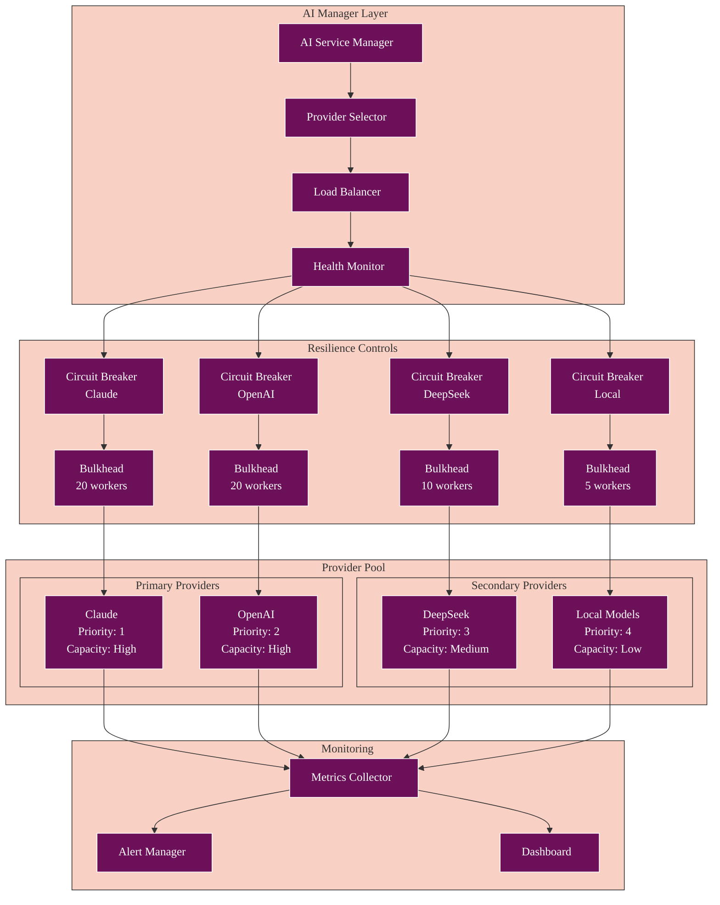

### Provider Configuration

```typescript
interface AIProviderConfig {
  name: string;
  baseUrl: string;
  apiKey: string;
  models: ModelConfig[];
  limits: {
    maxTokens: number;
    maxRequests: number;
    maxConcurrent: number;
  };
  features: {
    streaming: boolean;
    batching: boolean;
    functionCalling: boolean;
  };
}

// Provider-specific configurations
const PROVIDER_CONFIGS: Record<string, AIProviderConfig> = {
  claude: {
    name: 'Claude',
    baseUrl: 'https://api.anthropic.com/v1',
    apiKey: env.api.claude.key,
    models: [
      { id: 'claude-3-opus', maxTokens: 200000 },
      { id: 'claude-3-sonnet', maxTokens: 200000 },
      { id: 'claude-3-haiku', maxTokens: 200000 }
    ],
    limits: {
      maxTokens: 200000,
      maxRequests: 1000,
      maxConcurrent: 20
    },
    features: {
      streaming: true,
      batching: false,
      functionCalling: true
    }
  },
  openai: {
    name: 'OpenAI',
    baseUrl: 'https://api.openai.com/v1',
    apiKey: env.api.openai.key,
    models: [
      { id: 'gpt-4-turbo', maxTokens: 128000 },
      { id: 'gpt-4', maxTokens: 8192 },
      { id: 'gpt-3.5-turbo', maxTokens: 16384 }
    ],
    limits: {
      maxTokens: 128000,
      maxRequests: 5000,
      maxConcurrent: 20
    },
    features: {
      streaming: true,
      batching: true,
      functionCalling: true
    }
  },
  deepseek: {
    name: 'DeepSeek',
    baseUrl: 'https://api.deepseek.com/v1',
    apiKey: env.api.deepseek.key,
    models: [
      { id: 'deepseek-coder', maxTokens: 16384 },
      { id: 'deepseek-chat', maxTokens: 32768 }
    ],
    limits: {
      maxTokens: 32768,
      maxRequests: 1000,
      maxConcurrent: 10
    },
    features: {
      streaming: false,
      batching: true,
      functionCalling: false
    }
  }
};
```

## Resilience Patterns

### Circuit Breaker Implementation

The system uses adaptive circuit breakers that adjust based on response times and error rates:

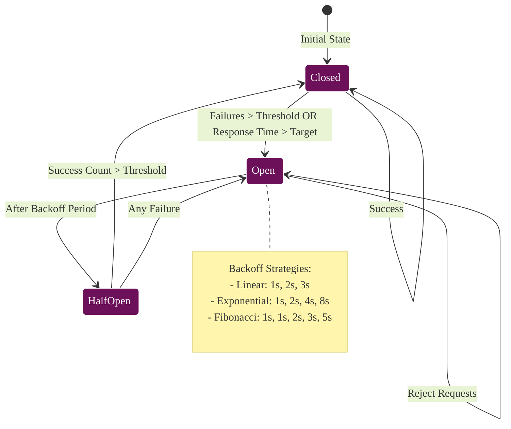

### Bulkhead Pattern

Service isolation prevents cascade failures:

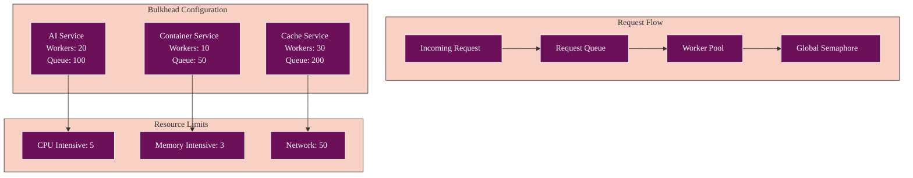

## Streaming Analysis

Support for real-time streaming responses via WebSocket and Server-Sent Events:

### Streaming Protocol Flow

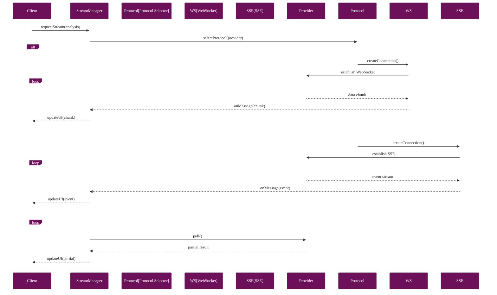

### Streaming Architecture

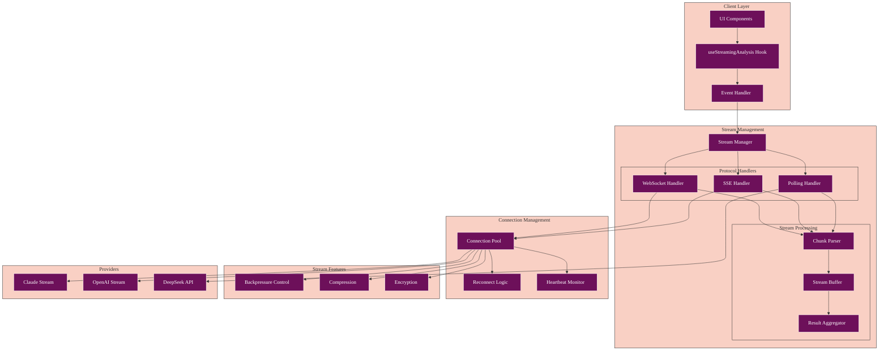

### Stream State Management

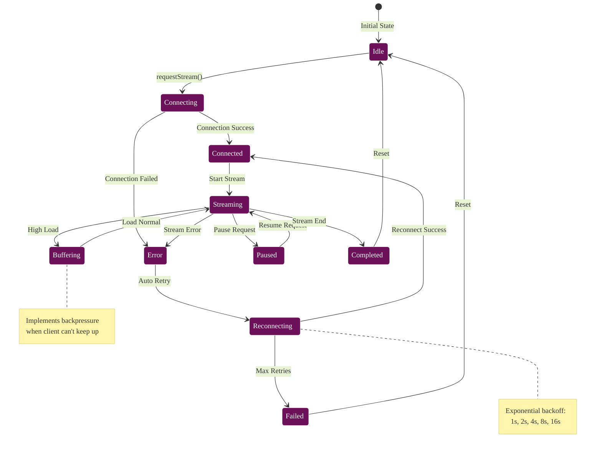

### Streaming Implementation

```typescript
class StreamingAnalysis {
  async analyzeWithStream(
    code: string,
    provider: string,
    onChunk: (chunk: AnalysisChunk) => void
  ): Promise<void> {
    const connection = await this.streamManager.connect(provider, {
      url: this.getStreamingEndpoint(provider),
      protocol: this.getPreferredProtocol(provider)
    });
    
    connection.on('message', (data) => {
      const chunk = this.parseChunk(data);
      onChunk(chunk);
      
      // Update partial results in cache
      this.cache.updatePartial(this.getCacheKey(), chunk);
    });
    
    connection.on('complete', async (finalResult) => {
      // Store complete result
      await this.cache.set(this.getCacheKey(), finalResult);
      connection.close();
    });
    
    // Send analysis request
    await connection.send({
      type: 'analyze',
      code,
      streaming: true
    });
  }
}
```

## Caching Strategy

Multi-tier caching with automatic fallback and synchronization:

### Cache Hierarchy

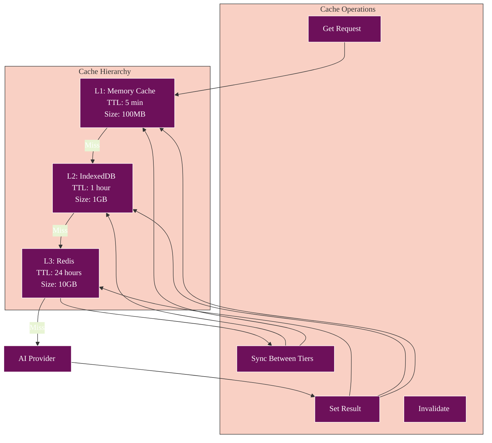

### Cache Integration Flow

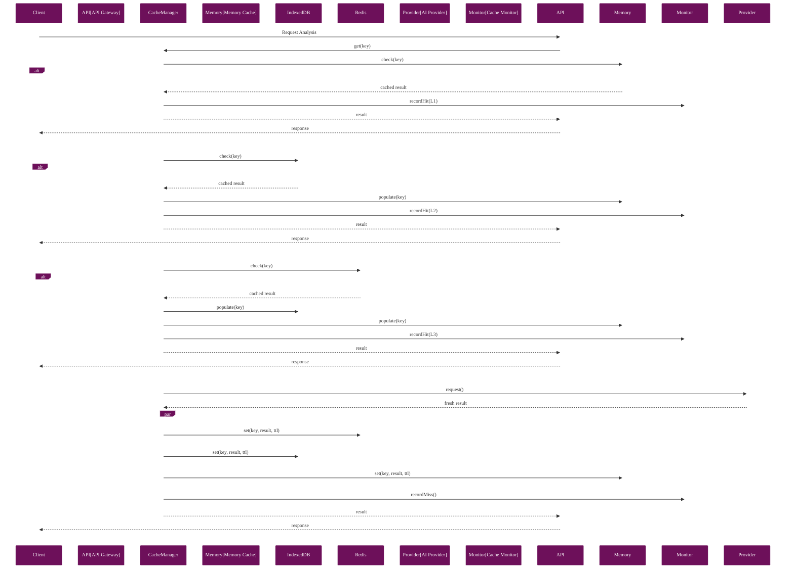

### Cache Invalidation Strategy

```mermaid
%%{init: {
  'theme': 'base',
  'themeVariables': {
    'primaryColor': '#6d105a',
    'primaryTextColor': '#ffffff',
    'primaryBorderColor': '#ffffff',
    'lineColor': '#333333',
    'secondaryColor': '#e8f4d4',
    'secondaryTextColor': '#333333',
    'secondaryBorderColor': '#333333',
    'tertiaryColor': '#f9d0c4',
    'tertiaryTextColor': '#333333',
    'tertiaryBorderColor': '#333333',
    'background': '#ffffff',
    'mainBkg': '#6d105a',
    'secondBkg': '#e8f4d4',
    'tertiaryBkg': '#f9d0c4',
    'textColor': '#333333',
    'fontFamily': 'Arial, sans-serif'
  }
}}%%
graph TB
    subgraph "Invalidation Triggers"
        Manual[Manual Invalidation]
        TTL[TTL Expiry]
        Event[Event-Based]
        Size[Size Limit]
    end
    
    subgraph "Invalidation Patterns"
        Single[Single Key]
        Pattern[Pattern Match]
        Tag[Tag-Based]
        All[Clear All]
    end
    
    subgraph "Invalidation Process"
        Coordinator[Invalidation Coordinator]
        
        subgraph "Cache Layers"
            MemInv[Memory Invalidate]
            IDBInv[IndexedDB Invalidate]
            RedisInv[Redis Invalidate]
        end
        
        Broadcast[Event Broadcast]
    end
    
    Manual --> Single
    TTL --> Single
    Event --> Pattern
    Size --> Tag
    
    Single --> Coordinator
    Pattern --> Coordinator
    Tag --> Coordinator
    All --> Coordinator
    
    Coordinator --> MemInv
    Coordinator --> IDBInv
    Coordinator --> RedisInv
    
    Coordinator --> Broadcast
    
    note right of Broadcast
        Notifies other instances
        for distributed cache
        consistency
    end note
```

### Cache Key Strategy

```typescript
class CacheKeyBuilder {
  static buildKey(params: {
    provider: string;
    model: string;
    code: string;
    analysisType: string;
    options?: Record<string, any>;
  }): string {
    const codeHash = this.hashCode(params.code);
    const optionsHash = params.options 
      ? this.hashObject(params.options) 
      : 'default';
    
    return `analysis:${params.provider}:${params.model}:${params.analysisType}:${codeHash}:${optionsHash}`;
  }
  
  private static hashCode(code: string): string {
    return createHash('sha256').update(code).digest('hex').substring(0, 16);
  }
  
  private static hashObject(obj: Record<string, any>): string {
    const sorted = JSON.stringify(this.sortObject(obj));
    return createHash('md5').update(sorted).digest('hex').substring(0, 8);
  }
}
```

## Security & Authentication

### API Key Management

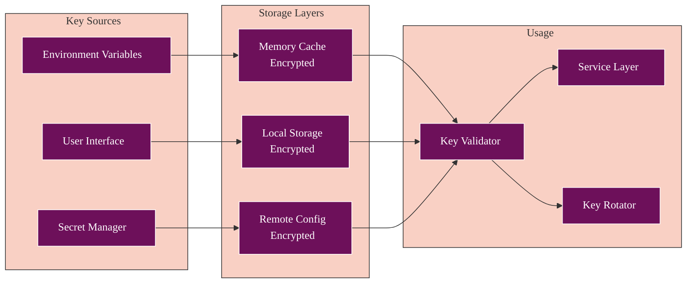

### Complete Authentication Flow

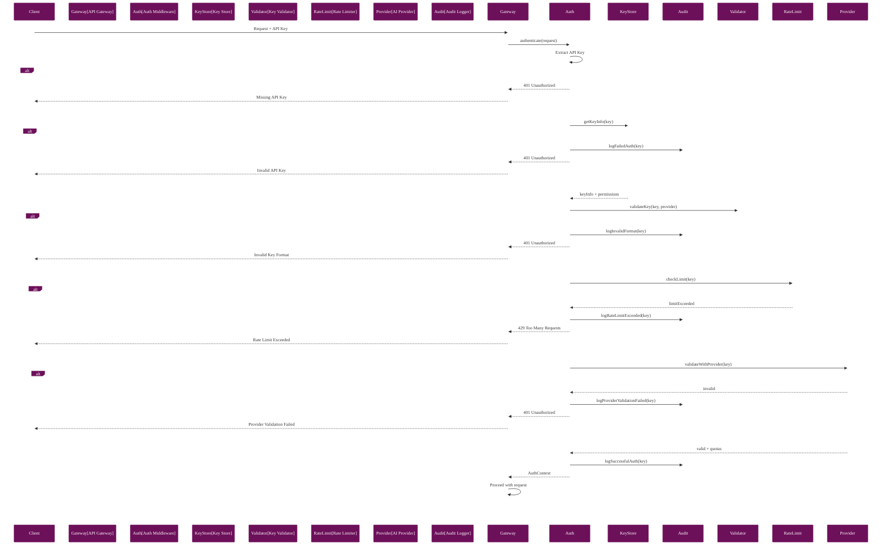

### Security Architecture

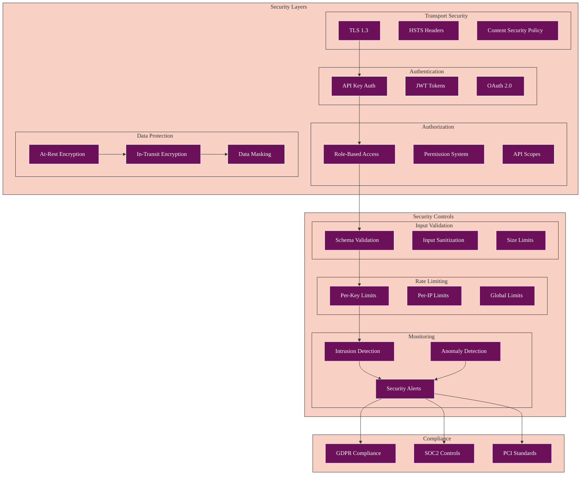

### Request Authentication

```typescript
class AuthenticationMiddleware {
  async authenticate(request: Request): Promise<AuthResult> {
    // Check API key
    const apiKey = this.extractApiKey(request);
    if (!apiKey) {
      throw new UnauthorizedError('API key required');
    }
    
    // Validate key format
    if (!this.isValidKeyFormat(apiKey)) {
      throw new UnauthorizedError('Invalid API key format');
    }
    
    // Check rate limits
    const rateLimitStatus = await this.rateLimiter.check(apiKey);
    if (rateLimitStatus.exceeded) {
      throw new RateLimitError(rateLimitStatus);
    }
    
    // Validate against provider
    const provider = await this.validateWithProvider(apiKey);
    if (!provider) {
      throw new UnauthorizedError('Invalid API key');
    }
    
    return {
      authenticated: true,
      provider,
      limits: rateLimitStatus
    };
  }
}
```

## Performance Optimization

### Request Batching

Automatic batching of multiple requests for efficiency:

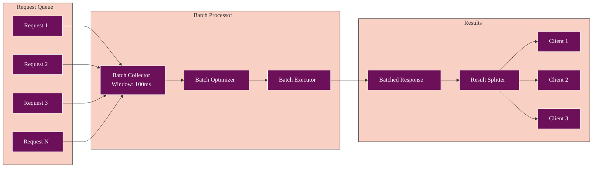

### Connection Pooling

```typescript
class ConnectionPool {
  private pools: Map<string, Pool> = new Map();
  
  async getConnection(provider: string): Promise<Connection> {
    const pool = this.getPool(provider);
    
    // Try to get an idle connection
    const idle = pool.getIdle();
    if (idle) {
      return idle;
    }
    
    // Check if we can create a new connection
    if (pool.size < pool.maxSize) {
      return this.createConnection(provider);
    }
    
    // Wait for a connection to become available
    return pool.waitForAvailable();
  }
  
  private getPool(provider: string): Pool {
    if (!this.pools.has(provider)) {
      this.pools.set(provider, new Pool({
        maxSize: this.getMaxPoolSize(provider),
        idleTimeout: 60000,
        connectionTimeout: 30000
      }));
    }
    return this.pools.get(provider)!;
  }
}
```

## Error Handling

### Comprehensive Error Hierarchy

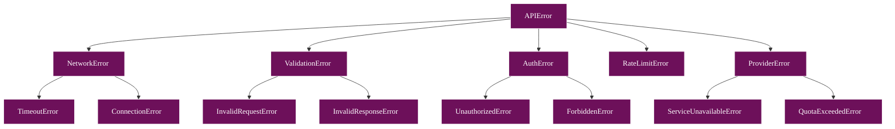

### Error Recovery Strategies

```typescript
class ErrorRecoveryStrategy {
  async handle(error: APIError, context: RequestContext): Promise<any> {
    const strategy = this.selectStrategy(error);
    
    switch (strategy) {
      case 'retry':
        return this.retryWithBackoff(context);
        
      case 'failover':
        return this.failoverToNextProvider(context);
        
      case 'degrade':
        return this.degradeGracefully(context);
        
      case 'cache':
        return this.serveCachedResponse(context);
        
      case 'queue':
        return this.queueForLater(context);
        
      default:
        throw error;
    }
  }
  
  private selectStrategy(error: APIError): RecoveryStrategy {
    if (error instanceof TimeoutError) return 'retry';
    if (error instanceof ServiceUnavailableError) return 'failover';
    if (error instanceof RateLimitError) return 'queue';
    if (error instanceof NetworkError) return 'cache';
    return 'none';
  }
}
```

## Monitoring & Observability

### APM Integration

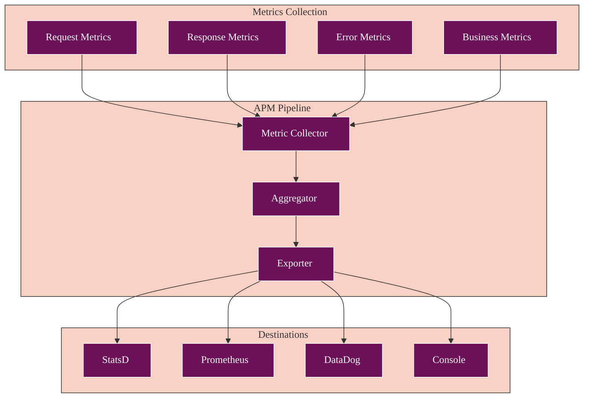

### Key Metrics

```typescript
interface APIMetrics {
  // Request metrics
  requestCount: Counter;
  requestDuration: Histogram;
  requestSize: Histogram;
  
  // Response metrics
  responseTime: Histogram;
  responseSize: Histogram;
  statusCodes: Counter;
  
  // Error metrics
  errorRate: Gauge;
  errorsByType: Counter;
  
  // Business metrics
  analysisSuccess: Counter;
  providerUsage: Counter;
  cacheHitRate: Gauge;
  
  // Circuit breaker metrics
  circuitState: Gauge;
  circuitFailures: Counter;
  
  // Resource metrics
  poolUtilization: Gauge;
  queueDepth: Gauge;
}
```

## Adding New Providers

### Provider Interface

```typescript
interface AIProvider {
  // Metadata
  readonly name: string;
  readonly version: string;
  readonly features: ProviderFeatures;
  
  // Core methods
  analyze(request: AnalysisRequest): Promise<AnalysisResult>;
  analyzeStream(request: AnalysisRequest): AsyncGenerator<AnalysisChunk>;
  
  // Health checks
  healthCheck(): Promise<HealthStatus>;
  validateApiKey(key: string): Promise<boolean>;
  
  // Resource management
  getUsage(): Promise<UsageStats>;
  getRateLimits(): Promise<RateLimits>;
}
```

### Implementation Template

```typescript
export class NewAIProvider extends BaseAIService implements AIProvider {
  readonly name = 'NewProvider';
  readonly version = '1.0.0';
  readonly features = {
    streaming: true,
    batching: true,
    functionCalling: false
  };
  
  constructor(config: AIProviderConfig) {
    super(config);
    this.initializeClient();
  }
  
  async analyze(request: AnalysisRequest): Promise<AnalysisResult> {
    // Validate request
    this.validateRequest(request);
    
    // Check circuit breaker
    return circuitBreakerFactory.execute(
      `ai.${this.name}.analyze`,
      async () => {
        // Execute with bulkhead protection
        return bulkheadManager.execute(
          `ai.${this.name}`,
          async () => {
            // Make API call
            const response = await this.client.complete({
              model: request.model,
              messages: this.formatMessages(request),
              temperature: 0.3,
              max_tokens: 4000
            });
            
            // Parse and return result
            return this.parseResponse(response);
          }
        );
      }
    );
  }
  
  async *analyzeStream(request: AnalysisRequest): AsyncGenerator<AnalysisChunk> {
    const stream = await this.client.streamComplete({
      model: request.model,
      messages: this.formatMessages(request),
      stream: true
    });
    
    for await (const chunk of stream) {
      yield this.parseChunk(chunk);
    }
  }
}
```

## Best Practices

### 1. **Always Use Circuit Breakers**
```typescript
// ✅ Good
const result = await circuitBreakerFactory.execute('api.endpoint', operation);

// ❌ Bad
const result = await operation();
```

### 2. **Implement Proper Caching**
```typescript
// ✅ Good
const cacheKey = CacheKeyBuilder.buildKey(params);
const cached = await cache.get(cacheKey);
if (cached) return cached;

// ❌ Bad
// No caching
```

### 3. **Handle Streaming Gracefully**
```typescript
// ✅ Good
try {
  for await (const chunk of stream) {
    processChunk(chunk);
  }
} catch (error) {
  handleStreamError(error);
} finally {
  cleanupStream();
}

// ❌ Bad
// No error handling for streams
```

### 4. **Monitor Everything**
```typescript
// ✅ Good
const span = apmManager.startSpan('operation');
try {
  const result = await operation();
  span.tags.success = true;
  return result;
} catch (error) {
  span.tags.error = true;
  throw error;
} finally {
  apmManager.finishSpan(span);
}

// ❌ Bad
// No monitoring
```

### 5. **Validate Early**
```typescript
// ✅ Good
this.validateRequest(request);
this.validateApiKey(apiKey);

// ❌ Bad
// Assume valid input
```

## WASM API Endpoints

### WASM Module Status

```typescript
// GET /api/v1/status/wasm
interface WASMStatusResponse {
  status: 'healthy' | 'degraded' | 'unhealthy';
  modules: {
    [moduleName: string]: {
      loaded: boolean;
      version: string;
      performanceMetrics: {
        avgExecutionTime: number;
        totalExecutions: number;
        errors: number;
      };
    };
  };
  totalMemoryUsage: number;
  lastCheck: string;
}
```

### WASM Analysis Endpoints

```typescript
// POST /api/v1/wasm/analyze
interface WASMAnalysisRequest {
  fileData: string | ArrayBuffer;
  analysisType: 'full' | 'quick' | 'pattern' | 'behavior';
  modules?: string[]; // Specific modules to use
  options?: {
    includeDeobfuscation?: boolean;
    includeCrypto?: boolean;
    includeNetworkAnalysis?: boolean;
    timeout?: number;
  };
}

// Response includes streaming support
interface WASMAnalysisResponse {
  id: string;
  status: 'processing' | 'completed' | 'failed';
  results: {
    analysis?: AnalysisResult;
    crypto?: CryptoResult;
    deobfuscation?: DeobfuscationResult;
    patterns?: PatternMatchResult;
    network?: NetworkAnalysisResult;
    sandbox?: SandboxResult;
  };
  performance: {
    totalTime: number;
    moduleTimings: Record<string, number>;
  };
}
```

### WASM Module Management

```typescript
// GET /api/v1/wasm/modules
interface WASMModulesResponse {
  modules: Array<{
    name: string;
    status: 'loaded' | 'unloaded' | 'error';
    version: string;
    capabilities: string[];
    memoryUsage: number;
  }>;
}

// POST /api/v1/wasm/modules/{moduleName}/reload
interface ModuleReloadResponse {
  success: boolean;
  module: string;
  previousVersion: string;
  newVersion: string;
  reloadTime: number;
}
```

### WASM Processing Flow

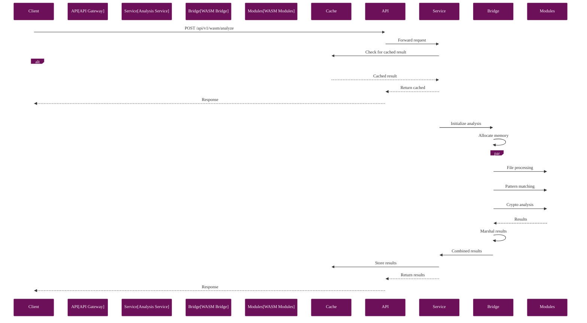

## Complete API Request Lifecycle

This diagram shows how all components work together to process an API request:

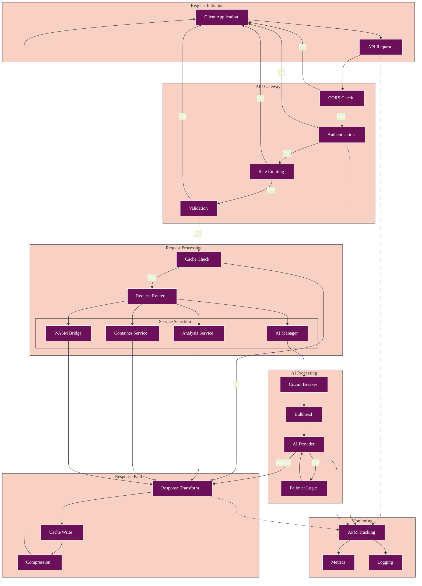

## Conclusion

The modernized API integration architecture provides:

- **High Availability**: Through circuit breakers and failover
- **Performance**: Via caching, batching, and pooling
- **Observability**: With comprehensive monitoring
- **Security**: Through proper authentication and validation
- **Flexibility**: Easy to add new providers and features

For implementation details, see:
- [API Gateway Implementation](/Athena/services/api/gateway.ts)
- [AI Manager](/Athena/services/ai/manager.ts)
- [Circuit Breaker Factory](/Athena/services/ai/circuitBreakerFactory.ts)
- [Cache Manager](/Athena/services/cache/manager.ts)
- [Stream Manager](/Athena/services/streaming/manager.ts)