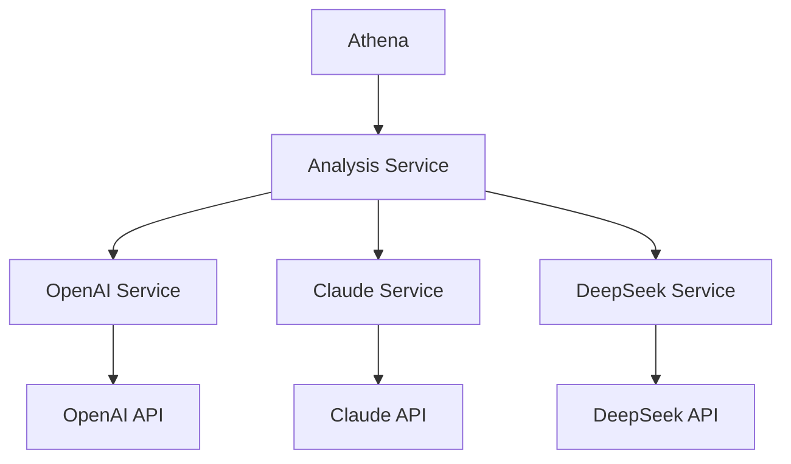
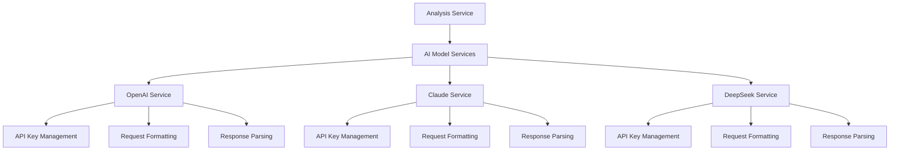
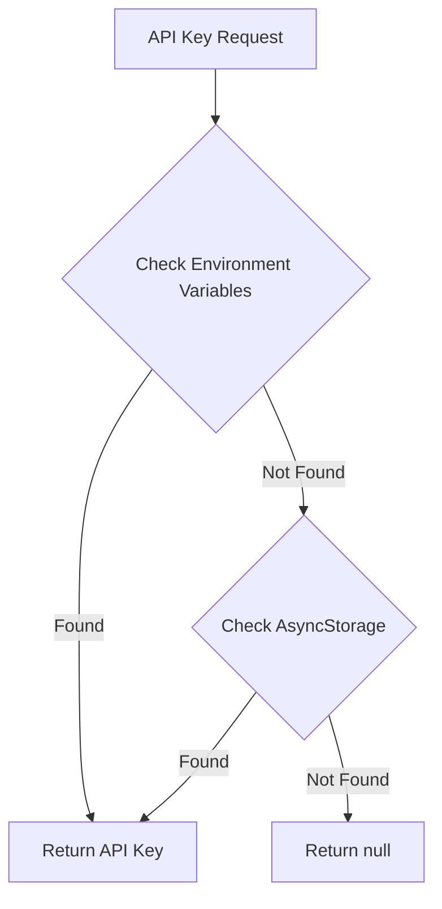

# AI Model API Integration

> **IMPORTANT DISCLAIMER:** The analysis components and API integrations described in this document are still being designed and developed. Their current implementation and documentation are not reflective of what the final design could be. This document represents a conceptual overview and may change significantly as development progresses.

This document provides detailed information about how Athena integrates with various AI model APIs for malware analysis.

## Table of Contents

- [Overview](#overview)
- [Supported AI Models](#supported-ai-models)
- [API Integration Architecture](#api-integration-architecture)
- [OpenAI Integration](#openai-integration)
- [Claude Integration](#claude-integration)
- [DeepSeek Integration](#deepseek-integration)
- [API Key Management](#api-key-management)
- [Error Handling](#error-handling)
- [Extending with New AI Models](#extending-with-new-ai-models)

## Overview

Athena leverages the power of advanced AI models to analyze and deobfuscate malware. The application integrates with multiple AI model APIs, allowing users to choose the most appropriate model for their specific analysis needs.



## Supported AI Models

### OpenAI Models

- **GPT-4 Turbo**: The default model for OpenAI integration, offering a good balance of performance and cost
- **GPT-4**: Higher quality but slower and more expensive than GPT-4 Turbo
- **GPT-3.5 Turbo**: Faster and less expensive, but with reduced capabilities for complex code analysis

### Claude Models

- **Claude 3 Opus**: The most powerful Claude model, offering detailed analysis and understanding of complex code patterns
- **Claude 3 Sonnet**: A balanced model offering good performance at a lower cost
- **Claude 3 Haiku**: The fastest Claude model, suitable for simpler analysis tasks

### DeepSeek Models

- **DeepSeek Coder**: Specialized for code analysis and understanding
- **DeepSeek Chat**: General-purpose model with good code understanding capabilities

## API Integration Architecture

Athena uses a service-based architecture for API integration, with a separate service for each AI model provider. This modular approach allows for easy addition of new AI models in the future.



Each AI model service is responsible for:

1. **API Key Management**: Securely storing and retrieving API keys
2. **Request Formatting**: Formatting requests according to the API's requirements
3. **Response Parsing**: Parsing and standardizing responses for consistent handling in the application

## OpenAI Integration

### API Endpoints

Athena communicates with the OpenAI API using the following endpoints:

- **Chat Completions**: `https://api.openai.com/v1/chat/completions`

### Request Format

```javascript
// Example request to OpenAI API
const response = await openai.chat.completions.create({
  model: "gpt-4-turbo",
  messages: [
    {
      role: "system",
      content: "You are a cybersecurity expert specializing in malware analysis. Analyze the following code, deobfuscate it, and explain its functionality."
    },
    {
      role: "user",
      content: malwareCode
    }
  ],
  temperature: 0.3,
  max_tokens: 4000
});
```

### Response Handling

```javascript
// Example response handling
const deobfuscatedCode = response.choices[0].message.content;
const analysisReport = extractAnalysisReport(deobfuscatedCode);
```

## Claude Integration

### API Endpoints

Athena communicates with the Claude API using the following endpoints:

- **Messages**: `https://api.anthropic.com/v1/messages`

### Request Format

```javascript
// Example request to Claude API
const response = await axios.post(
  'https://api.anthropic.com/v1/messages',
  {
    model: "claude-3-opus-20240229",
    max_tokens: 4000,
    messages: [
      {
        role: "user",
        content: `Analyze the following malware code, deobfuscate it, and explain its functionality:\n\n${malwareCode}`
      }
    ],
    temperature: 0.3
  },
  {
    headers: {
      'Content-Type': 'application/json',
      'x-api-key': apiKey,
      'anthropic-version': '2023-06-01'
    }
  }
);
```

### Response Handling

```javascript
// Example response handling
const deobfuscatedCode = response.data.content[0].text;
const analysisReport = extractAnalysisReport(deobfuscatedCode);
```

## DeepSeek Integration

### API Endpoints

Athena communicates with the DeepSeek API using the following endpoints:

- **Chat Completions**: `https://api.deepseek.com/v1/chat/completions`

### Request Format

```javascript
// Example request to DeepSeek API
const response = await axios.post(
  'https://api.deepseek.com/v1/chat/completions',
  {
    model: "deepseek-coder",
    messages: [
      {
        role: "system",
        content: "You are a cybersecurity expert specializing in malware analysis. Analyze the following code, deobfuscate it, and explain its functionality."
      },
      {
        role: "user",
        content: malwareCode
      }
    ],
    temperature: 0.3,
    max_tokens: 4000
  },
  {
    headers: {
      'Content-Type': 'application/json',
      'Authorization': `Bearer ${apiKey}`
    }
  }
);
```

### Response Handling

```javascript
// Example response handling
const deobfuscatedCode = response.data.choices[0].message.content;
const analysisReport = extractAnalysisReport(deobfuscatedCode);
```

## API Key Management

Athena uses a multi-layered approach for API key management:

1. **Environment Variables**: API keys can be stored in a `.env` file, which is excluded from version control
2. **AsyncStorage**: For keys entered through the UI, secure AsyncStorage is used for persistence
3. **Memory Cache**: During runtime, keys are cached in memory for efficient access



### API Key Storage

```javascript
// Example of saving an API key
export const saveOpenAIApiKey = async (apiKey: string): Promise<void> => {
  try {
    // Save to AsyncStorage
    await AsyncStorage.setItem('athena_openai_api_key', apiKey);
    console.log('OpenAI API key saved to AsyncStorage');
    
    // Cache in memory
    cachedOpenAIApiKey = apiKey;
    
    return Promise.resolve();
  } catch (error) {
    console.error('Error saving OpenAI API key:', error);
    return Promise.reject(error);
  }
};
```

### API Key Retrieval

```javascript
// Example of retrieving an API key
export const getOpenAIApiKey = async (): Promise<string | null> => {
  try {
    // Check environment variables first
    if (OPENAI_API_KEY) {
      return OPENAI_API_KEY;
    }
    
    // Check memory cache
    if (cachedOpenAIApiKey) {
      return cachedOpenAIApiKey;
    }
    
    // Check AsyncStorage
    const storedKey = await AsyncStorage.getItem('athena_openai_api_key');
    if (storedKey) {
      // Cache the key in memory
      cachedOpenAIApiKey = storedKey;
      return storedKey;
    }
    
    return null;
  } catch (error) {
    console.error('Error getting OpenAI API key:', error);
    return null;
  }
};
```

## Error Handling

Athena implements robust error handling for API interactions:

1. **Connection Errors**: Handled gracefully with user-friendly error messages
2. **Authentication Errors**: Detected and reported with suggestions to check API keys
3. **Rate Limiting**: Implemented with exponential backoff for retries
4. **Timeout Handling**: Long-running requests are monitored and can be cancelled

```javascript
// Example of error handling
try {
  const result = await openaiService.deobfuscateCode(code, modelId);
  return result;
} catch (error) {
  if (error.response) {
    // The request was made and the server responded with a status code
    // that falls out of the range of 2xx
    if (error.response.status === 401) {
      throw new Error('Authentication failed. Please check your API key.');
    } else if (error.response.status === 429) {
      throw new Error('Rate limit exceeded. Please try again later.');
    } else {
      throw new Error(`API error: ${error.response.data.error.message}`);
    }
  } else if (error.request) {
    // The request was made but no response was received
    throw new Error('No response from server. Please check your internet connection.');
  } else {
    // Something happened in setting up the request that triggered an Error
    throw new Error(`Error: ${error.message}`);
  }
}
```

## Extending with New AI Models

Athena's modular architecture makes it easy to add support for new AI models. To add a new AI model:

1. **Create a new service file** for the AI model (e.g., `newModelService.ts`)
2. **Implement the required functions**:
   - API key management functions
   - `deobfuscateCode` function
   - `analyzeVulnerabilities` function
3. **Update the analysis service** to use the new model service
4. **Add the new model to the store** in `store/index.ts`

### Example Implementation

```javascript
// Example of a new AI model service
import axios from 'axios';
import AsyncStorage from '@react-native-async-storage/async-storage';
import { Vulnerability } from '@/types';

// API key management
let cachedNewModelApiKey: string | null = null;

export const hasNewModelApiKey = async (): Promise<boolean> => {
  const apiKey = await getNewModelApiKey();
  return apiKey !== null && apiKey !== '';
};

export const getNewModelApiKey = async (): Promise<string | null> => {
  try {
    // Check environment variables first
    if (NEW_MODEL_API_KEY) {
      return NEW_MODEL_API_KEY;
    }
    
    // Check memory cache
    if (cachedNewModelApiKey) {
      return cachedNewModelApiKey;
    }
    
    // Check AsyncStorage
    const storedKey = await AsyncStorage.getItem('athena_new_model_api_key');
    if (storedKey) {
      // Cache the key in memory
      cachedNewModelApiKey = storedKey;
      return storedKey;
    }
    
    return null;
  } catch (error) {
    console.error('Error getting New Model API key:', error);
    return null;
  }
};

export const saveNewModelApiKey = async (apiKey: string): Promise<void> => {
  try {
    // Save to AsyncStorage
    await AsyncStorage.setItem('athena_new_model_api_key', apiKey);
    
    // Cache in memory
    cachedNewModelApiKey = apiKey;
    
    return Promise.resolve();
  } catch (error) {
    console.error('Error saving New Model API key:', error);
    return Promise.reject(error);
  }
};

export const deleteNewModelApiKey = async (): Promise<void> => {
  try {
    // Remove from AsyncStorage
    await AsyncStorage.removeItem('athena_new_model_api_key');
    
    // Clear memory cache
    cachedNewModelApiKey = null;
    
    return Promise.resolve();
  } catch (error) {
    console.error('Error deleting New Model API key:', error);
    return Promise.reject(error);
  }
};

// Deobfuscation function
export const deobfuscateCode = async (
  code: string,
  modelId: string
): Promise<{ deobfuscatedCode: string; analysisReport: string }> => {
  try {
    const apiKey = await getNewModelApiKey();
    if (!apiKey) {
      throw new Error('New Model API key not found');
    }
    
    const response = await axios.post(
      'https://api.newmodel.com/v1/completions',
      {
        model: modelId,
        prompt: `Analyze and deobfuscate the following code:\n\n${code}`,
        max_tokens: 4000,
        temperature: 0.3
      },
      {
        headers: {
          'Content-Type': 'application/json',
          'Authorization': `Bearer ${apiKey}`
        }
      }
    );
    
    const result = response.data.choices[0].text;
    
    // Extract deobfuscated code and analysis report
    const deobfuscatedCode = extractDeobfuscatedCode(result);
    const analysisReport = extractAnalysisReport(result);
    
    return {
      deobfuscatedCode,
      analysisReport
    };
  } catch (error) {
    console.error('Error in New Model deobfuscation:', error);
    throw error;
  }
};

// Vulnerability analysis function
export const analyzeVulnerabilities = async (
  code: string,
  modelId: string
): Promise<{ vulnerabilities: Vulnerability[]; analysisReport: string }> => {
  try {
    const apiKey = await getNewModelApiKey();
    if (!apiKey) {
      throw new Error('New Model API key not found');
    }
    
    const response = await axios.post(
      'https://api.newmodel.com/v1/completions',
      {
        model: modelId,
        prompt: `Analyze the following code for security vulnerabilities. For each vulnerability, provide a name, description, and severity (low, medium, high, critical):\n\n${code}`,
        max_tokens: 4000,
        temperature: 0.3
      },
      {
        headers: {
          'Content-Type': 'application/json',
          'Authorization': `Bearer ${apiKey}`
        }
      }
    );
    
    const result = response.data.choices[0].text;
    
    // Parse vulnerabilities from the response
    const vulnerabilities = parseVulnerabilities(result);
    const analysisReport = extractVulnerabilityReport(result);
    
    return {
      vulnerabilities,
      analysisReport
    };
  } catch (error) {
    console.error('Error in New Model vulnerability analysis:', error);
    throw error;
  }
};

// Helper functions for parsing responses
function extractDeobfuscatedCode(text: string): string {
  // Implementation depends on the response format
  // This is a simplified example
  const codeMatch = text.match(/```(?:javascript|python|.*?)\n([\s\S]*?)```/);
  return codeMatch ? codeMatch[1].trim() : '';
}

function extractAnalysisReport(text: string): string {
  // Implementation depends on the response format
  // This is a simplified example
  const reportMatch = text.replace(/```(?:javascript|python|.*?)\n[\s\S]*?```/, '').trim();
  return reportMatch;
}

function parseVulnerabilities(text: string): Vulnerability[] {
  // Implementation depends on the response format
  // This is a simplified example
  const vulnerabilities: Vulnerability[] = [];
  
  // Regular expression to match vulnerability patterns
  const regex = /Vulnerability: (.*?)\nDescription: (.*?)\nSeverity: (low|medium|high|critical)/gi;
  let match;
  
  while ((match = regex.exec(text)) !== null) {
    vulnerabilities.push({
      id: Math.random().toString(36).substring(2, 15),
      name: match[1].trim(),
      description: match[2].trim(),
      severity: match[3].toLowerCase() as 'low' | 'medium' | 'high' | 'critical'
    });
  }
  
  return vulnerabilities;
}

function extractVulnerabilityReport(text: string): string {
  // Implementation depends on the response format
  // This is a simplified example
  return text;
}
