# Athena Architecture Documentation

> **IMPORTANT DISCLAIMER:** The containerization and analysis components described in this documentation are still being designed and developed. Their current implementation and documentation are not reflective of what the final design could be. This documentation represents a conceptual overview and may change significantly as development progresses.

This document provides a detailed overview of Athena's architecture, explaining how the different components work together to provide a secure and efficient malware analysis platform.

## Table of Contents

- [Overview](#overview)
- [System Architecture](#system-architecture)
- [Deployment Architecture](#deployment-architecture)
- [Component Structure](#component-structure)
- [Data Flow](#data-flow)
- [State Management](#state-management)
- [Services Layer](#services-layer)
- [Cross-Platform Implementation](#cross-platform-implementation)
- [Security Architecture](#security-architecture)

## Overview

Athena is built using React Native with Expo, enabling cross-platform compatibility across iOS, Android, and web platforms. The application follows a modular architecture with clear separation of concerns, making it maintainable and extensible.

The deployment architecture includes an intelligent setup and launch system that automatically handles dependencies, configuration, and platform-specific requirements through a unified script interface.

## System Architecture

The high-level architecture of Athena consists of the following layers:

- **User Interface Layer**: React Native components that make up the application's UI
- **State Management Layer**: Zustand store for managing application state
- **Services Layer**: Business logic and integration with external systems
- **External APIs**: Integration with AI model APIs (OpenAI, Claude, DeepSeek)
- **Local Storage**: Persistent storage for files, analysis results, and settings
- **Container Execution**: Isolated environment for running malware analysis

## Deployment Architecture

Athena features an intelligent deployment architecture that provides a seamless setup and launch experience through a unified script system. This architecture automatically handles dependencies, configuration, and platform-specific requirements.

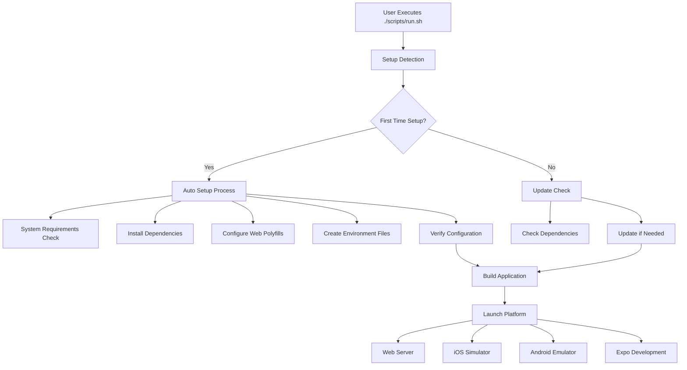

### Unified Script Architecture

The deployment system is built around a single, intelligent script (`scripts/run.sh`) that handles all aspects of setup and deployment:

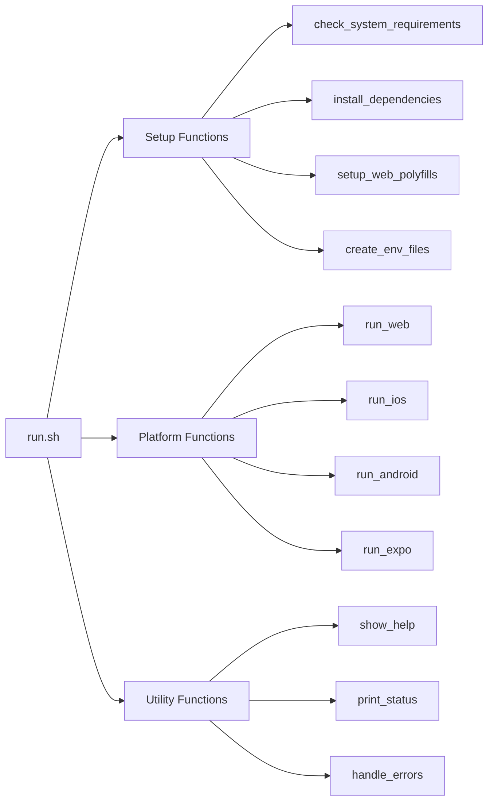

### Setup Detection Logic

The script uses intelligent detection to determine what setup steps are needed:

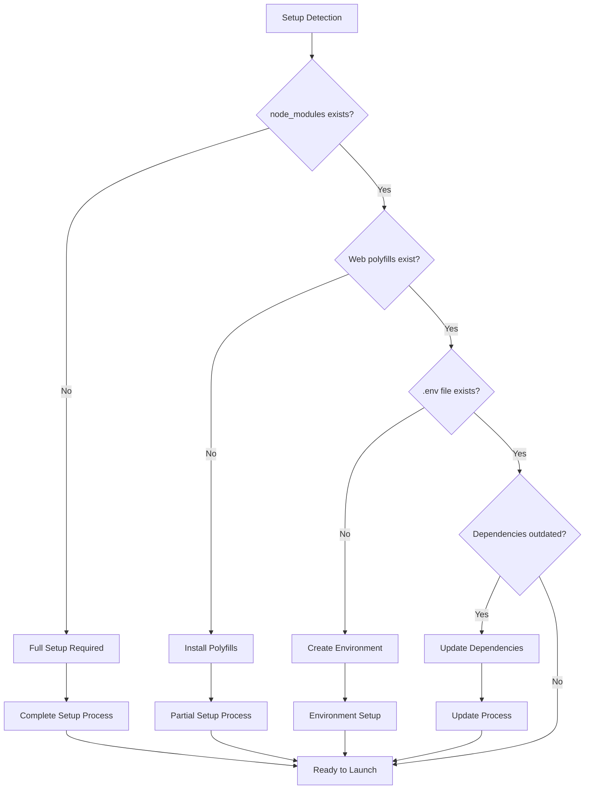

### Browser Compatibility Architecture

A critical component of the deployment architecture is the browser compatibility layer that resolves Node.js-specific dependencies:

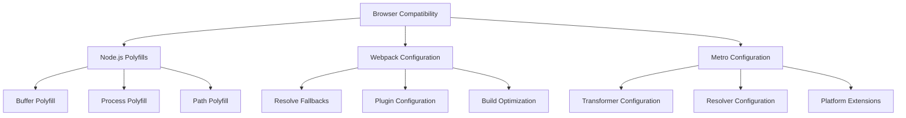

The system automatically installs and configures critical polyfills:
- **Buffer**: Provides Node.js Buffer functionality in browsers
- **Process**: Provides Node.js process object in browsers
- **Path**: Handles file path operations across platforms

### Platform-Specific Launch Architecture

The deployment system supports multiple platforms with platform-specific optimizations:

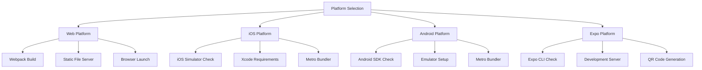

### Error Handling and Recovery

The deployment architecture includes comprehensive error handling and recovery mechanisms:

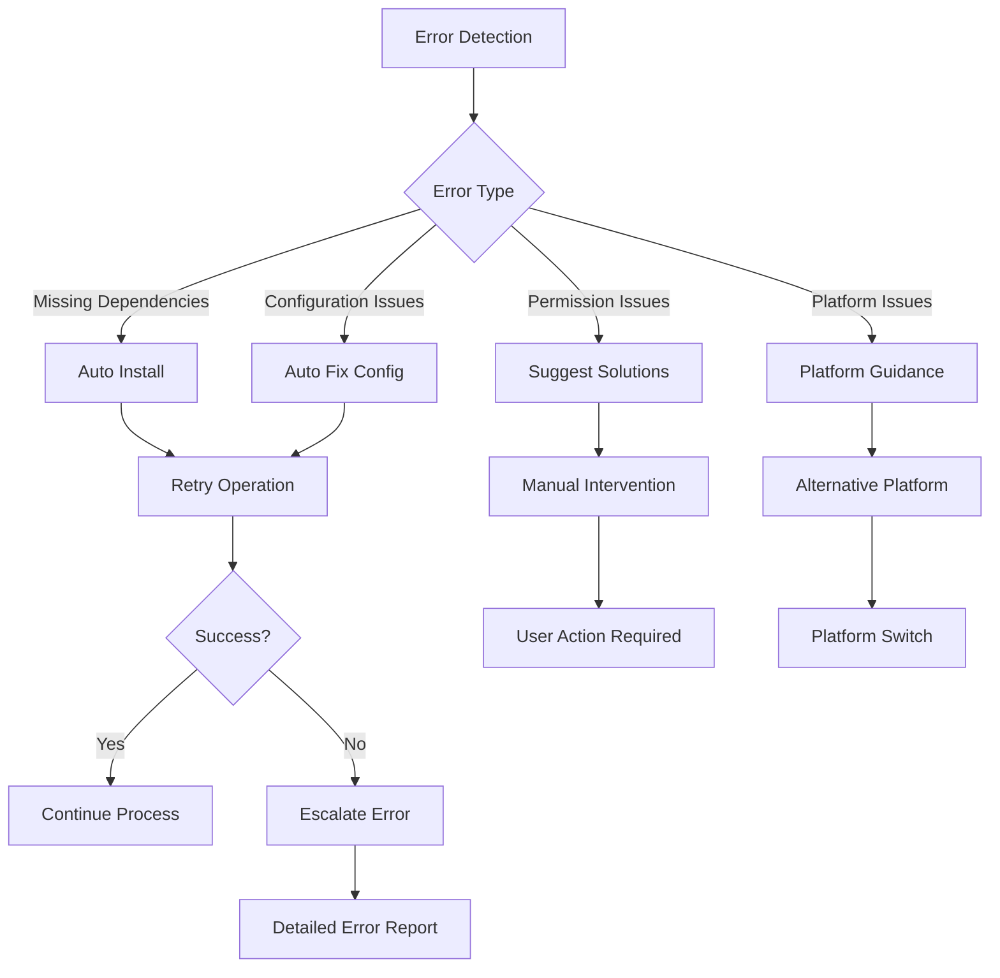

### Environment Management

The deployment system automatically manages environment configuration:

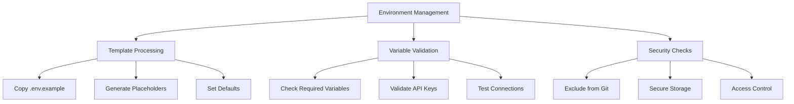

This deployment architecture ensures that users can get Athena running with minimal effort while maintaining flexibility for advanced users who need more control over the setup process.

## Component Structure

Athena is built with a component-based architecture, with reusable UI components that can be composed to create complex interfaces.

### Key Components

#### AIModelSelector

The AIModelSelector component allows users to select from available AI models for analysis.

- Displays a list of configured AI models (cloud and local)
- Checks for API key availability for cloud models
- Allows selection of a model for analysis

#### FileUploader

The FileUploader component handles file selection and management, with separate implementations for web and native platforms.

- **Web Implementation**: Uses the browser's File API to select files
- **Native Implementation**: Uses Expo's DocumentPicker and FileSystem APIs

#### AnalysisResults

The AnalysisResults component displays the results of malware analysis in three tabs:

- **Deobfuscated Code**: Shows the cleaned, readable version of the malware code
- **Analysis Report**: Provides a detailed report of the analysis findings
- **Vulnerabilities**: Lists detected vulnerabilities with severity ratings and details

## Data Flow

The application follows a unidirectional data flow pattern, where user actions trigger state changes through the Zustand store, which then propagate to the UI components.

## State Management

Athena uses Zustand for state management, providing a simple and efficient way to manage application state.

The store is structured into several slices:

- **AI Models**: Manages available AI models and the currently selected model
- **Malware Files**: Manages uploaded malware files and the currently selected file
- **Analysis Results**: Stores analysis results and the currently selected result
- **Containers**: Manages container instances for isolated malware execution
- **Settings**: Stores application settings and preferences
- **UI State**: Manages UI-related state such as loading indicators

The store is persisted using AsyncStorage, allowing the application to maintain state across sessions.

## Services Layer

The services layer provides a clean API for interacting with external systems and performing business logic.

```mermaid
flowchart TD
    A[Analysis Service] --> B[OpenAI Service]
    A --> C[Claude Service]
    A --> D[DeepSeek Service]
    A --> E[Local Models Service]
    A --> F[Container Service]
    A --> G[File Manager Service]
    A --> H[Metasploit Service]
    A --> I[Database Service]
    A --> J[Container-DB Service]
    A --> K[Monitoring Service]
    
    F --> F1[Container Creation]
    F --> F2[Container Execution]
    F --> F3[Container Monitoring]
    
    I --> I1[Database Connection]
    I --> I2[Model Operations]
    I --> I3[Query Execution]
    
    J --> J1[Container Integration]
    J --> J2[Database Integration]
    J --> J3[Monitoring Integration]
    
    K --> K1[Resource Monitoring]
    K --> K2[Network Monitoring]
    K --> K3[File Monitoring]
    K --> K4[Process Monitoring]
    
    E --> E1[Local Model Config]
    E --> E2[Model Execution]
    E --> E3[API Integration]
    
    E1 --> E1a[Config Storage]
    E1 --> E1b[Model Discovery]
    
    E2 --> E2a[Deobfuscation]
    E2 --> E2b[Vulnerability Analysis]
    
    E3 --> E3a[API Endpoints]
    E3 --> E3b[Request Handling]
```

### Database Integration

The application uses PostgreSQL for persistent storage of container configurations, monitoring data, and analysis results. The database integration is handled by the Database Service, which provides a clean API for interacting with the database.

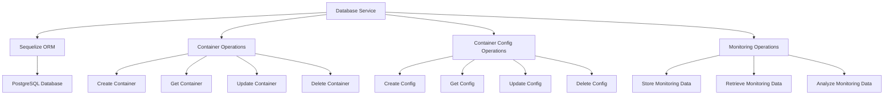

### Database Schema

The database schema consists of several related tables for storing container configurations, monitoring data, and analysis results.

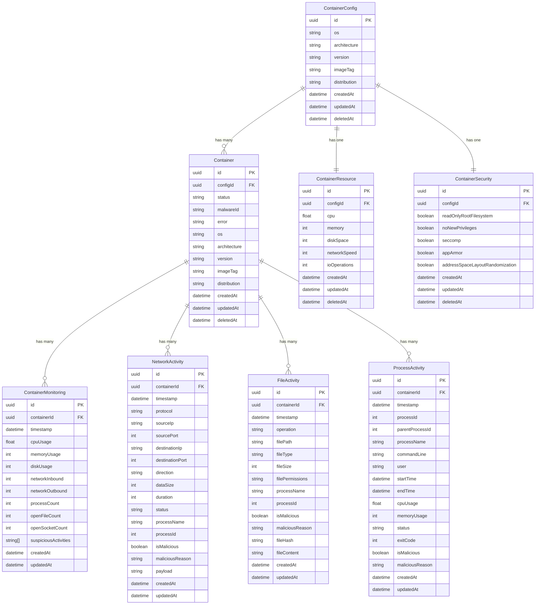

### Key Services

#### Analysis Service

The Analysis Service orchestrates the malware analysis process, coordinating between different AI models, container execution, and result processing.

Key functions:
- `runAnalysis`: Runs a full analysis on a malware file
- `deobfuscateCode`: Deobfuscates code using the selected AI model
- `analyzeVulnerabilities`: Analyzes code for vulnerabilities

#### AI Model Services (OpenAI, Claude, DeepSeek)

These services handle communication with external AI model APIs, providing a consistent interface for deobfuscation and vulnerability analysis.

Key functions:
- `deobfuscateCode`: Sends code to the AI model for deobfuscation
- `analyzeVulnerabilities`: Sends code to the AI model for vulnerability analysis
- API key management functions

#### Container Service

The Container Service manages isolated container environments for safer malware analysis.

Key functions:
- `createContainer`: Creates a new container for malware analysis
- `runMalwareAnalysis`: Runs analysis within the container
- `getContainerStatus`: Checks the status of a container

#### File Manager Service

The File Manager Service handles file operations, with platform-specific implementations for web and native platforms.

Key functions:
- `pickFile`: Opens a file picker dialog
- `readFileContent`: Reads the content of a file
- `saveAnalysisResult`: Saves analysis results to a file

#### Metasploit Service

The Metasploit Service integrates with the Metasploit database to provide additional context about identified vulnerabilities.

Key functions:
- `enrichVulnerabilityData`: Adds Metasploit module information to vulnerabilities
- `hasMetasploitConfig`: Checks if Metasploit is configured

## Cross-Platform Implementation

Athena is designed to work across multiple platforms, with platform-specific implementations where necessary.

Platform-specific implementations are used for:

- **File Handling**: Different APIs are used for file selection and management on web and native platforms
- **UI Components**: Some UI components have platform-specific implementations
- **Storage**: Different storage mechanisms are used on web and native platforms

## Security Architecture

Athena implements several security measures to protect sensitive data and provide a secure environment for malware analysis.

### API Key Security

The API key security implementation uses a multi-layered approach:

1. **Environment Variables**: API keys are primarily stored in `.env` files which are excluded from version control
2. **AsyncStorage**: For keys entered through the UI, secure AsyncStorage is used for persistence
3. **Memory Cache**: During runtime, keys are cached in memory for efficient access
4. **Fallback Mechanism**: The system checks environment variables first, then AsyncStorage if needed

### Container Isolation

Malware analysis can be performed in isolated containers to prevent potentially harmful code from affecting the host system. The container isolation feature provides a secure environment for executing and analyzing potentially harmful code.

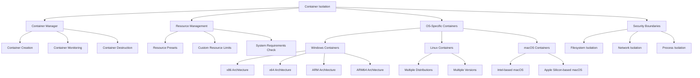

#### Container Lifecycle

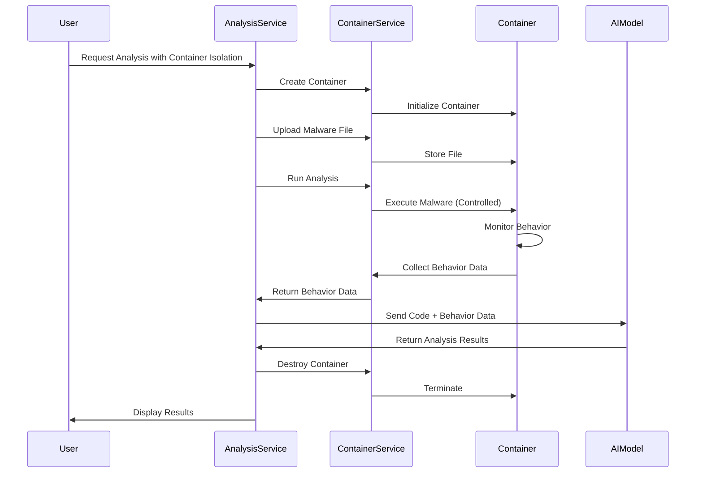

#### OS-Specific Resource Management

The container isolation feature includes OS-specific resource management to ensure optimal performance for each operating system:

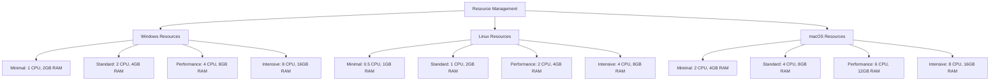

#### Container Service Integration

The Container Service integrates with the Analysis Service to provide a seamless experience for users:

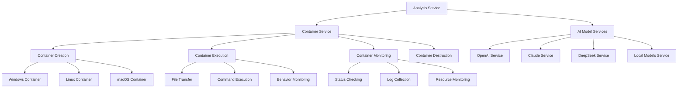

This approach provides an additional layer of security when analyzing potentially dangerous malware samples, while also offering flexibility in terms of target environment selection and resource allocation.
