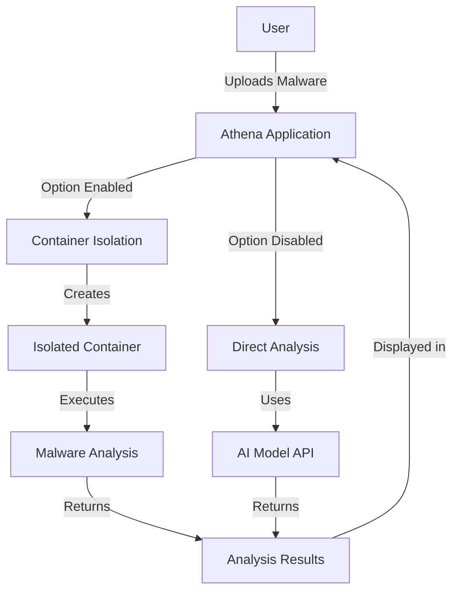
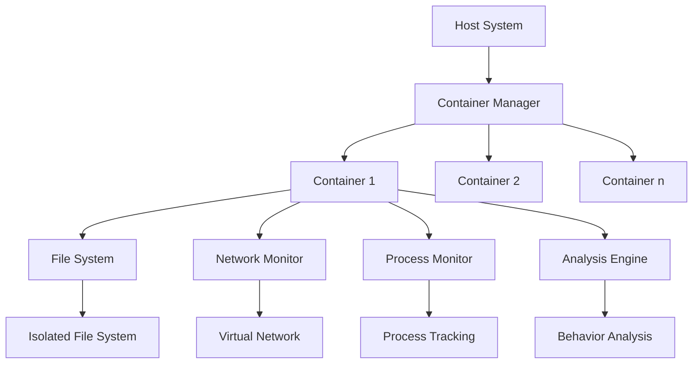
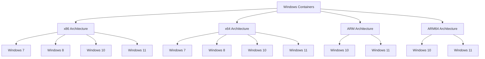
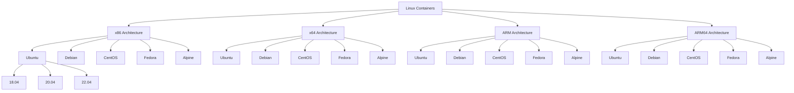
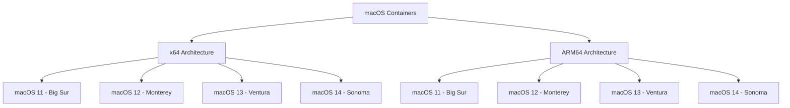
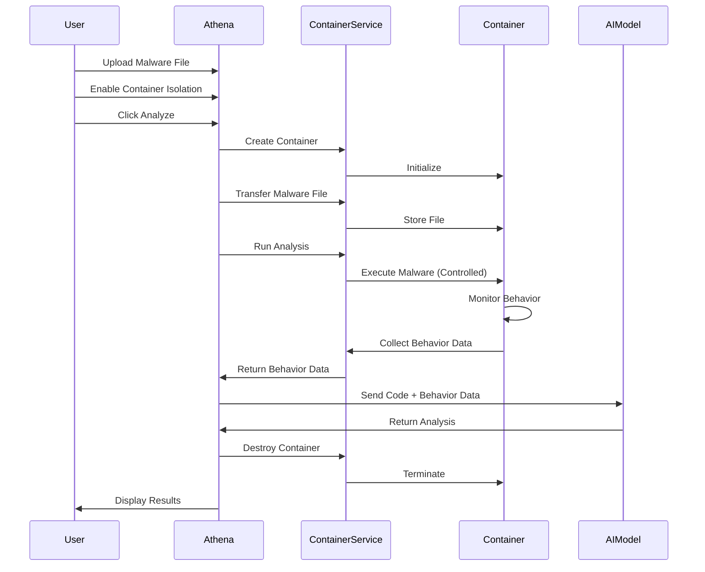
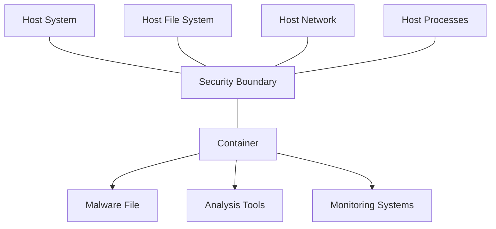

# Container Isolation for Malware Analysis

> **IMPORTANT DISCLAIMER:** The containerization and analysis components described in this document are still being designed and developed. Their current implementation and documentation are not reflective of what the final design could be. This document represents a conceptual overview and may change significantly as development progresses.

This document provides detailed information about Athena's container isolation feature, which allows for safer analysis of potentially harmful malware.

## Table of Contents

- [Overview](#overview)
- [How Container Isolation Works](#how-container-isolation-works)
- [Container Architecture](#container-architecture)
- [Container Lifecycle](#container-lifecycle)
- [Security Considerations](#security-considerations)
- [Implementation Details](#implementation-details)
- [Limitations and Considerations](#limitations-and-considerations)

## Overview

Analyzing malware can be risky, as executing malicious code could potentially harm your system. Athena addresses this risk by providing a container isolation feature that runs malware analysis in an isolated environment, separate from your main system.



## How Container Isolation Works

When the container isolation feature is enabled, Athena performs the following steps:

1. **Container Creation**: A new, isolated container is created for each analysis session
2. **File Transfer**: The malware file is securely transferred to the container
3. **Execution**: The analysis is performed within the container, monitoring behavior
4. **Result Collection**: Analysis results are collected from the container
5. **Container Destruction**: The container is destroyed after analysis, ensuring no malware remains

This approach provides a significant security advantage by preventing the malware from affecting your host system, even if it attempts to execute harmful operations.

## Container Architecture

The container isolation feature uses a lightweight, secure container architecture designed specifically for malware analysis.



### Key Components

1. **Container Manager**: Orchestrates container creation, monitoring, and destruction
2. **Isolated File System**: Prevents malware from accessing the host file system
3. **Virtual Network**: Monitors network activity without allowing actual connections
4. **Process Monitor**: Tracks process creation and execution
5. **Behavior Analysis**: Analyzes malware behavior within the container

### OS-Specific Containers

Athena supports different operating system containers to provide the most accurate analysis environment for various types of malware. Each OS container is available in different architectures to match the target environment of the malware.

#### Windows Containers

Windows containers are available in the following configurations:

| Architecture | Windows Versions | Use Case |
|--------------|-----------------|----------|
| x86 (32-bit) | Windows 7, 8, 10, 11 | Analyzing 32-bit Windows malware |
| x64 (64-bit) | Windows 7, 8, 10, 11 | Analyzing 64-bit Windows malware |
| ARM | Windows 10, 11 | Analyzing ARM-based Windows malware |
| ARM64 | Windows 10, 11 | Analyzing ARM64-based Windows malware |



When creating a container, you can specify the OS, architecture, and version to match the target environment of the malware you're analyzing. If not specified, the system defaults to Windows 10 x64.

#### Linux Containers

Linux containers are available in multiple distributions and architectures to analyze Linux-targeted malware:

| Architecture | Linux Distributions | Versions | Use Case |
|--------------|-------------------|----------|----------|
| x86 (32-bit) | Ubuntu, Debian, CentOS, Fedora, Alpine | Multiple per distro | Analyzing 32-bit Linux malware |
| x64 (64-bit) | Ubuntu, Debian, CentOS, Fedora, Alpine | Multiple per distro | Analyzing 64-bit Linux malware |
| ARM | Ubuntu, Debian, CentOS, Fedora, Alpine | Multiple per distro | Analyzing ARM-based Linux malware |
| ARM64 | Ubuntu, Debian, CentOS, Fedora, Alpine | Multiple per distro | Analyzing ARM64-based Linux malware |

Available Linux distributions and versions:

- **Ubuntu**: 18.04, 20.04, 22.04
- **Debian**: 10, 11, 12
- **CentOS**: 7, 8, 9
- **Fedora**: 36, 37, 38
- **Alpine**: 3.16, 3.17, 3.18



Linux containers are particularly useful for analyzing:
- ELF binaries and Linux-specific malware
- Cross-platform malware that targets both Windows and Linux
- Server-focused malware that targets common Linux server distributions
- IoT malware targeting Linux-based embedded systems

The default Linux container is Ubuntu 22.04 x64 if no specific configuration is provided.

#### macOS Containers

macOS containers are available for analyzing macOS-targeted malware:

| Architecture | macOS Versions | Use Case |
|--------------|---------------|----------|
| x64 (64-bit) | macOS 11 (Big Sur), 12 (Monterey), 13 (Ventura), 14 (Sonoma) | Analyzing Intel-based macOS malware |
| ARM64 | macOS 11 (Big Sur), 12 (Monterey), 13 (Ventura), 14 (Sonoma) | Analyzing Apple Silicon-based macOS malware |



macOS containers are particularly useful for analyzing:
- macOS-specific malware and malicious applications
- Cross-platform malware that targets macOS alongside Windows and Linux
- Malware targeting Apple's ecosystem
- Malicious code that exploits macOS-specific features or vulnerabilities

The default macOS container is macOS 14 (Sonoma) ARM64 if no specific configuration is provided, reflecting the current trend toward Apple Silicon-based Macs.

## Container Lifecycle



### Container States

Containers can exist in the following states:

1. **Creating**: The container is being initialized
2. **Running**: The container is actively performing analysis
3. **Stopped**: The analysis is complete, but the container still exists
4. **Error**: An error occurred during container operation
5. **Destroyed**: The container has been terminated and removed

## Security Considerations

The container isolation feature implements several security measures to ensure safe malware analysis:

### Isolation Mechanisms

1. **Filesystem Isolation**: The container has its own isolated filesystem, preventing malware from accessing the host filesystem
2. **Network Isolation**: Network activity is monitored but actual connections are restricted
3. **Process Isolation**: Processes run within the container cannot affect the host system
4. **Resource Limitations**: Containers have limited CPU, memory, and disk resources to prevent denial-of-service attacks

### Security Boundaries



## Implementation Details

The container isolation feature is implemented using the container service, which provides a clean API for container management.

### Container Service API

```typescript
// Container Service API
interface ContainerService {
  // Create a new container for malware analysis
  createContainer(
    malwareId: string,
    fileBase64: string,
    fileName: string
  ): Promise<Container>;
  
  // Get the status of a container
  getContainerStatus(containerId: string): Promise<ContainerStatus>;
  
  // Run malware analysis within the container
  runMalwareAnalysis(containerId: string): Promise<{
    logs: string;
    networkActivity: NetworkActivity[];
    fileActivity: FileActivity[];
  }>;
  
  // Get a file from the container
  getContainerFile(containerId: string, path: string): Promise<string>;
  
  // Remove a container
  removeContainer(containerId: string): Promise<void>;
}

// Container types
type ContainerStatus = 'creating' | 'running' | 'stopped' | 'error';

interface Container {
  id: string;
  status: ContainerStatus;
  malwareId: string;
  createdAt: number;
  error?: string;
}

interface NetworkActivity {
  protocol: string;
  destination: string;
  port: number;
  timestamp: number;
}

interface FileActivity {
  operation: 'read' | 'write' | 'delete' | 'execute';
  path: string;
  timestamp: number;
}
```

### Container Creation

```typescript
// Example of container creation with OS-specific configuration
export const createContainer = async (
  malwareId: string,
  malwareContent: string,
  malwareName: string,
  containerConfig?: Partial<ContainerConfig>
): Promise<Container> => {
  try {
    const client = await initContainerService();
    
    const containerId = generateId();
    
    // Use provided container config or default to Windows x64
    const config = containerConfig ? 
      { ...DEFAULT_CONTAINER_CONFIG, ...containerConfig } : 
      DEFAULT_CONTAINER_CONFIG;
    
    // If it's a Windows container, get the specific Windows container config
    let finalConfig = config;
    if (config.os === 'windows') {
      finalConfig = getWindowsContainerConfig(
        config.architecture,
        config.version as WindowsVersion
      );
    }
    
    const requestData = sanitizeRequestData({
      containerId,
      malwareId,
      malwareContent,
      malwareName,
      containerConfig: finalConfig,
    });
    
    const response = await safeApiCall(
      () => client.post('/api/v1/containers', requestData),
      'Container creation error'
    );
    
    return {
      id: containerId,
      status: 'creating',
      malwareId,
      createdAt: Date.now(),
      os: finalConfig.os,
      architecture: finalConfig.architecture,
      ...response.container,
    };
  } catch (error) {
    console.error('Container creation error:', error);
    throw error;
  }
};
```

### Windows Container Creation

```typescript
// Example of creating a Windows container with specific architecture and version
export const createWindowsContainer = async (
  malwareId: string,
  malwareContent: string,
  malwareName: string,
  architecture: ArchitectureType = 'x64',
  version: WindowsVersion = 'windows-10'
): Promise<Container> => {
  // Get the Windows container configuration
  const windowsConfig = getWindowsContainerConfig(architecture, version);
  
  // Create the container with the Windows configuration
  return createContainer(malwareId, malwareContent, malwareName, windowsConfig);
};
```

### Getting Windows Container Configurations

```typescript
// Example of getting Windows container configuration
export const getWindowsContainerConfig = (
  architecture: ArchitectureType = 'x64',
  version: WindowsVersion = 'windows-10'
): ContainerConfig => {
  // Check if the requested architecture is supported
  if (!WINDOWS_CONTAINERS[architecture]) {
    console.warn(`Architecture ${architecture} not supported, falling back to x64`);
    architecture = 'x64';
  }

  // Check if the requested version is supported for this architecture
  if (!WINDOWS_CONTAINERS[architecture][version]) {
    console.warn(`Windows version ${version} not supported for ${architecture}, falling back to windows-10`);
    version = 'windows-10';
  }

  const imageTag = WINDOWS_CONTAINERS[architecture][version].imageTag;

  return {
    os: 'windows',
    architecture,
    version,
    imageTag,
  };
};
```

### Getting Available Windows Versions and Architectures

```typescript
// Example of getting available Windows versions for a specific architecture
export const getAvailableWindowsVersions = (architecture: ArchitectureType): WindowsVersion[] => {
  if (!WINDOWS_CONTAINERS[architecture]) {
    return [];
  }
  
  return Object.keys(WINDOWS_CONTAINERS[architecture]) as WindowsVersion[];
};

// Example of getting available architectures for Windows containers
export const getAvailableWindowsArchitectures = (): ArchitectureType[] => {
  return Object.keys(WINDOWS_CONTAINERS) as ArchitectureType[];
};
```

### Linux Container Creation

```typescript
// Example of creating a Linux container with specific architecture and version
export const createLinuxContainer = async (
  malwareId: string,
  malwareContent: string,
  malwareName: string,
  architecture: ArchitectureType = 'x64',
  version: LinuxVersion = 'ubuntu-22.04'
): Promise<Container> => {
  // Get the Linux container configuration
  const linuxConfig = getLinuxContainerConfig(architecture, version);
  
  // Create the container with the Linux configuration
  return createContainer(malwareId, malwareContent, malwareName, linuxConfig);
};
```

### Getting Linux Container Configurations

```typescript
// Example of getting Linux container configuration
export const getLinuxContainerConfig = (
  architecture: ArchitectureType = 'x64',
  version: LinuxVersion = 'ubuntu-22.04'
): ContainerConfig => {
  // Check if the requested architecture is supported
  if (!LINUX_CONTAINERS[architecture]) {
    console.warn(`Architecture ${architecture} not supported for Linux, falling back to x64`);
    architecture = 'x64';
  }

  // Check if the requested version is supported for this architecture
  if (!LINUX_CONTAINERS[architecture][version]) {
    console.warn(`Linux version ${version} not supported for ${architecture}, falling back to ubuntu-22.04`);
    version = 'ubuntu-22.04';
  }

  const imageTag = LINUX_CONTAINERS[architecture][version].imageTag;
  const distribution = version.split('-')[0] as LinuxDistribution;

  return {
    os: 'linux',
    architecture,
    version,
    distribution,
    imageTag,
  };
};
```

### Getting Available Linux Versions, Architectures, and Distributions

```typescript
// Example of getting available Linux versions for a specific architecture
export const getAvailableLinuxVersions = (architecture: ArchitectureType): LinuxVersion[] => {
  if (!LINUX_CONTAINERS[architecture]) {
    return [];
  }
  
  return Object.keys(LINUX_CONTAINERS[architecture]) as LinuxVersion[];
};

// Example of getting available architectures for Linux containers
export const getAvailableLinuxArchitectures = (): ArchitectureType[] => {
  return Object.keys(LINUX_CONTAINERS) as ArchitectureType[];
};

// Example of getting available Linux distributions
export const getAvailableLinuxDistributions = (): LinuxDistribution[] => {
  const distributions = new Set<LinuxDistribution>();
  
  // Extract unique distribution names from all versions
  getAvailableLinuxVersions('x64').forEach(version => {
    const distribution = version.split('-')[0] as LinuxDistribution;
    distributions.add(distribution);
  });
  
  return Array.from(distributions);
};
```

### macOS Container Creation

```typescript
// Example of creating a macOS container with specific architecture and version
export const createMacOSContainer = async (
  malwareId: string,
  malwareContent: string,
  malwareName: string,
  architecture: ArchitectureType = 'arm64',
  version: MacOSVersion = 'macos-14'
): Promise<Container> => {
  // Get the macOS container configuration
  const macOSConfig = getMacOSContainerConfig(architecture, version);
  
  // Create the container with the macOS configuration
  return createContainer(malwareId, malwareContent, malwareName, macOSConfig);
};
```

### Getting macOS Container Configurations

```typescript
// Example of getting macOS container configuration
export const getMacOSContainerConfig = (
  architecture: ArchitectureType = 'arm64',
  version: MacOSVersion = 'macos-14'
): ContainerConfig => {
  // Check if the requested architecture is supported
  if (!MACOS_CONTAINERS[architecture]) {
    console.warn(`Architecture ${architecture} not supported for macOS, falling back to arm64`);
    architecture = 'arm64';
  }

  // Check if the requested version is supported for this architecture
  if (!MACOS_CONTAINERS[architecture][version]) {
    console.warn(`macOS version ${version} not supported for ${architecture}, falling back to macos-14`);
    version = 'macos-14';
  }

  const imageTag = MACOS_CONTAINERS[architecture][version].imageTag;

  return {
    os: 'macos',
    architecture,
    version,
    imageTag,
  };
};
```

### Getting Available macOS Versions and Architectures

```typescript
// Example of getting available macOS versions for a specific architecture
export const getAvailableMacOSVersions = (architecture: ArchitectureType): MacOSVersion[] => {
  if (!MACOS_CONTAINERS[architecture]) {
    return [];
  }
  
  return Object.keys(MACOS_CONTAINERS[architecture]) as MacOSVersion[];
};

// Example of getting available architectures for macOS containers
export const getAvailableMacOSArchitectures = (): ArchitectureType[] => {
  return Object.keys(MACOS_CONTAINERS) as ArchitectureType[];
};
```

### Running Malware Analysis

```javascript
// Example of running malware analysis in a container
export const runMalwareAnalysis = async (containerId: string): Promise<{
  logs: string;
  networkActivity: NetworkActivity[];
  fileActivity: FileActivity[];
}> => {
  try {
    // Send request to container service
    const response = await axios.post(
      `${CONTAINER_SERVICE_URL}/containers/${containerId}/analyze`,
      {},
      {
        headers: {
          'Content-Type': 'application/json',
          'Authorization': `Bearer ${API_KEY}`,
        },
      }
    );
    
    // Return analysis results
    return {
      logs: response.data.logs,
      networkActivity: response.data.networkActivity,
      fileActivity: response.data.fileActivity,
    };
  } catch (error) {
    console.error('Error running malware analysis:', error);
    throw new Error(`Failed to run malware analysis: ${(error as Error).message}`);
  }
};
```

### Container Removal

```javascript
// Example of container removal
export const removeContainer = async (containerId: string): Promise<void> => {
  try {
    // Send request to container service
    await axios.delete(
      `${CONTAINER_SERVICE_URL}/containers/${containerId}`,
      {
        headers: {
          'Content-Type': 'application/json',
          'Authorization': `Bearer ${API_KEY}`,
        },
      }
    );
    
    return Promise.resolve();
  } catch (error) {
    console.error('Error removing container:', error);
    throw new Error(`Failed to remove container: ${(error as Error).message}`);
  }
};
```

## Limitations and Considerations

While container isolation significantly improves security for malware analysis, it's important to be aware of its limitations:

### Technical Limitations

1. **Container Escape**: Sophisticated malware might attempt to escape the container, though this is rare and difficult
2. **Resource Overhead**: Running containers requires additional system resources
3. **Analysis Time**: Container-based analysis may take longer than direct analysis
4. **Compatibility**: Some malware may behave differently in a container environment

### Best Practices

1. **Regular Updates**: Keep the container system updated to patch security vulnerabilities
2. **Minimal Privileges**: Run containers with the minimum necessary privileges
3. **Monitoring**: Monitor container activity for unusual behavior
4. **Cleanup**: Always ensure containers are properly destroyed after analysis

### When to Use Container Isolation

Container isolation is recommended for:

1. **Unknown Malware**: When analyzing unknown or suspicious files
2. **High-Risk Analysis**: When working with known dangerous malware
3. **Production Environments**: When performing analysis in production environments

It may be less necessary for:

1. **Known Safe Files**: When analyzing files from trusted sources
2. **Simple Script Analysis**: When analyzing simple, non-executable scripts
3. **Development Testing**: During development and testing of the application itself
