# Container Isolation Documentation

## Table of Contents

- [Overview](#overview)
- [Container Architecture](#container-architecture)
- [Security Model](#security-model)
- [Platform Support](#platform-support)
- [Resource Management](#resource-management)
- [Container Lifecycle](#container-lifecycle)
- [Implementation Details](#implementation-details)
- [Monitoring & Analysis](#monitoring--analysis)
- [Best Practices](#best-practices)
- [Troubleshooting](#troubleshooting)

## Overview

Athena's container isolation feature provides a secure, sandboxed environment for analyzing potentially malicious code. The system uses Docker-based containerization with custom security hardening to ensure malware cannot escape and affect the host system.

### Key Features

- **Multi-Platform Support**: Windows, Linux, macOS containers
- **Architecture Support**: x86, x64, ARM, ARM64
- **Resource Management**: Fine-grained control over CPU, memory, disk
- **Security Hardening**: Multiple layers of isolation
- **Real-time Monitoring**: Behavior tracking and analysis
- **Automatic Cleanup**: Self-destroying containers

## Container Architecture

### Complete Container Architecture

```mermaid
graph TB
    subgraph "Athena Application Layer"
        UI[UI Components<br/>━━━━━━━━<br/>• Container Config<br/>• Resource Settings<br/>• OS Selection]
        Store[Zustand Store<br/>━━━━━━━━<br/>• Container State<br/>• Analysis Results<br/>• Resource Metrics]
    end
    
    subgraph "Service Layer"
        CS[Container Service<br/>━━━━━━━━<br/>• Create/Destroy<br/>• Execute Commands<br/>• Resource Control]
        CB[Circuit Breaker<br/>━━━━━━━━<br/>• Failure Detection<br/>• Auto Recovery<br/>• Fallback Logic]
        BH[Bulkhead<br/>━━━━━━━━<br/>• Resource Isolation<br/>• Concurrent Limits<br/>• Queue Management]
    end
    
    subgraph "API Gateway"
        AG[API Gateway<br/>━━━━━━━━<br/>• Request Routing<br/>• Authentication<br/>• Rate Limiting]
        Cache[Cache Manager<br/>━━━━━━━━<br/>• Response Cache<br/>• Image Cache<br/>• Metrics Cache]
    end
    
    subgraph "Container Runtime"
        Docker[Docker Engine<br/>━━━━━━━━<br/>• Container Creation<br/>• Image Management<br/>• Network Control]
        Monitor[Monitor Service<br/>━━━━━━━━<br/>• Event Collection<br/>• Metric Gathering<br/>• Alert Generation]
    end
    
    subgraph "Security Layers"
        Host[Host Security<br/>━━━━━━━━<br/>• Firewall Rules<br/>• SELinux/AppArmor<br/>• Resource Limits]
        Runtime[Runtime Security<br/>━━━━━━━━<br/>• Seccomp Profiles<br/>• Capability Drops<br/>• Namespace Isolation]
        Container[Container Security<br/>━━━━━━━━<br/>• Read-only FS<br/>• No Network<br/>• User Isolation]
    end
    
    subgraph "Container Types"
        Windows[Windows<br/>━━━━━━━━<br/>• 7/8/10/11<br/>• x86/x64/ARM]
        Linux[Linux<br/>━━━━━━━━<br/>• Ubuntu/Debian<br/>• CentOS/Fedora<br/>• Alpine]
        macOS[macOS<br/>━━━━━━━━<br/>• 11/12/13/14<br/>• x64/ARM64]
    end
    
    UI --> Store
    Store --> CS
    CS --> CB
    CS --> BH
    CB --> AG
    BH --> AG
    AG --> Cache
    AG --> Docker
    Docker --> Monitor
    Docker --> Host
    Host --> Runtime
    Runtime --> Container
    Container --> Windows
    Container --> Linux
    Container --> macOS
    
    style UI fill:#e1f5e1
    style CS fill:#e1e5ff
    style CB fill:#fff4e1
    style BH fill:#fff4e1
    style Docker fill:#e1e5ff
    style Host fill:#ffe4e1
    style Runtime fill:#ffe4e1
    style Container fill:#ffe4e1
```



### Container Service Integration


## Security Model

### Multi-Layer Security Architecture

```mermaid
graph TB
    subgraph "Layer 1: Host Security"
        HF[Host Firewall<br/>━━━━━━━━<br/>• iptables/nftables<br/>• Connection Tracking<br/>• Rate Limiting]
        HA[Host Protection<br/>━━━━━━━━<br/>• Antivirus/EDR<br/>• File Integrity<br/>• Audit Logging]
        HI[Intrusion Detection<br/>━━━━━━━━<br/>• Network IDS<br/>• Host IDS<br/>• Anomaly Detection]
    end
    
    subgraph "Layer 2: Runtime Security"
        DR[Docker Security<br/>━━━━━━━━<br/>• Docker Daemon<br/>• Image Signing<br/>• Content Trust]
        SE[MAC Systems<br/>━━━━━━━━<br/>• SELinux Policies<br/>• AppArmor Profiles<br/>• Security Contexts]
        SC[Syscall Filtering<br/>━━━━━━━━<br/>• Seccomp Profiles<br/>• Default Denies<br/>• Allowlists]
    end
    
    subgraph "Layer 3: Container Isolation"
        NS[Namespaces<br/>━━━━━━━━<br/>• PID Isolation<br/>• Network Isolation<br/>• Mount Isolation<br/>• User Isolation]
        CG[Control Groups<br/>━━━━━━━━<br/>• CPU Limits<br/>• Memory Limits<br/>• I/O Limits<br/>• PID Limits]
        CAP[Capabilities<br/>━━━━━━━━<br/>• Drop ALL<br/>• No CAP_SYS_ADMIN<br/>• No CAP_NET_RAW<br/>• Minimal Set]
    end
    
    subgraph "Layer 4: Application Security"
        RO[Filesystem<br/>━━━━━━━━<br/>• Read-Only Root<br/>• No Write Access<br/>• Temp Mounts Only]
        NP[Privileges<br/>━━━━━━━━<br/>• Non-Root User<br/>• No Escalation<br/>• No SUID/SGID]
        NE[Network<br/>━━━━━━━━<br/>• No Egress<br/>• Internal Only<br/>• Drop All Traffic]
    end
    
    HF --> DR
    HA --> SE
    HI --> SC
    DR --> NS
    SE --> CG
    SC --> CAP
    NS --> RO
    CG --> NP
    CAP --> NE
    
    style HF fill:#ffe4e1
    style HA fill:#ffe4e1
    style HI fill:#ffe4e1
    style DR fill:#fff4e1
    style SE fill:#fff4e1
    style SC fill:#fff4e1
    style NS fill:#e1e5ff
    style CG fill:#e1e5ff
    style CAP fill:#e1e5ff
    style RO fill:#e1f5e1
    style NP fill:#e1f5e1
    style NE fill:#e1f5e1
```



### Security Implementation Flow


### Security Features

#### 1. Namespace Isolation
```yaml
namespaces:
  - pid     # Process isolation
  - net     # Network isolation
  - ipc     # IPC isolation
  - uts     # Hostname isolation
  - mount   # Filesystem isolation
  - user    # User namespace
```

#### 2. Capability Restrictions
```yaml
dropped_capabilities:
  - CAP_SYS_ADMIN
  - CAP_SYS_MODULE
  - CAP_SYS_RAWIO
  - CAP_SYS_PTRACE
  - CAP_SYS_BOOT
  - CAP_NET_ADMIN
  - CAP_NET_RAW
```

#### 3. Seccomp Profiles
```json
{
  "defaultAction": "SCMP_ACT_ERRNO",
  "architectures": ["SCMP_ARCH_X86_64"],
  "syscalls": [
    {
      "names": ["read", "write", "open", "close"],
      "action": "SCMP_ACT_ALLOW"
    }
  ]
}
```

## Platform Support

### Windows Containers


#### Windows Configuration
```typescript
interface WindowsContainerConfig {
  os: 'windows';
  architecture: 'x86' | 'x64' | 'arm' | 'arm64';
  version: 'windows-7' | 'windows-8' | 'windows-10' | 'windows-11';
  features: {
    defender: boolean;
    firewall: boolean;
    eventLog: boolean;
    registry: boolean;
  };
}
```

### Linux Containers


#### Linux Configuration
```typescript
interface LinuxContainerConfig {
  os: 'linux';
  architecture: 'x86' | 'x64' | 'arm' | 'arm64';
  distribution: 'ubuntu' | 'debian' | 'centos' | 'fedora' | 'alpine';
  version: string;
  kernel: {
    version: string;
    modules: string[];
  };
}
```

### macOS Containers


#### macOS Configuration
```typescript
interface MacOSContainerConfig {
  os: 'macos';
  architecture: 'x64' | 'arm64';
  version: 'macos-11' | 'macos-12' | 'macos-13' | 'macos-14';
  security: {
    gatekeeper: boolean;
    xprotect: boolean;
    mrt: boolean;
  };
}
```

## Resource Management

### Resource Management Architecture

```mermaid
graph TB
    subgraph "Resource Manager"
        RM[Resource Manager<br/>━━━━━━━━<br/>• Allocation Logic<br/>• Quota Enforcement<br/>• Priority Scheduling]
        Scheduler[Resource Scheduler<br/>━━━━━━━━<br/>• CPU Scheduling<br/>• Memory Allocation<br/>• I/O Prioritization]
        Monitor[Usage Monitor<br/>━━━━━━━━<br/>• Real-time Metrics<br/>• Threshold Alerts<br/>• Historical Data]
        Limiter[Rate Limiter<br/>━━━━━━━━<br/>• Bandwidth Control<br/>• IOPS Limiting<br/>• Request Throttling]
    end
    
    subgraph "Resource Types"
        CPU[CPU Resources<br/>━━━━━━━━<br/>• Core Allocation<br/>• CPU Shares<br/>• CPU Sets]
        Memory[Memory Resources<br/>━━━━━━━━<br/>• RAM Limits<br/>• Swap Control<br/>• OOM Handling]
        Disk[Disk Resources<br/>━━━━━━━━<br/>• Space Quotas<br/>• I/O Bandwidth<br/>• IOPS Limits]
        Network[Network Resources<br/>━━━━━━━━<br/>• Bandwidth Caps<br/>• Packet Rate<br/>• Connection Limits]
    end
    
    subgraph "Control Mechanisms"
        Cgroups[Control Groups v2<br/>━━━━━━━━<br/>• Hierarchical Control<br/>• Resource Accounting<br/>• Unified Interface]
        Quotas[Filesystem Quotas<br/>━━━━━━━━<br/>• User Quotas<br/>• Project Quotas<br/>• Soft/Hard Limits]
        TC[Traffic Control<br/>━━━━━━━━<br/>• Token Bucket<br/>• Fair Queuing<br/>• Network Emulation]
        NS[Namespace Control<br/>━━━━━━━━<br/>• PID Limits<br/>• IPC Limits<br/>• Mount Limits]
    end
    
    RM --> Scheduler
    RM --> Monitor
    RM --> Limiter
    
    Scheduler --> CPU
    Scheduler --> Memory
    Monitor --> Disk
    Monitor --> Network
    
    CPU --> Cgroups
    Memory --> Cgroups
    Disk --> Quotas
    Network --> TC
    Memory --> NS
    
    style RM fill:#e1e5ff
    style CPU fill:#e1f5e1
    style Memory fill:#e1f5e1
    style Disk fill:#e1f5e1
    style Network fill:#e1f5e1
    style Cgroups fill:#fff4e1
```



### OS-Specific Resource Requirements

```mermaid
graph TB
    subgraph "Windows Requirements"
        WMin[Minimal<br/>━━━━━━━━<br/>🖥️ 1 CPU<br/>💾 2GB RAM<br/>💿 8GB Disk]
        WStd[Standard<br/>━━━━━━━━<br/>🖥️ 2 CPU<br/>💾 4GB RAM<br/>💿 10GB Disk]
        WPerf[Performance<br/>━━━━━━━━<br/>🖥️ 4 CPU<br/>💾 8GB RAM<br/>💿 20GB Disk]
        WInt[Intensive<br/>━━━━━━━━<br/>🖥️ 8 CPU<br/>💾 16GB RAM<br/>💿 40GB Disk]
    end
    
    subgraph "Linux Requirements"
        LMin[Minimal<br/>━━━━━━━━<br/>🖥️ 0.5 CPU<br/>💾 1GB RAM<br/>💿 4GB Disk]
        LStd[Standard<br/>━━━━━━━━<br/>🖥️ 1 CPU<br/>💾 2GB RAM<br/>💿 8GB Disk]
        LPerf[Performance<br/>━━━━━━━━<br/>🖥️ 2 CPU<br/>💾 4GB RAM<br/>💿 10GB Disk]
        LInt[Intensive<br/>━━━━━━━━<br/>🖥️ 4 CPU<br/>💾 8GB RAM<br/>💿 20GB Disk]
    end
    
    subgraph "macOS Requirements"
        MMin[Minimal<br/>━━━━━━━━<br/>🖥️ 2 CPU<br/>💾 4GB RAM<br/>💿 16GB Disk]
        MStd[Standard<br/>━━━━━━━━<br/>🖥️ 4 CPU<br/>💾 8GB RAM<br/>💿 20GB Disk]
        MPerf[Performance<br/>━━━━━━━━<br/>🖥️ 6 CPU<br/>💾 12GB RAM<br/>💿 30GB Disk]
        MInt[Intensive<br/>━━━━━━━━<br/>🖥️ 8 CPU<br/>💾 16GB RAM<br/>💿 40GB Disk]
    end
    
    subgraph "Use Cases"
        UC1[Simple Malware<br/>━━━━━━━━<br/>• Basic Scripts<br/>• Static Analysis<br/>• Quick Scans]
        UC2[Standard Analysis<br/>━━━━━━━━<br/>• Dynamic Analysis<br/>• Network Monitor<br/>• File Tracking]
        UC3[Complex Threats<br/>━━━━━━━━<br/>• Advanced Malware<br/>• Packed Binaries<br/>• Obfuscation]
        UC4[APT Analysis<br/>━━━━━━━━<br/>• Nation State<br/>• Zero Days<br/>• Persistence]
    end
    
    WMin --> UC1
    LMin --> UC1
    MMin --> UC1
    
    WStd --> UC2
    LStd --> UC2
    MStd --> UC2
    
    WPerf --> UC3
    LPerf --> UC3
    MPerf --> UC3
    
    WInt --> UC4
    LInt --> UC4
    MInt --> UC4
    
    style WMin fill:#e1f5e1
    style WStd fill:#e1e5ff
    style WPerf fill:#fff4e1
    style WInt fill:#ffe4e1
    style UC1 fill:#e1f5e1
    style UC2 fill:#e1e5ff
    style UC3 fill:#fff4e1
    style UC4 fill:#ffe4e1
```



### Resource Allocation Flow


### Resource Configuration

```typescript
interface ContainerResourceLimits {
  cpu: number;           // CPU cores (e.g., 0.5, 1, 2)
  memory: number;        // Memory in MB
  diskSpace: number;     // Disk space in MB
  networkSpeed: number;  // Network bandwidth in Mbps
  ioOperations: number;  // IOPS limit
  
  // Advanced limits
  pids?: number;         // Max process count
  openFiles?: number;    // Max open files
  cpuShares?: number;    // CPU priority shares
  swapMemory?: number;   // Swap memory in MB
}

// Resource monitoring
interface ResourceMetrics {
  cpuUsage: number;      // Percentage
  memoryUsage: number;   // MB used
  diskUsage: number;     // MB used
  networkIn: number;     // Bytes received
  networkOut: number;    // Bytes sent
  processCount: number;  // Active processes
}
```

## Container Lifecycle

### Complete Lifecycle State Machine


### Detailed Lifecycle Management Flow


### Container Lifecycle Monitoring

```mermaid
graph TB
    subgraph "Lifecycle Metrics"
        CreateTime[Creation Time<br/>━━━━━━━━<br/>• Image Pull: 5s<br/>• Security: 2s<br/>• Total: 7s]
        RunTime[Execution Time<br/>━━━━━━━━<br/>• Startup: 3s<br/>• Analysis: 60s<br/>• Cleanup: 5s]
        Resources[Resource Usage<br/>━━━━━━━━<br/>• Peak CPU: 85%<br/>• Peak RAM: 3.2GB<br/>• Disk I/O: 150MB]
    end
    
    subgraph "Health Monitoring"
        Health[Health Checks<br/>━━━━━━━━<br/>• Service Status<br/>• Resource Limits<br/>• Error Detection]
        Alerts[Alert System<br/>━━━━━━━━<br/>• Threshold Breach<br/>• Security Events<br/>• Failures]
        Recovery[Auto Recovery<br/>━━━━━━━━<br/>• Restart Services<br/>• Resource Adjust<br/>• Fallback Mode]
    end
    
    subgraph "Event Tracking"
        Events[Event Stream<br/>━━━━━━━━<br/>• State Changes<br/>• API Calls<br/>• System Events]
        Logs[Log Aggregation<br/>━━━━━━━━<br/>• Container Logs<br/>• System Logs<br/>• Security Logs]
        Metrics[Metrics Collection<br/>━━━━━━━━<br/>• Performance<br/>• Resources<br/>• Behavior]
    end
    
    CreateTime --> Health
    RunTime --> Alerts
    Resources --> Recovery
    
    Health --> Events
    Alerts --> Logs
    Recovery --> Metrics
    
    style CreateTime fill:#e1f5e1
    style Health fill:#e1e5ff
    style Events fill:#fff4e1
```



## Implementation Details

### Container Service Architecture

```typescript
class ContainerService {
  private docker: Docker;
  private monitor: ContainerMonitor;
  private security: SecurityManager;
  
  async createContainer(config: ContainerConfig): Promise<Container> {
    // Validate configuration
    this.validateConfig(config);
    
    // Apply security policies
    const secureConfig = await this.security.hardenConfig(config);
    
    // Create container with circuit breaker
    return await circuitBreakerFactory.execute(
      'container.create',
      async () => {
        const container = await this.docker.createContainer(secureConfig);
        await this.monitor.attach(container);
        return container;
      }
    );
  }
  
  async runAnalysis(containerId: string): Promise<AnalysisResult> {
    // Use bulkhead for resource isolation
    return await bulkheadManager.execute(
      'container.analysis',
      async () => {
        const container = await this.getContainer(containerId);
        
        // Start analysis with monitoring
        const analysis = await container.analyze();
        
        // Collect results
        return {
          logs: await this.monitor.getLogs(containerId),
          network: await this.monitor.getNetworkActivity(containerId),
          filesystem: await this.monitor.getFileActivity(containerId),
          processes: await this.monitor.getProcessActivity(containerId),
          registry: await this.monitor.getRegistryActivity(containerId)
        };
      }
    );
  }
}
```

### Security Hardening

```typescript
class SecurityManager {
  async hardenConfig(config: ContainerConfig): Promise<SecureContainerConfig> {
    return {
      ...config,
      
      // Security options
      securityOpt: [
        'no-new-privileges',
        'seccomp=unconfined',
        'apparmor=docker-default'
      ],
      
      // Capability drops
      capDrop: [
        'ALL'
      ],
      
      // Read-only root filesystem
      readonlyRootfs: true,
      
      // No network access
      networkMode: 'none',
      
      // Resource limits
      hostConfig: {
        memory: config.resources.memory * 1024 * 1024,
        cpuShares: config.resources.cpu * 1024,
        diskQuota: config.resources.diskSpace * 1024 * 1024,
        pidsLimit: 100,
        ulimits: [
          { name: 'nofile', soft: 1024, hard: 2048 }
        ]
      }
    };
  }
}
```

### Monitoring Implementation

```typescript
class ContainerMonitor {
  private monitors: Map<string, Monitor> = new Map();
  
  async attach(container: Container): Promise<void> {
    const monitor = new Monitor({
      containerId: container.id,
      hooks: {
        syscall: this.onSyscall.bind(this),
        network: this.onNetwork.bind(this),
        file: this.onFile.bind(this),
        process: this.onProcess.bind(this),
        registry: this.onRegistry.bind(this)
      }
    });
    
    await monitor.start();
    this.monitors.set(container.id, monitor);
  }
  
  private async onSyscall(event: SyscallEvent): Promise<void> {
    // Log system calls
    await this.logEvent('syscall', {
      pid: event.pid,
      syscall: event.name,
      args: event.args,
      result: event.result,
      timestamp: event.timestamp
    });
  }
  
  private async onNetwork(event: NetworkEvent): Promise<void> {
    // Log network activity
    await this.logEvent('network', {
      protocol: event.protocol,
      source: event.source,
      destination: event.destination,
      port: event.port,
      data: event.data,
      timestamp: event.timestamp
    });
  }
}
```

## Monitoring & Analysis

### Complete Monitoring Architecture

```mermaid
graph TB
    subgraph "Data Collection Layer"
        Hooks[System Hooks<br/>━━━━━━━━<br/>• Syscall Intercept<br/>• API Hooking<br/>• Kernel Events]
        Agents[Monitor Agents<br/>━━━━━━━━<br/>• Process Monitor<br/>• Network Monitor<br/>• File Monitor]
        Sensors[Container Sensors<br/>━━━━━━━━<br/>• Resource Usage<br/>• Performance Metrics<br/>• Health Status]
    end
    
    subgraph "Processing Layer"
        Collector[Event Collector<br/>━━━━━━━━<br/>• Event Queue<br/>• Deduplication<br/>• Normalization]
        Analyzer[Real-time Analyzer<br/>━━━━━━━━<br/>• Pattern Detection<br/>• Anomaly Detection<br/>• Threat Scoring]
        Enricher[Data Enricher<br/>━━━━━━━━<br/>• Context Addition<br/>• Metadata Lookup<br/>• Correlation]
    end
    
    subgraph "Storage Layer"
        TSB[Time Series DB<br/>━━━━━━━━<br/>• Metrics Storage<br/>• Performance Data<br/>• Resource Usage]
        EventDB[Event Database<br/>━━━━━━━━<br/>• Security Events<br/>• System Events<br/>• Analysis Results]
        Cache[Redis Cache<br/>━━━━━━━━<br/>• Hot Data<br/>• Recent Events<br/>• Quick Lookups]
    end
    
    subgraph "Presentation Layer"
        Dashboard[Live Dashboard<br/>━━━━━━━━<br/>• Real-time Metrics<br/>• Event Stream<br/>• Alert Panel]
        API[Query API<br/>━━━━━━━━<br/>• REST Endpoints<br/>• WebSocket Stream<br/>• GraphQL]
        Reports[Report Engine<br/>━━━━━━━━<br/>• PDF Reports<br/>• JSON Export<br/>• CSV Data]
    end
    
    Hooks --> Collector
    Agents --> Collector
    Sensors --> Collector
    
    Collector --> Analyzer
    Collector --> Cache
    
    Analyzer --> Enricher
    Enricher --> TSB
    Enricher --> EventDB
    
    TSB --> Dashboard
    EventDB --> API
    Cache --> Dashboard
    
    API --> Reports
    
    style Hooks fill:#e1f5e1
    style Collector fill:#e1e5ff
    style TSB fill:#fff4e1
    style Dashboard fill:#e1f5e1
```



### Real-time Monitoring Dashboard

```mermaid
graph TB
    subgraph "Container Monitor Dashboard"
        subgraph "System Metrics Panel"
            CPU[CPU Usage<br/>━━━━━━━━<br/>📊 Current: 45%<br/>📈 Peak: 87%<br/>⚡ Throttled: No]
            Memory[Memory Usage<br/>━━━━━━━━<br/>💾 Used: 3.2GB/4GB<br/>📊 Swap: 0MB<br/>⚠️ OOM Risk: Low]
            Disk[Disk I/O<br/>━━━━━━━━<br/>📥 Read: 45MB/s<br/>📤 Write: 12MB/s<br/>💿 Space: 2.1GB/10GB]
            Network[Network I/O<br/>━━━━━━━━<br/>⬇️ In: 0 KB/s<br/>⬆️ Out: 0 KB/s<br/>🚫 Blocked: 142]
        end
        
        subgraph "Security Events Panel"
            Syscalls[System Calls<br/>━━━━━━━━<br/>🔍 Total: 15,234<br/>⚠️ Suspicious: 23<br/>🚫 Blocked: 5]
            Files[File Activity<br/>━━━━━━━━<br/>📁 Created: 45<br/>✏️ Modified: 12<br/>🗑️ Deleted: 3]
            Processes[Process Activity<br/>━━━━━━━━<br/>🏃 Running: 12<br/>➕ Created: 34<br/>💀 Terminated: 22]
            Registry[Registry Activity<br/>━━━━━━━━<br/>🔑 Keys Created: 8<br/>✏️ Values Set: 24<br/>🗑️ Keys Deleted: 2]
        end
        
        subgraph "Analysis Status Panel"
            Status[Container Status<br/>━━━━━━━━<br/>🟢 State: Running<br/>⏱️ Uptime: 5m 23s<br/>🔄 Phase: Analysis]
            Progress[Analysis Progress<br/>━━━━━━━━<br/>📊 Static: ✅ Done<br/>🏃 Dynamic: 75%<br/>🧠 Behavioral: 45%]
            Alerts[Security Alerts<br/>━━━━━━━━<br/>🔴 Critical: 2<br/>🟡 Warning: 8<br/>🔵 Info: 23]
            Score[Threat Score<br/>━━━━━━━━<br/>⚠️ Score: 8.2/10<br/>🦠 Type: Ransomware<br/>🎯 Confidence: 92%]
        end
    end
    
    style CPU fill:#e1f5e1
    style Memory fill:#e1f5e1
    style Syscalls fill:#fff4e1
    style Files fill:#fff4e1
    style Status fill:#e1e5ff
    style Alerts fill:#ffe4e1
    style Score fill:#ffe4e1
```



### Multi-Stage Analysis Pipeline


### Event Collection and Processing

```mermaid
graph TB
    subgraph "Event Sources"
        Syscall[System Calls<br/>━━━━━━━━<br/>• open/read/write<br/>• socket/connect<br/>• exec/fork]
        Network[Network Events<br/>━━━━━━━━<br/>• TCP Connections<br/>• DNS Queries<br/>• HTTP Requests]
        File[File Events<br/>━━━━━━━━<br/>• Create/Delete<br/>• Read/Write<br/>• Permission Changes]
        Process[Process Events<br/>━━━━━━━━<br/>• Creation/Exit<br/>• Memory Access<br/>• Thread Activity]
    end
    
    subgraph "Event Processing"
        Queue[Event Queue<br/>━━━━━━━━<br/>• Buffer: 10K events<br/>• Rate: 1K/sec<br/>• Priority Sorting]
        Filter[Event Filter<br/>━━━━━━━━<br/>• Noise Reduction<br/>• Deduplication<br/>• Relevance Check]
        Enrichment[Enrichment<br/>━━━━━━━━<br/>• Add Context<br/>• Resolve Names<br/>• Tag Importance]
    end
    
    subgraph "Analysis Engine"
        Rules[Rule Engine<br/>━━━━━━━━<br/>• YARA Rules<br/>• Sigma Rules<br/>• Custom Rules]
        ML[ML Models<br/>━━━━━━━━<br/>• Random Forest<br/>• Neural Network<br/>• Clustering]
        Correlation[Correlation<br/>━━━━━━━━<br/>• Time Windows<br/>• Entity Linking<br/>• Attack Chains]
    end
    
    subgraph "Output"
        Alerts[Alert Generation<br/>━━━━━━━━<br/>• Severity Scoring<br/>• Context Info<br/>• Recommendations]
        Storage[Data Storage<br/>━━━━━━━━<br/>• Event Archive<br/>• Metrics DB<br/>• Search Index]
        Stream[Live Stream<br/>━━━━━━━━<br/>• WebSocket<br/>• Server-Sent Events<br/>• Real-time Updates]
    end
    
    Syscall --> Queue
    Network --> Queue
    File --> Queue
    Process --> Queue
    
    Queue --> Filter
    Filter --> Enrichment
    
    Enrichment --> Rules
    Enrichment --> ML
    Enrichment --> Correlation
    
    Rules --> Alerts
    ML --> Alerts
    Correlation --> Alerts
    
    Alerts --> Storage
    Alerts --> Stream
    
    style Syscall fill:#e1f5e1
    style Queue fill:#e1e5ff
    style Rules fill:#fff4e1
    style Alerts fill:#ffe4e1
```



### Event Collection

```typescript
interface AnalysisEvents {
  // System events
  syscalls: SyscallEvent[];
  
  // File system events
  fileOperations: FileEvent[];
  
  // Network events
  networkConnections: NetworkEvent[];
  
  // Process events
  processCreation: ProcessEvent[];
  processTermination: ProcessEvent[];
  
  // Registry events (Windows)
  registryOperations: RegistryEvent[];
  
  // Memory events
  memoryAllocations: MemoryEvent[];
  
  // Security events
  privilegeEscalation: SecurityEvent[];
  suspiciousBehavior: SecurityEvent[];
}

// Event aggregation
class EventAggregator {
  aggregate(events: AnalysisEvents): AnalysisSummary {
    return {
      totalEvents: this.countEvents(events),
      suspiciousActivities: this.findSuspicious(events),
      networkSummary: this.summarizeNetwork(events),
      fileSummary: this.summarizeFiles(events),
      processSummary: this.summarizeProcesses(events),
      threatIndicators: this.identifyThreats(events)
    };
  }
}
```

## Best Practices

### Container Security Best Practices

```mermaid
graph TB
    subgraph "Design Principles"
        LP[Least Privilege<br/>━━━━━━━━<br/>• Minimal Permissions<br/>• Drop Capabilities<br/>• Non-root User]
        DID[Defense in Depth<br/>━━━━━━━━<br/>• Multiple Layers<br/>• Redundant Controls<br/>• Fail Secure]
        ZT[Zero Trust<br/>━━━━━━━━<br/>• Verify Everything<br/>• Assume Breach<br/>• Continuous Validation]
    end
    
    subgraph "Container Hardening"
        Image[Image Security<br/>━━━━━━━━<br/>• Minimal Base<br/>• No Unnecessary Tools<br/>• Signed Images]
        Runtime[Runtime Security<br/>━━━━━━━━<br/>• Read-only Root<br/>• No Privileged<br/>• Resource Limits]
        Network[Network Isolation<br/>━━━━━━━━<br/>• No External Access<br/>• Drop NET_RAW<br/>• Internal Only]
    end
    
    subgraph "Monitoring Strategy"
        Collect[Comprehensive Collection<br/>━━━━━━━━<br/>• All System Calls<br/>• All File Access<br/>• All Network Activity]
        Analyze[Real-time Analysis<br/>━━━━━━━━<br/>• Pattern Detection<br/>• Anomaly Detection<br/>• Threat Scoring]
        Alert[Smart Alerting<br/>━━━━━━━━<br/>• Prioritized Alerts<br/>• Context Rich<br/>• Actionable]
    end
    
    subgraph "Lifecycle Management"
        Create[Secure Creation<br/>━━━━━━━━<br/>• Validate Config<br/>• Check Resources<br/>• Apply Policies]
        Run[Safe Execution<br/>━━━━━━━━<br/>• Monitor Health<br/>• Track Resources<br/>• Detect Anomalies]
        Destroy[Clean Destruction<br/>━━━━━━━━<br/>• Force Terminate<br/>• Purge Data<br/>• Verify Removal]
    end
    
    LP --> Image
    DID --> Runtime
    ZT --> Network
    
    Image --> Collect
    Runtime --> Analyze
    Network --> Alert
    
    Collect --> Create
    Analyze --> Run
    Alert --> Destroy
    
    style LP fill:#e1f5e1
    style DID fill:#e1e5ff
    style ZT fill:#fff4e1
    style Create fill:#e1f5e1
    style Run fill:#e1e5ff
    style Destroy fill:#ffe4e1
```



### Configuration Best Practices

```mermaid
graph TB
    subgraph "OS Selection Guide"
        WinChoice[Windows Container<br/>━━━━━━━━<br/>✅ PE/EXE Analysis<br/>✅ Registry Activity<br/>✅ Windows APIs]
        LinuxChoice[Linux Container<br/>━━━━━━━━<br/>✅ ELF Analysis<br/>✅ Shell Scripts<br/>✅ System Calls]
        MacChoice[macOS Container<br/>━━━━━━━━<br/>✅ Mach-O Analysis<br/>✅ macOS APIs<br/>✅ Code Signing]
    end
    
    subgraph "Resource Sizing"
        Minimal[Use Minimal<br/>━━━━━━━━<br/>📄 Scripts<br/>🔍 Quick Scans<br/>⚡ Static Only]
        Standard[Use Standard<br/>━━━━━━━━<br/>🦠 Most Malware<br/>🔄 Dynamic Analysis<br/>📊 Normal Load]
        Performance[Use Performance<br/>━━━━━━━━<br/>🎯 Complex Threats<br/>🔐 Packed/Encrypted<br/>🌐 Network Heavy]
        Intensive[Use Intensive<br/>━━━━━━━━<br/>🚨 APT Analysis<br/>💣 Resource Bombs<br/>🔥 Heavy Processing]
    end
    
    subgraph "Security Settings"
        Always[Always Enable<br/>━━━━━━━━<br/>☑️ Read-only Root<br/>☑️ Drop ALL Caps<br/>☑️ No Network]
        Consider[Consider Enabling<br/>━━━━━━━━<br/>⚡ Seccomp Profiles<br/>🛡️ AppArmor/SELinux<br/>📝 Audit Logging]
        Never[Never Enable<br/>━━━━━━━━<br/>❌ Privileged Mode<br/>❌ Host Network<br/>❌ SYS_ADMIN Cap]
    end
    
    WinChoice --> Standard
    LinuxChoice --> Minimal
    MacChoice --> Performance
    
    Minimal --> Always
    Standard --> Always
    Performance --> Consider
    Intensive --> Consider
    
    Always --> Never
    
    style WinChoice fill:#e1e5ff
    style LinuxChoice fill:#e1f5e1
    style MacChoice fill:#fff4e1
    style Always fill:#e1f5e1
    style Never fill:#ffe4e1
```



### Container Configuration Guidelines

1. **Always use the most restrictive settings**
   ```yaml
   security:
     readOnlyRootFilesystem: true
     allowPrivilegeEscalation: false
     runAsNonRoot: true
     capabilities:
       drop: ["ALL"]
   ```

2. **Set appropriate resource limits**
   ```yaml
   resources:
     limits:
       cpu: "1"
       memory: "2Gi"
     requests:
       cpu: "0.5"
       memory: "1Gi"
   ```

3. **Monitor all activities**
   ```yaml
   monitoring:
     syscalls: true
     network: true
     filesystem: true
     processes: true
   ```

### Usage Recommendations


## Troubleshooting

### Troubleshooting Decision Tree

```mermaid
graph TB
    Start[Container Issue<br/>━━━━━━━━<br/>🔴 Problem Detected]
    
    Start --> Type{Issue Type?}
    
    Type -->|Creation| Creation[Creation Failed<br/>━━━━━━━━<br/>❌ Cannot Create]
    Type -->|Runtime| Runtime[Runtime Error<br/>━━━━━━━━<br/>⚠️ Container Crashed]
    Type -->|Performance| Performance[Performance Issue<br/>━━━━━━━━<br/>🐌 Running Slow]
    Type -->|Cleanup| Cleanup[Cleanup Failed<br/>━━━━━━━━<br/>🧹 Won't Remove]
    
    Creation --> C1{Error Type?}
    C1 -->|Resources| CR[Check Resources<br/>━━━━━━━━<br/>• CPU Available?<br/>• Memory Free?<br/>• Disk Space?]
    C1 -->|Image| CI[Check Image<br/>━━━━━━━━<br/>• Image Exists?<br/>• Registry Access?<br/>• Pull Permissions?]
    C1 -->|Security| CS[Check Security<br/>━━━━━━━━<br/>• Docker Running?<br/>• User Permissions?<br/>• SELinux/AppArmor?]
    
    Runtime --> R1{Crash Type?}
    R1 -->|OOM| ROM[Out of Memory<br/>━━━━━━━━<br/>• Increase RAM<br/>• Check Leaks<br/>• Monitor Usage]
    R1 -->|Timeout| RT[Timeout<br/>━━━━━━━━<br/>• Increase Timeout<br/>• Check Deadlock<br/>• Review Logs]
    R1 -->|Security| RS[Security Block<br/>━━━━━━━━<br/>• Check Policies<br/>• Review Capabilities<br/>• Audit Logs]
    
    Performance --> P1{Bottleneck?}
    P1 -->|CPU| PC[CPU Limited<br/>━━━━━━━━<br/>• Increase Cores<br/>• Check Throttling<br/>• Profile Code]
    P1 -->|I/O| PI[I/O Limited<br/>━━━━━━━━<br/>• Increase IOPS<br/>• Check Disk<br/>• Use SSD]
    P1 -->|Network| PN[Network Limited<br/>━━━━━━━━<br/>• Check Bandwidth<br/>• Review Firewall<br/>• Optimize Calls]
    
    Cleanup --> CL1{Cleanup Issue?}
    CL1 -->|Stuck| CLS[Container Stuck<br/>━━━━━━━━<br/>• Force Remove<br/>• Kill Process<br/>• Restart Docker]
    CL1 -->|Resources| CLR[Resources Locked<br/>━━━━━━━━<br/>• Check Mounts<br/>• Clear Volumes<br/>• Release Ports]
    CL1 -->|Orphaned| CLO[Orphaned Items<br/>━━━━━━━━<br/>• Prune All<br/>• Clean Registry<br/>• Reset State]
    
    style Start fill:#ffe4e1
    style Creation fill:#fff4e1
    style Runtime fill:#ffe4e1
    style Performance fill:#fff4e1
    style Cleanup fill:#e1e5ff
```

### Common Issues and Solutions

```mermaid
graph TB
    subgraph "Container Creation Issues"
        CE1[Image Pull Failed<br/>━━━━━━━━<br/>🔍 Symptom: Cannot download<br/>⚡ Fix: Check registry access<br/>📝 docker pull test]
        CE2[Resource Exhausted<br/>━━━━━━━━<br/>🔍 Symptom: No space/memory<br/>⚡ Fix: Free resources<br/>📝 docker system prune]
        CE3[Permission Denied<br/>━━━━━━━━<br/>🔍 Symptom: Access error<br/>⚡ Fix: Check user groups<br/>📝 sudo usermod -aG docker]
    end
    
    subgraph "Runtime Issues"
        RE1[Container OOM Killed<br/>━━━━━━━━<br/>🔍 Symptom: Exit code 137<br/>⚡ Fix: Increase memory<br/>📝 --memory=4g]
        RE2[Analysis Timeout<br/>━━━━━━━━<br/>🔍 Symptom: Times out<br/>⚡ Fix: Extend timeout<br/>📝 timeout: 300]
        RE3[Container Crash Loop<br/>━━━━━━━━<br/>🔍 Symptom: Restarts repeatedly<br/>⚡ Fix: Check logs<br/>📝 docker logs -f]
    end
    
    subgraph "Performance Issues"
        PE1[Slow Execution<br/>━━━━━━━━<br/>🔍 Symptom: High latency<br/>⚡ Fix: Add CPU cores<br/>📝 --cpus=4]
        PE2[High Memory Usage<br/>━━━━━━━━<br/>🔍 Symptom: Memory spikes<br/>⚡ Fix: Set limits<br/>📝 --memory-swap=4g]
        PE3[I/O Bottleneck<br/>━━━━━━━━<br/>🔍 Symptom: Slow disk ops<br/>⚡ Fix: Increase IOPS<br/>📝 --device-write-bps]
    end
    
    subgraph "Cleanup Issues"
        CL1[Container Won't Stop<br/>━━━━━━━━<br/>🔍 Symptom: Hangs on stop<br/>⚡ Fix: Force remove<br/>📝 docker rm -f]
        CL2[Volumes Not Cleaned<br/>━━━━━━━━<br/>🔍 Symptom: Disk full<br/>⚡ Fix: Prune volumes<br/>📝 docker volume prune]
        CL3[Zombie Processes<br/>━━━━━━━━<br/>🔍 Symptom: Defunct procs<br/>⚡ Fix: Init process<br/>📝 --init flag]
    end
    
    style CE1 fill:#ffe4e1
    style CE2 fill:#ffe4e1
    style RE1 fill:#fff4e1
    style RE2 fill:#fff4e1
    style PE1 fill:#e1e5ff
    style PE2 fill:#e1e5ff
    style CL1 fill:#e1f5e1
    style CL2 fill:#e1f5e1
```

### Diagnostic Workflow

```mermaid
sequenceDiagram
    participant User
    participant CLI as Debug CLI
    participant Docker
    participant Monitor
    participant Logs
    
    User->>CLI: Report Issue
    
    rect rgb(225, 245, 225)
        Note over CLI: Step 1: Gather Info
        CLI->>Docker: docker ps -a
        Docker-->>CLI: Container List
        CLI->>Docker: docker inspect <id>
        Docker-->>CLI: Container Details
    end
    
    rect rgb(225, 229, 255)
        Note over CLI: Step 2: Check Logs
        CLI->>Logs: docker logs <id>
        Logs-->>CLI: Container Logs
        CLI->>Logs: journalctl -u docker
        Logs-->>CLI: Docker Daemon Logs
    end
    
    rect rgb(255, 244, 225)
        Note over CLI: Step 3: Monitor Resources
        CLI->>Monitor: docker stats <id>
        Monitor-->>CLI: Live Metrics
        CLI->>Monitor: docker top <id>
        Monitor-->>CLI: Process List
    end
    
    rect rgb(255, 228, 225)
        Note over CLI: Step 4: Debug Inside
        CLI->>Docker: docker exec -it <id> sh
        Docker-->>CLI: Shell Access
        CLI->>Docker: Run diagnostics
        Docker-->>CLI: Debug Output
    end
    
    CLI-->>User: Diagnostic Report
```

### Debug Commands

```bash
# Check container status
docker ps -a | grep athena

# View container logs
docker logs <container-id>

# Inspect container configuration
docker inspect <container-id>

# Monitor resource usage
docker stats <container-id>

# Force remove stuck container
docker rm -f <container-id>

# Clean up all stopped containers
docker container prune -f

# Check Docker daemon status
systemctl status docker
```

### Performance Optimization

1. **Pre-pull base images**
   ```bash
   docker pull athena/windows:10-x64
   docker pull athena/ubuntu:22.04-x64
   docker pull athena/macos:14-arm64
   ```

2. **Use image caching**
   ```typescript
   const imageCache = new Map<string, boolean>();
   
   async function ensureImage(tag: string) {
     if (!imageCache.has(tag)) {
       await docker.pull(tag);
       imageCache.set(tag, true);
     }
   }
   ```

3. **Implement connection pooling**
   ```typescript
   const dockerPool = new DockerConnectionPool({
     maxConnections: 10,
     idleTimeout: 60000
   });
   ```

## Conclusion

The modernized container isolation system provides:

- **Multi-Platform Support**: Comprehensive OS and architecture coverage
- **Enterprise Security**: Defense-in-depth with multiple isolation layers
- **Resource Management**: Fine-grained control and monitoring
- **Real-time Analysis**: Comprehensive behavior monitoring
- **Production Ready**: Scalable and reliable for enterprise use

For additional details, see:
- [Architecture Documentation](/docs/ARCHITECTURE.md)
- [Security Guide](/docs/SECURITY.md)
- [API Integration](/docs/API_INTEGRATION.md)