# Athena Ensemble & Multi-Agent Architecture

## 🧭 Navigation
- **📖 [Documentation Hub](./README.md)** ← Main navigation
- **🏗️ [Architecture](./ARCHITECTURE.md)** ← System architecture
- **⚡ [WASM Architecture](./WASM_ARCHITECTURE.md)** ← WASM modules
- **🚀 [Quick Start](./QUICKSTART.md)** ← Get running quickly

## Overview

Athena implements a sophisticated ensemble approach that combines multiple AI providers and specialized security agents to achieve superior malware analysis results. This architecture overcomes single-provider limitations through diversity, provides adversarial robustness, and maintains operational efficiency.

## Core Concepts

### Ensemble Learning in Cybersecurity

The ensemble approach leverages the mathematical principle that combining multiple diverse models can achieve better performance than any individual model:

```
F_ensemble(x) = Σ(w_i * f_i(x)) where Σw_i = 1
```

**Key Benefits**:
- **Improved Accuracy**: 1.3-2.9% F₁-score improvement over single providers
- **Adversarial Robustness**: 40-59% reduction in attack success rates
- **Fault Tolerance**: Byzantine fault tolerance for provider failures
- **Confidence Quantification**: Better uncertainty estimates

## AI Provider Orchestration

### Provider Capabilities

Each AI provider has specialized strengths leveraged by the orchestrator:


### Orchestration Strategies

The orchestrator (`services/aiProviders/orchestrator.ts`) implements four strategies:

#### 1. Single Provider with Fallback
```typescript
{
  strategy: 'single',
  provider: 'claude',
  fallbackProviders: ['openai', 'deepseek']
}
```
- Uses primary provider with automatic fallback
- Lowest latency and cost
- Suitable for simple, well-defined tasks

#### 2. Ensemble with Voting
```typescript
{
  strategy: 'ensemble',
  providers: ['claude', 'deepseek', 'openai'],
  consensusThreshold: 0.7,
  weights: { claude: 0.4, deepseek: 0.35, openai: 0.25 }
}
```
- Multiple providers analyze independently
- Weighted voting for consensus
- Human-in-the-loop for low confidence

#### 3. Sequential Enhancement
```typescript
{
  strategy: 'sequential',
  pipeline: [
    { provider: 'deepseek', task: 'initial_analysis' },
    { provider: 'claude', task: 'deep_reasoning' },
    { provider: 'openai', task: 'report_generation' }
  ]
}
```
- Each provider builds on previous results
- Leverages provider specializations
- Higher latency but deeper analysis

#### 4. Specialized Routing
```typescript
{
  strategy: 'specialized',
  routing: {
    'malware_analysis': 'deepseek',
    'code_review': 'claude',
    'threat_report': 'openai'
  }
}
```
- Task-specific provider selection
- Optimal performance per task type
- Dynamic routing based on content

## Security Agent Architecture

### Planned Agent Implementation (Phase 4)

Six specialized security agents will provide domain-specific expertise:

```mermaid
%%{init: {
  'theme': 'base',
  'themeVariables': {
    'primaryColor': '#6d105a',
    'primaryTextColor': '#ffffff',
    'primaryBorderColor': '#ffffff',
    'lineColor': '#333333',
    'secondaryColor': '#e8f4d4',
    'secondaryTextColor': '#333333',
    'secondaryBorderColor': '#333333',
    'tertiaryColor': '#f9d0c4',
    'tertiaryTextColor': '#333333',
    'tertiaryBorderColor': '#333333',
    'background': '#ffffff',
    'mainBkg': '#6d105a',
    'secondBkg': '#e8f4d4',
    'tertiaryBkg': '#f9d0c4',
    'textColor': '#333333',
    'fontFamily': 'Arial, sans-serif'
  }
}}%%
graph TB
    subgraph "Security Agents"
        OWL[OWL<br/>━━━━━━━━<br/>Pattern Detection<br/>Signature Analysis]
        DORU[DORU<br/>━━━━━━━━<br/>Malware RE<br/>Deep Analysis]
        AEGIS[AEGIS<br/>━━━━━━━━<br/>Threat Intel<br/>Risk Assessment]
        WEAVER[WEAVER<br/>━━━━━━━━<br/>Network Analysis<br/>Traffic Patterns]
        FORGE[FORGE<br/>━━━━━━━━<br/>Report Generation<br/>Documentation]
        POLIS[POLIS<br/>━━━━━━━━<br/>Compliance<br/>Policy Monitoring]
    end
    
    subgraph "Integration Layer"
        Bus[Message Bus]
        Manager[Agent Manager]
        API[REST API]
    end
    
    OWL --> Bus
    DORU --> Bus
    AEGIS --> Bus
    WEAVER --> Bus
    FORGE --> Bus
    POLIS --> Bus
    
    Bus --> Manager
    Manager --> API
    
    style OWL fill:#6d105a,color:#fff
    style DORU fill:#e8f4d4,color:#333
    style AEGIS fill:#f9d0c4,color:#333
    style WEAVER fill:#6d105a,color:#fff
    style FORGE fill:#e8f4d4,color:#333
    style POLIS fill:#f9d0c4,color:#333
```



### Agent Workflows

Each agent has specialized workflows defined in `services/aiProviders/workflows/agent-workflows.ts`:

#### DORU - Malware Reverse Engineering
```typescript
{
  id: 'doru-malware-analysis',
  name: 'Deep Malware Analysis',
  strategy: 'sequential',
  steps: [
    { name: 'Static Analysis', provider: 'deepseek' },
    { name: 'Behavioral Analysis', provider: 'claude' },
    { name: 'Threat Classification', provider: 'openai' }
  ]
}
```

#### AEGIS - Threat Intelligence
```typescript
{
  id: 'aegis-incident-response',
  name: 'Incident Response Analysis',
  strategy: 'ensemble',
  providers: ['claude', 'deepseek', 'openai'],
  consensusThreshold: 0.8
}
```

#### OWL - Security Testing
```typescript
{
  id: 'owl-vulnerability-assessment',
  name: 'Vulnerability Assessment',
  strategy: 'specialized',
  routing: {
    'code_analysis': 'claude',
    'exploit_detection': 'deepseek',
    'risk_scoring': 'openai'
  }
}
```

### Collaborative Workflows

Multiple agents can work together in complex scenarios:

```typescript
{
  id: 'full-security-assessment',
  name: 'Complete Security Assessment',
  agents: ['owl', 'doru', 'aegis', 'forge'],
  flow: [
    { agent: 'owl', workflow: 'vulnerability-scan' },
    { agent: 'doru', workflow: 'malware-analysis', 
      condition: 'if_malware_detected' },
    { agent: 'aegis', workflow: 'threat-assessment' },
    { agent: 'forge', workflow: 'report-generation' }
  ]
}
```

## Implementation Details

### Consensus Algorithm

The ensemble consensus algorithm implements weighted voting with uncertainty quantification:

```typescript
interface ConsensusResult {
  consensus: boolean;
  confidence: number;
  results: ProviderResult[];
  recommendation: string;
  requiresHumanReview: boolean;
}

async function buildConsensus(
  results: ProviderResult[],
  weights: ProviderWeights,
  threshold: number
): Promise<ConsensusResult> {
  // Normalize weights
  const totalWeight = Object.values(weights).reduce((a, b) => a + b, 0);
  
  // Calculate weighted agreement
  const agreement = calculateWeightedAgreement(results, weights);
  
  // Quantify uncertainty
  const uncertainty = calculateUncertainty(results);
  
  return {
    consensus: agreement >= threshold,
    confidence: agreement,
    results,
    recommendation: deriveRecommendation(results, weights),
    requiresHumanReview: uncertainty > 0.3 || agreement < threshold
  };
}
```

### Weight Optimization

Provider weights are dynamically optimized based on:

1. **Historical Performance**: Accuracy on known samples
2. **Response Time**: Average latency per provider
3. **Cost Efficiency**: API usage costs
4. **Specialization Match**: Task-specific performance

```typescript
interface WeightOptimization {
  performance: number;  // 0-1 accuracy score
  latency: number;      // Average ms
  cost: number;         // $ per request
  specialization: Map<TaskType, number>;
}

function optimizeWeights(
  metrics: Map<Provider, WeightOptimization>,
  taskType: TaskType
): ProviderWeights {
  // Multi-objective optimization
  return calculateParetoOptimal(metrics, {
    performanceWeight: 0.5,
    latencyWeight: 0.2,
    costWeight: 0.3,
    taskSpecific: taskType
  });
}
```

### Error Handling & Resilience

The system implements multiple resilience patterns:

```typescript
// Circuit breaker per provider
const circuitBreakers = new Map<Provider, CircuitBreaker>();

// Bulkhead isolation
const bulkheads = new Map<Provider, Bulkhead>();

// Retry with exponential backoff
const retryPolicy = {
  maxRetries: 3,
  initialDelay: 1000,
  maxDelay: 10000,
  factor: 2
};

// Fallback chain
const fallbackChain = ['claude', 'openai', 'deepseek', 'local_model'];
```

## API Usage

### Execute Ensemble Analysis

```typescript
POST /api/v1/analysis/ensemble
{
  "file": "base64_encoded_file",
  "strategy": "ensemble",
  "providers": ["claude", "deepseek", "openai"],
  "options": {
    "consensusThreshold": 0.7,
    "timeout": 30000,
    "includeUncertainty": true
  }
}

Response:
{
  "consensus": {
    "malicious": true,
    "confidence": 0.85,
    "threatLevel": "high"
  },
  "providerResults": [
    {
      "provider": "claude",
      "result": { ... },
      "confidence": 0.9,
      "latency": 2341
    },
    ...
  ],
  "recommendation": "Quarantine immediately",
  "requiresReview": false
}
```

### Execute Agent Workflow

```typescript
POST /api/v1/workflows/doru/malware-analysis/execute
{
  "input": {
    "file": "suspicious.exe",
    "analysisDepth": "deep"
  },
  "options": {
    "streaming": true,
    "includeIntermediateResults": true
  }
}

Response (SSE):
data: {"step": "static_analysis", "progress": 0.3, "findings": [...]}
data: {"step": "behavioral_analysis", "progress": 0.6, "findings": [...]}
data: {"step": "complete", "progress": 1.0, "report": {...}}
```

## Performance Metrics

### Ensemble Performance Gains

Based on research and testing:

| Metric | Single Provider | Ensemble | Improvement |
|--------|----------------|----------|-------------|
| F₁-Score | 0.92 | 0.94 | +2.2% |
| False Positives | 8.3% | 5.1% | -38.6% |
| False Negatives | 6.2% | 4.8% | -22.6% |
| Adversarial Robustness | 41% success | 24% success | -41.5% |

### Latency Trade-offs

| Strategy | Average Latency | Use Case |
|----------|----------------|----------|
| Single | 2.3s | Real-time scanning |
| Specialized | 2.8s | Targeted analysis |
| Sequential | 7.2s | Deep investigation |
| Ensemble | 4.5s | High-stakes decisions |

## Configuration

### Orchestrator Configuration

```typescript
// config/orchestrator.config.ts
export const orchestratorConfig = {
  defaultStrategy: 'specialized',
  
  strategies: {
    ensemble: {
      providers: ['claude', 'deepseek', 'openai'],
      consensusThreshold: 0.7,
      timeout: 30000,
      weights: {
        claude: 0.4,
        deepseek: 0.35,
        openai: 0.25
      }
    },
    
    specialized: {
      routing: {
        'malware_analysis': {
          primary: 'deepseek',
          fallback: ['claude', 'openai']
        },
        'code_review': {
          primary: 'claude',
          fallback: ['openai']
        },
        'report_generation': {
          primary: 'openai',
          fallback: ['claude']
        }
      }
    }
  },
  
  resilience: {
    circuitBreaker: {
      failureThreshold: 5,
      resetTimeout: 60000
    },
    retry: {
      maxRetries: 3,
      backoffMultiplier: 2
    }
  }
};
```

### Agent Configuration

```typescript
// config/agents.config.ts
export const agentConfig = {
  agents: {
    doru: {
      name: 'DORU - Malware RE',
      capabilities: ['static_analysis', 'dynamic_analysis', 'unpacking'],
      defaultWorkflow: 'deep-malware-analysis',
      resourceLimits: {
        maxConcurrent: 5,
        timeoutMs: 300000,
        maxMemoryMB: 2048
      }
    },
    // ... other agents
  }
};
```

## Future Enhancements

### Planned Features

1. **Adaptive Weight Learning**
   - Real-time weight optimization based on performance
   - Task-specific weight profiles
   - A/B testing framework

2. **Advanced Consensus Mechanisms**
   - Blockchain-based consensus for critical decisions
   - Reputation-based weighting
   - Adversarial voting detection

3. **Agent Specialization**
   - Fine-tuned models per agent
   - Domain-specific knowledge bases
   - Continuous learning from outcomes

4. **Human-in-the-Loop Integration**
   - Expert review queues
   - Feedback incorporation
   - Active learning from corrections

## Troubleshooting

### Common Issues

**Low Consensus Scores**
- Check provider availability
- Verify input quality
- Review weight configurations
- Consider increasing timeout

**High Latency**
- Use specialized strategy for simple tasks
- Enable provider caching
- Check network connectivity
- Consider parallel execution

**Provider Failures**
- Monitor circuit breaker status
- Check API quotas
- Verify authentication
- Review error logs

## Resources

- [Orchestrator Implementation](../services/aiProviders/orchestrator.ts)
- [Agent Workflows](../services/aiProviders/workflows/agent-workflows.ts)
- [Research Paper](./research/2025-06-11-multi-provider-ensemble-malware-detection.md)
- [API Documentation](../services/aiProviders/api/)