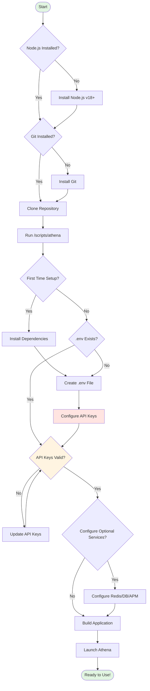
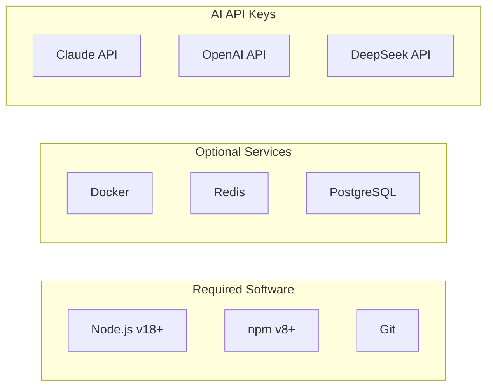
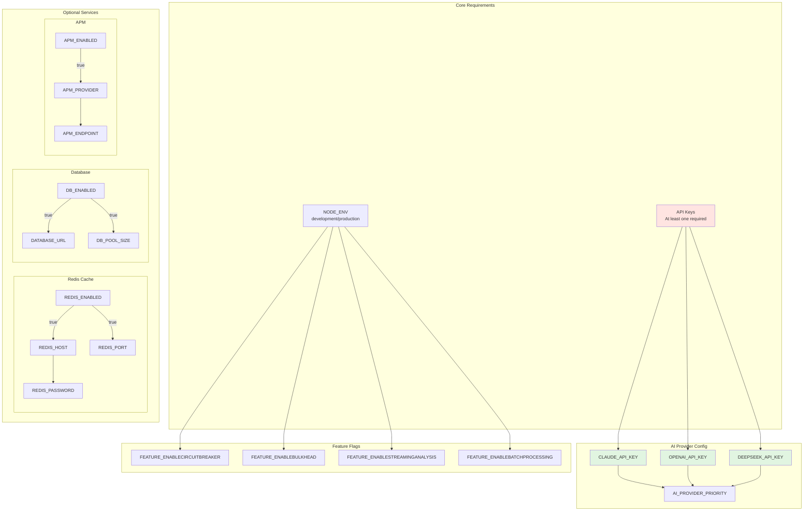
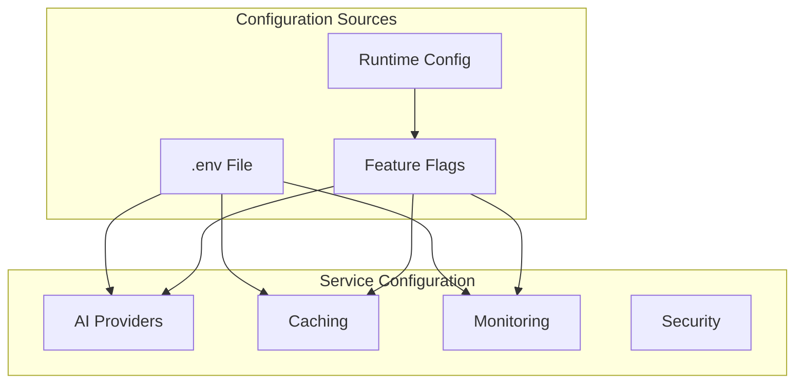
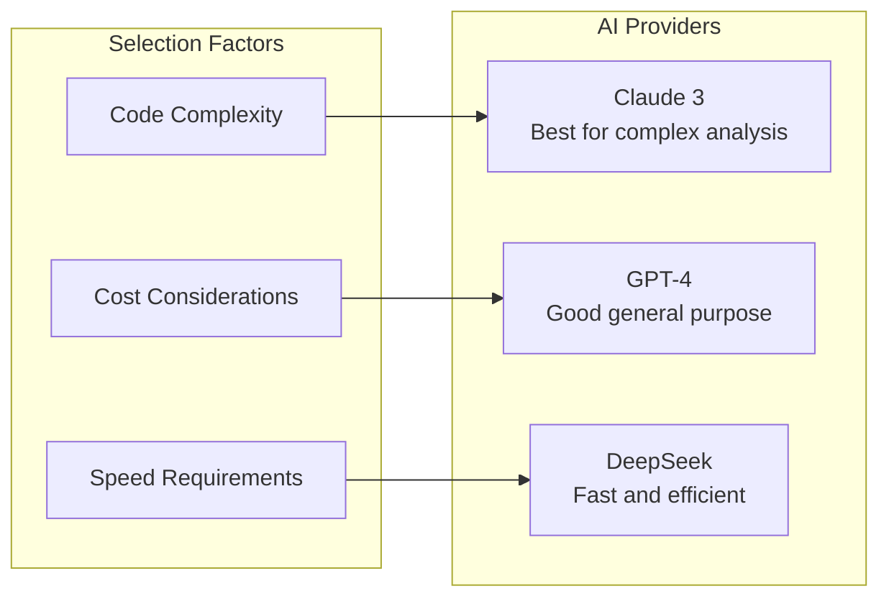
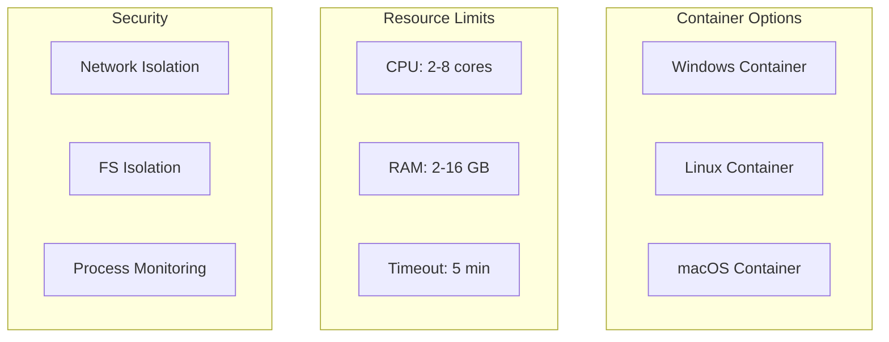
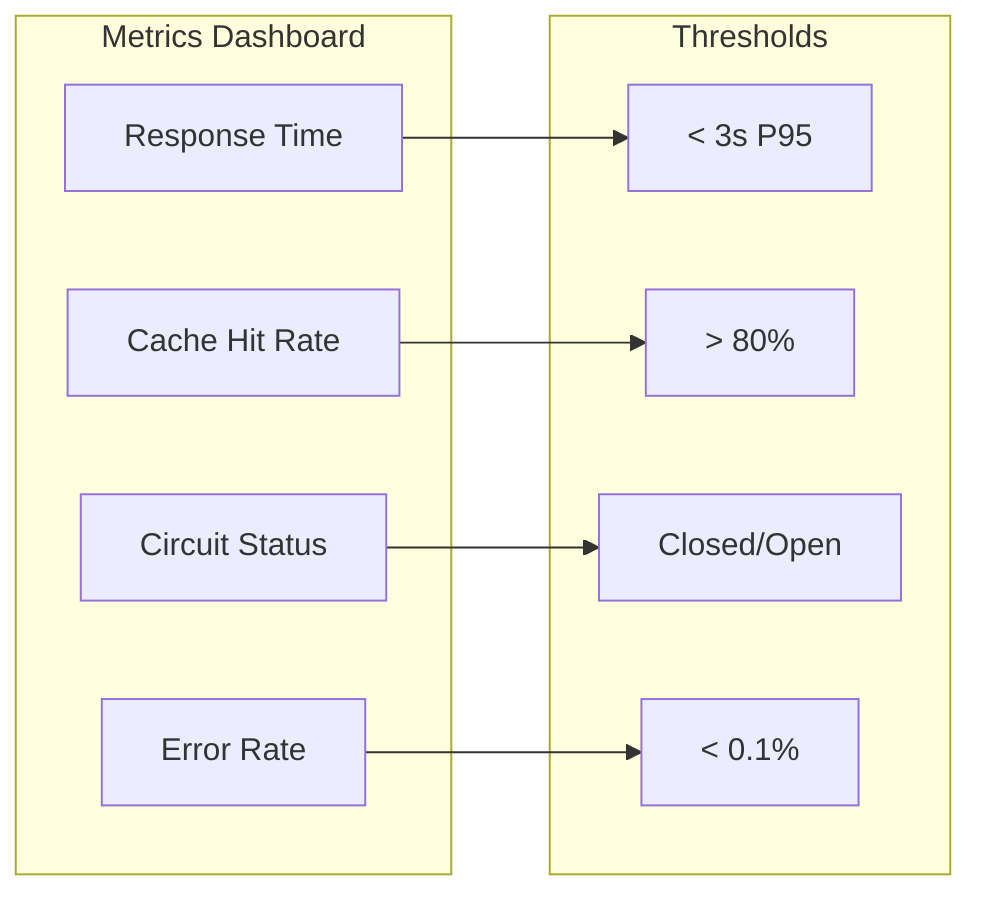
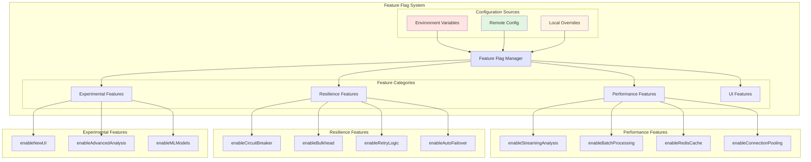
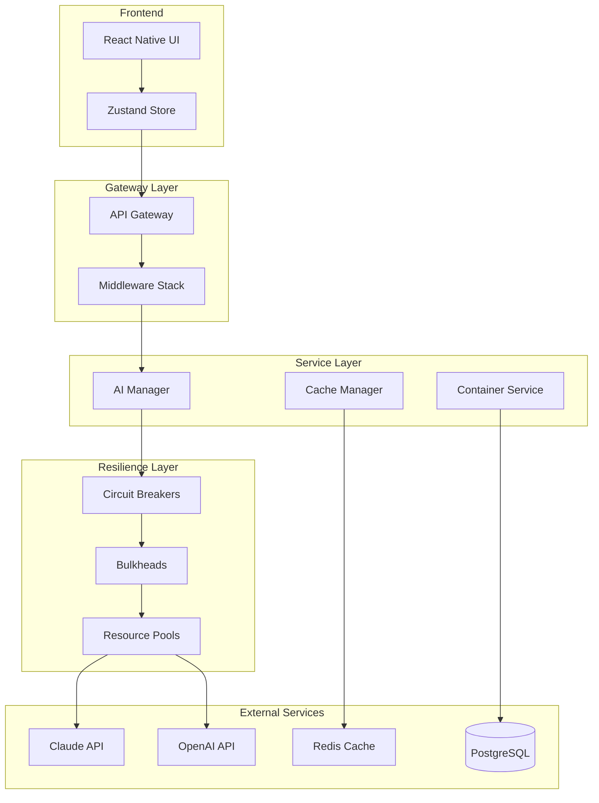
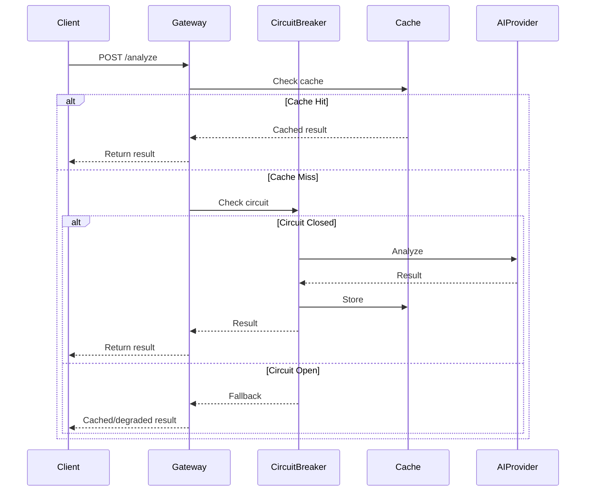

# Getting Started with Athena

## Table of Contents

- [Overview](#overview)
- [Prerequisites](#prerequisites)
- [Quick Start](#quick-start)
- [Configuration](#configuration)
- [Running Your First Analysis](#running-your-first-analysis)
- [Advanced Features](#advanced-features)
- [Architecture Overview](#architecture-overview)
- [Troubleshooting](#troubleshooting)
- [Next Steps](#next-steps)

## Overview

Athena is an enterprise-grade malware analysis platform that leverages multiple AI providers (Claude, OpenAI, DeepSeek) to analyze and deobfuscate potentially malicious code. The platform has been modernized with production-ready features including:

- **Multi-AI Provider Support** with automatic failover
- **Distributed Caching** with Redis
- **Resilience Patterns** (Circuit Breakers, Bulkheads)
- **Real-time Streaming** analysis
- **Container Isolation** for secure execution
- **Comprehensive Monitoring** with APM integration
- **Feature Flags** for runtime configuration

### Complete Setup Flow



## Prerequisites

### System Requirements



### Installation Checklist

- [ ] **Node.js** (v18 or later): [Download](https://nodejs.org/)
- [ ] **npm** (v8 or later): Included with Node.js
- [ ] **Git**: [Download](https://git-scm.com/downloads)
- [ ] **Docker** (optional): [Download](https://www.docker.com/products/docker-desktop/)
- [ ] **Redis** (optional): For distributed caching

### API Keys

Obtain API keys from:
- **Claude**: [Anthropic Console](https://console.anthropic.com/account/keys)
- **OpenAI**: [OpenAI Platform](https://platform.openai.com/account/api-keys)
- **DeepSeek**: [DeepSeek Platform](https://platform.deepseek.com/)

## Quick Start

### 1. Clone and Setup

```bash
# Clone the repository
git clone https://github.com/yourusername/athena.git
cd athena

# Launch interactive CLI
/scripts/athena
```

The interactive CLI provides a beautiful menu to:
- 🚀 Start Athena Web (with auto-setup on first run)
- 🔑 Check and validate API keys
- 📦 Update everything to latest versions
- 🔧 Run setup, tests, and maintenance tasks
- 📱 Launch iOS/Android versions

### 2. Configure API Keys

Edit the auto-generated `.env` file:

```bash
# Athena/.env
OPENAI_API_KEY=your_openai_key_here
CLAUDE_API_KEY=your_claude_key_here
DEEPSEEK_API_KEY=your_deepseek_key_here

# Optional: Enable enterprise features
REDIS_ENABLED=true
APM_ENABLED=true
FEATURE_ENABLESTREAMINGANALYSIS=true
```

### 3. Launch Application

**Interactive CLI (Recommended):**
```bash
/scripts/athena
# Then select option 1 for web, 4 for iOS, 5 for Android
```

**Direct Commands:**
```bash
./scripts/run.sh web      # Web version (default)
./scripts/run.sh ios      # iOS simulator  
./scripts/run.sh android  # Android emulator
```

## Configuration

### Configuration Dependencies



### Environment Configuration



### Key Configuration Options

```bash
# AI Provider Configuration
OPENAI_API_KEY=sk-...
CLAUDE_API_KEY=sk-ant-...
DEEPSEEK_API_KEY=...

# Redis Cache (Optional)
REDIS_ENABLED=true
REDIS_HOST=localhost
REDIS_PORT=6379

# APM Monitoring (Optional)
APM_ENABLED=true
APM_PROVIDER=console  # or statsd, datadog
APM_ENDPOINT=localhost:8125

# Feature Flags
FEATURE_ENABLECIRCUITBREAKER=true
FEATURE_ENABLEBULKHEAD=true
FEATURE_ENABLESTREAMINGANALYSIS=true
FEATURE_AIPROVIDERPRIORITY=claude,openai,deepseek
```

### Database Setup (Optional)

For persistent storage and container monitoring:

```bash
# Using Docker Compose (recommended)
cd Athena
docker-compose up -d

# Initialize database
npm run db:init
npm run db:test
```

### Redis Setup (Optional)

For distributed caching across instances:

```bash
# Using Docker
docker run -d \
  --name athena-redis \
  -p 6379:6379 \
  redis:alpine

# Verify connection
docker exec athena-redis redis-cli ping
# Should return: PONG
```

## Running Your First Analysis

### Complete Analysis Walkthrough

```mermaid
stateDiagram-v2
    [*] --> HomePage: Launch Athena
    
    HomePage --> FileSelection: Click Upload
    
    state FileSelection {
        [*] --> BrowseFiles
        BrowseFiles --> ValidateFile: Select File
        ValidateFile --> FileReady: Valid
        ValidateFile --> BrowseFiles: Invalid
        FileReady --> [*]
    }
    
    FileSelection --> ModelSelection: File Uploaded
    
    state ModelSelection {
        [*] --> SelectProvider
        SelectProvider --> SelectModel: Choose Provider
        SelectModel --> ConfigureOptions: Choose Model
        ConfigureOptions --> [*]: Set Options
    }
    
    ModelSelection --> AnalysisConfig: Model Selected
    
    state AnalysisConfig {
        [*] --> BasicOptions
        BasicOptions --> AdvancedOptions: Show Advanced
        AdvancedOptions --> ContainerConfig: Enable Container
        ContainerConfig --> StreamConfig: Configure Resources
        StreamConfig --> [*]: Enable Streaming
    }
    
    AnalysisConfig --> RunAnalysis: Start Analysis
    
    state RunAnalysis {
        [*] --> CheckCache
        CheckCache --> CacheHit: Found
        CheckCache --> CacheMiss: Not Found
        
        CacheHit --> DisplayCached
        
        CacheMiss --> ExecuteAnalysis
        ExecuteAnalysis --> Streaming: If Enabled
        ExecuteAnalysis --> BatchResult: If Disabled
        
        Streaming --> UpdateUI: Chunks
        UpdateUI --> Streaming: More Data
        UpdateUI --> Complete: Done
        
        BatchResult --> Complete
        Complete --> StoreCache
        StoreCache --> [*]
    }
    
    RunAnalysis --> ViewResults: Analysis Complete
    
    state ViewResults {
        [*] --> DeobfuscatedTab
        DeobfuscatedTab --> VulnerabilitiesTab: Switch Tab
        VulnerabilitiesTab --> ReportTab: Switch Tab
        ReportTab --> DeobfuscatedTab: Switch Tab
        
        DeobfuscatedTab --> Export: Download
        VulnerabilitiesTab --> Export: Download
        ReportTab --> Export: Download
    }
    
    ViewResults --> [*]: Done

### Step-by-Step Analysis Flow

```mermaid
sequenceDiagram
    participant User
    participant UI
    participant FileUploader
    participant AISelector
    participant Analysis
    participant Results
    
    User->>UI: Open Athena
    UI->>User: Display Home Screen
    
    User->>FileUploader: Upload malware sample
    FileUploader->>UI: Show uploaded file
    
    User->>AISelector: Select AI provider
    AISelector->>UI: Show selected model
    
    User->>Analysis: Click Analyze
    Analysis->>Analysis: Check cache
    Analysis->>Analysis: Run analysis
    Analysis->>Results: Display results
    
    Results->>User: Show deobfuscated code
    Results->>User: Show vulnerabilities
    Results->>User: Show analysis report
```

### 1. Upload a File

Navigate to the home screen and upload a file:

```typescript
// Supported file types
const ALLOWED_EXTENSIONS = [
  '.exe', '.dll', '.js', '.py', '.sh', 
  '.bat', '.ps1', '.vbs', '.jar', '.apk'
];
```

### 2. Select AI Model

Choose from available providers:



### 3. Configure Analysis Options

- **Enable Container Isolation**: Run in secure environment
- **Enable Streaming**: Get real-time results
- **Select Analysis Type**: Deobfuscation or vulnerability scan

### 4. View Results

Results are displayed in three tabs:

1. **Deobfuscated Code**: Cleaned, readable version
2. **Analysis Report**: Detailed behavioral analysis
3. **Vulnerabilities**: Security issues with severity ratings

## Advanced Features

### Streaming Analysis

Enable real-time streaming for immediate feedback:

```typescript
// Enable in analysis options
const options = {
  streaming: true,
  onChunk: (chunk) => {
    updateUI(chunk); // Real-time updates
  }
};
```

### Container Isolation

Run analysis in isolated environments:



### Performance Monitoring

View real-time metrics:



### Feature Flags

Runtime configuration without redeployment:



```typescript
// Check feature status
if (featureFlags.isEnabled('enableStreamingAnalysis')) {
  // Use streaming
}

// Development mode: Override features
featureFlags.setOverride('enableRedisCache', true);
```

## Architecture Overview

### High-Level Architecture



### Request Flow



## Troubleshooting

### Common Issues

#### API Key Issues
```bash
# Validate API keys
node scripts/check-api-keys.js

# Check specific provider
curl -H "Authorization: Bearer $CLAUDE_API_KEY" \
  https://api.anthropic.com/v1/messages
```

#### Redis Connection Issues
```bash
# Check Redis connection
redis-cli ping

# Test cache functionality
npm run test:redis-cache
```

#### Performance Issues
```bash
# Run load tests
npm run load-test

# Check circuit breaker status
curl http://localhost:3000/health/circuit-breakers
```

### Debug Mode

Enable detailed logging:

```bash
# Set debug environment
export NODE_ENV=development
export LOG_LEVEL=debug

# Run with verbose output
npm run dev -- --verbose
```

### Health Checks

Monitor system health:

```bash
# Overall health
curl http://localhost:3000/health

# Detailed status
curl http://localhost:3000/health/detailed
```

## Next Steps

### 1. Production Deployment

See [Deployment Guide](/docs/DEPLOYMENT.md) for:
- Docker containerization
- Kubernetes deployment
- Load balancing setup
- SSL/TLS configuration

### 2. Advanced Configuration

Explore:
- [Feature Flags Guide](/docs/performance/FEATURE_FLAGS.md)
- [Circuit Breaker Configuration](/docs/performance/ADAPTIVE_CIRCUIT_BREAKER.md)
- [Redis Cache Tuning](/docs/performance/REDIS_CACHE_INTEGRATION.md)
- [APM Integration](/docs/performance/APM_INTEGRATION.md)

### 3. Development

For contributors:
- [Architecture Documentation](/docs/ARCHITECTURE.md)
- [API Integration Guide](/docs/API_INTEGRATION.md)
- [Testing Guide](/docs/testing/README.md)
- [Contributing Guidelines](/CONTRIBUTING.md)

### 4. Monitoring & Operations

Set up production monitoring:
- Configure APM provider (DataDog, New Relic)
- Set up alerts for circuit breaker trips
- Monitor cache hit rates
- Track AI provider usage and costs

## Support

- **Documentation**: Check `/docs` folder
- **Issues**: [GitHub Issues](https://github.com/yourusername/athena/issues)
- **Discussions**: [GitHub Discussions](https://github.com/yourusername/athena/discussions)

## Quick Reference

### Essential Commands

```bash
# Interactive CLI (recommended)
/scripts/athena

# Direct commands
./scripts/run.sh web    # Start web version
./scripts/run.sh setup  # Setup only

# Development (from Athena/ directory)
npm run dev
npm test
npm run lint

# Production
npm run build
npm run test:production

# Database
npm run db:init
npm run db:migrate

# Monitoring
npm run monitor:start
npm run load-test
```

### Configuration Reference

```bash
# Required
OPENAI_API_KEY=...
CLAUDE_API_KEY=...
DEEPSEEK_API_KEY=...

# Optional but recommended
REDIS_ENABLED=true
APM_ENABLED=true
FEATURE_ENABLECIRCUITBREAKER=true
FEATURE_ENABLESTREAMINGANALYSIS=true
```

Welcome to Athena - your enterprise-grade malware analysis platform!