# Getting Started with Athena

## Table of Contents

- [Quick Start (2 Minutes)](#quick-start-2-minutes)
- [Complete Setup Guide](#complete-setup-guide)
  - [Prerequisites](#prerequisites)
  - [Installation](#installation)
  - [Configuration](#configuration)
  - [Running Your First Analysis](#running-your-first-analysis)
- [Advanced Features](#advanced-features)
- [Architecture Overview](#architecture-overview)
- [Troubleshooting](#troubleshooting)
- [Next Steps](#next-steps)

---

## Quick Start (2 Minutes)

Get Athena running in under 2 minutes!

### Prerequisites

- **Node.js v18+** - [Download here](https://nodejs.org/)
- **Git** - [Download here](https://git-scm.com/downloads)

### One-Command Setup & Launch

```bash
# Clone the repository
git clone https://github.com/yourusername/athena.git
cd athena

# Launch Athena Interactive CLI
./scripts/athena
```

**That's it!** 🎉

### Interactive CLI Options

The interactive CLI will present you with a beautiful menu where you can:

- 🚀 **Launch Complete Athena (Option 1)** - Docker Compose stack
- 🔑 **Check API Keys (Option 2)** - Setup your AI providers
- 📦 **Update Everything (Option 3)** - Keep Athena current
- ✨ **Launch Tauri 2.0 App (Option 11)** - Native desktop/mobile app

The script will automatically:

- ✅ Check your system requirements
- ✅ Install all dependencies
- ✅ Configure web polyfills for browser compatibility
- ✅ Set up environment files
- ✅ Build the application (including WASM modules)
- ✅ Load all WebAssembly security modules
- ✅ Launch the web server at <http://localhost:3000>

### Quick Start Process Flow

```mermaid
%%{init: {
  'theme': 'base',
  'themeVariables': {
    'primaryColor': '#6d105a',
    'primaryTextColor': '#ffffff',
    'primaryBorderColor': '#ffffff',
    'lineColor': '#333333',
    'secondaryColor': '#e8f4d4',
    'secondaryTextColor': '#333333',
    'secondaryBorderColor': '#333333',
    'tertiaryColor': '#f9d0c4',
    'tertiaryTextColor': '#333333',
    'tertiaryBorderColor': '#333333',
    'background': '#ffffff',
    'mainBkg': '#6d105a',
    'secondBkg': '#e8f4d4',
    'tertiaryBkg': '#f9d0c4',
    'textColor': '#333333',
    'fontFamily': 'Arial, sans-serif'
  }
}}%%
flowchart TB
    Start([Start<br/>━━━━━━━━<br/>User wants to<br/>run Athena]) --> Clone[Clone Repository<br/>━━━━━━━━<br/>• git clone<br/>• cd athena]

    Clone --> RunScript[Execute ./scripts/athena<br/>━━━━━━━━<br/>• Interactive menu<br/>• Auto-detects setup]

    RunScript --> FirstTime{First Time<br/>Setup?}

    FirstTime -->|Yes| AutoSetup[Automated Setup<br/>━━━━━━━━<br/>• Check requirements<br/>• Install dependencies<br/>• Configure environment]

    FirstTime -->|No| Build[Build Application<br/>━━━━━━━━<br/>• Webpack build<br/>• Asset compilation]

    AutoSetup --> Build

    Build --> Launch[Launch Application<br/>━━━━━━━━<br/>• Start web server<br/>• Open browser<br/>• Port 3000]

    Launch --> Ready([Ready!<br/>━━━━━━━━<br/>Athena running at<br/>localhost:3000])

    style Start fill:#6d105a,color:#fff
    style Ready fill:#e8f4d4,color:#333
    style AutoSetup fill:#f9d0c4,color:#333
```



### What Happens on First Run?

When you run `./scripts/athena` for the first time, you'll see:

```bash
🔧 First time setup detected, running setup process...

✓ Node.js is installed (v18.17.0)
✓ npm is installed (9.6.7)
✓ Git is installed (git version 2.39.2)
✓ Root dependencies installed successfully
✓ Athena dependencies installed successfully
✓ Web polyfills installed successfully
✓ Serve installed globally
✓ Created .env file from template
✓ Webpack configuration found
✓ Metro configuration found
✓ Package.json found
✓ Web polyfills are configured

✓ Setup complete!

🚀 Setup complete! Now starting the application...

✓ Build completed successfully
Starting web server...
```

### Next Steps After Quick Start

```mermaid
flowchart LR
    Ready[Athena Ready<br/>━━━━━━━━<br/>http://localhost:3000] --> Config{Configure<br/>API Keys?}

    Config -->|Optional| Keys[Add API Keys<br/>━━━━━━━━<br/>• Edit .env file<br/>• Add OpenAI key<br/>• Add Claude key<br/>• Add DeepSeek key]

    Config -->|Skip| Upload[Upload Files<br/>━━━━━━━━<br/>• Select malware<br/>• Drag & drop<br/>• Batch upload]

    Keys --> Upload

    Upload --> Analysis[Configure Analysis<br/>━━━━━━━━<br/>• Select AI models<br/>• Set options<br/>• Container config]

    Analysis --> Run[Run Analysis<br/>━━━━━━━━<br/>• Real-time monitoring<br/>• Progress tracking<br/>• Resource usage]

    Run --> Results[View Results<br/>━━━━━━━━<br/>• Analysis report<br/>• Risk assessment<br/>• Recommendations]

    style Ready fill:#e8f4d4,color:#333
    style Keys fill:#f9d0c4,color:#333
    style Results fill:#6d105a,color:#fff
```



1. **Add API Keys** (optional):

   - Edit `Athena/.env` to add your AI model API keys
   - Get keys from: [OpenAI](https://platform.openai.com/account/api-keys), [Claude](https://console.anthropic.com/account/keys), [DeepSeek](https://platform.deepseek.com/)

2. **Start Analyzing**:

   - Upload malware files
   - Select AI models
   - Configure analysis options
   - View results

---

## Complete Setup Guide

This section provides comprehensive setup instructions for users who need detailed configuration options.

### Overview

Athena is an enterprise-grade malware analysis platform that leverages multiple AI providers (Claude, OpenAI, DeepSeek) and high-performance WebAssembly modules to analyze and deobfuscate potentially malicious code. The platform has been modernized with production-ready features including:

- **WebAssembly Security Modules** for high-performance analysis
- **Multi-AI Provider Support** with automatic failover
- **Distributed Caching** with Redis
- **Resilience Patterns** (Circuit Breakers, Bulkheads)
- **Real-time Streaming** analysis
- **Container Isolation** for secure execution
- **Comprehensive Monitoring** with APM integration
- **Feature Flags** for runtime configuration

### Complete Setup Flow


### Prerequisites

#### System Requirements


#### Installation Checklist

- [ ] **Node.js** (v18 or later): [Download](https://nodejs.org/)
- [ ] **npm** (v8 or later): Included with Node.js
- [ ] **Git**: [Download](https://git-scm.com/downloads)
- [ ] **Docker** (optional): [Download](https://www.docker.com/products/docker-desktop/)
- [ ] **Redis** (optional): For distributed caching

#### API Keys

Obtain API keys from:

- **Claude**: [Anthropic Console](<https://console.anthropic.com/account/keys>)
- **OpenAI**: [OpenAI Platform](<https://platform.openai.com/account/api-keys>)
- **DeepSeek**: [DeepSeek Platform](<https://platform.deepseek.com/>)

#### Dependency Management

Athena uses **Expo SDK 52** and follows strict dependency versioning to ensure compatibility:

- **React Native**: 0.76.9
- **React**: 18.3.1
- **React Navigation**: v7.x (upgraded from v6)
- **Expo Packages**: Aligned with SDK 52 requirements

> **Note**: When updating dependencies, always use `npx expo install --fix` to maintain compatibility with Expo SDK.

### Installation

#### 1. Clone and Setup

```bash
# Clone the repository
git clone https://github.com/yourusername/athena.git
cd athena

# Launch interactive CLI
./scripts/athena
```

The interactive CLI provides a beautiful menu to:

- 🚀 Start Athena Web (with auto-setup on first run)
- 🔑 Check and validate API keys
- 📦 Update everything to latest versions
- 🔧 Run setup, tests, and maintenance tasks
- 📱 Launch iOS/Android versions

#### 2. Direct Commands (Alternative)

If you prefer direct commands over the interactive menu:

```bash
./scripts/run.sh web      # Web version
./scripts/run.sh ios      # iOS simulator
./scripts/run.sh android  # Android emulator
./scripts/run.sh setup    # Setup only
./scripts/run.sh help     # Help info
```

#### Automated Setup Process

```mermaid
%%{init: {
  'theme': 'base',
  'themeVariables': {
    'primaryColor': '#6d105a',
    'primaryTextColor': '#ffffff',
    'primaryBorderColor': '#ffffff',
    'lineColor': '#333333',
    'secondaryColor': '#e8f4d4',
    'secondaryTextColor': '#333333',
    'secondaryBorderColor': '#333333',
    'tertiaryColor': '#f9d0c4',
    'tertiaryTextColor': '#333333',
    'tertiaryBorderColor': '#333333',
    'background': '#ffffff',
    'mainBkg': '#6d105a',
    'secondBkg': '#e8f4d4',
    'tertiaryBkg': '#f9d0c4',
    'textColor': '#333333',
    'fontFamily': 'Arial, sans-serif'
  }
}}%%
sequenceDiagram
    participant User
    participant Script as athena CLI
    participant System
    participant Setup
    participant Build
    participant Server

    User->>Script: ./scripts/athena
    Script->>System: Check first-time setup

    alt First Time Setup
        Script->>Setup: Initialize setup process

        Setup->>System: Check Node.js version
        System-->>Setup: v18.17.0 ✓

        Setup->>System: Check npm
        System-->>Setup: 9.6.7 ✓

        Setup->>System: Check Git
        System-->>Setup: 2.39.2 ✓

        Setup->>System: Install root dependencies
        System-->>Setup: Success ✓

        Setup->>System: Install Athena dependencies
        System-->>Setup: Success ✓

        Setup->>System: Configure web polyfills
        System-->>Setup: Success ✓

        Setup->>System: Install serve globally
        System-->>Setup: Success ✓

        Setup->>System: Create .env from template
        System-->>Setup: Success ✓

        Setup->>System: Verify configurations
        System-->>Setup: All checks passed ✓

        Setup-->>Script: Setup complete
    end

    Script->>Build: Start build process
    Build->>System: Webpack build
    System-->>Build: Build successful ✓

    Build-->>Script: Build complete

    Script->>Server: Start web server
    Server->>System: Launch on port 3000
    Server-->>User: Ready at http://localhost:3000

    style User fill:#6d105a,color:#fff
    style Script fill:#f9d0c4,color:#333
    style Server fill:#e8f4d4,color:#333
```

### Configuration

#### Configuration Dependencies


#### Environment Configuration

Edit the auto-generated `.env` file:

```bash
# Athena/.env

# AI Provider Configuration
OPENAI_API_KEY=sk-...
CLAUDE_API_KEY=sk-ant-...
DEEPSEEK_API_KEY=...

# Redis Cache (Optional)
REDIS_ENABLED=true
REDIS_HOST=localhost
REDIS_PORT=6379

# APM Monitoring (Optional)
APM_ENABLED=true
APM_PROVIDER=console  # or statsd, datadog
APM_ENDPOINT=localhost:8125

# Feature Flags
FEATURE_ENABLECIRCUITBREAKER=true
FEATURE_ENABLEBULKHEAD=true
FEATURE_ENABLESTREAMINGANALYSIS=true
FEATURE_AIPROVIDERPRIORITY=claude,openai,deepseek
```

#### Database Setup (Optional)

For persistent storage and container monitoring:

```bash
# Using Docker Compose (recommended)
cd Athena
docker-compose up -d

# Initialize database
npm run db:init
npm run db:test
```

#### Redis Setup (Optional)

For distributed caching across instances:

```bash
# Using Docker
docker run -d \
  --name athena-redis \
  -p 6379:6379 \
  redis:alpine

# Verify connection
docker exec athena-redis redis-cli ping
# Should return: PONG
```

### Running Your First Analysis

#### Complete Analysis Walkthrough

The analysis process leverages both AI providers and WASM modules for comprehensive security analysis:

1. **WASM Pre-processing**: High-performance binary analysis
2. **AI Analysis**: Deep semantic understanding
3. **Combined Results**: Integrated findings from both systems


### Step-by-Step Analysis Flow


#### 1. Upload a File

Navigate to the home screen and upload a file:

```typescript
// Supported file types
const ALLOWED_EXTENSIONS = [
  '.exe', '.dll', '.js', '.py', '.sh',
  '.bat', '.ps1', '.vbs', '.jar', '.apk'
];
```

#### 2. Select AI Model

Choose from available providers:


#### 3. Configure Analysis Options

- **Enable Container Isolation**: Run in secure environment
- **Enable Streaming**: Get real-time results
- **Select Analysis Type**: Deobfuscation or vulnerability scan

#### 4. View Results

Results are displayed in three tabs:

1. **Deobfuscated Code**: Cleaned, readable version
2. **Analysis Report**: Detailed behavioral analysis
3. **Vulnerabilities**: Security issues with severity ratings

### Advanced Features

#### Streaming Analysis

Enable real-time streaming for immediate feedback:

```typescript
// Enable in analysis options
const options = {
  streaming: true,
  onChunk: (chunk) => {
    updateUI(chunk); // Real-time updates
  }
};
```

#### Container Isolation

Run analysis in isolated environments:


#### Performance Monitoring

View real-time metrics:


#### Feature Flags

Runtime configuration without redeployment:

```typescript
// Check feature status
if (featureFlags.isEnabled('enableStreamingAnalysis')) {
  // Use streaming
}

// Development mode: Override features
featureFlags.setOverride('enableRedisCache', true);
```

### Architecture Overview

#### High-Level Architecture


#### Request Flow


## Troubleshooting

### Common Issues

#### Node.js Version Issues
```bash
# Check Node.js version
node -v

# Should be v18+ or later
# If not, download from <https://nodejs.org/>
```

#### API Key Issues
```bash
# Validate API keys using the interactive CLI
./scripts/athena
# Select option 2: Check API Keys

# Or check specific provider manually
curl -H "Authorization: Bearer $CLAUDE_API_KEY" \
  https://api.anthropic.com/v1/messages
```

#### Redis Connection Issues
```bash
# Check Redis connection
redis-cli ping

# Test cache functionality
npm run test:redis-cache
```

#### Performance Issues
```bash
# Run load tests
npm run load-test

# Check circuit breaker status
curl http://localhost:3000/health/circuit-breakers
```

#### Clean Install
If you encounter persistent issues:

```bash
# Force clean setup
rm -rf node_modules Athena/node_modules
./scripts/run.sh setup
```

#### Debug Mode

Enable detailed logging:

```bash
# Set debug environment
export NODE_ENV=development
export LOG_LEVEL=debug

# Run with verbose output
npm run dev -- --verbose
```

#### Health Checks

Monitor system health:

```bash
# Overall health
curl http://localhost:3000/health

# Detailed status
curl http://localhost:3000/health/detailed
```

### Next Steps

#### 1. Production Deployment

See [Deployment Guide](/docs/DEPLOYMENT.md) for:

- Docker containerization
- Kubernetes deployment
- Load balancing setup
- SSL/TLS configuration

#### 2. Advanced Configuration

Explore:

- [Feature Flags Guide](/docs/performance/FEATURE_FLAGS.md)
- [Circuit Breaker Configuration](/docs/performance/ADAPTIVE_CIRCUIT_BREAKER.md)
- [Redis Cache Tuning](/docs/performance/REDIS_CACHE_INTEGRATION.md)
- [APM Integration](/docs/performance/APM_INTEGRATION.md)

#### 3. Development

For contributors:

- [Architecture Documentation](/docs/ARCHITECTURE.md)
- [API Integration Guide](/docs/API_INTEGRATION.md)
- [Testing Guide](/docs/testing/README.md)
- [Contributing Guidelines](/CONTRIBUTING.md)

#### 4. Monitoring & Operations

Set up production monitoring:

- Configure APM provider (DataDog, New Relic)
- Set up alerts for circuit breaker trips
- Monitor cache hit rates
- Track AI provider usage and costs

### Support

- **Documentation**: Check `/docs` folder
- **Issues**: [GitHub Issues](<https://github.com/yourusername/athena/issues>)
- **Discussions**: [GitHub Discussions](<https://github.com/yourusername/athena/discussions>)

### Quick Reference

#### Essential Commands

```bash
# Interactive CLI (recommended)
./scripts/athena

# Direct commands
./scripts/run.sh web    # Start web version
./scripts/run.sh setup  # Setup only

# Development (from Athena/ directory)
npm run dev
npm test
npm run lint

# Production
npm run build
npm run test:production

# Database
npm run db:init
npm run db:migrate

# Monitoring
npm run monitor:start
npm run load-test
```

#### Configuration Reference

```bash
# Required
OPENAI_API_KEY=...
CLAUDE_API_KEY=...
DEEPSEEK_API_KEY=...

# Optional but recommended
REDIS_ENABLED=true
APM_ENABLED=true
FEATURE_ENABLECIRCUITBREAKER=true
FEATURE_ENABLESTREAMINGANALYSIS=true
```

---

**Welcome to Athena - your enterprise-grade malware analysis platform!** 🛡️🔍
