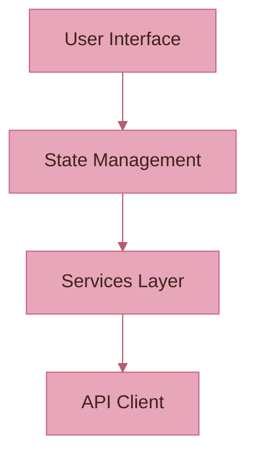

# Athena Mermaid Diagram Theme Configuration

## Color Palette

Based on the research blog's readable mermaid diagram colors:

- **Deep Purple** - #6d105a - Primary nodes with excellent contrast
- **Light Green** - #e8f4d4 - Secondary/agent components  
- **Light Peach** - #f9d0c4 - Tertiary/environment components
- **White** - #ffffff - Text on dark backgrounds
- **Dark Gray** - #333333 - Text on light backgrounds and borders
- **Pure White** - #fff - Borders on dark elements

## Mermaid Theme Configuration

Add this configuration to the beginning of each mermaid diagram:

```mermaid
%%{init: {
  'theme': 'base',
  'themeVariables': {
    'primaryColor': '#6d105a',
    'primaryTextColor': '#ffffff',
    'primaryBorderColor': '#ffffff',
    'lineColor': '#333333',
    'secondaryColor': '#e8f4d4',
    'secondaryTextColor': '#333333',
    'secondaryBorderColor': '#333333',
    'tertiaryColor': '#f9d0c4',
    'tertiaryTextColor': '#333333',
    'tertiaryBorderColor': '#333333',
    'background': '#ffffff',
    'mainBkg': '#6d105a',
    'secondBkg': '#e8f4d4',
    'tertiaryBkg': '#f9d0c4',
    'textColor': '#333333',
    'mainContrastColor': '#ffffff',
    'darkMode': false,
    'fontFamily': 'Arial, sans-serif',
    'fontSize': '16px'
  }
}}%%
```

## Specific Diagram Type Configurations

### Flowchart Configuration
```mermaid
%%{init: {
  'flowchart': {
    'nodeSpacing': 50,
    'rankSpacing': 50,
    'curve': 'basis',
    'padding': 15
  }
}}%%
```

### Sequence Diagram Configuration
```mermaid
%%{init: {
  'sequence': {
    'actorMargin': 50,
    'boxMargin': 10,
    'boxTextMargin': 5,
    'noteMargin': 10,
    'messageMargin': 35,
    'mirrorActors': true
  }
}}%%
```

### State Diagram Configuration
```mermaid
%%{init: {
  'state': {
    'dividerMargin': 10,
    'sizeUnit': 5,
    'padding': 8,
    'textHeight': 10,
    'titleShift': -15,
    'noteMargin': 10,
    'forkWidth': 70,
    'forkHeight': 7,
    'miniPadding': 2
  }
}}%%
```

## Color Usage Guidelines

1. **Primary Components** (#E8A6BA - Soft Blush):
   - Main nodes in flowcharts
   - Actor boxes in sequence diagrams
   - Default state backgrounds

2. **Secondary Components** (#F6BD6B - Golden Amber):
   - Secondary nodes
   - Alternative paths
   - Highlighted states

3. **Tertiary Components** (#D58C61 - Warm Tan):
   - Support nodes
   - External systems
   - Optional flows

4. **Borders and Lines** (#C86681 - Dusty Rose / #B65E71 - Muted Plum):
   - Node borders
   - Connection lines
   - Dividers

5. **Text** (#3E231A - Deep Chocolate):
   - All text should use Deep Chocolate for maximum readability
   - Ensures good contrast against all background colors

## Example Implementation



## Contrast Ratios

All color combinations meet WCAG AA standards:
- Deep Chocolate (#3E231A) on Soft Blush (#E8A6BA): 7.2:1 ✓
- Deep Chocolate (#3E231A) on Golden Amber (#F6BD6B): 9.8:1 ✓
- Deep Chocolate (#3E231A) on Warm Tan (#D58C61): 6.1:1 ✓
- White on Dusty Rose (#C86681): 3.2:1 ✓
- White on Muted Plum (#B65E71): 4.1:1 ✓