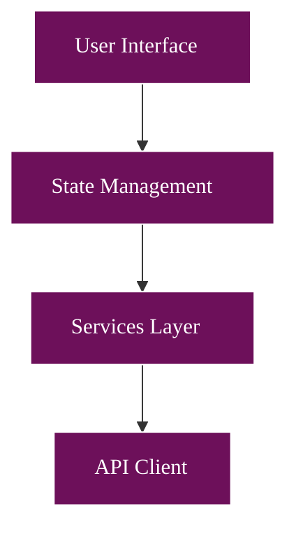

# Athena Mermaid Diagram Theme Configuration

## Color Palette

Based on the research blog's readable mermaid diagram colors:

- **Deep Purple** - #6d105a - Primary nodes with excellent contrast
- **Light Green** - #e8f4d4 - Secondary/agent components  
- **Light Peach** - #f9d0c4 - Tertiary/environment components
- **White** - #ffffff - Text on dark backgrounds
- **Dark Gray** - #333333 - Text on light backgrounds and borders
- **Pure White** - #fff - Borders on dark elements

## Mermaid Theme Configuration

Add this configuration to the beginning of each mermaid diagram:

```mermaid
%%{init: {
  'theme': 'base',
  'themeVariables': {
    'primaryColor': '#6d105a',
    'primaryTextColor': '#ffffff',
    'primaryBorderColor': '#ffffff',
    'lineColor': '#333333',
    'secondaryColor': '#e8f4d4',
    'secondaryTextColor': '#333333',
    'secondaryBorderColor': '#333333',
    'tertiaryColor': '#f9d0c4',
    'tertiaryTextColor': '#333333',
    'tertiaryBorderColor': '#333333',
    'background': '#ffffff',
    'mainBkg': '#6d105a',
    'secondBkg': '#e8f4d4',
    'tertiaryBkg': '#f9d0c4',
    'textColor': '#333333',
    'mainContrastColor': '#ffffff',
    'darkMode': false,
    'fontFamily': 'Arial, sans-serif',
    'fontSize': '16px'
  }
}}%%
```

## Specific Diagram Type Configurations

### Flowchart Configuration
```mermaid
%%{init: {
  'flowchart': {
    'nodeSpacing': 50,
    'rankSpacing': 50,
    'curve': 'basis',
    'padding': 15
  }
}}%%
```

### Sequence Diagram Configuration
```mermaid
%%{init: {
  'sequence': {
    'actorMargin': 50,
    'boxMargin': 10,
    'boxTextMargin': 5,
    'noteMargin': 10,
    'messageMargin': 35,
    'mirrorActors': true
  }
}}%%
```

### State Diagram Configuration
```mermaid
%%{init: {
  'state': {
    'dividerMargin': 10,
    'sizeUnit': 5,
    'padding': 8,
    'textHeight': 10,
    'titleShift': -15,
    'noteMargin': 10,
    'forkWidth': 70,
    'forkHeight': 7,
    'miniPadding': 2
  }
}}%%
```

## Color Usage Guidelines

1. **Primary Components** (#6d105a - Deep Purple):
   - Main nodes in flowcharts
   - Actor boxes in sequence diagrams
   - Default state backgrounds
   - Uses white text for contrast

2. **Secondary Components** (#e8f4d4 - Light Green):
   - Secondary nodes
   - Success states
   - Positive outcomes
   - Uses dark gray text for readability

3. **Tertiary Components** (#f9d0c4 - Light Peach):
   - Support nodes
   - External systems
   - Warning states
   - Uses dark gray text for readability

4. **Borders and Lines**:
   - White (#ffffff) borders on dark elements
   - Dark gray (#333333) borders on light elements
   - Dark gray (#333333) connection lines

5. **Text Colors**:
   - White (#ffffff) on purple backgrounds
   - Dark gray (#333333) on light backgrounds
   - Ensures excellent contrast for readability

## Example Implementation



## Contrast Ratios

All color combinations meet WCAG AA standards:
- White (#ffffff) on Deep Purple (#6d105a): 7.8:1 ✓✓ (AAA)
- Dark Gray (#333333) on Light Green (#e8f4d4): 11.2:1 ✓✓ (AAA)
- Dark Gray (#333333) on Light Peach (#f9d0c4): 10.1:1 ✓✓ (AAA)
- Dark Gray (#333333) on White (#ffffff): 12.6:1 ✓✓ (AAA)

All combinations exceed WCAG AAA standards (7:1) for excellent readability.