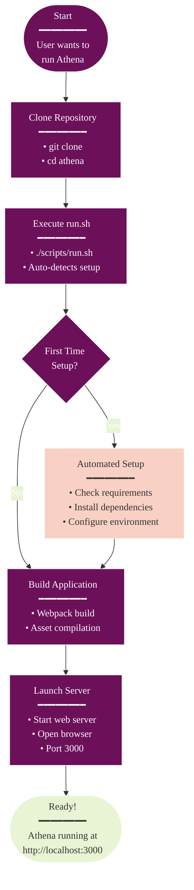
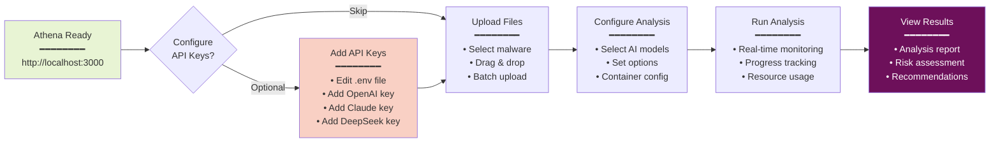

# 🚀 Athena Quick Start Guide

Get Athena running in under 2 minutes!

## Quick Start Overview



## Prerequisites

- **Node.js v16+** - [Download here](https://nodejs.org/)
- **Git** - [Download here](https://git-scm.com/downloads)

## One-Command Setup & Launch

```bash
# Clone the repository
git clone https://github.com/yourusername/athena.git
cd athena

# Launch Athena Interactive CLI
/scripts/athena
```

**That's it!** 🎉

The interactive CLI will present you with a beautiful menu where you can:
- 🚀 Start Athena Web (Option 1) - Most common choice
- 🔑 Check API Keys (Option 2) - Setup your AI providers
- 📦 Update Everything (Option 3) - Keep Athena current

The script will automatically:
- ✅ Check your system requirements
- ✅ Install all dependencies
- ✅ Configure web polyfills for browser compatibility
- ✅ Set up environment files
- ✅ Build the application
- ✅ Launch the web server at http://localhost:3000

## What happens on first run?

### Automated Setup Process

```mermaid
%%{init: {
  'theme': 'base',
  'themeVariables': {
    'primaryColor': '#6d105a',
    'primaryTextColor': '#ffffff',
    'primaryBorderColor': '#ffffff',
    'lineColor': '#333333',
    'secondaryColor': '#e8f4d4',
    'secondaryTextColor': '#333333',
    'secondaryBorderColor': '#333333',
    'tertiaryColor': '#f9d0c4',
    'tertiaryTextColor': '#333333',
    'tertiaryBorderColor': '#333333',
    'background': '#ffffff',
    'mainBkg': '#6d105a',
    'secondBkg': '#e8f4d4',
    'tertiaryBkg': '#f9d0c4',
    'textColor': '#333333',
    'fontFamily': 'Arial, sans-serif'
  }
}}%%
sequenceDiagram
    participant User
    participant Script as athena CLI
    participant System
    participant Setup
    participant Build
    participant Server
    
    User->>Script: /scripts/athena
    Script->>System: Check first-time setup
    
    alt First Time Setup
        Script->>Setup: Initialize setup process
        
        Setup->>System: Check Node.js version
        System-->>Setup: v18.17.0 ✓
        
        Setup->>System: Check npm
        System-->>Setup: 9.6.7 ✓
        
        Setup->>System: Check Git
        System-->>Setup: 2.39.2 ✓
        
        Setup->>System: Install root dependencies
        System-->>Setup: Success ✓
        
        Setup->>System: Install Athena dependencies
        System-->>Setup: Success ✓
        
        Setup->>System: Configure web polyfills
        System-->>Setup: Success ✓
        
        Setup->>System: Install serve globally
        System-->>Setup: Success ✓
        
        Setup->>System: Create .env from template
        System-->>Setup: Success ✓
        
        Setup->>System: Verify configurations
        System-->>Setup: All checks passed ✓
        
        Setup-->>Script: Setup complete
    end
    
    Script->>Build: Start build process
    Build->>System: Webpack build
    System-->>Build: Build successful ✓
    
    Build-->>Script: Build complete
    
    Script->>Server: Start web server
    Server->>System: Launch on port 3000
    Server-->>User: Ready at http://localhost:3000
    
    style User fill:#6d105a,color:#fff
    style Script fill:#f9d0c4,color:#333
    style Server fill:#e8f4d4,color:#333
```

When you run `/scripts/athena` and select "Start Athena Web" for the first time, you'll see:

```
🔧 First time setup detected, running setup process...

✓ Node.js is installed (v18.17.0)
✓ npm is installed (9.6.7)
✓ Git is installed (git version 2.39.2)
✓ Root dependencies installed successfully
✓ Athena dependencies installed successfully
✓ Web polyfills installed successfully
✓ Serve installed globally
✓ Created .env file from template
✓ Webpack configuration found
✓ Metro configuration found
✓ Package.json found
✓ Web polyfills are configured

✓ Setup complete!

🚀 Setup complete! Now starting the application...

✓ Build completed successfully
Starting web server...
```

## Next Steps

### Post-Setup Workflow



1. **Add API Keys** (optional):
   - Edit `Athena/.env` to add your AI model API keys
   - Get keys from: [OpenAI](https://platform.openai.com/account/api-keys), [Claude](https://console.anthropic.com/account/keys), [DeepSeek](https://platform.deepseek.com/)

2. **Start Analyzing**:
   - Upload malware files
   - Select AI models
   - Configure analysis options
   - View results

## Advanced Usage

### Interactive CLI Options

```mermaid
flowchart TD
    Command[/scripts/athena] --> Menu{Interactive<br/>Menu}
    
    Menu -->|Option 1| Web[🚀 Start Athena Web<br/>━━━━━━━━<br/>• Browser-based<br/>• Port 3000<br/>• Auto-setup]
    
    Menu -->|Option 2| Keys[🔑 Check API Keys<br/>━━━━━━━━<br/>• Validate keys<br/>• Setup providers<br/>• Environment check]
    
    Menu -->|Option 3| Update[📦 Update Everything<br/>━━━━━━━━<br/>• Pull latest<br/>• Update deps<br/>• Clean rebuild]
    
    Menu -->|Option 4| iOS[📱 Start iOS<br/>━━━━━━━━<br/>• Requires macOS<br/>• Xcode needed<br/>• Simulator/device]
    
    Menu -->|Option 5| Android[🤖 Start Android<br/>━━━━━━━━<br/>• Android SDK<br/>• Emulator/device<br/>• Java required]
    
    Menu -->|Option 7| Setup[🔧 Run Setup<br/>━━━━━━━━<br/>• Install deps<br/>• Configure env<br/>• Initialize DB]
    
    Menu -->|Option 11| Tests[🧪 Run All Tests<br/>━━━━━━━━<br/>• Unit tests<br/>• Integration tests<br/>• Component tests]
    
    style Web fill:#e8f4d4,color:#333
    style Keys fill:#f9d0c4,color:#333
    style Update fill:#6d105a,color:#fff
    style iOS fill:#6d105a,color:#fff
    style Android fill:#f9d0c4,color:#333
    style Setup fill:#f9d0c4,color:#333
    style Tests fill:#e8f4d4,color:#333
```

**Most Common Workflow:**
```bash
# Start the interactive CLI
/scripts/athena

# Then select:
# 1 - Start Athena Web (first time will auto-setup)
# 2 - Check API Keys (add OpenAI, Claude, DeepSeek keys)
# q - Quit when done
```

**Direct Commands (if you prefer):**
```bash
# Still works for automation/scripts
./scripts/run.sh web      # Web version
./scripts/run.sh setup    # Setup only
./scripts/run.sh help     # Help info
```

## Troubleshooting

If you encounter issues:

1. **Check Node.js version**: `node -v` (should be v16+)
2. **Force clean setup**: 
   ```bash
   rm -rf node_modules Athena/node_modules
   ./scripts/run.sh setup
   ```
3. **Check the logs** - the script provides detailed error messages

## Need Help?

- 📖 [Full Documentation](./README.md)
- 📘 [Getting Started Guide](./docs/GETTING_STARTED.md)
- 📗 [User Guide](./docs/USER_GUIDE.md)

---

**Happy analyzing!** 🛡️🔍
