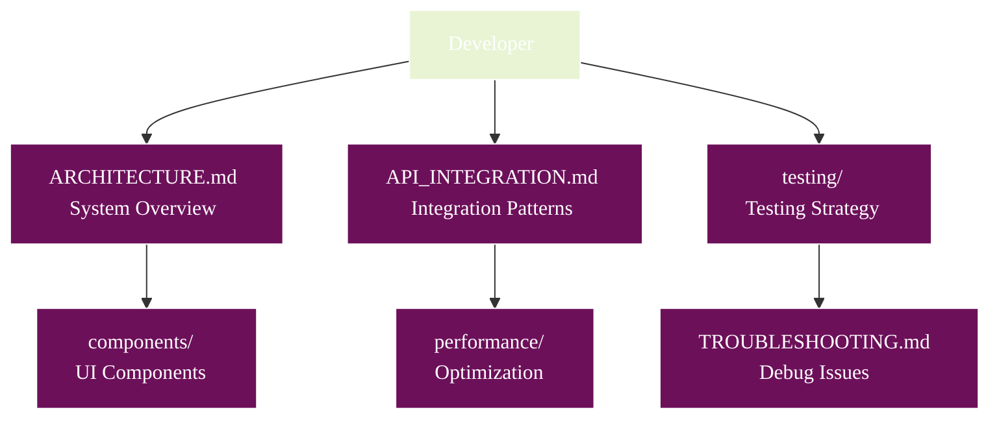
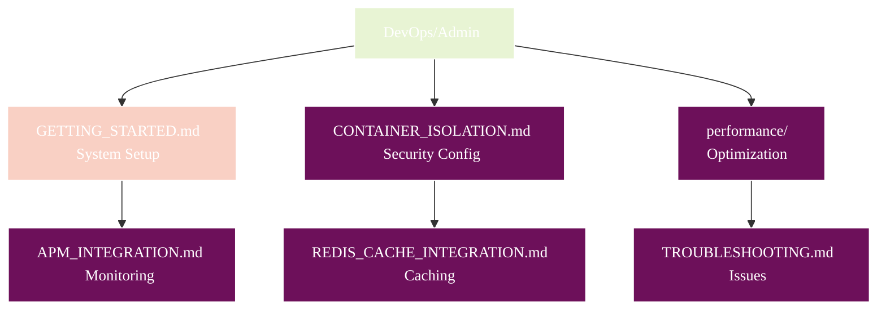
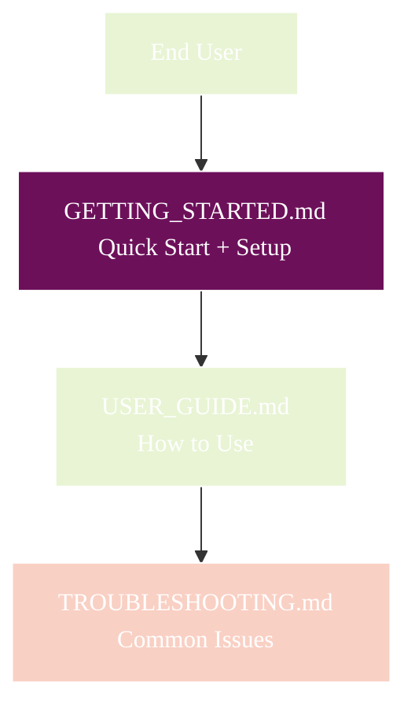

# Athena Documentation Hub

**Version:** 2.0 | **Status:** In Development | **Last Updated:** December 2025

Welcome to the comprehensive documentation for Athena, the AI-powered malware analysis platform. Built exclusively with **Tauri 2.0** for native desktop performance.

> **Project Status:** Core features implemented and under active development.

## 🚀 Quick Start

**New to Athena? Start here:**

```mermaid
%%{init: {
  'theme': 'base',
  'themeVariables': {
    'primaryColor': '#6d105a',
    'primaryTextColor': '#ffffff',
    'primaryBorderColor': '#ffffff',
    'lineColor': '#333333',
    'secondaryColor': '#e8f4d4',
    'secondaryTextColor': '#333333',
    'secondaryBorderColor': '#333333',
    'tertiaryColor': '#f9d0c4',
    'tertiaryTextColor': '#333333',
    'tertiaryBorderColor': '#333333',
    'background': '#ffffff',
    'mainBkg': '#6d105a',
    'secondBkg': '#e8f4d4',
    'tertiaryBkg': '#f9d0c4',
    'textColor': '#333333',
    'fontFamily': 'Arial, sans-serif'
  }
}}%%
flowchart LR
    Start([New User]) --> Setup[📖 GETTING_STARTED.md<br/>━━━━━━━━<br/>Quick start (2 min)<br/>+ Complete setup]

    Setup --> User[👤 USER_GUIDE.md<br/>━━━━━━━━<br/>How to use<br/>all features]

    User --> Advanced[⚙️ Advanced Docs<br/>━━━━━━━━<br/>Architecture<br/>and development]

    style Start fill:#e8f4d4
    style Setup fill:#6d105a,color:#fff
    style User fill:#e8f4d4
    style Advanced fill:#6d105a,color:#fff
```

## 📚 Documentation Map

### 🎯 Getting Started (Essential)

| Document | Purpose | Time | Audience |
| -------- | ------- | ---- | -------- |
| [**GETTING_STARTED.md**](./GETTING_STARTED.md) | Quick start (2 min) + Complete setup guide | 5-15 min | Everyone |
| [**USER_GUIDE.md**](./USER_GUIDE.md) | How to use all features | 30 min | End users |

### 🏗️ Architecture & Development

| Document | Purpose | Audience |
| -------- | ------- | -------- |
| [**ARCHITECTURE.md**](./ARCHITECTURE.md) | System architecture overview | Developers |
| [**WASM_ARCHITECTURE.md**](./WASM_ARCHITECTURE.md) | WebAssembly modules architecture | Developers |
| [**ENSEMBLE_ARCHITECTURE.md**](./ENSEMBLE_ARCHITECTURE.md) | Multi-agent ensemble approach | Developers |
| [**API_INTEGRATION.md**](./API_INTEGRATION.md) | API integration patterns | Developers |
| [**CONTAINER_ISOLATION.md**](./CONTAINER_ISOLATION.md) | Security and isolation | DevOps/Security |
| [**FRONTEND_LAUNCH_METHODS.md**](./FRONTEND_LAUNCH_METHODS.md) | Frontend navigation setup | Developers |

### 🔧 Technical Guides

| Document | Purpose | Audience |
| -------- | ------- | -------- |
| [**API_CORS_HANDLING.md**](./API_CORS_HANDLING.md) | CORS configuration | Developers |
| [**TROUBLESHOOTING.md**](./TROUBLESHOOTING.md) | Common issues and solutions | Everyone |
| [**FONT_CONFIGURATION.md**](./FONT_CONFIGURATION.md) | Font setup and issues | Developers |

### 🧩 Component Documentation

| Component | Purpose |
| --------- | ------- |
| [**AI_MODEL_SELECTOR.md**](./components/AI_MODEL_SELECTOR.md) | AI provider selection UI |
| [**ANALYSIS_OPTIONS_PANEL.md**](./components/ANALYSIS_OPTIONS_PANEL.md) | Analysis configuration UI |
| [**ANALYSIS_RESULTS.md**](./components/ANALYSIS_RESULTS.md) | Results display component |
| [**CONTAINER_CONFIG_SELECTOR.md**](./components/CONTAINER_CONFIG_SELECTOR.md) | Container settings UI |
| [**CONTAINER_MONITORING.md**](./components/CONTAINER_MONITORING.md) | Real-time monitoring UI |
| [**FILE_UPLOADER.md**](./components/FILE_UPLOADER.md) | File upload component |

### ⚡ Performance & Optimization

| Document | Purpose |
| -------- | ------- |
| [**ADAPTIVE_CIRCUIT_BREAKER.md**](./performance/ADAPTIVE_CIRCUIT_BREAKER.md) | Resilience patterns |
| [**BULKHEAD_PATTERN.md**](./performance/BULKHEAD_PATTERN.md) | Resource isolation |
| [**REDIS_CACHE_INTEGRATION.md**](./performance/REDIS_CACHE_INTEGRATION.md) | Distributed caching |
| [**APM_INTEGRATION.md**](./performance/APM_INTEGRATION.md) | Application monitoring |
| [**FEATURE_FLAGS.md**](./performance/FEATURE_FLAGS.md) | Runtime configuration |

### 🧪 Testing Documentation

| Document | Purpose |
| -------- | ------- |
| [**Testing README**](./testing/README.md) | Testing overview |
| [**Getting Started with Testing**](./testing/getting-started.md) | Test setup and execution |
| [**Testing Patterns**](./testing/patterns.md) | Best practices |
| [**API Testing**](./testing/api-testing.md) | API test strategies |
| [**Component Testing**](./testing/component-testing.md) | UI component tests |

## 🗺️ Navigation by Role

### 👨‍💻 **Developers**



### 👨‍💼 **DevOps/Admins**



### 👤 **End Users**



## 🎨 Documentation Legend

### 📊 Diagram Types

- **🔄 Flowcharts**: Process flows and decision trees
- **🎯 Sequence Diagrams**: Step-by-step interactions
- **🏗️ Architecture Diagrams**: System structure and relationships
- **📈 State Diagrams**: Component states and transitions
- **🎨 UI Mockups**: Visual component representations

### 🏷️ Color Coding

- 🟣 **Purple (`fill:#6d105a`)**: Primary elements, main processes
- 🟢 **Green (`fill:#e8f4d4`)**: Secondary elements, success states
- 🟠 **Peach (`fill:#f9d0c4`)**: Tertiary elements, warnings
- ⚫ **Dark Gray (`#333333`)**: Text and borders on light backgrounds

### 📝 Document Types

- **📖 Guides**: Step-by-step instructions
- **📋 Reference**: Technical specifications
- **🔧 Troubleshooting**: Problem resolution
- **🏗️ Architecture**: System design
- **🧩 Components**: UI element documentation

## 🚀 Common Workflows

### 🆕 First Time Setup

1. [GETTING_STARTED.md](./GETTING_STARTED.md) - Get running quickly (2 min quick start)
2. Run `/scripts/athena` → Option 2 (Check API Keys)
3. [USER_GUIDE.md](./USER_GUIDE.md) - Learn to use features

### 🐛 Troubleshooting Issues

1. [TROUBLESHOOTING.md](./TROUBLESHOOTING.md) - Find your issue category
2. Follow the visual decision trees
3. Check specific component docs if UI-related
4. Review [ARCHITECTURE.md](./ARCHITECTURE.md) for system issues

### 🔧 Development Setup

1. [GETTING_STARTED.md](./GETTING_STARTED.md) - Complete setup
2. [ARCHITECTURE.md](./ARCHITECTURE.md) - Understand the system
3. [testing/getting-started.md](./testing/getting-started.md) - Setup tests
4. Component docs for UI work

### ⚡ Performance Optimization

1. [performance/](./performance/) - Review all performance docs
2. [APM_INTEGRATION.md](./performance/APM_INTEGRATION.md) - Setup monitoring
3. [REDIS_CACHE_INTEGRATION.md](./performance/REDIS_CACHE_INTEGRATION.md) - Optimize caching

## 🔍 Quick Search

**Looking for specific topics?**

- **API Keys**: [GETTING_STARTED.md](./GETTING_STARTED.md#configure-api-keys)
- **Container Setup**: [CONTAINER_ISOLATION.md](./CONTAINER_ISOLATION.md)
- **Dependency Issues**: [TROUBLESHOOTING.md](./TROUBLESHOOTING.md#dependency-issues)
- **Error Messages**: [TROUBLESHOOTING.md](./TROUBLESHOOTING.md)
- **Frontend Navigation**: [FRONTEND_LAUNCH_METHODS.md](./FRONTEND_LAUNCH_METHODS.md)
- **Performance Issues**: [performance/](./performance/)
- **React Navigation v7**: [modernization/REACT_NAVIGATION_V7_UPGRADE.md](./modernization/REACT_NAVIGATION_V7_UPGRADE.md)
- **Testing**: [testing/](./testing/)
- **UI Components**: [components/](./components/)
- **WASM Integration**: [WASM-ARCHITECTURE-COMPLETE.md](./WASM-ARCHITECTURE-COMPLETE.md)

## 📱 Interactive CLI Reference

The new Athena CLI (`/scripts/athena`) provides a beautiful interactive menu:

```bash
/scripts/athena
```

**Main Options:**

- **🚀 Option 1**: Launch Complete Athena (Docker Compose)
- **🔑 Option 2**: Check API Keys
- **📦 Option 3**: Update Everything
- **🌐 Option 4-8**: Frontend/Mobile Options
- **🐳 Option 9-10**: Docker/Kubernetes
- **✨ Option 11**: Launch Tauri 2.0 App (NEW - Cross-platform desktop/mobile)
- **🔧 Option 12**: Run Setup
- **🧪 Option 16**: Run All Tests

### Tauri 2.0 Application

Athena is built with **Tauri 2.0** as a native desktop application:

- **Desktop Platforms**: Windows, macOS (verified on Apple Silicon), Linux
- **Backend**: Rust with 50+ Tauri commands
- **Frontend**: SolidJS with TypeScript
- **WASM Runtime**: Wasmtime 29.0 with Component Model
- **Build System**: Vite 7.1.10
- **Documentation**: See [`athena-v2/README.md`](../athena-v2/README.md) for details

**Quick Start:**

```bash
cd athena-v2
npm run tauri:dev    # Development mode
npm run tauri:build  # Production build
```

---

**💡 Tip**: Each document includes visual diagrams and cross-references to related documentation. Use the navigation maps above to find exactly what you need!
