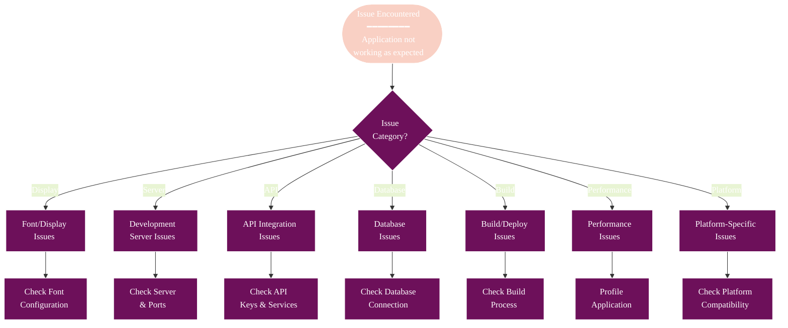
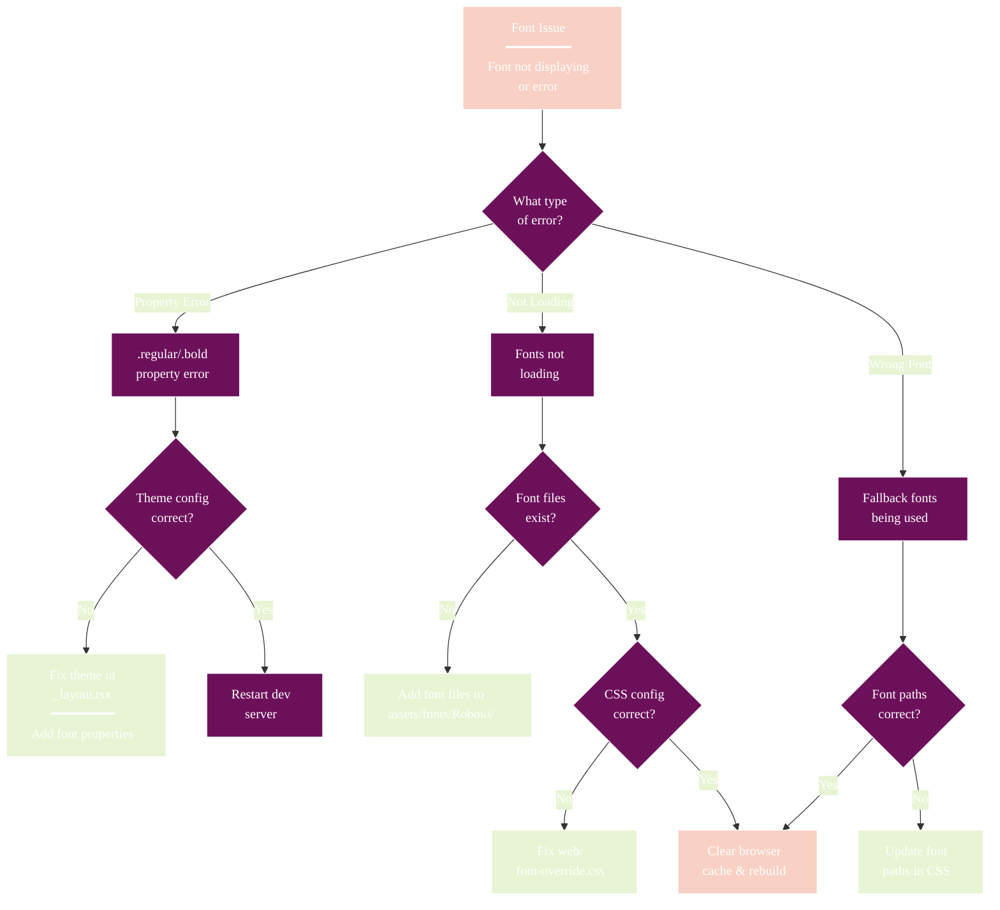
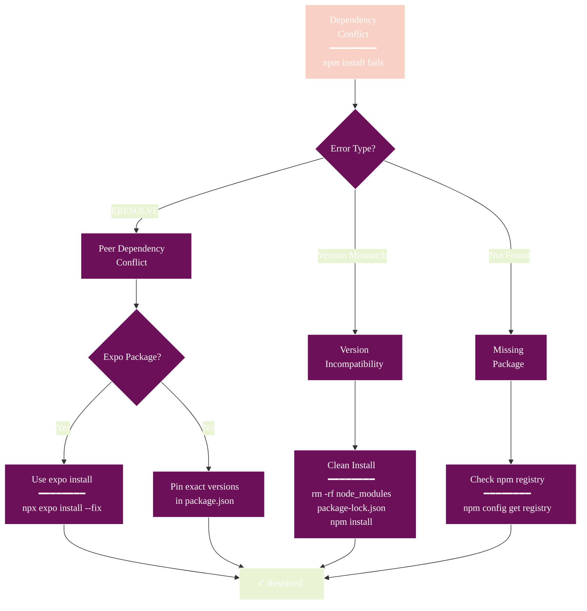
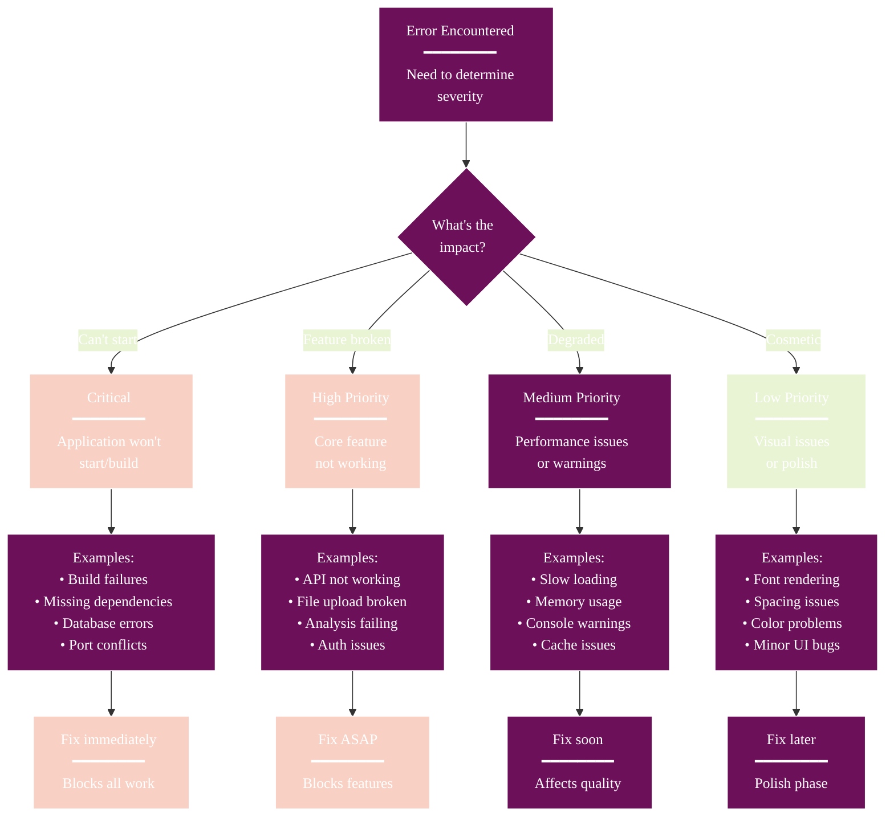

# Troubleshooting Guide

This document provides solutions to common issues encountered when developing or running the Athena application.

## Troubleshooting Overview



## Font-Related Issues

### Font Troubleshooting Decision Tree



### ".regular property access error"

**Error Message**: `TypeError: Cannot read properties of undefined (reading 'regular')` or similar for other font weights (medium, bold, heavy).

**Symptoms**:
- Application fails to load with font-related errors
- React Navigation components throwing undefined property errors
- Console showing font property access errors

**Root Cause**: React Navigation components trying to access font properties from the theme's fonts object, but the properties are not properly defined in the theme configuration.

**Solution**:
1. Ensure custom theme objects are properly configured in `app/_layout.tsx`
2. Verify all font weight properties (regular, medium, bold, heavy) are defined
3. Check that both light and dark themes include font configurations
4. Restart the development server after making changes

**Fixed in**: The font configuration has been updated to include proper theme definitions. See [Font Configuration Guide](FONT_CONFIGURATION.md) for details.

### Font Loading Issues on Web

**Symptoms**:
- Fonts not displaying correctly on web platform
- Fallback fonts being used instead of Roboto
- Font files not loading

**Solutions**:
1. Verify font files exist in `assets/fonts/Roboto/`
2. Check `web/font-override.css` configuration
3. Clear browser cache and rebuild application
4. Ensure font paths are correct in CSS files

## Development Server Issues

### Server Issue Resolution Flow

```mermaid
%%{init: {
  'theme': 'base',
  'themeVariables': {
    'primaryColor': '#6d105a',
    'primaryTextColor': '#ffffff',
    'primaryBorderColor': '#ffffff',
    'lineColor': '#333333',
    'secondaryColor': '#e8f4d4',
    'secondaryTextColor': '#333333',
    'secondaryBorderColor': '#333333',
    'tertiaryColor': '#f9d0c4',
    'tertiaryTextColor': '#333333',
    'tertiaryBorderColor': '#333333',
    'background': '#ffffff',
    'mainBkg': '#6d105a',
    'secondBkg': '#e8f4d4',
    'tertiaryBkg': '#f9d0c4',
    'textColor': '#333333',
    'fontFamily': 'Arial, sans-serif'
  }
}}%%
flowchart TD
    ServerIssue[Server Issue<br/>━━━━━━━━<br/>Can't start<br/>dev server] --> IssueType{What's the<br/>error?}
    
    IssueType -->|Port in use| PortIssue[Port 3000<br/>already in use]
    IssueType -->|Metro error| MetroIssue[Metro bundler<br/>cache issue]
    IssueType -->|Build error| BuildIssue[Build/compile<br/>error]
    
    PortIssue --> KillProcess{Kill existing<br/>process?}
    KillProcess -->|Yes| KillCmd[pkill -f<br/>"expo start"]
    KillProcess -->|No| AutoPort[Script auto-finds<br/>available port]
    
    KillCmd --> Restart[Restart<br/>server]
    AutoPort --> Restart
    
    MetroIssue --> ClearCache[Clear Metro cache<br/>━━━━━━━━<br/>npx expo start --clear]
    ClearCache --> StillIssue{Still having<br/>issues?}
    StillIssue -->|Yes| DeepClean[Deep clean<br/>━━━━━━━━<br/>rm -rf node_modules<br/>npm install]
    StillIssue -->|No| Resolved[Issue<br/>Resolved ✓]
    
    BuildIssue --> CheckCode[Check for<br/>code errors<br/>━━━━━━━━<br/>npx tsc --noEmit]
    
    DeepClean --> Resolved
    CheckCode --> FixErrors[Fix code<br/>errors]
    FixErrors --> Restart
    
    style ServerIssue fill:#f9d0c4
    style Resolved fill:#e8f4d4
    style ClearCache fill:#f9d0c4
    style DeepClean fill:#f9d0c4
```

### Port Already in Use

**Error**: `Port 3000 is already in use`

**Solution**:
1. Kill existing processes: `pkill -f "expo start"`
2. Use a different port: The run script will automatically find an available port
3. Check for other applications using the port: `lsof -i :3000`

### Metro Bundler Cache Issues

**Symptoms**:
- Changes not reflecting in the application
- Stale code being served
- Build errors after file changes

**Solutions**:
1. Clear Metro cache: `npx expo start --clear`
2. Delete node_modules and reinstall: `rm -rf node_modules && npm install`
3. Clear browser cache and hard refresh

## API Integration Issues

### API Issue Diagnosis Flow

```mermaid
%%{init: {
  'theme': 'base',
  'themeVariables': {
    'primaryColor': '#6d105a',
    'primaryTextColor': '#ffffff',
    'primaryBorderColor': '#ffffff',
    'lineColor': '#333333',
    'secondaryColor': '#e8f4d4',
    'secondaryTextColor': '#333333',
    'secondaryBorderColor': '#333333',
    'tertiaryColor': '#f9d0c4',
    'tertiaryTextColor': '#333333',
    'tertiaryBorderColor': '#333333',
    'background': '#ffffff',
    'mainBkg': '#6d105a',
    'secondBkg': '#e8f4d4',
    'tertiaryBkg': '#f9d0c4',
    'textColor': '#333333',
    'fontFamily': 'Arial, sans-serif'
  }
}}%%
flowchart TD
    APIIssue[API Issue<br/>━━━━━━━━<br/>AI models not<br/>working] --> CheckKeys{API keys<br/>configured?}
    
    CheckKeys -->|No| NoKeys[No keys found<br/>━━━━━━━━<br/>"No AI models<br/>available"]
    CheckKeys -->|Yes| ValidKeys{Keys valid?}
    
    NoKeys --> AddKeys[Add keys to .env<br/>━━━━━━━━<br/>• OpenAI<br/>• Claude<br/>• DeepSeek]
    
    ValidKeys -->|No| InvalidKeys[Invalid keys<br/>━━━━━━━━<br/>401/403 errors]
    ValidKeys -->|Yes| ConnIssue{Connection<br/>working?}
    
    InvalidKeys --> CheckFormat[Check key format<br/>& permissions]
    
    ConnIssue -->|No| NetworkIssue[Network/Timeout<br/>errors]
    ConnIssue -->|Yes| ServiceIssue[Service-specific<br/>issue]
    
    NetworkIssue --> CheckNet[Check:<br/>━━━━━━━━<br/>• Internet connection<br/>• Proxy settings<br/>• Service status]
    
    ServiceIssue --> CheckLogs[Check console<br/>for specific errors]
    
    AddKeys --> RestartServer[Restart dev<br/>server]
    CheckFormat --> RestartServer
    CheckNet --> RestartServer
    CheckLogs --> DebugService[Debug specific<br/>service]
    
    style APIIssue fill:#f9d0c4
    style AddKeys fill:#e8f4d4
    style CheckFormat fill:#f9d0c4
    style CheckNet fill:#f9d0c4
    style RestartServer fill:#6d105a,color:#fff
```

### Missing API Keys

**Symptoms**:
- "No AI models available" message
- API key validation errors
- Services not initializing properly

**Solutions**:
1. Check `.env` file exists and contains required keys
2. Verify API key format and validity
3. Restart development server after adding keys
4. Check console for specific API key errors

### Service Connection Errors

**Symptoms**:
- API calls failing
- Network timeout errors
- Service initialization errors

**Solutions**:
1. Verify internet connection
2. Check API service status
3. Validate API key permissions
4. Review network proxy settings

## Database Issues

### Database Connection Errors

**Symptoms**:
- Database initialization failures
- Connection timeout errors
- SQL execution errors

**Solutions**:
1. Ensure Docker is running (if using containerized database)
2. Check database configuration in `config/database.ts`
3. Verify database credentials
4. Run database setup scripts: `npm run setup-db`

### Migration Issues

**Symptoms**:
- Schema mismatch errors
- Migration execution failures
- Data inconsistency

**Solutions**:
1. Run database migrations: `npm run migrate`
2. Reset database if needed: `npm run reset-db`
3. Check migration files for syntax errors
4. Verify database permissions

## Dependency Issues

### npm ci Failures (CI/CD)

**Symptoms**:
- `ERESOLVE could not resolve` errors
- Peer dependency conflicts
- CI/CD pipeline failures

**Solutions**:
1. Ensure exact package versions match Expo SDK 52:
   ```bash
   npx expo install --fix
   ```
2. Clean install locally:
   ```bash
   rm -rf node_modules package-lock.json
   npm install
   ```
3. For specific conflicts, see [React Navigation v7 Upgrade](modernization/REACT_NAVIGATION_V7_UPGRADE.md)

### Dependency Version Conflicts



### Common Dependency Fixes

**React Navigation v7 Conflicts**:
```json
{
  "@react-navigation/native": "^7.0.14",
  "@react-navigation/bottom-tabs": "^7.1.5"
}
```

**Picker Version Conflicts**:
```json
{
  "@react-native-picker/picker": "2.9.0"  // Exact version, no ^
}
```

**Type Definition Conflicts**:
```json
{
  "@types/react": "~18.3.12"  // Constrained to patch versions
}
```

## Build and Deployment Issues

### Web Build Failures

**Symptoms**:
- Build process failing
- Asset loading errors
- JavaScript bundle errors

**Solutions**:
1. Clear build cache: `rm -rf dist .expo`
2. Check for TypeScript errors: `npx tsc --noEmit`
3. Verify all imports and dependencies
4. Update dependencies using Expo: `npx expo install --fix`

### Asset Loading Issues

**Symptoms**:
- Images not loading
- Font files not found
- Static assets returning 404

**Solutions**:
1. Verify asset paths are correct
2. Check asset file permissions
3. Ensure assets are included in build output
4. Clear browser cache

## Performance Issues

### Slow Application Loading

**Symptoms**:
- Long initial load times
- Slow navigation between screens
- High memory usage

**Solutions**:
1. Enable code splitting for large components
2. Optimize image sizes and formats
3. Implement lazy loading for heavy components
4. Profile application performance

### Memory Leaks

**Symptoms**:
- Increasing memory usage over time
- Application becoming unresponsive
- Browser tab crashes

**Solutions**:
1. Check for unsubscribed event listeners
2. Properly cleanup useEffect hooks
3. Avoid creating objects in render methods
4. Use React DevTools Profiler

## Platform-Specific Issues

### Web Platform Issues

**Common Issues**:
- Font rendering differences
- CSS compatibility issues
- Browser-specific behaviors

**Solutions**:
1. Test across different browsers
2. Use CSS prefixes for compatibility
3. Implement platform-specific code with `Platform.select()`
4. Check browser console for errors

### Mobile Platform Issues

**Common Issues**:
- Touch gesture conflicts
- Screen size adaptation
- Native module integration

**Solutions**:
1. Test on different screen sizes
2. Use responsive design principles
3. Check native module compatibility
4. Test on physical devices

## Error Categorization & Priority

### Error Severity Classification



## Getting Help

### Debug Information to Collect

When reporting issues, please include:

1. **Error messages**: Full error text and stack traces
2. **Environment details**: OS, Node.js version, browser version
3. **Steps to reproduce**: Detailed steps that lead to the issue
4. **Expected vs actual behavior**: What should happen vs what actually happens
5. **Console logs**: Browser console output and server logs
6. **Configuration**: Relevant configuration files and environment variables

### Log Locations

- **Browser console**: Developer tools → Console tab
- **Server logs**: Terminal running the development server
- **Build logs**: Output from build commands
- **Application logs**: Check browser network tab for API calls

### Useful Commands

```bash
# Clear all caches and restart
npm run clean && npm install && npm start

# Check for TypeScript errors
npx tsc --noEmit

# Verify dependencies
npm audit

# Check for outdated packages
npm outdated

# Reset development environment
rm -rf node_modules package-lock.json && npm install
```

## Related Documentation

- [Font Configuration Guide](FONT_CONFIGURATION.md)
- [Getting Started Guide](GETTING_STARTED.md)
- [Architecture Overview](ARCHITECTURE.md)
- [API Integration Guide](API_INTEGRATION.md)
