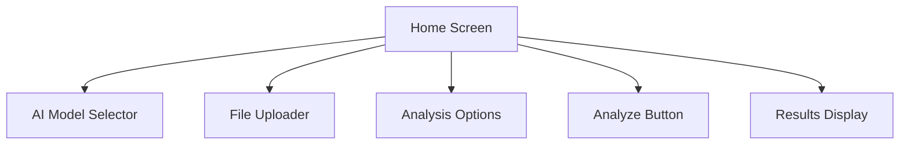
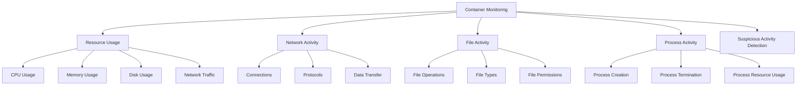

# Athena User Guide

> **IMPORTANT DISCLAIMER:** The containerization and analysis components described in this documentation are still being designed and developed. Their current implementation and documentation are not reflective of what the final design could be. This documentation represents a conceptual overview and may change significantly as development progresses.

This guide provides detailed instructions for using Athena, the AI-powered malware analysis assistant. It's designed for users who may not be familiar with React Native applications or technical development environments.

## Table of Contents

- [Installation](#installation)
  - [Web Version](#web-version)
  - [Mobile Version](#mobile-version)
  - [Database Setup](#database-setup)
- [Setting Up API Keys](#setting-up-api-keys)
- [Using Athena](#using-athena)
  - [Home Screen](#home-screen)
  - [Uploading Files](#uploading-files)
  - [Selecting an AI Model](#selecting-an-ai-model)
  - [Running Analysis](#running-analysis)
  - [Viewing Results](#viewing-results)
- [Container Isolation](#container-isolation)
  - [Enabling Container Isolation](#enabling-container-isolation)
  - [Container Configuration](#container-configuration)
  - [Resource Presets](#resource-presets)
- [Container Monitoring](#container-monitoring)
  - [Monitoring Dashboard](#monitoring-dashboard)
  - [Resource Usage](#resource-usage)
  - [Network Activity](#network-activity)
  - [File Activity](#file-activity)
  - [Process Activity](#process-activity)
  - [Suspicious Activity Detection](#suspicious-activity-detection)
- [Troubleshooting](#troubleshooting)
- [FAQ](#faq)

## Installation

Athena can be run as a web application or as a mobile app on iOS and Android devices.

### Web Version

The web version is the easiest way to get started with Athena. You don't need to install anything on your computer except a modern web browser.

1. **Clone the Repository**:
   - If you have Git installed, open a terminal and run:
     ```bash
     git clone https://github.com/yourusername/athena.git
     cd athena
     ```
   - If you don't have Git, you can download the repository as a ZIP file from GitHub and extract it to a folder on your computer.

2. **Install Dependencies**:
   - Make sure you have Node.js installed. If not, download and install it from [nodejs.org](https://nodejs.org/).
   - Open a terminal in the athena folder and run:
     ```bash
     npm install
     ```
   - This will install all the necessary dependencies for the application.

3. **Set Up Environment Variables**:
   - Create a file named `.env` in the Athena directory
   - Add your API keys (see [Setting Up API Keys](#setting-up-api-keys) for details)

4. **Start the Web Application**:
   - In the terminal, run:
     ```bash
     npx serve dist
     ```
   - This will serve the built app from the dist directory using a static file server
   - Open your web browser and navigate to `http://localhost:3000` (or the URL shown in the terminal)

### Mobile Version

> **Important:** The Expo launch method is currently not working. Please use the web version with `npx serve dist` instead.

When working, to run Athena on a mobile device, you'll need to use the Expo Go app.

1. **Install Expo Go on Your Device**:
   - iOS: [Download from App Store](https://apps.apple.com/app/expo-go/id982107779)
   - Android: [Download from Google Play](https://play.google.com/store/apps/details?id=host.exp.exponent)

2. **Clone and Set Up the Repository** (same as steps 1-3 for Web Version)

3. **Start the Expo Development Server**:
   - In the terminal, run:
     ```bash
     npx expo start
     ```
   - This will start the Expo development server and display a QR code in the terminal

4. **Connect Your Device**:
   - Open the Expo Go app on your device
   - Scan the QR code displayed in the terminal:
     - iOS: Use the device's camera
     - Android: Use the Expo Go app's QR code scanner
   - The app will load on your device

### Database Setup

Athena uses PostgreSQL for persistent storage of container configurations, monitoring data, and analysis results.

1. **Using Docker Compose (Recommended)**:
   - Make sure Docker and Docker Compose are installed
   - Run the database setup script:
     ```bash
     chmod +x Athena/scripts/setup-db.sh
     ./Athena/scripts/setup-db.sh
     ```
   - This will start PostgreSQL and pgAdmin containers and initialize the database

2. **Using an Existing PostgreSQL Server**:
   - Update your `.env` file with your PostgreSQL connection details:
     ```
     DB_HOST=your_postgres_host
     DB_PORT=your_postgres_port
     DB_NAME=athena_db
     DB_USER=your_postgres_user
     DB_PASSWORD=your_postgres_password
     ```
   - Create and initialize the database:
     ```bash
     npm run db:create
     npm run init-db
     ```

3. **Verifying the Database Setup**:
   - Run the database test script:
     ```bash
     npm run db:test
     ```
   - This will create test container configurations and instances to verify the setup

For more detailed instructions, see the [Database Setup Documentation](../Athena/docs/DATABASE_SETUP.md).

## Setting Up API Keys

Athena uses API keys to connect to various AI models. You'll need to obtain these keys from the respective providers.

### Getting API Keys

1. **OpenAI API Key**:
   - Go to [OpenAI's platform](https://platform.openai.com/account/api-keys)
   - Sign up or log in to your account
   - Navigate to the API keys section
   - Create a new API key
   - Copy the key (you won't be able to see it again)

2. **Claude API Key**:
   - Go to [Anthropic's console](https://console.anthropic.com/account/keys)
   - Sign up or log in to your account
   - Create a new API key
   - Copy the key

3. **DeepSeek API Key**:
   - Go to [DeepSeek's platform](https://platform.deepseek.com/)
   - Sign up or log in to your account
   - Navigate to the API keys section
   - Create a new API key
   - Copy the key

### Adding API Keys to Athena

You can add API keys in two ways:

#### Method 1: Using Environment Variables (Recommended for Development)

1. Create a file named `.env` in the Athena directory
2. Add your API keys to the file:
   ```
   OPENAI_API_KEY=your_openai_api_key_here
   CLAUDE_API_KEY=your_claude_api_key_here
   DEEPSEEK_API_KEY=your_deepseek_api_key_here
   ```
3. Save the file
4. Restart the application if it's already running

#### Method 2: Using the Settings Screen

1. Open Athena in your browser or on your mobile device
2. Navigate to the Settings screen (click the gear icon in the tab bar)
3. Enter your API keys in the respective fields
4. Click the "Save" button next to each field
5. You can verify that the keys are saved by clicking the "Check" button

## Using Athena

### Home Screen

The Home screen is the main interface for analyzing malware files. It consists of several sections:



### Uploading Files

To upload a file for analysis:

1. On the Home screen, find the "Uploaded Files" section
2. Click the "Upload" button
3. A file picker dialog will open
4. Select the file you want to analyze
5. The file will appear in the list of uploaded files
6. Click on the file to select it for analysis

### Selecting an AI Model

To select an AI model for analysis:

1. On the Home screen, find the "Select AI Model" section
2. You'll see a list of available AI models (if you've set up the API keys)
3. Click on a model to select it
4. The selected model will be highlighted

### Running Analysis

To run an analysis:

1. Make sure you've selected both a file and an AI model
2. (Optional) Configure analysis options:
   - Use Container: Toggle this option to run the analysis in an isolated container
3. Click the "Analyze" button
4. The analysis will begin, and you'll see a loading indicator
5. Wait for the analysis to complete (this may take some time depending on the file size and complexity)

### Viewing Results

Once the analysis is complete, you'll see the results in the "Analysis Results" section. The results are organized into three tabs:

1. **Deobfuscated Code**: Shows the cleaned, readable version of the malware code
   - This tab displays the deobfuscated version of the original code
   - The code is formatted and commented for better readability

2. **Analysis Report**: Provides a detailed report of the analysis findings
   - This tab contains a comprehensive report of the analysis
   - It includes information about the malware's purpose, behavior, and potential impact
   - If container analysis was used, it also includes information about the malware's behavior in the container

3. **Vulnerabilities**: Lists detected vulnerabilities with severity ratings and details
   - This tab shows a list of vulnerabilities found in the code
   - Each vulnerability includes:
     - Name and description
     - Severity rating (low, medium, high, critical)
     - CVE ID (if available)
     - Metasploit module (if available)

## Container Isolation

The container isolation feature allows you to run malware analysis in an isolated environment, preventing potentially harmful code from affecting your system.

### Enabling Container Isolation

1. In the Analysis Options panel, toggle the "Use Container" switch to enable container isolation
2. Configure the container settings:
   - **OS**: Select the operating system for the container (Windows, Linux, or macOS)
   - **Architecture**: Select the CPU architecture (x86, x64, ARM, ARM64)
   - **Version**: Select the OS version
   - **Resources**: Select a resource preset or configure custom resource limits

### Container Configuration

The container configuration options allow you to customize the container environment to match the target environment of the malware you're analyzing.

#### OS Selection

- **Windows**: For analyzing Windows-specific malware
- **Linux**: For analyzing Linux-specific malware
- **macOS**: For analyzing macOS-specific malware

#### Architecture Selection

- **x86 (32-bit)**: For analyzing 32-bit malware
- **x64 (64-bit)**: For analyzing 64-bit malware
- **ARM**: For analyzing ARM-based malware
- **ARM64**: For analyzing ARM64-based malware

#### Version Selection

- **Windows**: Windows 7, 8, 10, 11
- **Linux**: Various distributions and versions (Ubuntu, Debian, CentOS, etc.)
- **macOS**: macOS 11 (Big Sur), 12 (Monterey), 13 (Ventura), 14 (Sonoma)

#### Resource Configuration

- **CPU**: Number of CPU cores allocated to the container
- **Memory**: Amount of RAM allocated to the container
- **Disk Space**: Amount of disk space allocated to the container
- **Network Speed**: Network bandwidth allocated to the container
- **I/O Operations**: Maximum I/O operations per second allowed for the container

### Resource Presets

The container isolation feature provides OS-specific resource presets for common use cases:

#### Windows Resource Presets

| Preset | CPU Cores | Memory (MB) | Disk Space (MB) | Network Speed (Mbps) | I/O Operations (IOPS) | Use Case |
|--------|-----------|------------|-----------------|---------------------|----------------------|----------|
| Minimal | 1 | 2,048 | 8,192 | 5 | 500 | Simple malware analysis with minimal resource requirements |
| Standard | 2 | 4,096 | 10,240 | 20 | 2,000 | General-purpose malware analysis |
| Performance | 4 | 8,192 | 20,480 | 50 | 5,000 | Complex malware analysis requiring more resources |
| Intensive | 8 | 16,384 | 40,960 | 100 | 10,000 | Advanced malware analysis for resource-intensive samples |

#### Linux Resource Presets

| Preset | CPU Cores | Memory (MB) | Disk Space (MB) | Network Speed (Mbps) | I/O Operations (IOPS) | Use Case |
|--------|-----------|------------|-----------------|---------------------|----------------------|----------|
| Minimal | 0.5 | 1,024 | 4,096 | 5 | 500 | Simple malware analysis with minimal resource requirements |
| Standard | 1 | 2,048 | 8,192 | 20 | 2,000 | General-purpose malware analysis |
| Performance | 2 | 4,096 | 10,240 | 50 | 5,000 | Complex malware analysis requiring more resources |
| Intensive | 4 | 8,192 | 20,480 | 100 | 10,000 | Advanced malware analysis for resource-intensive samples |

#### macOS Resource Presets

| Preset | CPU Cores | Memory (MB) | Disk Space (MB) | Network Speed (Mbps) | I/O Operations (IOPS) | Use Case |
|--------|-----------|------------|-----------------|---------------------|----------------------|----------|
| Minimal | 2 | 4,096 | 16,384 | 10 | 1,000 | Simple malware analysis with minimal resource requirements |
| Standard | 4 | 8,192 | 20,480 | 20 | 2,000 | General-purpose malware analysis |
| Performance | 6 | 12,288 | 30,720 | 50 | 5,000 | Complex malware analysis requiring more resources |
| Intensive | 8 | 16,384 | 40,960 | 100 | 10,000 | Advanced malware analysis for resource-intensive samples |

## Container Monitoring

The container monitoring system tracks various aspects of container activity during malware analysis, providing valuable insights into the behavior of the analyzed malware.



### Monitoring Dashboard

The monitoring dashboard provides a comprehensive view of container activity:

1. Access the monitoring dashboard by clicking the "Monitor" button in the analysis results
2. The dashboard displays real-time monitoring data for the selected container
3. Use the refresh button to update the data manually, or enable auto-refresh for real-time updates
4. Use the tabs to navigate between different monitoring views

### Resource Usage

The resource usage view displays information about the container's resource consumption:

- **CPU Usage**: Percentage of CPU usage over time
- **Memory Usage**: Memory consumption in MB over time
- **Disk Usage**: Disk space usage in MB over time
- **Network Traffic**: Inbound and outbound network traffic in bytes over time

### Network Activity

The network activity view displays information about network connections made by the container:

- **Connection List**: List of all network connections made by the container
- **Connection Details**: For each connection:
  - Protocol (TCP, UDP, ICMP, HTTP, HTTPS, DNS)
  - Source and destination IP addresses and ports
  - Connection direction (inbound/outbound)
  - Data size and duration
  - Process responsible for the connection
  - Connection status (established, closed, blocked, attempted)

### File Activity

The file activity view displays information about file operations performed by the container:

- **Operation List**: List of all file operations performed by the container
- **Operation Details**: For each operation:
  - Operation type (create, read, write, delete, modify, execute, rename, move)
  - File path and type
  - File size and permissions
  - Process responsible for the operation
  - File hash and content (for suspicious files)

### Process Activity

The process activity view displays information about processes running in the container:

- **Process List**: List of all processes that have run in the container
- **Process Details**: For each process:
  - Process ID and parent process ID
  - Process name and command line
  - User running the process
  - Start and end times
  - CPU and memory usage
  - Process status (running, stopped, terminated, zombie)

### Suspicious Activity Detection

The suspicious activity detection feature automatically identifies potentially malicious activities:

- **Suspicious Network Activity**: Unusual network connections or data transfers
- **Suspicious File Activity**: Operations on sensitive files or unusual file types
- **Suspicious Process Activity**: Unusual process behavior or resource usage
- **Activity Details**: For each suspicious activity:
  - Activity type and description
  - Reason for flagging as suspicious
  - Severity level (low, medium, high, critical)
  - Recommendations for further investigation

For more detailed information about the container monitoring system, see the [Container Monitoring Documentation](../Athena/docs/CONTAINER_MONITORING.md).

## Troubleshooting

### Font-Related Issues

**Problem**: Application displays incorrectly or shows font-related errors like ".regular property access error".

**Solution**:
1. Check the [Font Configuration Guide](./FONT_CONFIGURATION.md) for detailed font setup instructions
2. Verify that font assets are properly loaded in the web version
3. Clear your browser cache and reload the application
4. If using the mobile version, restart the Expo development server

### API Key Issues

**Problem**: The AI models are not showing up in the selector.

**Solution**:
1. Go to the Settings screen
2. Check if your API keys are entered correctly
3. Click the "Check" button next to each API key to verify it's working
4. If the keys are not working, try re-entering them
5. Make sure you're connected to the internet

### File Upload Issues

**Problem**: Unable to upload files.

**Solution**:
1. Make sure the file is accessible on your device
2. Check if the file size is reasonable (very large files may cause issues)
3. Try a different file format
4. If using the web version, try a different browser

### Analysis Issues

**Problem**: Analysis fails or takes too long.

**Solution**:
1. Check your internet connection
2. Try a smaller or less complex file
3. Try a different AI model
4. If using container analysis, try disabling it
5. Check the console for error messages (if you're familiar with developer tools)

### Database Issues

**Problem**: Database connection errors.

**Solution**:
1. Check if the PostgreSQL server is running
2. Verify the database connection details in the `.env` file
3. Make sure the database has been created and initialized
4. Try running the database test script:
   ```bash
   npm run db:test
   ```
5. Check the console for error messages

### General Issues

For comprehensive troubleshooting guidance covering common issues, error messages, and solutions, see the [Troubleshooting Guide](./TROUBLESHOOTING.md).

## FAQ

**Q: Which AI model should I use?**

A: Each model has its strengths:
- OpenAI GPT-4 is good for general-purpose analysis and has strong reasoning capabilities
- Claude 3 Opus excels at detailed analysis and understanding complex code patterns
- DeepSeek Coder is specialized for code analysis and may perform better for certain programming languages

**Q: Is it safe to analyze malware on my device?**

A: Athena is designed with security in mind, but you should still exercise caution:
- Use the container isolation feature when analyzing suspicious files
- Don't execute or open malware files outside of Athena
- Consider running Athena in a virtual machine for an extra layer of security

**Q: Can I analyze any type of file?**

A: Athena works best with text-based files like source code, scripts, and configuration files. Binary files may not be analyzed as effectively.

**Q: How accurate is the analysis?**

A: The accuracy depends on several factors:
- The AI model used
- The complexity of the malware
- The quality of the input data
- Whether container analysis is used

While AI models are powerful, they're not perfect. Always use your judgment and consider the analysis as a helpful tool rather than a definitive assessment.

**Q: Do I need an internet connection?**

A: Yes, Athena requires an internet connection to communicate with the AI model APIs.

**Q: Are my files sent to external servers?**

A: Yes, when using cloud-based AI models (OpenAI, Claude, DeepSeek), your files are sent to their respective APIs for analysis. If you're concerned about sensitive data, consider using the container isolation feature and reviewing the privacy policies of the AI model providers.

**Q: Do I need to set up the database?**

A: The database is required for container monitoring and persistent storage of analysis results. If you're not using these features, you can skip the database setup.

**Q: How can I view monitoring data for a container?**

A: After running an analysis with container isolation enabled, click the "Monitor" button in the analysis results to access the monitoring dashboard.

**Q: What should I do if I encounter font-related errors?**

A: Font-related issues are usually related to missing font assets or configuration problems. Check the [Font Configuration Guide](./FONT_CONFIGURATION.md) for detailed setup instructions and troubleshooting steps.
