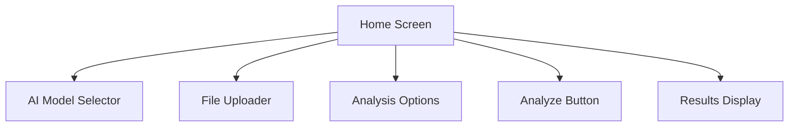

# Athena User Guide

> **IMPORTANT DISCLAIMER:** The containerization and analysis components described in this documentation are still being designed and developed. Their current implementation and documentation are not reflective of what the final design could be. This documentation represents a conceptual overview and may change significantly as development progresses.

This guide provides detailed instructions for using Athena, the AI-powered malware analysis assistant. It's designed for users who may not be familiar with React Native applications or technical development environments.

## Table of Contents

- [Installation](#installation)
  - [Web Version](#web-version)
  - [Mobile Version](#mobile-version)
- [Setting Up API Keys](#setting-up-api-keys)
- [Using Athena](#using-athena)
  - [Home Screen](#home-screen)
  - [Uploading Files](#uploading-files)
  - [Selecting an AI Model](#selecting-an-ai-model)
  - [Running Analysis](#running-analysis)
  - [Viewing Results](#viewing-results)
- [Troubleshooting](#troubleshooting)
- [FAQ](#faq)

## Installation

Athena can be run as a web application or as a mobile app on iOS and Android devices.

### Web Version

The web version is the easiest way to get started with Athena. You don't need to install anything on your computer except a modern web browser.

1. **Clone the Repository**:
   - If you have Git installed, open a terminal and run:
     ```bash
     git clone https://github.com/yourusername/athena.git
     cd athena
     ```
   - If you don't have Git, you can download the repository as a ZIP file from GitHub and extract it to a folder on your computer.

2. **Install Dependencies**:
   - Make sure you have Node.js installed. If not, download and install it from [nodejs.org](https://nodejs.org/).
   - Open a terminal in the athena folder and run:
     ```bash
     npm install
     ```
   - This will install all the necessary dependencies for the application.

3. **Set Up Environment Variables**:
   - Create a file named `.env` in the Athena directory
   - Add your API keys (see [Setting Up API Keys](#setting-up-api-keys) for details)

4. **Start the Web Application**:
   - In the terminal, run:
     ```bash
     npm run start:web
     ```
   - This will build the application and start a local web server
   - Open your web browser and navigate to `http://localhost:3000` (or the URL shown in the terminal)

### Mobile Version

To run Athena on a mobile device, you'll need to use the Expo Go app.

1. **Install Expo Go on Your Device**:
   - iOS: [Download from App Store](https://apps.apple.com/app/expo-go/id982107779)
   - Android: [Download from Google Play](https://play.google.com/store/apps/details?id=host.exp.exponent)

2. **Clone and Set Up the Repository** (same as steps 1-3 for Web Version)

3. **Start the Expo Development Server**:
   - In the terminal, run:
     ```bash
     npx expo start
     ```
   - This will start the Expo development server and display a QR code in the terminal

4. **Connect Your Device**:
   - Open the Expo Go app on your device
   - Scan the QR code displayed in the terminal:
     - iOS: Use the device's camera
     - Android: Use the Expo Go app's QR code scanner
   - The app will load on your device

## Setting Up API Keys

Athena uses API keys to connect to various AI models. You'll need to obtain these keys from the respective providers.

### Getting API Keys

1. **OpenAI API Key**:
   - Go to [OpenAI's platform](https://platform.openai.com/account/api-keys)
   - Sign up or log in to your account
   - Navigate to the API keys section
   - Create a new API key
   - Copy the key (you won't be able to see it again)

2. **Claude API Key**:
   - Go to [Anthropic's console](https://console.anthropic.com/account/keys)
   - Sign up or log in to your account
   - Create a new API key
   - Copy the key

3. **DeepSeek API Key**:
   - Go to [DeepSeek's platform](https://platform.deepseek.com/)
   - Sign up or log in to your account
   - Navigate to the API keys section
   - Create a new API key
   - Copy the key

### Adding API Keys to Athena

You can add API keys in two ways:

#### Method 1: Using Environment Variables (Recommended for Development)

1. Create a file named `.env` in the Athena directory
2. Add your API keys to the file:
   ```
   OPENAI_API_KEY=your_openai_api_key_here
   CLAUDE_API_KEY=your_claude_api_key_here
   DEEPSEEK_API_KEY=your_deepseek_api_key_here
   ```
3. Save the file
4. Restart the application if it's already running

#### Method 2: Using the Settings Screen

1. Open Athena in your browser or on your mobile device
2. Navigate to the Settings screen (click the gear icon in the tab bar)
3. Enter your API keys in the respective fields
4. Click the "Save" button next to each field
5. You can verify that the keys are saved by clicking the "Check" button

## Using Athena

### Home Screen

The Home screen is the main interface for analyzing malware files. It consists of several sections:



### Uploading Files

To upload a file for analysis:

1. On the Home screen, find the "Uploaded Files" section
2. Click the "Upload" button
3. A file picker dialog will open
4. Select the file you want to analyze
5. The file will appear in the list of uploaded files
6. Click on the file to select it for analysis

### Selecting an AI Model

To select an AI model for analysis:

1. On the Home screen, find the "Select AI Model" section
2. You'll see a list of available AI models (if you've set up the API keys)
3. Click on a model to select it
4. The selected model will be highlighted

### Running Analysis

To run an analysis:

1. Make sure you've selected both a file and an AI model
2. (Optional) Configure analysis options:
   - Use Container: Toggle this option to run the analysis in an isolated container
3. Click the "Analyze" button
4. The analysis will begin, and you'll see a loading indicator
5. Wait for the analysis to complete (this may take some time depending on the file size and complexity)

### Viewing Results

Once the analysis is complete, you'll see the results in the "Analysis Results" section. The results are organized into three tabs:

1. **Deobfuscated Code**: Shows the cleaned, readable version of the malware code
   - This tab displays the deobfuscated version of the original code
   - The code is formatted and commented for better readability

2. **Analysis Report**: Provides a detailed report of the analysis findings
   - This tab contains a comprehensive report of the analysis
   - It includes information about the malware's purpose, behavior, and potential impact
   - If container analysis was used, it also includes information about the malware's behavior in the container

3. **Vulnerabilities**: Lists detected vulnerabilities with severity ratings and details
   - This tab shows a list of vulnerabilities found in the code
   - Each vulnerability includes:
     - Name and description
     - Severity rating (low, medium, high, critical)
     - CVE ID (if available)
     - Metasploit module (if available)

## Troubleshooting

### API Key Issues

**Problem**: The AI models are not showing up in the selector.

**Solution**:
1. Go to the Settings screen
2. Check if your API keys are entered correctly
3. Click the "Check" button next to each API key to verify it's working
4. If the keys are not working, try re-entering them
5. Make sure you're connected to the internet

### File Upload Issues

**Problem**: Unable to upload files.

**Solution**:
1. Make sure the file is accessible on your device
2. Check if the file size is reasonable (very large files may cause issues)
3. Try a different file format
4. If using the web version, try a different browser

### Analysis Issues

**Problem**: Analysis fails or takes too long.

**Solution**:
1. Check your internet connection
2. Try a smaller or less complex file
3. Try a different AI model
4. If using container analysis, try disabling it
5. Check the console for error messages (if you're familiar with developer tools)

## FAQ

**Q: Which AI model should I use?**

A: Each model has its strengths:
- OpenAI GPT-4 is good for general-purpose analysis and has strong reasoning capabilities
- Claude 3 Opus excels at detailed analysis and understanding complex code patterns
- DeepSeek Coder is specialized for code analysis and may perform better for certain programming languages

**Q: Is it safe to analyze malware on my device?**

A: Athena is designed with security in mind, but you should still exercise caution:
- Use the container isolation feature when analyzing suspicious files
- Don't execute or open malware files outside of Athena
- Consider running Athena in a virtual machine for an extra layer of security

**Q: Can I analyze any type of file?**

A: Athena works best with text-based files like source code, scripts, and configuration files. Binary files may not be analyzed as effectively.

**Q: How accurate is the analysis?**

A: The accuracy depends on several factors:
- The AI model used
- The complexity of the malware
- The quality of the input data
- Whether container analysis is used

While AI models are powerful, they're not perfect. Always use your judgment and consider the analysis as a helpful tool rather than a definitive assessment.

**Q: Do I need an internet connection?**

A: Yes, Athena requires an internet connection to communicate with the AI model APIs.

**Q: Are my files sent to external servers?**

A: Yes, when using cloud-based AI models (OpenAI, Claude, DeepSeek), your files are sent to their respective APIs for analysis. If you're concerned about sensitive data, consider using the container isolation feature and reviewing the privacy policies of the AI model providers.
