# Athena User Guide

This comprehensive guide provides detailed instructions for using Athena, the AI-powered malware analysis platform. It's designed for all users, from security analysts to researchers, covering both basic and advanced features including multi-AI provider support, distributed caching, streaming analysis, and comprehensive monitoring.

## 🧭 Navigation
- **📖 [Documentation Hub](./README.md)** ← Main navigation
- **🚀 [Quick Start](./QUICKSTART.md)** ← Get running in 2 minutes
- **🏗️ [Architecture](./ARCHITECTURE.md)** ← System design  
- **🐛 [Troubleshooting](./TROUBLESHOOTING.md)** ← Fix issues

## Table of Contents

- [Overview](#overview)
- [User Journey](#user-journey)
- [Installation](#installation)
  - [Web Version](#web-version)
  - [Mobile Version](#mobile-version)
  - [Database Setup](#database-setup)
- [Setting Up API Keys](#setting-up-api-keys)
- [Using Athena](#using-athena)
  - [Home Screen](#home-screen)
  - [Uploading Files](#uploading-files)
  - [Selecting an AI Model](#selecting-an-ai-model)
  - [Running Analysis](#running-analysis)
  - [Viewing Results](#viewing-results)
- [Advanced Features](#advanced-features)
  - [Container Isolation](#container-isolation)
  - [Streaming Analysis](#streaming-analysis)
  - [Batch Processing](#batch-processing)
- [Container Monitoring](#container-monitoring)
  - [Monitoring Dashboard](#monitoring-dashboard)
  - [Resource Usage](#resource-usage)
  - [Network Activity](#network-activity)
  - [File Activity](#file-activity)
  - [Process Activity](#process-activity)
  - [Suspicious Activity Detection](#suspicious-activity-detection)
- [Performance Features](#performance-features)
- [Troubleshooting](#troubleshooting)
- [FAQ](#faq)

## Overview

Athena is an enterprise-grade malware analysis platform that combines the power of multiple AI providers with advanced security features. Key capabilities include:

- **Multi-AI Analysis**: Leverage Claude, OpenAI, and DeepSeek for comprehensive analysis
- **Real-time Streaming**: Get immediate feedback as analysis progresses
- **Container Isolation**: Safely execute malware in isolated environments
- **Advanced Caching**: Fast response times with multi-tier caching
- **Enterprise Monitoring**: Track performance and security metrics in real-time

## User Journey

### Complete User Workflow


### Feature Interaction Flow


## Installation

Athena can be run as a web application or as a mobile app on iOS and Android devices.

### Web Version

The web version is the easiest way to get started with Athena. You don't need to install anything on your computer except a modern web browser.

1. **Clone the Repository**:
   - If you have Git installed, open a terminal and run:
     ```bash
     git clone https://github.com/yourusername/athena.git
     cd athena
     ```
   - If you don't have Git, you can download the repository as a ZIP file from GitHub and extract it to a folder on your computer.

2. **Install Dependencies**:
   - Make sure you have Node.js installed. If not, download and install it from [nodejs.org](https://nodejs.org/).
   - Open a terminal in the athena folder and run:
     ```bash
     npm install
     ```
   - This will install all the necessary dependencies for the application.

3. **Set Up Environment Variables**:
   - Create a file named `.env` in the Athena directory
   - Add your API keys (see [Setting Up API Keys](#setting-up-api-keys) for details)

4. **Start the Web Application**:
   - In the terminal, run:
     ```bash
     npx serve dist
     ```
   - This will serve the built app from the dist directory using a static file server
   - Open your web browser and navigate to `http://localhost:3000` (or the URL shown in the terminal)

### Mobile Version

> **Important:** The Expo launch method is currently not working. Please use the web version with `npx serve dist` instead.

When working, to run Athena on a mobile device, you'll need to use the Expo Go app.

1. **Install Expo Go on Your Device**:
   - iOS: [Download from App Store](https://apps.apple.com/app/expo-go/id982107779)
   - Android: [Download from Google Play](https://play.google.com/store/apps/details?id=host.exp.exponent)

2. **Clone and Set Up the Repository** (same as steps 1-3 for Web Version)

3. **Start the Expo Development Server**:
   - In the terminal, run:
     ```bash
     npx expo start
     ```
   - This will start the Expo development server and display a QR code in the terminal

4. **Connect Your Device**:
   - Open the Expo Go app on your device
   - Scan the QR code displayed in the terminal:
     - iOS: Use the device's camera
     - Android: Use the Expo Go app's QR code scanner
   - The app will load on your device

### Database Setup

Athena uses PostgreSQL for persistent storage of container configurations, monitoring data, and analysis results.

1. **Using Docker Compose (Recommended)**:
   - Make sure Docker and Docker Compose are installed
   - Run the database setup script:
     ```bash
     chmod +x Athena/scripts/setup-db.sh
     ./Athena/scripts/setup-db.sh
     ```
   - This will start PostgreSQL and pgAdmin containers and initialize the database

2. **Using an Existing PostgreSQL Server**:
   - Update your `.env` file with your PostgreSQL connection details:
     ```
     DB_HOST=your_postgres_host
     DB_PORT=your_postgres_port
     DB_NAME=athena_db
     DB_USER=your_postgres_user
     DB_PASSWORD=your_postgres_password
     ```
   - Create and initialize the database:
     ```bash
     npm run db:create
     npm run init-db
     ```

3. **Verifying the Database Setup**:
   - Run the database test script:
     ```bash
     npm run db:test
     ```
   - This will create test container configurations and instances to verify the setup

For more detailed database setup instructions, see the [Getting Started Guide](./GETTING_STARTED.md#database-setup).

## Setting Up API Keys

Athena uses API keys to connect to various AI models. You'll need to obtain these keys from the respective providers.

### Getting API Keys

1. **OpenAI API Key**:
   - Go to [OpenAI's platform](https://platform.openai.com/account/api-keys)
   - Sign up or log in to your account
   - Navigate to the API keys section
   - Create a new API key
   - Copy the key (you won't be able to see it again)

2. **Claude API Key**:
   - Go to [Anthropic's console](https://console.anthropic.com/account/keys)
   - Sign up or log in to your account
   - Create a new API key
   - Copy the key

3. **DeepSeek API Key**:
   - Go to [DeepSeek's platform](https://platform.deepseek.com/)
   - Sign up or log in to your account
   - Navigate to the API keys section
   - Create a new API key
   - Copy the key

### Adding API Keys to Athena

You can add API keys in two ways:

#### Method 1: Using Environment Variables (Recommended for Development)

1. Create a file named `.env` in the Athena directory
2. Add your API keys to the file:
   ```
   OPENAI_API_KEY=your_openai_api_key_here
   CLAUDE_API_KEY=your_claude_api_key_here
   DEEPSEEK_API_KEY=your_deepseek_api_key_here
   ```
3. Save the file
4. Restart the application if it's already running

#### Method 2: Using the Settings Screen

1. Open Athena in your browser or on your mobile device
2. Navigate to the Settings screen (click the gear icon in the tab bar)
3. Enter your API keys in the respective fields
4. Click the "Save" button next to each field
5. You can verify that the keys are saved by clicking the "Check" button

## Using Athena

### Home Screen Layout

The Home screen is the main interface for analyzing malware files. Here's the visual layout:

```mermaid
%%{init: {
  'theme': 'base',
  'themeVariables': {
    'primaryColor': '#6d105a',
    'primaryTextColor': '#ffffff',
    'primaryBorderColor': '#ffffff',
    'lineColor': '#333333',
    'secondaryColor': '#e8f4d4',
    'secondaryTextColor': '#333333',
    'secondaryBorderColor': '#333333',
    'tertiaryColor': '#f9d0c4',
    'tertiaryTextColor': '#333333',
    'tertiaryBorderColor': '#333333',
    'background': '#ffffff',
    'mainBkg': '#6d105a',
    'secondBkg': '#e8f4d4',
    'tertiaryBkg': '#f9d0c4',
    'textColor': '#333333',
    'fontFamily': 'Arial, sans-serif'
  }
}}%%
graph TB
    subgraph "Home Screen Layout"
        subgraph "Header"
            Title[Athena - Malware Analysis]
            Version[v2.0 - Phase 9]
        end
        
        subgraph "Main Content Area"
            subgraph "Left Panel"
                AISelector[AI Model Selector<br/>━━━━━━━━━━<br/>☑ Claude 3 Opus<br/>☐ GPT-4 Turbo<br/>☐ DeepSeek Coder]
                
                FileUploader[File Uploader<br/>━━━━━━━━━━<br/>📁 Drop files here<br/>or click to browse<br/>━━━━━━━━━━<br/>✓ malware.exe<br/>✓ suspicious.js]
            end
            
            subgraph "Center Panel"
                AnalysisOptions[Analysis Options<br/>━━━━━━━━━━<br/>☑ Enable Streaming<br/>☑ Use Container<br/>☐ Batch Mode<br/>☐ Deep Analysis]
                
                ActionButtons[<br/>🔍 Analyze<br/>⏸️ Pause<br/>🛑 Stop<br/>]
                
                Progress[Progress Bar<br/>━━━━━━━━━━<br/>████████░░ 80%<br/>Analyzing behaviors...]
            end
            
            subgraph "Right Panel"
                Performance[Performance Monitor<br/>━━━━━━━━━━<br/>Response Time: 2.3s<br/>Cache Hit: 85%<br/>Circuit: ✅ Closed<br/>Queue: 3 pending]
            end
        end
        
        subgraph "Results Area"
            Tabs[📄 Deobfuscated | 🔍 Analysis | ⚠️ Vulnerabilities]
            ResultsView[Results Display Area]
        end
    end
    
    style AISelector fill:#6d105a
    style ActionButtons fill:#e8f4d4
    style Performance fill:#f9d0c4
```

### File Upload Workflow


### AI Model Selection Interface


### Analysis Execution Flow

```mermaid
%%{init: {
  'theme': 'base',
  'themeVariables': {
    'primaryColor': '#6d105a',
    'primaryTextColor': '#ffffff',
    'primaryBorderColor': '#ffffff',
    'lineColor': '#333333',
    'secondaryColor': '#e8f4d4',
    'secondaryTextColor': '#333333',
    'secondaryBorderColor': '#333333',
    'tertiaryColor': '#f9d0c4',
    'tertiaryTextColor': '#333333',
    'tertiaryBorderColor': '#333333',
    'background': '#ffffff',
    'mainBkg': '#6d105a',
    'secondBkg': '#e8f4d4',
    'tertiaryBkg': '#f9d0c4',
    'textColor': '#333333',
    'fontFamily': 'Arial, sans-serif',
    'stateBkg': '#6d105a',
    'stateBorder': '#333333',
    'compositeBorder': '#333333',
    'compositeBackground': '#ffffff',
    'altBackground': '#e8f4d4',
    'compositeTitleBackground': '#6d105a'
  }
}}%%
stateDiagram-v2
    [*] --> Ready: Page Loaded
    
    Ready --> Configuring: Select File & Model
    
    state Configuring {
        [*] --> FileSelected
        FileSelected --> ModelSelected
        ModelSelected --> OptionsSet
        OptionsSet --> [*]
    }
    
    Configuring --> PreAnalysis: Click Analyze
    
    state PreAnalysis {
        [*] --> ValidateInputs
        ValidateInputs --> CheckCache
        CheckCache --> CacheHit: Found
        CheckCache --> CacheMiss: Not Found
        CacheHit --> [*]: Use Cached
        CacheMiss --> [*]: Proceed
    }
    
    PreAnalysis --> Analyzing: Start Analysis
    
    state Analyzing {
        [*] --> Initialize
        Initialize --> Streaming: If Enabled
        Initialize --> Batch: If Disabled
        
        state Streaming {
            [*] --> Connect
            Connect --> Receive
            Receive --> Update
            Update --> Receive: More
            Update --> [*]: Complete
        }
        
        state Batch {
            [*] --> Process
            Process --> Wait
            Wait --> [*]: Complete
        }
    }
    
    Analyzing --> PostAnalysis: Complete
    
    state PostAnalysis {
        [*] --> SaveCache
        SaveCache --> FormatResults
        FormatResults --> [*]
    }
    
    PostAnalysis --> ViewingResults: Display
    
    state ViewingResults {
        [*] --> DeobfuscatedView
        DeobfuscatedView --> AnalysisView: Tab
        AnalysisView --> VulnerabilitiesView: Tab
        VulnerabilitiesView --> DeobfuscatedView: Tab
        
        DeobfuscatedView --> Export
        AnalysisView --> Export
        VulnerabilitiesView --> Export
    }
    
    ViewingResults --> Ready: New Analysis

### Results Visualization

```mermaid
%%{init: {
  'theme': 'base',
  'themeVariables': {
    'primaryColor': '#6d105a',
    'primaryTextColor': '#ffffff',
    'primaryBorderColor': '#ffffff',
    'lineColor': '#333333',
    'secondaryColor': '#e8f4d4',
    'secondaryTextColor': '#333333',
    'secondaryBorderColor': '#333333',
    'tertiaryColor': '#f9d0c4',
    'tertiaryTextColor': '#333333',
    'tertiaryBorderColor': '#333333',
    'background': '#ffffff',
    'mainBkg': '#6d105a',
    'secondBkg': '#e8f4d4',
    'tertiaryBkg': '#f9d0c4',
    'textColor': '#333333',
    'fontFamily': 'Arial, sans-serif'
  }
}}%%
graph TB
    subgraph "Results Interface"
        subgraph "Tab Navigation"
            Tab1[📄 Deobfuscated Code]
            Tab2[🔍 Analysis Report] 
            Tab3[⚠️ Vulnerabilities]
        end
        
        subgraph "Deobfuscated Code View"
            Original[Original Code<br/>━━━━━━━━<br/>Obfuscated<br/>Minified<br/>Encoded]
            
            Arrow1[➡️]
            
            Clean[Clean Code<br/>━━━━━━━━<br/>✓ Readable<br/>✓ Formatted<br/>✓ Commented<br/>✓ Syntax Highlighted]
        end
        
        subgraph "Analysis Report View"
            Summary[Executive Summary<br/>━━━━━━━━<br/>Type: Ransomware<br/>Risk: Critical<br/>Confidence: 94%]
            
            Behaviors[Behaviors Detected<br/>━━━━━━━━<br/>• File encryption<br/>• Network comms<br/>• Registry changes<br/>• Process injection]
            
            Technical[Technical Details<br/>━━━━━━━━<br/>• API calls used<br/>• Encryption methods<br/>• C2 servers<br/>• Persistence]
        end
        
        subgraph "Vulnerabilities View"
            Critical[🔴 Critical (2)<br/>━━━━━━━━<br/>CVE-2024-1234<br/>RCE via buffer overflow<br/>━━━━━━━━<br/>CVE-2024-5678<br/>Privilege escalation]
            
            High[🟠 High (3)<br/>━━━━━━━━<br/>SQL Injection<br/>XSS in admin panel<br/>Weak encryption]
            
            Medium[🟡 Medium (5)<br/>━━━━━━━━<br/>Information disclosure<br/>Session fixation<br/>...]
        end
    end
    
    Tab1 --> Original
    Original --> Arrow1
    Arrow1 --> Clean
    
    Tab2 --> Summary
    Summary --> Behaviors
    Behaviors --> Technical
    
    Tab3 --> Critical
    Critical --> High
    High --> Medium
    
    style Tab1 fill:#6d105a
    style Tab2 fill:#f9d0c4
    style Tab3 fill:#e8f4d4
```

## Advanced Features

### Container Isolation Architecture


### Container Configuration Workflow

```mermaid
%%{init: {
  'theme': 'base',
  'themeVariables': {
    'primaryColor': '#6d105a',
    'primaryTextColor': '#ffffff',
    'primaryBorderColor': '#ffffff',
    'lineColor': '#333333',
    'secondaryColor': '#e8f4d4',
    'secondaryTextColor': '#333333',
    'secondaryBorderColor': '#333333',
    'tertiaryColor': '#f9d0c4',
    'tertiaryTextColor': '#333333',
    'tertiaryBorderColor': '#333333',
    'background': '#ffffff',
    'mainBkg': '#6d105a',
    'secondBkg': '#e8f4d4',
    'tertiaryBkg': '#f9d0c4',
    'textColor': '#333333',
    'fontFamily': 'Arial, sans-serif',
    'stateBkg': '#6d105a',
    'stateBorder': '#333333',
    'compositeBorder': '#333333',
    'compositeBackground': '#ffffff',
    'altBackground': '#e8f4d4',
    'compositeTitleBackground': '#6d105a'
  }
}}%%
stateDiagram-v2
    [*] --> Disabled: Default State
    
    Disabled --> Configuring: Enable Container
    
    state Configuring {
        [*] --> SelectOS
        SelectOS --> SelectArch: Choose OS
        SelectArch --> SelectVersion: Choose Architecture
        SelectVersion --> ConfigResources: Choose Version
        
        state ConfigResources {
            [*] --> Preset
            Preset --> Custom: Customize
            Custom --> [*]: Apply
            Preset --> [*]: Use Preset
        }
        
        ConfigResources --> [*]: Configuration Complete
    }
    
    Configuring --> Ready: Save Config
    
    Ready --> Starting: Start Analysis
    
    state Starting {
        [*] --> CreateContainer
        CreateContainer --> ApplySecurity
        ApplySecurity --> MountFiles
        MountFiles --> StartMonitoring
        StartMonitoring --> [*]
    }
    
    Starting --> Running: Container Ready
    
    state Running {
        [*] --> Executing
        Executing --> Monitoring
        Monitoring --> Executing: Continue
        
        state Monitoring {
            [*] --> CPU_Monitor
            CPU_Monitor --> Memory_Monitor
            Memory_Monitor --> Network_Monitor
            Network_Monitor --> File_Monitor
            File_Monitor --> Process_Monitor
            Process_Monitor --> [*]
        }
    }
    
    Running --> Stopping: Analysis Complete
    
    state Stopping {
        [*] --> CollectResults
        CollectResults --> SaveLogs
        SaveLogs --> Cleanup
        Cleanup --> [*]
    }
    
    Stopping --> Disabled: Container Destroyed

### Streaming Analysis

Real-time streaming provides immediate feedback during analysis:

```mermaid
%%{init: {
  'theme': 'base',
  'themeVariables': {
    'primaryColor': '#6d105a',
    'primaryTextColor': '#ffffff',
    'primaryBorderColor': '#ffffff',
    'lineColor': '#333333',
    'secondaryColor': '#e8f4d4',
    'secondaryTextColor': '#333333',
    'secondaryBorderColor': '#333333',
    'tertiaryColor': '#f9d0c4',
    'tertiaryTextColor': '#333333',
    'tertiaryBorderColor': '#333333',
    'background': '#ffffff',
    'mainBkg': '#6d105a',
    'secondBkg': '#e8f4d4',
    'tertiaryBkg': '#f9d0c4',
    'textColor': '#333333',
    'fontFamily': 'Arial, sans-serif',
    'sequenceNumberColor': '#333333',
    'actorTextColor': '#333333',
    'actorLineColor': '#333333',
    'signalColor': '#333333',
    'signalTextColor': '#333333',
    'activationBkgColor': '#e8f4d4',
    'activationBorderColor': '#333333'
  }
}}%%
sequenceDiagram
    participant User
    participant UI
    participant StreamManager
    participant AIProvider
    participant Cache
    
    User->>UI: Enable Streaming
    UI->>StreamManager: Initialize Stream
    
    StreamManager->>AIProvider: Establish Connection
    AIProvider-->>StreamManager: Connection Ready
    
    User->>UI: Start Analysis
    UI->>StreamManager: Begin Stream
    
    loop Streaming Chunks
        StreamManager->>AIProvider: Request Next Chunk
        AIProvider-->>StreamManager: Analysis Chunk
        
        par Update UI
            StreamManager->>UI: Render Chunk
            UI-->>User: Show Progress
        and Update Cache
            StreamManager->>Cache: Store Partial
        end
        
        alt User Pauses
            User->>UI: Pause Stream
            UI->>StreamManager: Pause
            StreamManager->>AIProvider: Hold
        else User Resumes
            User->>UI: Resume Stream
            UI->>StreamManager: Resume
            StreamManager->>AIProvider: Continue
        end
    end
    
    AIProvider-->>StreamManager: Stream Complete
    StreamManager->>Cache: Store Final
    StreamManager->>UI: Analysis Complete
    UI-->>User: Show Results
```

### Batch Processing

Process multiple files efficiently:

```mermaid
%%{init: {
  'theme': 'base',
  'themeVariables': {
    'primaryColor': '#6d105a',
    'primaryTextColor': '#ffffff',
    'primaryBorderColor': '#ffffff',
    'lineColor': '#333333',
    'secondaryColor': '#e8f4d4',
    'secondaryTextColor': '#333333',
    'secondaryBorderColor': '#333333',
    'tertiaryColor': '#f9d0c4',
    'tertiaryTextColor': '#333333',
    'tertiaryBorderColor': '#333333',
    'background': '#ffffff',
    'mainBkg': '#6d105a',
    'secondBkg': '#e8f4d4',
    'tertiaryBkg': '#f9d0c4',
    'textColor': '#333333',
    'fontFamily': 'Arial, sans-serif'
  }
}}%%
graph TB
    subgraph "Batch Processing System"
        subgraph "Input Queue"
            File1[malware1.exe]
            File2[malware2.dll]
            File3[malware3.js]
            FileN[... more files]
        end
        
        subgraph "Batch Controller"
            Queue[Queue Manager<br/>━━━━━━━━<br/>• Priority sorting<br/>• Deduplication<br/>• Size optimization]
            
            Scheduler[Scheduler<br/>━━━━━━━━<br/>• Parallel slots: 5<br/>• Rate limiting<br/>• Load balancing]
        end
        
        subgraph "Processing Pipeline"
            Worker1[Worker 1<br/>Processing...]
            Worker2[Worker 2<br/>Processing...]
            Worker3[Worker 3<br/>Available]
            WorkerN[Worker N<br/>Processing...]
        end
        
        subgraph "Results Aggregation"
            Collector[Result Collector]
            Report[Batch Report<br/>━━━━━━━━<br/>✓ 15/20 complete<br/>⚠️ 2 warnings<br/>❌ 1 failed<br/>⏳ 2 pending]
        end
    end
    
    File1 --> Queue
    File2 --> Queue
    File3 --> Queue
    FileN --> Queue
    
    Queue --> Scheduler
    
    Scheduler --> Worker1
    Scheduler --> Worker2
    Scheduler --> Worker3
    Scheduler --> WorkerN
    
    Worker1 --> Collector
    Worker2 --> Collector
    Worker3 --> Collector
    WorkerN --> Collector
    
    Collector --> Report
    
    style Queue fill:#6d105a
    style Scheduler fill:#e8f4d4
    style Report fill:#f9d0c4
```



| Preset | CPU Cores | Memory (MB) | Disk Space (MB) | Network Speed (Mbps) | I/O Operations (IOPS) | Use Case |
|--------|-----------|------------|-----------------|---------------------|----------------------|----------|
| Minimal | 1 | 2,048 | 8,192 | 5 | 500 | Simple malware analysis with minimal resource requirements |
| Standard | 2 | 4,096 | 10,240 | 20 | 2,000 | General-purpose malware analysis |
| Performance | 4 | 8,192 | 20,480 | 50 | 5,000 | Complex malware analysis requiring more resources |
| Intensive | 8 | 16,384 | 40,960 | 100 | 10,000 | Advanced malware analysis for resource-intensive samples |

#### Linux Resource Presets

| Preset | CPU Cores | Memory (MB) | Disk Space (MB) | Network Speed (Mbps) | I/O Operations (IOPS) | Use Case |
|--------|-----------|------------|-----------------|---------------------|----------------------|----------|
| Minimal | 0.5 | 1,024 | 4,096 | 5 | 500 | Simple malware analysis with minimal resource requirements |
| Standard | 1 | 2,048 | 8,192 | 20 | 2,000 | General-purpose malware analysis |
| Performance | 2 | 4,096 | 10,240 | 50 | 5,000 | Complex malware analysis requiring more resources |
| Intensive | 4 | 8,192 | 20,480 | 100 | 10,000 | Advanced malware analysis for resource-intensive samples |

#### macOS Resource Presets

| Preset | CPU Cores | Memory (MB) | Disk Space (MB) | Network Speed (Mbps) | I/O Operations (IOPS) | Use Case |
|--------|-----------|------------|-----------------|---------------------|----------------------|----------|
| Minimal | 2 | 4,096 | 16,384 | 10 | 1,000 | Simple malware analysis with minimal resource requirements |
| Standard | 4 | 8,192 | 20,480 | 20 | 2,000 | General-purpose malware analysis |
| Performance | 6 | 12,288 | 30,720 | 50 | 5,000 | Complex malware analysis requiring more resources |
| Intensive | 8 | 16,384 | 40,960 | 100 | 10,000 | Advanced malware analysis for resource-intensive samples |

## Container Monitoring

### Monitoring Architecture

```mermaid
%%{init: {
  'theme': 'base',
  'themeVariables': {
    'primaryColor': '#6d105a',
    'primaryTextColor': '#ffffff',
    'primaryBorderColor': '#ffffff',
    'lineColor': '#333333',
    'secondaryColor': '#e8f4d4',
    'secondaryTextColor': '#333333',
    'secondaryBorderColor': '#333333',
    'tertiaryColor': '#f9d0c4',
    'tertiaryTextColor': '#333333',
    'tertiaryBorderColor': '#333333',
    'background': '#ffffff',
    'mainBkg': '#6d105a',
    'secondBkg': '#e8f4d4',
    'tertiaryBkg': '#f9d0c4',
    'textColor': '#333333',
    'fontFamily': 'Arial, sans-serif'
  }
}}%%
graph TB
    subgraph "Container Monitoring System"
        subgraph "Data Collection"
            Agent[Monitoring Agent<br/>━━━━━━━━<br/>• Syscall hooks<br/>• Event capture<br/>• Real-time stream]
            
            Collectors[Collectors<br/>━━━━━━━━<br/>• CPU/Memory<br/>• Network traffic<br/>• File operations<br/>• Process events]
        end
        
        subgraph "Processing Pipeline"
            Aggregator[Event Aggregator<br/>━━━━━━━━<br/>• Deduplication<br/>• Correlation<br/>• Enrichment]
            
            Analyzer[Behavior Analyzer<br/>━━━━━━━━<br/>• Pattern detection<br/>• Anomaly scoring<br/>• Threat classification]
        end
        
        subgraph "Storage & Display"
            TimeSeries[(Time Series DB<br/>━━━━━━━━<br/>• Metrics data<br/>• 1s resolution<br/>• 24h retention)]
            
            EventStore[(Event Store<br/>━━━━━━━━<br/>• Raw events<br/>• Full detail<br/>• Searchable)]
            
            Dashboard[Live Dashboard<br/>━━━━━━━━<br/>• Real-time charts<br/>• Alert indicators<br/>• Export reports]
        end
    end
    
    Agent --> Collectors
    Collectors --> Aggregator
    Aggregator --> Analyzer
    
    Analyzer --> TimeSeries
    Analyzer --> EventStore
    
    TimeSeries --> Dashboard
    EventStore --> Dashboard
    
    style Agent fill:#e8f4d4
    style Analyzer fill:#f9d0c4
    style Dashboard fill:#6d105a
```



### Monitoring Dashboard Interface

```mermaid
%%{init: {
  'theme': 'base',
  'themeVariables': {
    'primaryColor': '#6d105a',
    'primaryTextColor': '#ffffff',
    'primaryBorderColor': '#ffffff',
    'lineColor': '#333333',
    'secondaryColor': '#e8f4d4',
    'secondaryTextColor': '#333333',
    'secondaryBorderColor': '#333333',
    'tertiaryColor': '#f9d0c4',
    'tertiaryTextColor': '#333333',
    'tertiaryBorderColor': '#333333',
    'background': '#ffffff',
    'mainBkg': '#6d105a',
    'secondBkg': '#e8f4d4',
    'tertiaryBkg': '#f9d0c4',
    'textColor': '#333333',
    'fontFamily': 'Arial, sans-serif'
  }
}}%%
graph TB
    subgraph "Container Monitoring Dashboard"
        subgraph "Header Controls"
            Status[🟢 Container: Running | Instance: malware-001]
            Controls[⏸️ Pause | 🔄 Refresh | 📊 Export | ⚙️ Settings]
        end
        
        subgraph "Main Dashboard"
            subgraph "Resource Gauges"
                CPU[CPU Usage<br/>━━━━━━━━<br/>████████░░<br/>82% / 4 cores]
                
                Memory[Memory<br/>━━━━━━━━<br/>██████░░░░<br/>6.2GB / 8GB]
                
                Disk[Disk I/O<br/>━━━━━━━━<br/>███░░░░░░░<br/>342 MB/s]
                
                Network[Network<br/>━━━━━━━━<br/>█████░░░░░<br/>12.5 Mbps]
            end
            
            subgraph "Activity Timeline"
                Timeline[Event Timeline<br/>━━━━━━━━━━━━━━━━━━━━━━<br/>10:42:31 - Process spawn: cmd.exe<br/>10:42:33 - Network: 192.168.1.100:443<br/>10:42:35 - File write: C:\\temp\\payload.exe<br/>10:42:37 - Registry: HKLM\\Software\\Run]
            end
            
            subgraph "Alert Panel"
                Alerts[🔴 Critical Alerts (3)<br/>━━━━━━━━━━━━━━<br/>• Suspicious network beacon<br/>• Privilege escalation attempt<br/>• Known malware signature<br/><br/>🟠 Warnings (5)<br/>━━━━━━━━━━━━━━<br/>• Unusual registry access<br/>• High CPU usage spike<br/>• Multiple process spawns]
            end
        end
        
        subgraph "Detail Tabs"
            Tabs[📊 Resources | 🌐 Network | 📁 Files | 🔄 Processes | ⚠️ Threats]
        end
    end
    
    Status --> Controls
    Controls --> CPU
    
    CPU --> Memory
    Memory --> Disk
    Disk --> Network
    
    Network --> Timeline
    Timeline --> Alerts
    
    Alerts --> Tabs
```

### Resource Usage Monitoring

```mermaid
%%{init: {
  'theme': 'base',
  'themeVariables': {
    'primaryColor': '#6d105a',
    'primaryTextColor': '#ffffff',
    'primaryBorderColor': '#ffffff',
    'lineColor': '#333333',
    'secondaryColor': '#e8f4d4',
    'secondaryTextColor': '#333333',
    'secondaryBorderColor': '#333333',
    'tertiaryColor': '#f9d0c4',
    'tertiaryTextColor': '#333333',
    'tertiaryBorderColor': '#333333',
    'background': '#ffffff',
    'mainBkg': '#6d105a',
    'secondBkg': '#e8f4d4',
    'tertiaryBkg': '#f9d0c4',
    'textColor': '#333333',
    'fontFamily': 'Arial, sans-serif'
  }
}}%%
graph LR
    subgraph "Resource Monitoring"
        subgraph "CPU Monitoring"
            CPUGraph[CPU Usage Graph<br/>━━━━━━━━━━<br/>100%┤ ╭─╮<br/> 75%┤╭╯ ╰╮<br/> 50%┤╯   ╰─╮<br/> 25%┤     ╰─<br/>  0%└────────<br/>    Time →]
            
            CPUDetails[Details<br/>━━━━━━━<br/>• Current: 82%<br/>• Average: 45%<br/>• Peak: 95%<br/>• Processes: 12]
        end
        
        subgraph "Memory Monitoring"
            MemGraph[Memory Usage<br/>━━━━━━━━━━<br/>8GB┤   ╭────<br/>6GB┤ ╭─╯<br/>4GB┤─╯<br/>2GB┤<br/>0GB└────────<br/>   Time →]
            
            MemDetails[Details<br/>━━━━━━━<br/>• Used: 6.2GB<br/>• Free: 1.8GB<br/>• Swap: 0.5GB<br/>• Leaks: None]
        end
        
        subgraph "Disk Monitoring"
            DiskGraph[Disk I/O<br/>━━━━━━━━━━<br/>500┤  ╭╮<br/>400┤ ╱╰╮╱╲<br/>300┤╱  ╰╯ ╲<br/>200┤      ╲<br/>100└────────<br/>   MB/s →]
            
            DiskDetails[Details<br/>━━━━━━━<br/>• Read: 242 MB/s<br/>• Write: 100 MB/s<br/>• Queue: 5<br/>• Latency: 2ms]
        end
    end
    
    CPUGraph --> CPUDetails
    MemGraph --> MemDetails
    DiskGraph --> DiskDetails
```



### Network Activity Visualization

```mermaid
%%{init: {
  'theme': 'base',
  'themeVariables': {
    'primaryColor': '#6d105a',
    'primaryTextColor': '#ffffff',
    'primaryBorderColor': '#ffffff',
    'lineColor': '#333333',
    'secondaryColor': '#e8f4d4',
    'secondaryTextColor': '#333333',
    'secondaryBorderColor': '#333333',
    'tertiaryColor': '#f9d0c4',
    'tertiaryTextColor': '#333333',
    'tertiaryBorderColor': '#333333',
    'background': '#ffffff',
    'mainBkg': '#6d105a',
    'secondBkg': '#e8f4d4',
    'tertiaryBkg': '#f9d0c4',
    'textColor': '#333333',
    'fontFamily': 'Arial, sans-serif'
  }
}}%%
sequenceDiagram
    participant Container
    participant Monitor
    participant Firewall
    participant External
    
    Container->>Monitor: TCP SYN to 192.168.1.100:443
    Monitor->>Monitor: Log connection attempt
    Monitor->>Firewall: Check rules
    
    alt Allowed
        Firewall-->>Container: Allow
        Container->>External: Establish connection
        
        loop Data Transfer
            Container->>External: Send data (encrypted)
            Monitor->>Monitor: Capture packets
            Monitor->>Monitor: Analyze protocol
            External-->>Container: Response
            Monitor->>Monitor: Log transfer size
        end
        
        Container->>External: Close connection
        Monitor->>Monitor: Log session summary
    else Blocked
        Firewall-->>Container: Block
        Monitor->>Monitor: Alert: Blocked connection
        Monitor->>Monitor: Log threat indicator
    end
    
    Note over Monitor: Connection Summary:<br/>Protocol: HTTPS<br/>Duration: 45s<br/>Data sent: 2.4MB<br/>Data recv: 156KB<br/>Status: Suspicious

### File Activity Tracking

```mermaid
%%{init: {
  'theme': 'base',
  'themeVariables': {
    'primaryColor': '#6d105a',
    'primaryTextColor': '#ffffff',
    'primaryBorderColor': '#ffffff',
    'lineColor': '#333333',
    'secondaryColor': '#e8f4d4',
    'secondaryTextColor': '#333333',
    'secondaryBorderColor': '#333333',
    'tertiaryColor': '#f9d0c4',
    'tertiaryTextColor': '#333333',
    'tertiaryBorderColor': '#333333',
    'background': '#ffffff',
    'mainBkg': '#6d105a',
    'secondBkg': '#e8f4d4',
    'tertiaryBkg': '#f9d0c4',
    'textColor': '#333333',
    'fontFamily': 'Arial, sans-serif'
  }
}}%%
graph TB
    subgraph "File Operations Monitor"
        subgraph "Operation Types"
            Create[📄 Create<br/>━━━━━━<br/>Count: 23<br/>• .exe: 3<br/>• .dll: 5<br/>• .tmp: 15]
            
            Modify[✏️ Modify<br/>━━━━━━<br/>Count: 45<br/>• Registry: 12<br/>• Config: 8<br/>• System: 25]
            
            Delete[🗑️ Delete<br/>━━━━━━<br/>Count: 18<br/>• Logs: 10<br/>• Temp: 6<br/>• Shadow: 2]
            
            Execute[▶️ Execute<br/>━━━━━━<br/>Count: 7<br/>• cmd.exe<br/>• powershell<br/>• payload.exe]
        end
        
        subgraph "Suspicious Files"
            Alert[⚠️ Suspicious Activity<br/>━━━━━━━━━━━━<br/>• Hidden file creation<br/>• System file modification<br/>• Executable in %TEMP%<br/>• Known malware path]
        end
        
        subgraph "File Timeline"
            Timeline[Recent Operations<br/>━━━━━━━━━━━━━━━━━━<br/>10:42:35 CREATE C:\\temp\\payload.exe<br/>10:42:36 MODIFY C:\\Windows\\System32\\hosts<br/>10:42:37 DELETE C:\\Users\\Admin\\*.log<br/>10:42:38 EXECUTE C:\\temp\\payload.exe]
        end
    end
    
    Create --> Alert
    Modify --> Alert
    Delete --> Alert
    Execute --> Alert
    
    Alert --> Timeline
    
    style Alert fill:#f9d0c4
    style Execute fill:#6d105a
```

### Process Activity Monitoring


### Suspicious Activity Detection

```mermaid
%%{init: {
  'theme': 'base',
  'themeVariables': {
    'primaryColor': '#6d105a',
    'primaryTextColor': '#ffffff',
    'primaryBorderColor': '#ffffff',
    'lineColor': '#333333',
    'secondaryColor': '#e8f4d4',
    'secondaryTextColor': '#333333',
    'secondaryBorderColor': '#333333',
    'tertiaryColor': '#f9d0c4',
    'tertiaryTextColor': '#333333',
    'tertiaryBorderColor': '#333333',
    'background': '#ffffff',
    'mainBkg': '#6d105a',
    'secondBkg': '#e8f4d4',
    'tertiaryBkg': '#f9d0c4',
    'textColor': '#333333',
    'fontFamily': 'Arial, sans-serif'
  }
}}%%
stateDiagram-v2
    [*] --> Monitoring: Start Monitoring
    
    state Monitoring {
        [*] --> Collecting
        Collecting --> Analyzing: Events
        
        state Analyzing {
            [*] --> BehaviorCheck
            BehaviorCheck --> ScoreCalc: Match Found
            ScoreCalc --> Threshold: Calculate Score
            
            Threshold --> Low: Score < 30
            Threshold --> Medium: Score 30-70
            Threshold --> High: Score > 70
            
            Low --> [*]: Log
            Medium --> [*]: Warning
            High --> [*]: Alert
        }
        
        Analyzing --> Collecting: Continue
    }
    
    Monitoring --> AlertGenerated: Suspicious Activity
    
    state AlertGenerated {
        [*] --> Notify
        Notify --> LogEvent
        LogEvent --> UpdateDashboard
        UpdateDashboard --> [*]
    }
    
    AlertGenerated --> Monitoring: Resume
## Performance Features

### Performance Optimization Architecture

```mermaid
%%{init: {
  'theme': 'base',
  'themeVariables': {
    'primaryColor': '#6d105a',
    'primaryTextColor': '#ffffff',
    'primaryBorderColor': '#ffffff',
    'lineColor': '#333333',
    'secondaryColor': '#e8f4d4',
    'secondaryTextColor': '#333333',
    'secondaryBorderColor': '#333333',
    'tertiaryColor': '#f9d0c4',
    'tertiaryTextColor': '#333333',
    'tertiaryBorderColor': '#333333',
    'background': '#ffffff',
    'mainBkg': '#6d105a',
    'secondBkg': '#e8f4d4',
    'tertiaryBkg': '#f9d0c4',
    'textColor': '#333333',
    'fontFamily': 'Arial, sans-serif'
  }
}}%%
graph TB
    subgraph "Performance Features"
        subgraph "Caching System"
            L1[L1 Cache<br/>━━━━━━━<br/>Memory<br/>5 min TTL<br/>100MB]
            
            L2[L2 Cache<br/>━━━━━━━<br/>IndexedDB<br/>1 hour TTL<br/>1GB]
            
            L3[L3 Cache<br/>━━━━━━━<br/>Redis<br/>24 hour TTL<br/>10GB]
        end
        
        subgraph "Circuit Breakers"
            CB1[Claude CB<br/>━━━━━━━<br/>🟢 Closed<br/>Failures: 0/5<br/>Success: 98%]
            
            CB2[OpenAI CB<br/>━━━━━━━<br/>🟡 Half-Open<br/>Testing...<br/>Success: 85%]
            
            CB3[DeepSeek CB<br/>━━━━━━━<br/>🔴 Open<br/>Reset in: 45s<br/>Success: 0%]
        end
        
        subgraph "Resource Pools"
            ConnPool[Connection Pool<br/>━━━━━━━━━<br/>Active: 12/50<br/>Idle: 38<br/>Queue: 0]
            
            WorkerPool[Worker Pool<br/>━━━━━━━━━<br/>Busy: 3/10<br/>Available: 7<br/>Queue: 2]
        end
    end
    
    L1 --> L2
    L2 --> L3
    
    CB1 --> ConnPool
    CB2 --> ConnPool
    CB3 --> ConnPool
    
    ConnPool --> WorkerPool
    
    style L1 fill:#e8f4d4
    style CB1 fill:#e8f4d4
    style CB2 fill:#f9d0c4
    style CB3 fill:#6d105a
```

### Real-time Performance Dashboard

```mermaid
%%{init: {
  'theme': 'base',
  'themeVariables': {
    'primaryColor': '#6d105a',
    'primaryTextColor': '#ffffff',
    'primaryBorderColor': '#ffffff',
    'lineColor': '#333333',
    'secondaryColor': '#e8f4d4',
    'secondaryTextColor': '#333333',
    'secondaryBorderColor': '#333333',
    'tertiaryColor': '#f9d0c4',
    'tertiaryTextColor': '#333333',
    'tertiaryBorderColor': '#333333',
    'background': '#ffffff',
    'mainBkg': '#6d105a',
    'secondBkg': '#e8f4d4',
    'tertiaryBkg': '#f9d0c4',
    'textColor': '#333333',
    'fontFamily': 'Arial, sans-serif'
  }
}}%%
graph LR
    subgraph "Performance Metrics"
        subgraph "Response Times"
            P50[P50 Latency<br/>━━━━━━━<br/>1.2s ✅]
            P95[P95 Latency<br/>━━━━━━━<br/>2.8s ✅]
            P99[P99 Latency<br/>━━━━━━━<br/>4.5s ⚠️]
        end
        
        subgraph "Throughput"
            RPS[Requests/sec<br/>━━━━━━━<br/>████████░░<br/>42 RPS]
            
            Queue[Queue Depth<br/>━━━━━━━<br/>██░░░░░░░░<br/>3 pending]
        end
        
        subgraph "Success Rates"
            Overall[Overall<br/>━━━━━━━<br/>98.5% ✅]
            
            Cache[Cache Hit<br/>━━━━━━━<br/>85% ✅]
            
            Error[Error Rate<br/>━━━━━━━<br/>1.5% ✅]
        end
    end
    
    P50 --> P95
    P95 --> P99
    
    RPS --> Queue
    
    Overall --> Cache
    Cache --> Error
```


  - Start and end times
  - CPU and memory usage
  - Process status (running, stopped, terminated, zombie)

### Suspicious Activity Detection

The suspicious activity detection feature automatically identifies potentially malicious activities:

- **Suspicious Network Activity**: Unusual network connections or data transfers
- **Suspicious File Activity**: Operations on sensitive files or unusual file types
- **Suspicious Process Activity**: Unusual process behavior or resource usage
- **Activity Details**: For each suspicious activity:
  - Activity type and description
  - Reason for flagging as suspicious
  - Severity level (low, medium, high, critical)
  - Recommendations for further investigation

For more detailed information about the container monitoring system, see the [Container Monitoring Documentation](./components/CONTAINER_MONITORING.md).

## Troubleshooting

### Font-Related Issues

**Problem**: Application displays incorrectly or shows font-related errors like ".regular property access error".

**Solution**:
1. Check the [Font Configuration Guide](./FONT_CONFIGURATION.md) for detailed font setup instructions
2. Verify that font assets are properly loaded in the web version
3. Clear your browser cache and reload the application
4. If using the mobile version, restart the Expo development server

### API Key Issues

**Problem**: The AI models are not showing up in the selector.

**Solution**:
1. Go to the Settings screen
2. Check if your API keys are entered correctly
3. Click the "Check" button next to each API key to verify it's working
4. If the keys are not working, try re-entering them
5. Make sure you're connected to the internet

### File Upload Issues

**Problem**: Unable to upload files.

**Solution**:
1. Make sure the file is accessible on your device
2. Check if the file size is reasonable (very large files may cause issues)
3. Try a different file format
4. If using the web version, try a different browser

### Analysis Issues

**Problem**: Analysis fails or takes too long.

**Solution**:
1. Check your internet connection
2. Try a smaller or less complex file
3. Try a different AI model
4. If using container analysis, try disabling it
5. Check the console for error messages (if you're familiar with developer tools)

### Database Issues

**Problem**: Database connection errors.

**Solution**:
1. Check if the PostgreSQL server is running
2. Verify the database connection details in the `.env` file
3. Make sure the database has been created and initialized
4. Try running the database test script:
   ```bash
   npm run db:test
   ```
5. Check the console for error messages

### General Issues

For comprehensive troubleshooting guidance covering common issues, error messages, and solutions, see the [Troubleshooting Guide](./TROUBLESHOOTING.md).

## FAQ

**Q: Which AI model should I use?**

A: Each model has its strengths:
- OpenAI GPT-4 is good for general-purpose analysis and has strong reasoning capabilities
- Claude 3 Opus excels at detailed analysis and understanding complex code patterns
- DeepSeek Coder is specialized for code analysis and may perform better for certain programming languages

**Q: Is it safe to analyze malware on my device?**

A: Athena is designed with security in mind, but you should still exercise caution:
- Use the container isolation feature when analyzing suspicious files
- Don't execute or open malware files outside of Athena
- Consider running Athena in a virtual machine for an extra layer of security

**Q: Can I analyze any type of file?**

A: Athena works best with text-based files like source code, scripts, and configuration files. Binary files may not be analyzed as effectively.

**Q: How accurate is the analysis?**

A: The accuracy depends on several factors:
- The AI model used
- The complexity of the malware
- The quality of the input data
- Whether container analysis is used

While AI models are powerful, they're not perfect. Always use your judgment and consider the analysis as a helpful tool rather than a definitive assessment.

**Q: Do I need an internet connection?**

A: Yes, Athena requires an internet connection to communicate with the AI model APIs.

**Q: Are my files sent to external servers?**

A: Yes, when using cloud-based AI models (OpenAI, Claude, DeepSeek), your files are sent to their respective APIs for analysis. If you're concerned about sensitive data, consider using the container isolation feature and reviewing the privacy policies of the AI model providers.

**Q: Do I need to set up the database?**

A: The database is required for container monitoring and persistent storage of analysis results. If you're not using these features, you can skip the database setup.

**Q: How can I view monitoring data for a container?**

A: After running an analysis with container isolation enabled, click the "Monitor" button in the analysis results to access the monitoring dashboard.

**Q: What should I do if I encounter font-related errors?**

A: Font-related issues are usually related to missing font assets or configuration problems. Check the [Font Configuration Guide](./FONT_CONFIGURATION.md) for detailed setup instructions and troubleshooting steps.
