# Athena WASM Architecture Documentation

## 🧭 Navigation
- **📖 [Documentation Hub](./README.md)** ← Main navigation
- **🏗️ [Architecture](./ARCHITECTURE.md)** ← System architecture
- **🚀 [Quick Start](./QUICKSTART.md)** ← Get running quickly

## Overview

Athena's WebAssembly (WASM) architecture provides military-grade security isolation for malware analysis while maintaining exceptional performance. The platform implements 7 security-critical WASM modules that work together to create a comprehensive malware analysis environment.

## Key Achievements

- **Performance**: 10x faster than JavaScript implementation
- **Security**: Complete sandbox isolation with memory safety
- **Size**: 6.7MB total (optimized with Binaryen)
- **Zero TypeScript Errors**: 100% type-safe implementation
- **Timeline**: Completed 10 weeks ahead of schedule

## Architecture Overview

```mermaid
%%{init: {
  'theme': 'base',
  'themeVariables': {
    'primaryColor': '#6d105a',
    'primaryTextColor': '#ffffff',
    'primaryBorderColor': '#ffffff',
    'lineColor': '#333333',
    'secondaryColor': '#e8f4d4',
    'secondaryTextColor': '#333333',
    'secondaryBorderColor': '#333333',
    'tertiaryColor': '#f9d0c4',
    'tertiaryTextColor': '#333333',
    'tertiaryBorderColor': '#333333',
    'background': '#ffffff',
    'mainBkg': '#6d105a',
    'secondBkg': '#e8f4d4',
    'tertiaryBkg': '#f9d0c4',
    'textColor': '#333333',
    'fontFamily': 'Arial, sans-serif'
  }
}}%%
graph TB
    subgraph "Frontend Layer"
        UI[React Native UI]
        Bridge[WASM Bridge Layer]
    end
    
    subgraph "WASM Security Modules"
        Analysis[Analysis Engine<br/>━━━━━━━━<br/>871KB]
        FileProc[File Processor<br/>━━━━━━━━<br/>1.6MB]
        Pattern[Pattern Matcher<br/>━━━━━━━━<br/>1.5MB]
        Deobfusc[Deobfuscator<br/>━━━━━━━━<br/>1.6MB]
        Sandbox[Sandbox<br/>━━━━━━━━<br/>219KB]
        Crypto[Crypto Module<br/>━━━━━━━━<br/>576KB]
        Network[Network Analysis<br/>━━━━━━━━<br/>291KB]
    end
    
    subgraph "AI Integration"
        Pipeline[WASM Preprocessing Pipeline]
        Claude[Claude API]
        OpenAI[OpenAI API]
        DeepSeek[DeepSeek API]
    end
    
    UI --> Bridge
    Bridge --> Analysis
    Bridge --> FileProc
    Bridge --> Pattern
    Bridge --> Deobfusc
    Bridge --> Sandbox
    Bridge --> Crypto
    Bridge --> Network
    
    Analysis --> Pipeline
    FileProc --> Pipeline
    Pattern --> Pipeline
    Deobfusc --> Pipeline
    
    Pipeline --> Claude
    Pipeline --> OpenAI
    Pipeline --> DeepSeek
    
    style Analysis fill:#6d105a,color:#fff
    style FileProc fill:#e8f4d4,color:#333
    style Pattern fill:#f9d0c4,color:#333
    style Deobfusc fill:#6d105a,color:#fff
    style Sandbox fill:#e8f4d4,color:#333
    style Crypto fill:#f9d0c4,color:#333
    style Network fill:#6d105a,color:#fff
```



## WASM Modules

### 1. Analysis Engine (871KB)
**Purpose**: Core threat analysis and risk scoring

**Features**:
- Comprehensive malware detection
- Risk assessment (0-100 score)
- Code pattern analysis
- Behavioral detection
- Heuristic analysis

**Performance**: <100ms for typical analysis

**API Example**:
```typescript
const result = await AnalysisEngine.analyzeFile({
  content: fileBuffer,
  fileName: 'suspicious.exe',
  options: {
    deepAnalysis: true,
    extractStrings: true
  }
});
// Returns: { riskScore: 85, threats: [...], patterns: [...] }
```

### 2. File Processor (1.6MB)
**Purpose**: Multi-format file parsing and extraction

**Supported Formats**:
- Executables: PE/ELF/Mach-O
- Archives: ZIP/RAR/7z/TAR
- Documents: PDF, Office (DOC/DOCX/XLS/XLSX)
- Scripts: JS/PS1/BAT/SH/PY

**Performance**: 1MB file in <5 seconds

**API Example**:
```typescript
const processed = await FileProcessor.processFile(fileBuffer);
// Returns: { 
//   format: 'PE32',
//   metadata: { ... },
//   extractedFiles: [...],
//   suspiciousIndicators: [...]
// }
```

### 3. Pattern Matcher (1.5MB)
**Purpose**: High-speed pattern matching and signature detection

**Features**:
- Regex engine with 10,000+ patterns/second
- YARA-style rule support
- Custom pattern definitions
- Real-time pattern updates

**API Example**:
```typescript
const matches = await PatternMatcher.scan({
  content: data,
  patterns: ['malware_signatures', 'suspicious_apis'],
  customRules: yaraRules
});
```

### 4. Deobfuscator (1.6MB)
**Purpose**: Advanced code deobfuscation

**Capabilities**:
- JavaScript deobfuscation (includes JSFuck, obfuscator.io)
- PowerShell deobfuscation
- String decoding (Base64, hex, custom encodings)
- Control flow unraveling
- Variable renaming and AST analysis

**API Example**:
```typescript
const clean = await Deobfuscator.deobfuscate({
  code: obfuscatedCode,
  language: 'javascript',
  techniques: ['all']
});
```

### 5. Sandbox (219KB)
**Purpose**: Isolated code execution environment

**Security Features**:
- Complete memory isolation
- Resource limits (CPU, memory, time)
- Syscall interception
- Network isolation
- File system virtualization

**Performance**: <10ms overhead

**API Example**:
```typescript
const result = await Sandbox.execute({
  code: untrustedCode,
  limits: {
    memory: '50MB',
    cpu: '1000ms',
    network: false
  }
});
```

### 6. Crypto Module (576KB)
**Purpose**: Cryptographic operations and analysis

**Features**:
- **Hashing**: SHA-256/384/512, SHA-1, MD5, Blake3
- **HMAC**: HMAC-SHA256/384/512
- **Encryption**: AES-128/256-GCM
- **Asymmetric**: RSA-2048/4096 (PKCS#1 v1.5)
- **Key Derivation**: PBKDF2 (600k iterations - OWASP 2023)
- **Analysis**: Entropy calculation, randomness testing

**API Example**:
```typescript
const hash = await Crypto.hash(data, 'SHA-256');
const encrypted = await Crypto.encrypt(plaintext, key, 'AES-256-GCM');
const entropy = await Crypto.calculateEntropy(data);
```

### 7. Network Analysis (291KB)
**Purpose**: Network traffic and protocol analysis

**Features**:
- Packet parsing (Ethernet, IPv4/6, TCP/UDP)
- Protocol detection (HTTP/S, DNS, TLS with SNI)
- Anomaly detection (DDoS, port scanning, C2 beaconing)
- Domain Generation Algorithm (DGA) detection
- Malicious URL analysis

**Performance**: 1Gbps analysis capability

**API Example**:
```typescript
const analysis = await Network.analyzeTraffic(pcapData);
// Returns: {
//   protocols: ['HTTP', 'DNS', 'TLS'],
//   anomalies: ['c2_beaconing', 'dga_domain'],
//   riskIndicators: [...]
// }
```

## Security Architecture

### WASM Preprocessing Pipeline

All AI provider inputs pass through WASM preprocessing for security:

```
User Input → WASM Validation → Sanitization → AI Provider → Response Filtering
```

**Security Layers**:

1. **Input Validation**
   - Prompt injection detection
   - Script tag removal
   - Malicious URL blocking
   - Binary content validation

2. **Sandboxing**
   - Complete memory isolation
   - No direct system calls
   - Resource limits enforced
   - Time-boxed execution

3. **Output Sanitization**
   - Response filtering
   - Data leak prevention
   - PII detection and removal

### Multi-Layer Security Model

```mermaid
%%{init: {
  'theme': 'base',
  'themeVariables': {
    'primaryColor': '#6d105a',
    'primaryTextColor': '#ffffff',
    'primaryBorderColor': '#ffffff',
    'lineColor': '#333333',
    'secondaryColor': '#e8f4d4',
    'secondaryTextColor': '#333333',
    'secondaryBorderColor': '#333333',
    'tertiaryColor': '#f9d0c4',
    'tertiaryTextColor': '#333333',
    'tertiaryBorderColor': '#333333',
    'background': '#ffffff',
    'mainBkg': '#6d105a',
    'secondBkg': '#e8f4d4',
    'tertiaryBkg': '#f9d0c4',
    'textColor': '#333333',
    'fontFamily': 'Arial, sans-serif'
  }
}}%%
graph TD
    subgraph "Security Layers"
        L1[Layer 1: WASM Isolation<br/>━━━━━━━━<br/>Memory isolation<br/>No system access]
        L2[Layer 2: Container Security<br/>━━━━━━━━<br/>Docker containers<br/>Resource limits]
        L3[Layer 3: Network Isolation<br/>━━━━━━━━<br/>Backend separation<br/>Firewall rules]
        L4[Layer 4: API Security<br/>━━━━━━━━<br/>Rate limiting<br/>Authentication]
    end
    
    L1 --> L2
    L2 --> L3
    L3 --> L4
    
    style L1 fill:#6d105a,color:#fff
    style L2 fill:#e8f4d4,color:#333
    style L3 fill:#f9d0c4,color:#333
    style L4 fill:#6d105a,color:#fff
```



## Integration Guide

### Initialization

```typescript
import { initializeWASMModules } from '@/services/analysisService';

// Initialize all WASM modules on app start
await initializeWASMModules();
```

### Using Individual Modules

```typescript
import { 
  AnalysisEngineBridge,
  CryptoBridge,
  NetworkBridge,
  SandboxBridge 
} from '@/wasm-modules/bridge';

// Get module instances
const analysis = AnalysisEngineBridge.getInstance();
const crypto = CryptoBridge.getInstance();
const network = NetworkBridge.getInstance();
const sandbox = SandboxBridge.getInstance();

// Use modules
const result = await analysis.analyzeCode(suspiciousCode);
const hash = await crypto.hashData(data, 'SHA-256');
const traffic = await network.analyzePacket(packetData);
const exec = await sandbox.executeCode(untrustedCode);
```

### Error Handling

All WASM modules use consistent error handling:

```typescript
try {
  const result = await module.operation(data);
} catch (error) {
  if (error.code === 'WASM_MEMORY_ERROR') {
    // Handle memory allocation failure
  } else if (error.code === 'WASM_TIMEOUT') {
    // Handle execution timeout
  }
}
```

## Performance Optimization

### Module Loading

Modules are lazy-loaded to improve startup time:

```typescript
// Modules load on first use
const crypto = CryptoBridge.getInstance(); // Loads crypto.wasm
```

### Memory Management

- Automatic memory cleanup after operations
- Configurable memory limits per module
- Shared memory buffers for large operations

### Caching

- Pattern matcher caches compiled patterns
- Deobfuscator caches AST transformations
- Network module caches protocol parsers

## Development Guide

### Building Modules

```bash
# Build individual module
cd wasm-modules/core/[module-name]
wasm-pack build --target web

# Build all modules
cd wasm-modules
./build-all.sh

# Optimize for production
wasm-opt -O3 -o optimized.wasm pkg/module_bg.wasm
```

### Testing

```bash
# Run Rust unit tests
cargo test

# Run integration tests
npm run test:wasm

# Run performance benchmarks
cargo bench
```

### Adding New Modules

1. Create module structure:
   ```
   wasm-modules/core/new-module/
   ├── Cargo.toml
   ├── src/
   │   └── lib.rs
   └── tests/
       └── integration.rs
   ```

2. Implement module interface
3. Create TypeScript bridge
4. Add integration tests
5. Update documentation

## Troubleshooting

### Common Issues

**Module fails to load**
- Check browser WASM support
- Verify CORS headers for .wasm files
- Ensure proper MIME type (application/wasm)

**Out of memory errors**
- Increase module memory limits
- Check for memory leaks in Rust code
- Use streaming APIs for large files

**Performance issues**
- Enable WASM optimization (-O3)
- Use Web Workers for parallel processing
- Profile with browser DevTools

## Future Enhancements

- **SIMD Support**: Utilize WASM SIMD for faster processing
- **Threading**: Multi-threaded analysis with SharedArrayBuffer
- **GPU Acceleration**: WebGPU integration for ML models
- **Additional Modules**: 
  - Machine learning inference
  - Blockchain analysis
  - Advanced unpacking

## Resources

- [WASM Modules Source](../wasm-modules/)
- [Bridge Implementation](../wasm-modules/bridge/)
- [Integration Tests](../wasm-modules/tests/)
- [Performance Benchmarks](../wasm-modules/benchmarks/)