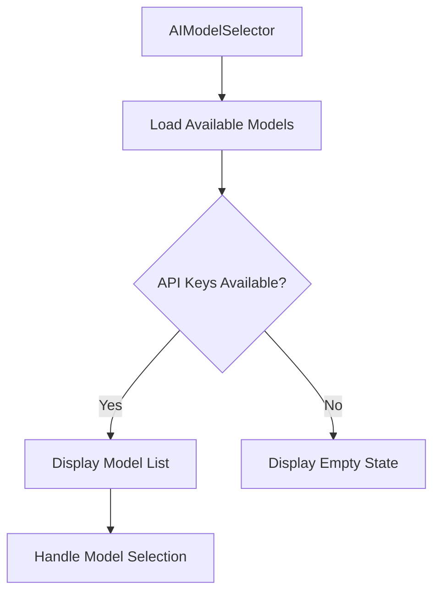

# AIModelSelector Component

The AIModelSelector component allows users to select from available AI models for malware analysis.

## Table of Contents

- [Overview](#overview)
- [Component Structure](#component-structure)
- [Props](#props)
- [State](#state)
- [Key Functions](#key-functions)
- [Rendering Logic](#rendering-logic)
- [Styling](#styling)
- [Usage Example](#usage-example)

## Overview

The AIModelSelector component is responsible for:

1. Loading available AI models based on configured API keys
2. Displaying a list of available models to the user
3. Allowing the user to select a model for analysis
4. Handling loading and error states



## Component Structure

The AIModelSelector component is structured as follows:

```jsx
export const AIModelSelector: React.FC<AIModelSelectorProps> = ({ onModelSelect }) => {
  // State hooks
  const [loading, setLoading] = useState(true);
  const [availableModels, setAvailableModels] = useState<AIModel[]>([]);
  const [error, setError] = useState<string | null>(null);
  
  // Store hooks
  const { aiModels, selectedModelId, selectAIModel } = useAppStore(...);
  
  // Effects
  useEffect(() => {
    loadAvailableModels();
  }, [aiModels]);
  
  // Functions
  const loadAvailableModels = async () => {...};
  const handleModelSelect = (model: AIModel) => {...};
  const getModelIcon = (type: string) => {...};
  
  // Render logic
  if (loading) {
    return <LoadingView />;
  }
  
  if (error) {
    return <ErrorView />;
  }
  
  if (availableModels.length === 0) {
    return <EmptyView />;
  }
  
  return <ModelListView />;
};
```

## Props

| Prop | Type | Description |
|------|------|-------------|
| `onModelSelect` | `(model: AIModel) => void` | Callback function that is called when a model is selected |

## State

The component maintains the following state:

| State | Type | Description |
|-------|------|-------------|
| `loading` | `boolean` | Indicates whether the component is loading available models |
| `availableModels` | `AIModel[]` | List of available AI models |
| `error` | `string \| null` | Error message if loading models fails |

Additionally, the component uses the following state from the global store:

| Store State | Type | Description |
|-------------|------|-------------|
| `aiModels` | `AIModel[]` | List of all configured AI models |
| `selectedModelId` | `string \| null` | ID of the currently selected model |
| `selectAIModel` | `(id: string \| null) => void` | Function to update the selected model ID |

## Key Functions

### `loadAvailableModels`

```typescript
const loadAvailableModels = async () => {
  try {
    setLoading(true);
    setError(null);
    
    // Check for API keys using environment variables and service functions
    let hasOpenAIKey = false;
    let hasClaudeKey = false;
    let hasDeepSeekKey = false;
    
    // First check environment variables
    if (OPENAI_API_KEY) {
      hasOpenAIKey = true;
    }
    
    if (CLAUDE_API_KEY) {
      hasClaudeKey = true;
    }
    
    if (DEEPSEEK_API_KEY) {
      hasDeepSeekKey = true;
    }
    
    // If not found in environment variables, check using service functions
    if (!hasOpenAIKey) {
      hasOpenAIKey = await openaiService.hasOpenAIApiKey();
    }
    
    if (!hasClaudeKey) {
      hasClaudeKey = await claudeService.hasClaudeApiKey();
    }
    
    if (!hasDeepSeekKey) {
      hasDeepSeekKey = await deepseekService.hasDeepSeekApiKey();
    }
    
    // Add models based on available API keys
    const availableModels: AIModel[] = [];
    
    // Add OpenAI models if API key exists
    if (hasOpenAIKey) {
      const openaiModels = aiModels.filter(model => model.type === 'openai');
      availableModels.push(...openaiModels);
    }
    
    // Add Claude models if API key exists
    if (hasClaudeKey) {
      const claudeModels = aiModels.filter(model => model.type === 'claude');
      availableModels.push(...claudeModels);
    }
    
    // Add DeepSeek models if API key exists
    if (hasDeepSeekKey) {
      const deepseekModels = aiModels.filter(model => model.type === 'deepseek');
      availableModels.push(...deepseekModels);
    }
    
    // If no models are available, try to use the service functions as a fallback
    if (availableModels.length === 0) {
      const serviceModels = await analysisService.getAvailableModels();
      availableModels.push(...serviceModels);
    }
    
    setAvailableModels(availableModels);
    
    // If no model is selected and we have available models, select the first one
    if (!selectedModelId && availableModels.length > 0) {
      selectAIModel(availableModels[0].id);
      onModelSelect(availableModels[0]);
    } else if (selectedModelId) {
      // If a model is already selected, make sure it's in the available models
      const selectedModel = availableModels.find((model: AIModel) => model.id === selectedModelId);
      if (selectedModel) {
        onModelSelect(selectedModel);
      } else if (availableModels.length > 0) {
        // If the selected model is not available, select the first available one
        selectAIModel(availableModels[0].id);
        onModelSelect(availableModels[0]);
      }
    }
  } catch (error) {
    console.error('Error loading available models:', error);
    setError('Failed to load available AI models. Please check your API keys in settings.');
  } finally {
    setLoading(false);
  }
};
```

### `handleModelSelect`

```typescript
const handleModelSelect = (model: AIModel) => {
  selectAIModel(model.id);
  onModelSelect(model);
};
```

### `getModelIcon`

```typescript
const getModelIcon = (type: string) => {
  switch (type) {
    case 'openai':
      return 'openai'; // Special case for OpenAI
    case 'claude':
      return 'person.circle';
    case 'deepseek':
      return 'magnifyingglass.circle';
    case 'local':
      return 'desktopcomputer';
    default:
      return 'questionmark.circle';
  }
};
```

## Rendering Logic

The component renders different views based on its state:

### Loading State

```jsx
<ThemedView style={styles.loadingContainer}>
  <ActivityIndicator size="large" color={Colors[colorScheme ?? 'light'].tint} />
  <ThemedText style={styles.loadingText}>Loading AI models...</ThemedText>
</ThemedView>
```

### Error State

```jsx
<ThemedView style={styles.errorContainer}>
  <IconSymbol name="exclamationmark.triangle" size={24} color="#FF6B6B" />
  <ThemedText style={styles.errorText}>{error}</ThemedText>
  <TouchableOpacity style={styles.retryButton} onPress={loadAvailableModels}>
    <ThemedText style={styles.retryButtonText}>Retry</ThemedText>
  </TouchableOpacity>
</ThemedView>
```

### Empty State

```jsx
<ThemedView style={styles.emptyContainer}>
  <AiFillRobot size={24} color="#4A90E2" />
  <ThemedText style={styles.emptyText}>
    No AI models available. Please add API keys in settings.
  </ThemedText>
</ThemedView>
```

### Model List

```jsx
<ThemedView style={styles.container}>
  <View style={styles.headerContainer}>
    <ThemedText style={styles.title}>Select AI Model</ThemedText>
    <TouchableOpacity 
      style={styles.refreshButton} 
      onPress={loadAvailableModels}
    >
      <IconSymbol name="arrow.clockwise" size={20} color={Colors[colorScheme ?? 'light'].text} />
    </TouchableOpacity>
  </View>
  <ScrollView style={styles.modelList}>
    {availableModels.map(model => (
      <TouchableOpacity
        key={model.id}
        style={[
          styles.modelItem,
          selectedModelId === model.id && styles.selectedModelItem,
        ]}
        onPress={() => handleModelSelect(model)}
      >
        <View style={styles.modelIconContainer}>
          {/* Model icon based on type */}
        </View>
        <View style={styles.modelInfo}>
          <ThemedText style={styles.modelName}>{model.name}</ThemedText>
          <ThemedText style={styles.modelDescription}>
            {model.isLocal ? 'Local Model' : 'Hosted Model'}
          </ThemedText>
        </View>
        {selectedModelId === model.id && (
          <IconSymbol name="checkmark.circle.fill" size={24} color="#FFFFFF" />
        )}
      </TouchableOpacity>
    ))}
  </ScrollView>
</ThemedView>
```

## Styling

The component uses a StyleSheet for styling:

```javascript
const styles = StyleSheet.create({
  container: {
    marginVertical: 10,
    borderRadius: 8,
    padding: 10,
  },
  headerContainer: {
    flexDirection: 'row',
    justifyContent: 'space-between',
    alignItems: 'center',
    marginBottom: 10,
  },
  title: {
    fontSize: 18,
    fontWeight: 'bold',
  },
  refreshButton: {
    padding: 5,
    borderRadius: 15,
    backgroundColor: '#F0F0F0',
    justifyContent: 'center',
    alignItems: 'center',
  },
  modelList: {
    maxHeight: 300,
  },
  modelItem: {
    flexDirection: 'row',
    alignItems: 'center',
    padding: 12,
    borderRadius: 8,
    marginBottom: 8,
    backgroundColor: '#F0F0F0',
  },
  selectedModelItem: {
    backgroundColor: '#4A90E2',
  },
  modelIconContainer: {
    width: 40,
    height: 40,
    borderRadius: 20,
    justifyContent: 'center',
    alignItems: 'center',
    marginRight: 10,
    backgroundColor: '#d76e8b',
  },
  modelInfo: {
    flex: 1,
  },
  modelName: {
    fontSize: 16,
    fontWeight: 'bold',
  },
  modelDescription: {
    fontSize: 14,
    opacity: 0.7,
  },
  selectedModelText: {
    color: '#000',
  },
  loadingContainer: {
    padding: 20,
    alignItems: 'center',
    justifyContent: 'center',
  },
  loadingText: {
    marginTop: 10,
    fontSize: 16,
  },
  errorContainer: {
    padding: 20,
    alignItems: 'center',
    justifyContent: 'center',
    backgroundColor: '#000',
    borderRadius: 8,
  },
  errorText: {
    marginTop: 10,
    fontSize: 16,
    color: '#FF6B6B',
    textAlign: 'center',
  },
  retryButton: {
    marginTop: 15,
    paddingVertical: 8,
    paddingHorizontal: 16,
    backgroundColor: '#4A90E2',
    borderRadius: 4,
  },
  retryButtonText: {
    color: '#FFFFFF',
    fontWeight: 'bold',
  },
  emptyContainer: {
    padding: 20,
    alignItems: 'center',
    justifyContent: 'center',
    backgroundColor: '#F0F8FF',
    borderRadius: 8,
  },
  emptyText: {
    marginTop: 10,
    fontSize: 16,
    textAlign: 'center',
    color: '#000000',
  },
});
```

## Usage Example

```jsx
import { AIModelSelector } from '@/components/AIModelSelector';
import { AIModel } from '@/types';

export default function HomeScreen() {
  const [selectedModel, setSelectedModel] = useState<AIModel | null>(null);
  
  const handleModelSelect = (model: AIModel) => {
    setSelectedModel(model);
  };
  
  return (
    <View style={styles.container}>
      <AIModelSelector onModelSelect={handleModelSelect} />
      
      {selectedModel && (
        <Text>Selected Model: {selectedModel.name}</Text>
      )}
    </View>
  );
}
