# AIModelSelector Component

> **Update Notice (December 2025):** This documentation references React Native patterns. The current implementation uses SolidJS. See `athena-v2/src/components/solid/providers/AIProviderStatus.tsx` for the actual implementation. Conceptual information (architecture diagrams, data flow) remains valid.

The AIModelSelector component allows users to select from available AI models for malware analysis, featuring intelligent failover, health monitoring, and seamless integration with the AI Manager service.

## Table of Contents

- [Overview](#overview)
- [Architecture](#architecture)
- [Component Structure](#component-structure)
- [State Management](#state-management)
- [AI Manager Integration](#ai-manager-integration)
- [Props and Events](#props-and-events)
- [Provider Selection Logic](#provider-selection-logic)
- [Rendering States](#rendering-states)
- [Styling](#styling)
- [Usage Example](#usage-example)
- [Related Documentation](#related-documentation)

## Overview

The AIModelSelector component is responsible for:

1. Loading available AI models based on configured API keys
2. Displaying a list of available models to the user
3. Allowing the user to select a model for analysis
4. Handling loading and error states
5. Integrating with the AI Manager for provider health monitoring
6. Supporting automatic failover and circuit breaker patterns

```mermaid
%%{init: {
  'theme': 'base',
  'themeVariables': {
    'primaryColor': '#6d105a',
    'primaryTextColor': '#ffffff',
    'primaryBorderColor': '#ffffff',
    'lineColor': '#333333',
    'secondaryColor': '#e8f4d4',
    'secondaryTextColor': '#333333',
    'secondaryBorderColor': '#333333',
    'tertiaryColor': '#f9d0c4',
    'tertiaryTextColor': '#333333',
    'tertiaryBorderColor': '#333333',
    'background': '#ffffff',
    'mainBkg': '#6d105a',
    'secondBkg': '#e8f4d4',
    'tertiaryBkg': '#f9d0c4',
    'textColor': '#333333',
    'fontFamily': 'Arial, sans-serif'
  }
}}%%
graph TD
    subgraph "AIModelSelector Component"
        A[AIModelSelector<br/>━━━━━━━━<br/>• Model Loading<br/>• Selection UI<br/>• Error Handling]
    end
    
    subgraph "Environment Configuration"
        B[Environment Config<br/>━━━━━━━━<br/>• API Keys<br/>• Provider Status<br/>• Feature Flags]
    end
    
    subgraph "State Management"
        C[SolidJS Store<br/>━━━━━━━━<br/>• AI Models List<br/>• Selected Model<br/>• Update Actions]
    end
    
    subgraph "AI Services"
        D[AI Manager<br/>━━━━━━━━<br/>• Provider Health<br/>• Circuit Breakers<br/>• Failover Logic]
        E[Provider Services<br/>━━━━━━━━<br/>• Claude Service<br/>• OpenAI Service<br/>• DeepSeek Service]
    end
    
    A --> B
    A --> C
    A --> D
    D --> E
    
    style A fill:#6d105a,color:#fff
    style B fill:#f9d0c4
    style C fill:#e8f4d4
    style D fill:#f9d0c4
    style E fill:#6d105a,color:#fff
```



## Architecture

### Component Architecture

```mermaid
%%{init: {
  'theme': 'base',
  'themeVariables': {
    'primaryColor': '#6d105a',
    'primaryTextColor': '#ffffff',
    'primaryBorderColor': '#ffffff',
    'lineColor': '#333333',
    'secondaryColor': '#e8f4d4',
    'secondaryTextColor': '#333333',
    'secondaryBorderColor': '#333333',
    'tertiaryColor': '#f9d0c4',
    'tertiaryTextColor': '#333333',
    'tertiaryBorderColor': '#333333',
    'background': '#ffffff',
    'mainBkg': '#6d105a',
    'secondBkg': '#e8f4d4',
    'tertiaryBkg': '#f9d0c4',
    'textColor': '#333333',
    'fontFamily': 'Arial, sans-serif'
  }
}}%%
graph LR
    subgraph "Component Layer"
        A[AIModelSelector<br/>━━━━━━━━<br/>• SolidJS Component<br/>• UI Rendering<br/>• Event Handling]
    end
    
    subgraph "Hook Layer"
        B[useAppStore<br/>━━━━━━━━<br/>• Model State<br/>• Selection State<br/>• Actions]
        C[useColorScheme<br/>━━━━━━━━<br/>• Theme Support<br/>• Dark/Light Mode]
    end
    
    subgraph "Service Layer"
        D[Analysis Service<br/>━━━━━━━━<br/>• getAvailableModels()<br/>• Model Validation]
        E[Provider Services<br/>━━━━━━━━<br/>• hasValidApiKey()<br/>• Health Checks]
    end
    
    subgraph "Configuration Layer"
        F[Environment<br/>━━━━━━━━<br/>• API Key Config<br/>• Provider Enable<br/>• Base URLs]
    end
    
    A --> B
    A --> C
    A --> D
    A --> E
    D --> E
    E --> F
    
    style A fill:#6d105a,color:#fff
    style B fill:#e8f4d4
    style C fill:#e8f4d4
    style D fill:#f9d0c4
    style E fill:#f9d0c4
    style F fill:#f9d0c4
```

## Component Structure

The AIModelSelector component is structured as follows:

### Component Lifecycle


### Component Hierarchy

```mermaid
%%{init: {
  'theme': 'base',
  'themeVariables': {
    'primaryColor': '#6d105a',
    'primaryTextColor': '#ffffff',
    'primaryBorderColor': '#ffffff',
    'lineColor': '#333333',
    'secondaryColor': '#e8f4d4',
    'secondaryTextColor': '#333333',
    'secondaryBorderColor': '#333333',
    'tertiaryColor': '#f9d0c4',
    'tertiaryTextColor': '#333333',
    'tertiaryBorderColor': '#333333',
    'background': '#ffffff',
    'mainBkg': '#6d105a',
    'secondBkg': '#e8f4d4',
    'tertiaryBkg': '#f9d0c4',
    'textColor': '#333333',
    'fontFamily': 'Arial, sans-serif'
  }
}}%%
graph TD
    subgraph "AIModelSelector Component"
        A[Component Root]
        
        subgraph "State Management"
            B[Local State<br/>━━━━━━━━<br/>• loading: boolean<br/>• availableModels: AIModel[]<br/>• error: string | null]
            C[Store State<br/>━━━━━━━━<br/>• aiModels: AIModel[]<br/>• selectedModelId: string<br/>• selectAIModel: Function]
        end
        
        subgraph "Conditional Rendering"
            D{State Check}
            E[LoadingView<br/>━━━━━━━━<br/>• ActivityIndicator<br/>• Loading Text]
            F[ErrorView<br/>━━━━━━━━<br/>• Error Icon<br/>• Error Message<br/>• Retry Button]
            G[EmptyView<br/>━━━━━━━━<br/>• Robot Icon<br/>• Empty Message<br/>• Settings Link]
            H[ModelListView<br/>━━━━━━━━<br/>• Model List<br/>• Selection UI<br/>• Refresh Button]
        end
        
        A --> B
        A --> C
        B --> D
        C --> D
        D -->|loading| E
        D -->|error| F
        D -->|no models| G
        D -->|models exist| H
    end
    
    style A fill:#6d105a,color:#fff
    style B fill:#f9d0c4
    style C fill:#e8f4d4
    style E fill:#f9d0c4
    style F fill:#f9d0c4
    style G fill:#f9d0c4
    style H fill:#e8f4d4
```

## State Management

### State Flow Diagram


## AI Manager Integration

### Provider Health Monitoring

```mermaid
%%{init: {
  'theme': 'base',
  'themeVariables': {
    'primaryColor': '#6d105a',
    'primaryTextColor': '#ffffff',
    'primaryBorderColor': '#ffffff',
    'lineColor': '#333333',
    'secondaryColor': '#e8f4d4',
    'secondaryTextColor': '#333333',
    'secondaryBorderColor': '#333333',
    'tertiaryColor': '#f9d0c4',
    'tertiaryTextColor': '#333333',
    'tertiaryBorderColor': '#333333',
    'background': '#ffffff',
    'mainBkg': '#6d105a',
    'secondBkg': '#e8f4d4',
    'tertiaryBkg': '#f9d0c4',
    'textColor': '#333333',
    'fontFamily': 'Arial, sans-serif'
  }
}}%%
graph TB
    subgraph "AI Manager Service"
        A[AI Manager<br/>━━━━━━━━<br/>• Provider Registry<br/>• Health Monitoring<br/>• Circuit Breakers]
        
        subgraph "Provider Health"
            B[Claude<br/>━━━━━━━━<br/>Status: healthy<br/>Success: 98%<br/>Avg: 250ms]
            C[OpenAI<br/>━━━━━━━━<br/>Status: degraded<br/>Success: 85%<br/>Avg: 500ms]
            D[DeepSeek<br/>━━━━━━━━<br/>Status: healthy<br/>Success: 95%<br/>Avg: 300ms]
        end
        
        subgraph "Circuit Breakers"
            E[Claude CB<br/>━━━━━━━━<br/>State: Closed<br/>Failures: 0/3]
            F[OpenAI CB<br/>━━━━━━━━<br/>State: Half-Open<br/>Failures: 2/3]
            G[DeepSeek CB<br/>━━━━━━━━<br/>State: Closed<br/>Failures: 0/3]
        end
    end
    
    subgraph "Model Selection Impact"
        H[Available Models<br/>━━━━━━━━<br/>• Filter by health<br/>• Sort by priority<br/>• Show status]
    end
    
    A --> B
    A --> C
    A --> D
    B --> E
    C --> F
    D --> G
    E --> H
    F --> H
    G --> H
    
    style B fill:#e8f4d4
    style C fill:#f9d0c4
    style D fill:#e8f4d4
    style E fill:#e8f4d4
    style F fill:#f9d0c4
    style G fill:#e8f4d4
```



## Props and Events

### Props Flow

```mermaid
%%{init: {
  'theme': 'base',
  'themeVariables': {
    'primaryColor': '#6d105a',
    'primaryTextColor': '#ffffff',
    'primaryBorderColor': '#ffffff',
    'lineColor': '#333333',
    'secondaryColor': '#e8f4d4',
    'secondaryTextColor': '#333333',
    'secondaryBorderColor': '#333333',
    'tertiaryColor': '#f9d0c4',
    'tertiaryTextColor': '#333333',
    'tertiaryBorderColor': '#333333',
    'background': '#ffffff',
    'mainBkg': '#6d105a',
    'secondBkg': '#e8f4d4',
    'tertiaryBkg': '#f9d0c4',
    'textColor': '#333333',
    'fontFamily': 'Arial, sans-serif'
  }
}}%%
graph LR
    subgraph "Parent Component"
        A[Home Screen<br/>━━━━━━━━<br/>• Manages selection<br/>• Triggers analysis]
    end
    
    subgraph "AIModelSelector"
        B[Props<br/>━━━━━━━━<br/>onModelSelect:<br/>(model: AIModel) => void]
        
        C[Internal Events<br/>━━━━━━━━<br/>• Model Click<br/>• Refresh Click<br/>• Retry Click]
        
        D[Callbacks<br/>━━━━━━━━<br/>• handleModelSelect<br/>• loadAvailableModels]
    end
    
    subgraph "Effects"
        E[State Updates<br/>━━━━━━━━<br/>• Store Update<br/>• Parent Callback<br/>• UI Re-render]
    end
    
    A -->|onModelSelect| B
    B --> C
    C --> D
    D --> E
    E -->|Notify| A
    
    style A fill:#6d105a,color:#fff
    style B fill:#f9d0c4
    style C fill:#e8f4d4
    style D fill:#e8f4d4
    style E fill:#f9d0c4
```

## Provider Selection Logic

### Model Filtering Process

```mermaid
%%{init: {
  'theme': 'base',
  'themeVariables': {
    'primaryColor': '#6d105a',
    'primaryTextColor': '#ffffff',
    'primaryBorderColor': '#ffffff',
    'lineColor': '#333333',
    'secondaryColor': '#e8f4d4',
    'secondaryTextColor': '#333333',
    'secondaryBorderColor': '#333333',
    'tertiaryColor': '#f9d0c4',
    'tertiaryTextColor': '#333333',
    'tertiaryBorderColor': '#333333',
    'background': '#ffffff',
    'mainBkg': '#6d105a',
    'secondBkg': '#e8f4d4',
    'tertiaryBkg': '#f9d0c4',
    'textColor': '#333333',
    'fontFamily': 'Arial, sans-serif'
  }
}}%%
flowchart TD
    Start[Start Model Loading]
    
    subgraph "API Key Detection"
        CheckEnv{Check Environment<br/>Configuration}
        CheckService{Check Service<br/>Functions}
        
        EnvKeys[Environment Keys Found<br/>━━━━━━━━<br/>• env.api.openai.enabled<br/>• env.api.claude.enabled<br/>• env.api.deepseek.enabled]
        ServiceKeys[Service Key Check<br/>━━━━━━━━<br/>• hasOpenAIApiKey()<br/>• hasClaudeApiKey()<br/>• hasDeepSeekApiKey()]
    end
    
    subgraph "Model Filtering"
        FilterOpenAI{OpenAI<br/>Key?}
        FilterClaude{Claude<br/>Key?}
        FilterDeepSeek{DeepSeek<br/>Key?}
        
        AddOpenAI[Add OpenAI Models<br/>━━━━━━━━<br/>• GPT-4<br/>• GPT-3.5-Turbo]
        AddClaude[Add Claude Models<br/>━━━━━━━━<br/>• Claude 3 Opus<br/>• Claude 3 Sonnet]
        AddDeepSeek[Add DeepSeek Models<br/>━━━━━━━━<br/>• DeepSeek Coder<br/>• DeepSeek Chat]
    end
    
    subgraph "Fallback"
        CheckEmpty{Models<br/>Empty?}
        ServiceFallback[Get Models from<br/>Analysis Service]
    end
    
    Combine[Combine All<br/>Available Models]
    End[Return Models]
    
    Start --> CheckEnv
    CheckEnv -->|Found| EnvKeys
    CheckEnv -->|Not Found| CheckService
    CheckService --> ServiceKeys
    
    EnvKeys --> FilterOpenAI
    ServiceKeys --> FilterOpenAI
    
    FilterOpenAI -->|Yes| AddOpenAI
    FilterOpenAI -->|No| FilterClaude
    AddOpenAI --> FilterClaude
    
    FilterClaude -->|Yes| AddClaude
    FilterClaude -->|No| FilterDeepSeek
    AddClaude --> FilterDeepSeek
    
    FilterDeepSeek -->|Yes| AddDeepSeek
    FilterDeepSeek -->|No| CheckEmpty
    AddDeepSeek --> CheckEmpty
    
    CheckEmpty -->|Yes| ServiceFallback
    CheckEmpty -->|No| Combine
    ServiceFallback --> Combine
    
    Combine --> End
    
    style Start fill:#6d105a,color:#fff
    style EnvKeys fill:#e8f4d4
    style ServiceKeys fill:#f9d0c4
    style AddOpenAI fill:#e8f4d4
    style AddClaude fill:#e8f4d4
    style AddDeepSeek fill:#e8f4d4
    style ServiceFallback fill:#f9d0c4
    style End fill:#6d105a,color:#fff
```

## Rendering States

### Visual Component States

```mermaid
%%{init: {
  'theme': 'base',
  'themeVariables': {
    'primaryColor': '#6d105a',
    'primaryTextColor': '#ffffff',
    'primaryBorderColor': '#ffffff',
    'lineColor': '#333333',
    'secondaryColor': '#e8f4d4',
    'secondaryTextColor': '#333333',
    'secondaryBorderColor': '#333333',
    'tertiaryColor': '#f9d0c4',
    'tertiaryTextColor': '#333333',
    'tertiaryBorderColor': '#333333',
    'background': '#ffffff',
    'mainBkg': '#6d105a',
    'secondBkg': '#e8f4d4',
    'tertiaryBkg': '#f9d0c4',
    'textColor': '#333333',
    'fontFamily': 'Arial, sans-serif'
  }
}}%%
graph TD
    subgraph "Loading State"
        A[LoadingView<br/>━━━━━━━━<br/>🔄 ActivityIndicator<br/>📝 "Loading AI models..."]
    end
    
    subgraph "Error State"
        B[ErrorView<br/>━━━━━━━━<br/>⚠️ Error Icon<br/>📝 Error Message<br/>🔁 Retry Button]
    end
    
    subgraph "Empty State"
        C[EmptyView<br/>━━━━━━━━<br/>🤖 Robot Icon<br/>📝 "No AI models available"<br/>🔗 Settings Link]
    end
    
    subgraph "Model List State"
        D[Header<br/>━━━━━━━━<br/>🔄 Refresh Button]
        
        E[Model Item 1<br/>━━━━━━━━<br/>🟢 OpenAI Icon<br/>📝 GPT-4<br/>✓ Selected]
        
        F[Model Item 2<br/>━━━━━━━━<br/>🔵 Claude Icon<br/>📝 Claude 3 Opus<br/>○ Not Selected]
        
        G[Model Item 3<br/>━━━━━━━━<br/>🟣 DeepSeek Icon<br/>📝 DeepSeek Coder<br/>○ Not Selected]
    end
    
    D --> E
    D --> F
    D --> G
    
    style A fill:#f9d0c4
    style B fill:#f9d0c4
    style C fill:#f9d0c4
    style D fill:#6d105a,color:#fff
    style E fill:#e8f4d4
    style F fill:#6d105a,color:#fff
    style G fill:#6d105a,color:#fff
```

### Mock UI Representation

```mermaid
%%{init: {
  'theme': 'base',
  'themeVariables': {
    'primaryColor': '#6d105a',
    'primaryTextColor': '#ffffff',
    'primaryBorderColor': '#ffffff',
    'lineColor': '#333333',
    'secondaryColor': '#e8f4d4',
    'secondaryTextColor': '#333333',
    'secondaryBorderColor': '#333333',
    'tertiaryColor': '#f9d0c4',
    'tertiaryTextColor': '#333333',
    'tertiaryBorderColor': '#333333',
    'background': '#ffffff',
    'mainBkg': '#6d105a',
    'secondBkg': '#e8f4d4',
    'tertiaryBkg': '#f9d0c4',
    'textColor': '#333333',
    'fontFamily': 'Arial, sans-serif'
  }
}}%%
graph TD
    subgraph "AIModelSelector UI"
        Header["<div style='background:#d76e8b;padding:10px;border-radius:8px 8px 0 0'>
            <span style='float:right;background:#d76e8b;border-radius:50%;padding:5px'>🔄</span>
        </div>"]
        
        Model1["<div style='background:#4A90E2;padding:12px;margin:8px;border-radius:8px;display:flex'>
            <span style='background:#d76e8b;border-radius:50%;padding:8px;margin-right:10px'>🟢</span>
            <div style='flex:1'>
                <strong>GPT-4</strong><br/>
                <small>Hosted Model</small>
            </div>
            <span>✓</span>
        </div>"]
        
        Model2["<div style='background:#F0F0F0;padding:12px;margin:8px;border-radius:8px;display:flex'>
            <span style='background:#d76e8b;border-radius:50%;padding:8px;margin-right:10px'>🔵</span>
            <div style='flex:1'>
                <strong>Claude 3 Opus</strong><br/>
                <small>Hosted Model</small>
            </div>
        </div>"]
        
        Model3["<div style='background:#F0F0F0;padding:12px;margin:8px;border-radius:8px;display:flex'>
            <span style='background:#d76e8b;border-radius:50%;padding:8px;margin-right:10px'>🟣</span>
            <div style='flex:1'>
                <strong>DeepSeek Coder</strong><br/>
                <small>Hosted Model</small>
            </div>
        </div>"]
        
        Container["<div style='background:#f9f9f9;border-radius:8px;border:1px solid #ddd'>"]
    end
    
    Container --> Header
    Container --> Model1
    Container --> Model2
    Container --> Model3
```



## Key Functions

### `loadAvailableModels`

```typescript
const loadAvailableModels = async () => {
  try {
    setLoading(true);
    setError(null);
    
    // Check for API keys using environment variables and service functions
    let hasOpenAIKey = false;
    let hasClaudeKey = false;
    let hasDeepSeekKey = false;
    
    // First check environment variables
    if (OPENAI_API_KEY) {
      hasOpenAIKey = true;
    }
    
    if (CLAUDE_API_KEY) {
      hasClaudeKey = true;
    }
    
    if (DEEPSEEK_API_KEY) {
      hasDeepSeekKey = true;
    }
    
    // If not found in environment variables, check using service functions
    if (!hasOpenAIKey) {
      hasOpenAIKey = await openaiService.hasOpenAIApiKey();
    }
    
    if (!hasClaudeKey) {
      hasClaudeKey = await claudeService.hasClaudeApiKey();
    }
    
    if (!hasDeepSeekKey) {
      hasDeepSeekKey = await deepseekService.hasDeepSeekApiKey();
    }
    
    // Add models based on available API keys
    const availableModels: AIModel[] = [];
    
    // Add OpenAI models if API key exists
    if (hasOpenAIKey) {
      const openaiModels = aiModels.filter(model => model.type === 'openai');
      availableModels.push(...openaiModels);
    }
    
    // Add Claude models if API key exists
    if (hasClaudeKey) {
      const claudeModels = aiModels.filter(model => model.type === 'claude');
      availableModels.push(...claudeModels);
    }
    
    // Add DeepSeek models if API key exists
    if (hasDeepSeekKey) {
      const deepseekModels = aiModels.filter(model => model.type === 'deepseek');
      availableModels.push(...deepseekModels);
    }
    
    // If no models are available, try to use the service functions as a fallback
    if (availableModels.length === 0) {
      const serviceModels = await analysisService.getAvailableModels();
      availableModels.push(...serviceModels);
    }
    
    setAvailableModels(availableModels);
    
    // If no model is selected and we have available models, select the first one
    if (!selectedModelId && availableModels.length > 0) {
      selectAIModel(availableModels[0].id);
      onModelSelect(availableModels[0]);
    } else if (selectedModelId) {
      // If a model is already selected, make sure it's in the available models
      const selectedModel = availableModels.find((model: AIModel) => model.id === selectedModelId);
      if (selectedModel) {
        onModelSelect(selectedModel);
      } else if (availableModels.length > 0) {
        // If the selected model is not available, select the first available one
        selectAIModel(availableModels[0].id);
        onModelSelect(availableModels[0]);
      }
    }
  } catch (error) {
    console.error('Error loading available models:', error);
    setError('Failed to load available AI models. Please check your API keys in settings.');
  } finally {
    setLoading(false);
  }
};
```

### `handleModelSelect`

```typescript
const handleModelSelect = (model: AIModel) => {
  selectAIModel(model.id);
  onModelSelect(model);
};
```

### `getModelIcon`

```typescript
const getModelIcon = (type: string) => {
  switch (type) {
    case 'openai':
      return 'openai'; // Special case for OpenAI
    case 'claude':
      return 'person.circle';
    case 'deepseek':
      return 'magnifyingglass.circle';
    case 'local':
      return 'desktopcomputer';
    default:
      return 'questionmark.circle';
  }
};
```


## Styling

The component uses a StyleSheet for styling:

```javascript
const styles = StyleSheet.create({
  container: {
    marginVertical: 10,
    borderRadius: 8,
    padding: 10,
  },
  headerContainer: {
    flexDirection: 'row',
    justifyContent: 'space-between',
    alignItems: 'center',
    marginBottom: 10,
  },
  title: {
    fontSize: 18,
    fontWeight: 'bold',
  },
  refreshButton: {
    padding: 5,
    borderRadius: 15,
    backgroundColor: '#F0F0F0',
    justifyContent: 'center',
    alignItems: 'center',
  },
  modelList: {
    maxHeight: 300,
  },
  modelItem: {
    flexDirection: 'row',
    alignItems: 'center',
    padding: 12,
    borderRadius: 8,
    marginBottom: 8,
    backgroundColor: '#F0F0F0',
  },
  selectedModelItem: {
    backgroundColor: '#4A90E2',
  },
  modelIconContainer: {
    width: 40,
    height: 40,
    borderRadius: 20,
    justifyContent: 'center',
    alignItems: 'center',
    marginRight: 10,
    backgroundColor: '#d76e8b',
  },
  modelInfo: {
    flex: 1,
  },
  modelName: {
    fontSize: 16,
    fontWeight: 'bold',
  },
  modelDescription: {
    fontSize: 14,
    opacity: 0.7,
  },
  selectedModelText: {
    color: '#000',
  },
  loadingContainer: {
    padding: 20,
    alignItems: 'center',
    justifyContent: 'center',
  },
  loadingText: {
    marginTop: 10,
    fontSize: 16,
  },
  errorContainer: {
    padding: 20,
    alignItems: 'center',
    justifyContent: 'center',
    backgroundColor: '#000',
    borderRadius: 8,
  },
  errorText: {
    marginTop: 10,
    fontSize: 16,
    color: '#FF6B6B',
    textAlign: 'center',
  },
  retryButton: {
    marginTop: 15,
    paddingVertical: 8,
    paddingHorizontal: 16,
    backgroundColor: '#4A90E2',
    borderRadius: 4,
  },
  retryButtonText: {
    color: '#FFFFFF',
    fontWeight: 'bold',
  },
  emptyContainer: {
    padding: 20,
    alignItems: 'center',
    justifyContent: 'center',
    backgroundColor: '#F0F8FF',
    borderRadius: 8,
  },
  emptyText: {
    marginTop: 10,
    fontSize: 16,
    textAlign: 'center',
    color: '#000000',
  },
});
```

## Usage Example

```jsx
import { AIModelSelector } from '@/components/AIModelSelector';
import { AIModel } from '@/types';

export default function HomeScreen() {
  const [selectedModel, setSelectedModel] = useState<AIModel | null>(null);
  
  const handleModelSelect = (model: AIModel) => {
    setSelectedModel(model);
    // Trigger analysis or other actions with selected model
    console.log('Selected AI model:', model.name);
  };
  
  return (
    <View style={styles.container}>
      <AIModelSelector onModelSelect={handleModelSelect} />
      
      {selectedModel && (
        <View style={styles.selectionInfo}>
          <Text>Selected Model: {selectedModel.name}</Text>
          <Text>Type: {selectedModel.type}</Text>
          <Text>Status: {selectedModel.isLocal ? 'Local' : 'Hosted'}</Text>
        </View>
      )}
    </View>
  );
}
```

## Related Documentation

- [Architecture Overview](../ARCHITECTURE.md) - System-wide architecture and design patterns
- [API Integration](../API_INTEGRATION.md) - API layer and service integration details
- [Getting Started](../GETTING_STARTED.md) - Setup and configuration guide
- [User Guide](../USER_GUIDE.md) - End-user documentation
- [Performance Guide](../performance/PHASE_8_OPTIMIZATION_GUIDE.md) - Performance optimization strategies
- [Circuit Breaker Pattern](../performance/ADAPTIVE_CIRCUIT_BREAKER.md) - Resilience patterns used
