# Analysis Options Panel

> **Update Notice (December 2025):** This documentation references React Native patterns. The current implementation uses SolidJS. See `athena-v2/src/components/solid/analysis/` for the actual implementation. Conceptual information (architecture diagrams, data flow) remains valid.

The Analysis Options Panel is a UI component that allows users to configure various options for malware analysis. This component provides a streamlined interface for setting up analysis parameters, with mandatory container isolation for enhanced security.

## Component Architecture

```mermaid
%%{init: {
  'theme': 'base',
  'themeVariables': {
    'primaryColor': '#6d105a',
    'primaryTextColor': '#ffffff',
    'primaryBorderColor': '#ffffff',
    'lineColor': '#333333',
    'secondaryColor': '#e8f4d4',
    'secondaryTextColor': '#333333',
    'secondaryBorderColor': '#333333',
    'tertiaryColor': '#f9d0c4',
    'tertiaryTextColor': '#333333',
    'tertiaryBorderColor': '#333333',
    'background': '#ffffff',
    'mainBkg': '#6d105a',
    'secondBkg': '#e8f4d4',
    'tertiaryBkg': '#f9d0c4',
    'textColor': '#333333',
    'fontFamily': 'Arial, sans-serif'
  }
}}%%
graph TB
    subgraph "Analysis Options Panel"
        AOP[AnalysisOptionsPanel<br/>━━━━━━━━<br/>• State Management<br/>• Option Updates<br/>• Change Callbacks]
        
        subgraph "Container Section"
            CC[ContainerConfigSelector<br/>━━━━━━━━<br/>• OS Selection<br/>• Architecture<br/>• Resources]
        end
        
        subgraph "Analysis Options"
            DA[Deep Analysis<br/>━━━━━━━━<br/>• Toggle Switch<br/>• Behavior Monitoring]
            SR[Save Results<br/>━━━━━━━━<br/>• Toggle Switch<br/>• Database Storage]
        end
    end
    
    subgraph "External Integration"
        CS[Container Service<br/>━━━━━━━━<br/>• Resource Presets<br/>• Configuration]
        DB[Database<br/>━━━━━━━━<br/>• Results Storage<br/>• History Tracking]
        AS[Analysis Service<br/>━━━━━━━━<br/>• Deep Analysis<br/>• Processing]
    end
    
    AOP --> CC
    AOP --> DA
    AOP --> SR
    
    CC -.-> CS
    SR -.-> DB
    DA -.-> AS
    
    style AOP fill:#6d105a,color:#fff
    style CC fill:#e8f4d4
    style DA fill:#f9d0c4
    style SR fill:#e8f4d4
    style CS fill:#6d105a,color:#fff
    style DB fill:#6d105a,color:#fff
    style AS fill:#6d105a,color:#fff
```



## State Management Flow


## Features

- **Mandatory Container Isolation**: Always enabled for enhanced security
- **Container Configuration**: Full control over OS, architecture, and resources
- **Deep Analysis Toggle**: Enable thorough behavior monitoring
- **Save Results Toggle**: Store analysis results for future reference

## Usage

### Basic Usage

```tsx
import React from 'react';
import { View } from 'react-native';
import AnalysisOptionsPanel, { AnalysisOptions } from '@/components/AnalysisOptionsPanel';

const MyComponent = () => {
  const handleOptionsChange = (options: AnalysisOptions) => {
    console.log('Analysis options updated:', options);
    // Container config, deep analysis, and save results settings
  };

  return (
    <View style={{ flex: 1 }}>
      <AnalysisOptionsPanel onOptionsChange={handleOptionsChange} />
    </View>
  );
};
```

### With Initial Options

```tsx
import React from 'react';
import { View } from 'react-native';
import AnalysisOptionsPanel, { AnalysisOptions } from '@/components/AnalysisOptionsPanel';
import { getResourcePreset } from '@/services/container';

const MyComponent = () => {
  // Define initial options
  const initialOptions: Partial<AnalysisOptions> = {
    containerConfig: {
      os: 'linux',
      architecture: 'x64',
      version: 'ubuntu-22.04',
      distribution: 'ubuntu',
      resources: getResourcePreset('performance')
    },
    deepAnalysis: true,
    saveResults: false
  };

  const handleOptionsChange = (options: AnalysisOptions) => {
    console.log('Analysis options updated:', options);
    // Handle the updated configuration
  };

  return (
    <View style={{ flex: 1 }}>
      <AnalysisOptionsPanel 
        onOptionsChange={handleOptionsChange}
        initialOptions={initialOptions}
      />
    </View>
  );
};
```

## Props

| Prop | Type | Required | Description |
|------|------|----------|-------------|
| `onOptionsChange` | `(options: AnalysisOptions) => void` | Yes | Callback function that is called when any analysis option changes |
| `initialOptions` | `Partial<AnalysisOptions>` | No | Initial analysis options |

## AnalysisOptions Interface

The `AnalysisOptions` interface defines the structure of the analysis options:

```typescript
interface AnalysisOptions {
  containerConfig: ContainerConfig;
  deepAnalysis: boolean;
  saveResults: boolean;
}
```

Note: Container isolation is always enabled in the modernized architecture, and AI model selection is now handled by the AI Manager service.

### Default Options

If no initial options are provided, the component uses the following default options:

```typescript
const DEFAULT_OPTIONS: AnalysisOptions = {
  containerConfig: {
    os: 'windows',
    architecture: 'x64',
    version: 'windows-10',
    resources: getResourcePreset('standard')
  },
  deepAnalysis: false,
  saveResults: true
};
```

## Data Flow Diagram


## Container Configuration

The component always displays a `ContainerConfigSelector` component that allows users to configure the container settings. Container isolation is mandatory for security. See the [ContainerConfigSelector](./CONTAINER_CONFIG_SELECTOR.md) documentation for more details.

## Deep Analysis

The deep analysis option enables more thorough analysis with detailed behavior monitoring. This takes longer but provides more comprehensive results.

## Save Results

The save results option allows users to store analysis results in the database for future reference.

## Example

See the `analysis-options-example.tsx` file for a complete example of how to use the Analysis Options Panel in a screen:

```tsx
import React, { useState } from 'react';
import { View, StyleSheet, ScrollView, Button, Alert } from 'react-native';
import { ThemedText } from '../components/ThemedText';
import { ThemedView } from '../components/ThemedView';
import AnalysisOptionsPanel, { AnalysisOptions } from '../components/AnalysisOptionsPanel';
import { getResourcePreset } from '../services/container';

const AnalysisOptionsExample = () => {
  // Initial options with partial configuration
  const initialOptions: Partial<AnalysisOptions> = {
    containerConfig: {
      os: 'windows',
      architecture: 'x64',
      version: 'windows-10',
      resources: getResourcePreset('standard')
    },
    deepAnalysis: false,
    saveResults: true
  };
  
  // State to store the current options
  const [options, setOptions] = useState<AnalysisOptions | null>(null);
  
  // Handle options changes
  const handleOptionsChange = (newOptions: AnalysisOptions) => {
    setOptions(newOptions);
    console.log('Options updated:', newOptions);
  };
  
  // Handle analysis start
  const handleStartAnalysis = () => {
    if (!options) return;
    
    Alert.alert(
      'Analysis Configuration',
      `Starting analysis with the following configuration:
      
Container Environment: Always Isolated
OS: ${options.containerConfig.os}
Architecture: ${options.containerConfig.architecture}
Version: ${options.containerConfig.version}
Deep Analysis: ${options.deepAnalysis ? 'Enabled' : 'Disabled'}
Save Results: ${options.saveResults ? 'Yes' : 'No'}
CPU Cores: ${options.containerConfig.resources?.cpu || 'Default'}
Memory: ${options.containerConfig.resources?.memory || 'Default'} MB
Disk Space: ${options.containerConfig.resources?.diskSpace || 'Default'} MB
Network Speed: ${options.containerConfig.resources?.networkSpeed || 'Default'} Mbps
I/O Operations: ${options.containerConfig.resources?.ioOperations || 'Default'} IOPS`,
      [
        { text: 'Cancel', style: 'cancel' },
        { text: 'Start Analysis', onPress: () => console.log('Analysis started with options:', options) }
      ]
    );
  };
  
  return (
    <ThemedView style={styles.container}>
      <ScrollView style={styles.scrollView}>
        <ThemedText style={styles.title}>Analysis Options</ThemedText>
        
        <ThemedText style={styles.description}>
          Configure the analysis options below. Container isolation is always 
          enabled for enhanced security. Select the container configuration 
          and set additional analysis options.
        </ThemedText>
        
        <AnalysisOptionsPanel
          onOptionsChange={handleOptionsChange}
          initialOptions={initialOptions}
        />
        
        <View style={styles.buttonContainer}>
          <Button
            title="Start Analysis"
            onPress={handleStartAnalysis}
            color="#0a7ea4"
          />
        </View>
      </ScrollView>
    </ThemedView>
  );
};
```

## Mock UI Representation

```mermaid
%%{init: {
  'theme': 'base',
  'themeVariables': {
    'primaryColor': '#6d105a',
    'primaryTextColor': '#ffffff',
    'primaryBorderColor': '#ffffff',
    'lineColor': '#333333',
    'secondaryColor': '#e8f4d4',
    'secondaryTextColor': '#333333',
    'secondaryBorderColor': '#333333',
    'tertiaryColor': '#f9d0c4',
    'tertiaryTextColor': '#333333',
    'tertiaryBorderColor': '#333333',
    'background': '#ffffff',
    'mainBkg': '#6d105a',
    'secondBkg': '#e8f4d4',
    'tertiaryBkg': '#f9d0c4',
    'textColor': '#333333',
    'fontFamily': 'Arial, sans-serif'
  }
}}%%
graph TB
    subgraph "Analysis Options Panel UI"
        Header["<b>Container Configuration</b><br/>Malware is always analyzed in an isolated container<br/>environment for enhanced security"]
        
        ContainerSection["🖥️ Container Config Selector<br/>━━━━━━━━━━━━━━━━━━━━<br/>OS: Windows 10 x64<br/>Resources: Standard Preset<br/>[Configure →]"]
        
        DeepAnalysis["<b>Deep Analysis</b> &nbsp;&nbsp;&nbsp;&nbsp;&nbsp;&nbsp;&nbsp;&nbsp;&nbsp;&nbsp;&nbsp;&nbsp; [Toggle: OFF]<br/>━━━━━━━━━━━━━━━━━━━━━━━━━━━<br/>Perform more thorough analysis with<br/>detailed behavior monitoring"]
        
        SaveResults["<b>Save Results</b> &nbsp;&nbsp;&nbsp;&nbsp;&nbsp;&nbsp;&nbsp;&nbsp;&nbsp;&nbsp;&nbsp;&nbsp;&nbsp;&nbsp; [Toggle: ON]<br/>━━━━━━━━━━━━━━━━━━━━━━━━━━━<br/>Save analysis results to the database<br/>for future reference"]
    end
    
    Header --> ContainerSection
    ContainerSection --> DeepAnalysis
    DeepAnalysis --> SaveResults
    
    style Header fill:#6d105a,color:#fff
    style ContainerSection fill:#e8f4d4
    style DeepAnalysis fill:#f9d0c4
    style SaveResults fill:#e8f4d4
```



## Option Update Flow

```mermaid
%%{init: {
  'theme': 'base',
  'themeVariables': {
    'primaryColor': '#6d105a',
    'primaryTextColor': '#ffffff',
    'primaryBorderColor': '#ffffff',
    'lineColor': '#333333',
    'secondaryColor': '#e8f4d4',
    'secondaryTextColor': '#333333',
    'secondaryBorderColor': '#333333',
    'tertiaryColor': '#f9d0c4',
    'tertiaryTextColor': '#333333',
    'tertiaryBorderColor': '#333333',
    'background': '#ffffff',
    'mainBkg': '#6d105a',
    'secondBkg': '#e8f4d4',
    'tertiaryBkg': '#f9d0c4',
    'textColor': '#333333',
    'fontFamily': 'Arial, sans-serif'
  }
}}%%
flowchart LR
    subgraph "User Actions"
        UC[Container Change]
        UD[Toggle Deep Analysis]
        US[Toggle Save Results]
    end
    
    subgraph "Component State"
        State[Options State<br/>━━━━━━━━<br/>• containerConfig<br/>• deepAnalysis<br/>• saveResults]
    end
    
    subgraph "Parent Integration"
        CB[onOptionsChange<br/>Callback]
        PC[Parent Component<br/>━━━━━━━━<br/>• Start Analysis<br/>• Update Config]
    end
    
    UC --> State
    UD --> State
    US --> State
    
    State --> CB
    CB --> PC
    
    style UC fill:#6d105a,color:#fff
    style UD fill:#6d105a,color:#fff
    style US fill:#6d105a,color:#fff
    style State fill:#f9d0c4
    style CB fill:#e8f4d4
    style PC fill:#e8f4d4
```



## Integration with Other Components

The Analysis Options Panel is designed to be used in conjunction with other components in the analysis workflow:

1. **ContainerConfigSelector**: Embedded component for configuring container settings
2. **FileUploader**: Use before Analysis Options to upload files for analysis
3. **AnalysisResults**: Use after analysis to display results
4. **Container Service**: Provides resource presets and configuration validation
5. **Analysis Service**: Consumes the options for processing

## Modernization Benefits

The Phase 9 modernization brings several improvements:

- **Simplified State Management**: Removed complex AI model selection logic
- **Enhanced Security**: Container isolation is now mandatory
- **Better Performance**: Optimized re-renders with proper state updates
- **Type Safety**: Full TypeScript support with strict interfaces
- **Consistent Design**: Uses the modernized design system components
