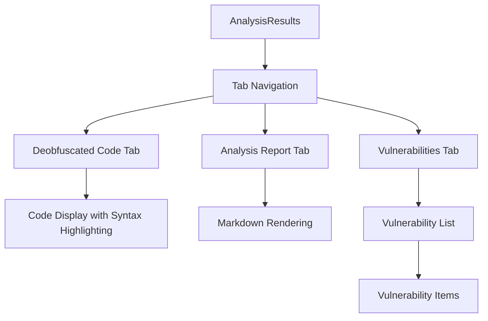

# AnalysisResults Component

The AnalysisResults component displays the results of malware analysis, including deobfuscated code, analysis reports, and detected vulnerabilities.

## Table of Contents

- [Overview](#overview)
- [Component Structure](#component-structure)
- [Props](#props)
- [State](#state)
- [Key Functions](#key-functions)
- [Rendering Logic](#rendering-logic)
- [Styling](#styling)
- [Usage Example](#usage-example)

## Overview

The AnalysisResults component is responsible for:

1. Displaying the results of malware analysis in a tabbed interface
2. Showing deobfuscated code with syntax highlighting
3. Presenting analysis reports in a readable format
4. Listing detected vulnerabilities with severity ratings
5. Handling loading and empty states



## Component Structure

The AnalysisResults component is structured as follows:

```jsx
export const AnalysisResults: React.FC<AnalysisResultsProps> = ({ result, isAnalyzing }) => {
  // State hooks
  const [activeTab, setActiveTab] = useState<'code' | 'report' | 'vulnerabilities'>('code');
  
  // Render logic
  if (isAnalyzing) {
    return <LoadingView />;
  }
  
  if (!result) {
    return <EmptyView />;
  }
  
  return (
    <ThemedView style={styles.container}>
      <TabNavigation />
      <TabContent />
    </ThemedView>
  );
};
```

## Props

| Prop | Type | Description |
|------|------|-------------|
| `result` | `AnalysisResult \| null` | The analysis result to display |
| `isAnalyzing` | `boolean` | Indicates whether analysis is in progress |

## State

The component maintains the following state:

| State | Type | Description |
|-------|------|-------------|
| `activeTab` | `'code' \| 'report' \| 'vulnerabilities'` | The currently active tab |

## Key Functions

### `renderTabContent`

```typescript
const renderTabContent = () => {
  switch (activeTab) {
    case 'code':
      return renderCodeTab();
    case 'report':
      return renderReportTab();
    case 'vulnerabilities':
      return renderVulnerabilitiesTab();
    default:
      return null;
  }
};
```

### `renderCodeTab`

```typescript
const renderCodeTab = () => {
  if (!result?.deobfuscatedCode) {
    return (
      <ThemedView style={styles.emptyTabContent}>
        <ThemedText style={styles.emptyText}>
          No deobfuscated code available.
        </ThemedText>
      </ThemedView>
    );
  }
  
  return (
    <ScrollView style={styles.codeContainer}>
      <ThemedView style={styles.codeBlock}>
        <ThemedText style={styles.codeText}>
          {result.deobfuscatedCode}
        </ThemedText>
      </ThemedView>
    </ScrollView>
  );
};
```

### `renderReportTab`

```typescript
const renderReportTab = () => {
  if (!result?.analysisReport) {
    return (
      <ThemedView style={styles.emptyTabContent}>
        <ThemedText style={styles.emptyText}>
          No analysis report available.
        </ThemedText>
      </ThemedView>
    );
  }
  
  return (
    <ScrollView style={styles.reportContainer}>
      <ThemedView style={styles.reportContent}>
        <ThemedText style={styles.reportText}>
          {result.analysisReport}
        </ThemedText>
      </ThemedView>
    </ScrollView>
  );
};
```

### `renderVulnerabilitiesTab`

```typescript
const renderVulnerabilitiesTab = () => {
  if (!result?.vulnerabilities || result.vulnerabilities.length === 0) {
    return (
      <ThemedView style={styles.emptyTabContent}>
        <ThemedText style={styles.emptyText}>
          No vulnerabilities detected.
        </ThemedText>
      </ThemedView>
    );
  }
  
  return (
    <ScrollView style={styles.vulnerabilitiesContainer}>
      {result.vulnerabilities.map(vulnerability => (
        <VulnerabilityItem
          key={vulnerability.id}
          vulnerability={vulnerability}
        />
      ))}
    </ScrollView>
  );
};
```

### `VulnerabilityItem`

```typescript
const VulnerabilityItem: React.FC<{ vulnerability: Vulnerability }> = ({ vulnerability }) => {
  const getSeverityColor = (severity: string) => {
    switch (severity) {
      case 'critical':
        return '#FF0000';
      case 'high':
        return '#FF6B6B';
      case 'medium':
        return '#FFA500';
      case 'low':
        return '#4CAF50';
      default:
        return '#AAAAAA';
    }
  };
  
  return (
    <ThemedView style={styles.vulnerabilityItem}>
      <View style={styles.vulnerabilityHeader}>
        <ThemedText style={styles.vulnerabilityName}>
          {vulnerability.name}
        </ThemedText>
        <View
          style={[
            styles.severityBadge,
            { backgroundColor: getSeverityColor(vulnerability.severity) },
          ]}
        >
          <ThemedText style={styles.severityText}>
            {vulnerability.severity.toUpperCase()}
          </ThemedText>
        </View>
      </View>
      <ThemedText style={styles.vulnerabilityDescription}>
        {vulnerability.description}
      </ThemedText>
      {vulnerability.cveId && (
        <ThemedText style={styles.vulnerabilityCve}>
          CVE: {vulnerability.cveId}
        </ThemedText>
      )}
      {vulnerability.metasploitModule && (
        <ThemedText style={styles.vulnerabilityMetasploit}>
          Metasploit: {vulnerability.metasploitModule}
        </ThemedText>
      )}
    </ThemedView>
  );
};
```

## Rendering Logic

The component renders different views based on its state:

### Loading State

```jsx
<ThemedView style={styles.loadingContainer}>
  <ActivityIndicator size="large" color={Colors[colorScheme ?? 'light'].tint} />
  <ThemedText style={styles.loadingText}>Analyzing...</ThemedText>
</ThemedView>
```

### Empty State

```jsx
<ThemedView style={styles.emptyContainer}>
  <IconSymbol name="doc.text.magnifyingglass" size={32} color="#AAAAAA" />
  <ThemedText style={styles.emptyText}>
    No analysis results yet. Select a file and an AI model, then click "Analyze" to get started.
  </ThemedText>
</ThemedView>
```

### Tab Navigation

```jsx
<View style={styles.tabBar}>
  <TouchableOpacity
    style={[
      styles.tabButton,
      activeTab === 'code' && styles.activeTabButton,
    ]}
    onPress={() => setActiveTab('code')}
  >
    <ThemedText
      style={[
        styles.tabButtonText,
        activeTab === 'code' && styles.activeTabButtonText,
      ]}
    >
      Deobfuscated Code
    </ThemedText>
  </TouchableOpacity>
  <TouchableOpacity
    style={[
      styles.tabButton,
      activeTab === 'report' && styles.activeTabButton,
    ]}
    onPress={() => setActiveTab('report')}
  >
    <ThemedText
      style={[
        styles.tabButtonText,
        activeTab === 'report' && styles.activeTabButtonText,
      ]}
    >
      Analysis Report
    </ThemedText>
  </TouchableOpacity>
  <TouchableOpacity
    style={[
      styles.tabButton,
      activeTab === 'vulnerabilities' && styles.activeTabButton,
    ]}
    onPress={() => setActiveTab('vulnerabilities')}
  >
    <ThemedText
      style={[
        styles.tabButtonText,
        activeTab === 'vulnerabilities' && styles.activeTabButtonText,
      ]}
    >
      Vulnerabilities
    </ThemedText>
  </TouchableOpacity>
</View>
```

### Tab Content

The tab content is rendered based on the active tab, as described in the key functions section.

## Styling

The component uses a StyleSheet for styling:

```javascript
const styles = StyleSheet.create({
  container: {
    marginVertical: 10,
    borderRadius: 8,
    padding: 10,
  },
  loadingContainer: {
    padding: 20,
    alignItems: 'center',
    justifyContent: 'center',
  },
  loadingText: {
    marginTop: 10,
    fontSize: 16,
  },
  emptyContainer: {
    padding: 20,
    alignItems: 'center',
    justifyContent: 'center',
  },
  emptyText: {
    marginTop: 10,
    fontSize: 16,
    textAlign: 'center',
    color: '#AAAAAA',
  },
  tabBar: {
    flexDirection: 'row',
    marginBottom: 10,
  },
  tabButton: {
    flex: 1,
    paddingVertical: 8,
    alignItems: 'center',
    borderBottomWidth: 2,
    borderBottomColor: 'transparent',
  },
  activeTabButton: {
    borderBottomColor: '#4A90E2',
  },
  tabButtonText: {
    fontSize: 14,
    fontWeight: 'bold',
  },
  activeTabButtonText: {
    color: '#4A90E2',
  },
  emptyTabContent: {
    padding: 20,
    alignItems: 'center',
    justifyContent: 'center',
  },
  codeContainer: {
    maxHeight: 400,
  },
  codeBlock: {
    padding: 10,
    backgroundColor: '#1E1E1E',
    borderRadius: 4,
  },
  codeText: {
    fontFamily: 'monospace',
    fontSize: 12,
    color: '#FFFFFF',
  },
  reportContainer: {
    maxHeight: 400,
  },
  reportContent: {
    padding: 10,
  },
  reportText: {
    fontSize: 14,
    lineHeight: 20,
  },
  vulnerabilitiesContainer: {
    maxHeight: 400,
  },
  vulnerabilityItem: {
    marginBottom: 10,
    padding: 10,
    backgroundColor: '#F0F0F0',
    borderRadius: 4,
  },
  vulnerabilityHeader: {
    flexDirection: 'row',
    justifyContent: 'space-between',
    alignItems: 'center',
    marginBottom: 5,
  },
  vulnerabilityName: {
    fontSize: 16,
    fontWeight: 'bold',
    flex: 1,
  },
  severityBadge: {
    paddingHorizontal: 8,
    paddingVertical: 2,
    borderRadius: 4,
  },
  severityText: {
    fontSize: 12,
    fontWeight: 'bold',
    color: '#FFFFFF',
  },
  vulnerabilityDescription: {
    fontSize: 14,
    marginBottom: 5,
  },
  vulnerabilityCve: {
    fontSize: 12,
    color: '#4A90E2',
    marginBottom: 2,
  },
  vulnerabilityMetasploit: {
    fontSize: 12,
    color: '#4A90E2',
  },
});
```

## Usage Example

```jsx
import { AnalysisResults } from '@/components/AnalysisResults';
import { AnalysisResult } from '@/types';

export default function HomeScreen() {
  const [analysisResult, setAnalysisResult] = useState<AnalysisResult | null>(null);
  const [isAnalyzing, setIsAnalyzing] = useState(false);
  
  const handleAnalyze = async () => {
    try {
      setIsAnalyzing(true);
      
      // Perform analysis...
      const result = await analysisService.runAnalysis(selectedFile, selectedModel);
      
      setAnalysisResult(result);
    } catch (error) {
      console.error('Analysis error:', error);
      Alert.alert('Analysis Error', `Failed to analyze file: ${(error as Error).message}`);
    } finally {
      setIsAnalyzing(false);
    }
  };
  
  return (
    <View style={styles.container}>
      <TouchableOpacity
        style={styles.analyzeButton}
        onPress={handleAnalyze}
        disabled={isAnalyzing}
      >
        <Text style={styles.analyzeButtonText}>
          {isAnalyzing ? 'Analyzing...' : 'Analyze'}
        </Text>
      </TouchableOpacity>
      
      <AnalysisResults
        result={analysisResult}
        isAnalyzing={isAnalyzing}
      />
    </View>
  );
}
