# AnalysisResults Component

The AnalysisResults component provides a sophisticated interface for displaying malware analysis results, featuring tabbed navigation, real-time updates, syntax highlighting, vulnerability visualization, and export functionality.

## Table of Contents

- [Overview](#overview)
- [Architecture](#architecture)
- [Results Rendering Architecture](#results-rendering-architecture)
- [Tab Management Flow](#tab-management-flow)
- [Data Transformation Pipeline](#data-transformation-pipeline)
- [Export Functionality](#export-functionality)
- [Streaming Updates](#streaming-updates)
- [Component Structure](#component-structure)
- [Rendering States](#rendering-states)
- [Styling](#styling)
- [Usage Example](#usage-example)
- [Related Documentation](#related-documentation)

## Overview

The AnalysisResults component is responsible for:

1. Displaying the results of malware analysis in a tabbed interface
2. Showing deobfuscated code with syntax highlighting
3. Presenting analysis reports in a readable format
4. Listing detected vulnerabilities with severity ratings
5. Handling real-time streaming updates
6. Supporting export in multiple formats
7. Providing interactive data visualization
8. Managing loading, error, and empty states


## Architecture

### Component Architecture

```mermaid
%%{init: {
  'theme': 'base',
  'themeVariables': {
    'primaryColor': '#6d105a',
    'primaryTextColor': '#ffffff',
    'primaryBorderColor': '#ffffff',
    'lineColor': '#333333',
    'secondaryColor': '#e8f4d4',
    'secondaryTextColor': '#333333',
    'secondaryBorderColor': '#333333',
    'tertiaryColor': '#f9d0c4',
    'tertiaryTextColor': '#333333',
    'tertiaryBorderColor': '#333333',
    'background': '#ffffff',
    'mainBkg': '#6d105a',
    'secondBkg': '#e8f4d4',
    'tertiaryBkg': '#f9d0c4',
    'textColor': '#333333',
    'fontFamily': 'Arial, sans-serif'
  }
}}%%
graph LR
    subgraph "Component Layer"
        A[AnalysisResults<br/>━━━━━━━━<br/>• React Component<br/>• Tab Controller<br/>• Export Handler]
    end
    
    subgraph "State Management"
        B[Local State<br/>━━━━━━━━<br/>• activeTab<br/>• exportLoading<br/>• streamingData]
        C[Props<br/>━━━━━━━━<br/>• result: AnalysisResult<br/>• isAnalyzing: boolean<br/>• onExport: Function]
    end
    
    subgraph "Sub-Components"
        D[Tab Navigation<br/>━━━━━━━━<br/>• Tab Buttons<br/>• Active Indicator<br/>• Tab Count]
        E[Code Tab<br/>━━━━━━━━<br/>• Syntax Highlighter<br/>• Line Numbers<br/>• Copy Button]
        F[Report Tab<br/>━━━━━━━━<br/>• Markdown Renderer<br/>• Section Navigation<br/>• Summary Cards]
        G[Vulnerabilities Tab<br/>━━━━━━━━<br/>• Severity Filter<br/>• CVE Links<br/>• Exploit Info]
    end
    
    subgraph "Services"
        H[Export Service<br/>━━━━━━━━<br/>• PDF Generation<br/>• JSON Export<br/>• Clipboard API]
        I[Syntax Service<br/>━━━━━━━━<br/>• Language Detection<br/>• Highlighting<br/>• Formatting]
    end
    
    A --> B
    A --> C
    A --> D
    D --> E
    D --> F
    D --> G
    E --> I
    A --> H
    
    style A fill:#6d105a
    style B fill:#f9d0c4
    style C fill:#e8f4d4
    style D fill:#6d105a
    style E fill:#e8f4d4
    style F fill:#e8f4d4
    style G fill:#f9d0c4
    style H fill:#6d105a
    style I fill:#6d105a
```



## Results Rendering Architecture

### Rendering Pipeline

```mermaid
%%{init: {
  'theme': 'base',
  'themeVariables': {
    'primaryColor': '#6d105a',
    'primaryTextColor': '#ffffff',
    'primaryBorderColor': '#ffffff',
    'lineColor': '#333333',
    'secondaryColor': '#e8f4d4',
    'secondaryTextColor': '#333333',
    'secondaryBorderColor': '#333333',
    'tertiaryColor': '#f9d0c4',
    'tertiaryTextColor': '#333333',
    'tertiaryBorderColor': '#333333',
    'background': '#ffffff',
    'mainBkg': '#6d105a',
    'secondBkg': '#e8f4d4',
    'tertiaryBkg': '#f9d0c4',
    'textColor': '#333333',
    'fontFamily': 'Arial, sans-serif'
  }
}}%%
flowchart TD
    Start[Analysis Complete]
    
    subgraph "Data Processing"
        Parse[Parse Results<br/>━━━━━━━━<br/>• JSON Parsing<br/>• Data Validation<br/>• Error Checking]
        
        Transform[Transform Data<br/>━━━━━━━━<br/>• Code Formatting<br/>• Report Structuring<br/>• Vulnerability Mapping]
        
        Enhance[Enhance Display<br/>━━━━━━━━<br/>• Syntax Highlighting<br/>• Markdown Rendering<br/>• Severity Colors]
    end
    
    subgraph "Rendering Layers"
        TabNav[Tab Navigation<br/>━━━━━━━━<br/>• Active Tab State<br/>• Tab Indicators<br/>• Transition Effects]
        
        CodeRender[Code Renderer<br/>━━━━━━━━<br/>• Language Detection<br/>• Line Numbers<br/>• Syntax Colors]
        
        ReportRender[Report Renderer<br/>━━━━━━━━<br/>• Section Headers<br/>• Bullet Points<br/>• Summary Cards]
        
        VulnRender[Vulnerability Renderer<br/>━━━━━━━━<br/>• Severity Badges<br/>• CVE Links<br/>• Exploit Info]
    end
    
    subgraph "User Interface"
        Display[Final Display<br/>━━━━━━━━<br/>• Responsive Layout<br/>• Interactive Elements<br/>• Export Options]
    end
    
    Start --> Parse
    Parse --> Transform
    Transform --> Enhance
    Enhance --> TabNav
    TabNav --> CodeRender
    TabNav --> ReportRender
    TabNav --> VulnRender
    CodeRender --> Display
    ReportRender --> Display
    VulnRender --> Display
    
    style Start fill:#6d105a
    style Parse fill:#f9d0c4
    style Transform fill:#e8f4d4
    style Enhance fill:#6d105a
    style TabNav fill:#6d105a
    style CodeRender fill:#e8f4d4
    style ReportRender fill:#e8f4d4
    style VulnRender fill:#f9d0c4
    style Display fill:#6d105a
```



## Tab Management Flow

### Tab State Machine


### Tab Navigation UI

```mermaid
%%{init: {
  'theme': 'base',
  'themeVariables': {
    'primaryColor': '#6d105a',
    'primaryTextColor': '#ffffff',
    'primaryBorderColor': '#ffffff',
    'lineColor': '#333333',
    'secondaryColor': '#e8f4d4',
    'secondaryTextColor': '#333333',
    'secondaryBorderColor': '#333333',
    'tertiaryColor': '#f9d0c4',
    'tertiaryTextColor': '#333333',
    'tertiaryBorderColor': '#333333',
    'background': '#ffffff',
    'mainBkg': '#6d105a',
    'secondBkg': '#e8f4d4',
    'tertiaryBkg': '#f9d0c4',
    'textColor': '#333333',
    'fontFamily': 'Arial, sans-serif'
  }
}}%%
graph LR
    subgraph "Tab Bar"
        A[Code Tab<br/>━━━━━━━━<br/>📄 Icon<br/>Count: 1250 lines<br/>Active: ✓]
        B[Report Tab<br/>━━━━━━━━<br/>📋 Icon<br/>Sections: 5<br/>Active: ✗]
        C[Vulnerabilities Tab<br/>━━━━━━━━<br/>⚠️ Icon<br/>Count: 12<br/>Active: ✗]
    end
    
    subgraph "Tab Indicators"
        D[Active Indicator<br/>━━━━━━━━<br/>Blue Underline<br/>Bold Text<br/>Scale: 1.05]
        E[Hover State<br/>━━━━━━━━<br/>Background: Light<br/>Cursor: Pointer<br/>Transition: 0.2s]
    end
    
    A --> D
    B --> E
    C --> E
    
    style A fill:#e8f4d4
    style B fill:#6d105a
    style C fill:#6d105a
    style D fill:#e8f4d4
    style E fill:#f9d0c4
```



## Data Transformation Pipeline

### Analysis Data Flow


## Export Functionality

### Export Pipeline

```mermaid
%%{init: {
  'theme': 'base',
  'themeVariables': {
    'primaryColor': '#6d105a',
    'primaryTextColor': '#ffffff',
    'primaryBorderColor': '#ffffff',
    'lineColor': '#333333',
    'secondaryColor': '#e8f4d4',
    'secondaryTextColor': '#333333',
    'secondaryBorderColor': '#333333',
    'tertiaryColor': '#f9d0c4',
    'tertiaryTextColor': '#333333',
    'tertiaryBorderColor': '#333333',
    'background': '#ffffff',
    'mainBkg': '#6d105a',
    'secondBkg': '#e8f4d4',
    'tertiaryBkg': '#f9d0c4',
    'textColor': '#333333',
    'fontFamily': 'Arial, sans-serif'
  }
}}%%
flowchart LR
    subgraph "Export Triggers"
        A[Export Button<br/>━━━━━━━━<br/>• PDF Export<br/>• JSON Export<br/>• Copy Code]
    end
    
    subgraph "Data Preparation"
        B[Gather Data<br/>━━━━━━━━<br/>• Current Tab<br/>• All Results<br/>• Metadata]
        C[Format Data<br/>━━━━━━━━<br/>• PDF Layout<br/>• JSON Structure<br/>• Plain Text]
    end
    
    subgraph "Export Handlers"
        D[PDF Generator<br/>━━━━━━━━<br/>• jsPDF Library<br/>• Page Layout<br/>• Styling]
        E[JSON Exporter<br/>━━━━━━━━<br/>• Stringify<br/>• Pretty Print<br/>• Download]
        F[Clipboard API<br/>━━━━━━━━<br/>• Copy Text<br/>• Format Code<br/>• Feedback]
    end
    
    subgraph "Output"
        G[File Download<br/>━━━━━━━━<br/>• analysis.pdf<br/>• results.json]
        H[Clipboard<br/>━━━━━━━━<br/>• Code Copied<br/>• Toast Shown]
    end
    
    A --> B
    B --> C
    C --> D
    C --> E
    C --> F
    D --> G
    E --> G
    F --> H
    
    style A fill:#6d105a
    style B fill:#f9d0c4
    style C fill:#e8f4d4
    style D fill:#6d105a
    style E fill:#6d105a
    style F fill:#6d105a
    style G fill:#e8f4d4
    style H fill:#e8f4d4
```



## Streaming Updates

### Real-time Update Flow


### Progress Visualization

```mermaid
%%{init: {
  'theme': 'base',
  'themeVariables': {
    'primaryColor': '#6d105a',
    'primaryTextColor': '#ffffff',
    'primaryBorderColor': '#ffffff',
    'lineColor': '#333333',
    'secondaryColor': '#e8f4d4',
    'secondaryTextColor': '#333333',
    'secondaryBorderColor': '#333333',
    'tertiaryColor': '#f9d0c4',
    'tertiaryTextColor': '#333333',
    'tertiaryBorderColor': '#333333',
    'background': '#ffffff',
    'mainBkg': '#6d105a',
    'secondBkg': '#e8f4d4',
    'tertiaryBkg': '#f9d0c4',
    'textColor': '#333333',
    'fontFamily': 'Arial, sans-serif'
  }
}}%%
graph TD
    subgraph "Streaming Progress"
        A[Initial State<br/>━━━━━━━━<br/>0% Complete<br/>⏳ Starting...]
        
        B[Code Analysis<br/>━━━━━━━━<br/>35% Complete<br/>📄 Deobfuscating...]
        
        C[Report Generation<br/>━━━━━━━━<br/>70% Complete<br/>📋 Analyzing patterns...]
        
        D[Vulnerability Scan<br/>━━━━━━━━<br/>90% Complete<br/>🔍 Checking CVEs...]
        
        E[Complete<br/>━━━━━━━━<br/>100% Complete<br/>✅ Analysis done!]
    end
    
    A -->|Stream Update| B
    B -->|Stream Update| C
    C -->|Stream Update| D
    D -->|Stream Complete| E
    
    style A fill:#f9d0c4
    style B fill:#f9d0c4
    style C fill:#f9d0c4
    style D fill:#f9d0c4
    style E fill:#e8f4d4
```



## Rendering States

### Visual Component States

```mermaid
%%{init: {
  'theme': 'base',
  'themeVariables': {
    'primaryColor': '#6d105a',
    'primaryTextColor': '#ffffff',
    'primaryBorderColor': '#ffffff',
    'lineColor': '#333333',
    'secondaryColor': '#e8f4d4',
    'secondaryTextColor': '#333333',
    'secondaryBorderColor': '#333333',
    'tertiaryColor': '#f9d0c4',
    'tertiaryTextColor': '#333333',
    'tertiaryBorderColor': '#333333',
    'background': '#ffffff',
    'mainBkg': '#6d105a',
    'secondBkg': '#e8f4d4',
    'tertiaryBkg': '#f9d0c4',
    'textColor': '#333333',
    'fontFamily': 'Arial, sans-serif'
  }
}}%%
graph TD
    subgraph "Loading State"
        A[LoadingView<br/>━━━━━━━━<br/>🔄 ActivityIndicator<br/>📝 "Analyzing malware..."<br/>📊 Progress indicator]
    end
    
    subgraph "Empty State"
        B[EmptyView<br/>━━━━━━━━<br/>🔍 Search Icon<br/>📝 "No results yet"<br/>💡 Instructions]
    end
    
    subgraph "Error State"
        C[ErrorView<br/>━━━━━━━━<br/>⚠️ Error Icon<br/>📝 Error Message<br/>🔁 Retry Option]
    end
    
    subgraph "Results State"
        D[Header<br/>━━━━━━━━<br/>📋 Title<br/>🕒 Timestamp<br/>📤 Export]
        
        E[Tab Bar<br/>━━━━━━━━<br/>📄 Code<br/>📋 Report<br/>⚠️ Vulnerabilities]
        
        F[Content Area<br/>━━━━━━━━<br/>Dynamic Content<br/>Based on Tab]
    end
    
    D --> E
    E --> F
    
    style A fill:#f9d0c4
    style B fill:#6d105a
    style C fill:#f9d0c4
    style D fill:#6d105a
    style E fill:#6d105a
    style F fill:#e8f4d4
```

### Mock UI Representation

```mermaid
%%{init: {
  'theme': 'base',
  'themeVariables': {
    'primaryColor': '#6d105a',
    'primaryTextColor': '#ffffff',
    'primaryBorderColor': '#ffffff',
    'lineColor': '#333333',
    'secondaryColor': '#e8f4d4',
    'secondaryTextColor': '#333333',
    'secondaryBorderColor': '#333333',
    'tertiaryColor': '#f9d0c4',
    'tertiaryTextColor': '#333333',
    'tertiaryBorderColor': '#333333',
    'background': '#ffffff',
    'mainBkg': '#6d105a',
    'secondBkg': '#e8f4d4',
    'tertiaryBkg': '#f9d0c4',
    'textColor': '#333333',
    'fontFamily': 'Arial, sans-serif'
  }
}}%%
graph TD
    subgraph "AnalysisResults UI - Code Tab"
        Header1["<div style='background:#f9f9f9;padding:10px;border-radius:8px 8px 0 0;display:flex;justify-content:space-between'>
            <div>
                <h3>Analysis Results</h3>
                <small>🕒 2024-01-15 10:30:45</small>
            </div>
            <button style='background:#4A90E2;color:white;padding:6px 12px;border-radius:4px'>📤 Export</button>
        </div>"]
        
        TabBar1["<div style='display:flex;background:#eee;padding:5px'>
            <button style='background:#4A90E2;color:white;padding:8px 16px;border:none;border-radius:4px 4px 0 0'>📄 Code</button>
            <button style='background:transparent;padding:8px 16px;border:none'>📋 Report</button>
            <button style='background:transparent;padding:8px 16px;border:none'>⚠️ Vulnerabilities (12)</button>
        </div>"]
        
        CodeContent["<div style='background:#1e1e1e;color:#fff;padding:15px;font-family:monospace;overflow:auto;max-height:400px'>
            <pre>
1  | function deobfuscatedMalware() {
2  |   // Malicious code revealed
3  |   const payload = createPayload();
4  |   const target = findTarget();
5  |   executeAttack(target, payload);
6  | }
            </pre>
        </div>"]
    end
    
    subgraph "AnalysisResults UI - Vulnerabilities Tab"
        Header2["<div style='background:#f9f9f9;padding:10px;border-radius:8px 8px 0 0;display:flex;justify-content:space-between'>
            <div>
                <h3>Analysis Results</h3>
                <small>🕒 2024-01-15 10:30:45</small>
            </div>
            <button style='background:#4A90E2;color:white;padding:6px 12px;border-radius:4px'>📤 Export</button>
        </div>"]
        
        TabBar2["<div style='display:flex;background:#eee;padding:5px'>
            <button style='background:transparent;padding:8px 16px;border:none'>📄 Code</button>
            <button style='background:transparent;padding:8px 16px;border:none'>📋 Report</button>
            <button style='background:#4A90E2;color:white;padding:8px 16px;border:none;border-radius:4px 4px 0 0'>⚠️ Vulnerabilities (12)</button>
        </div>"]
        
        VulnContent["<div style='max-height:400px;overflow:auto;padding:10px'>
            <div style='background:#fff;padding:12px;margin:8px;border-radius:8px;border-left:4px solid #FF0000'>
                <div style='display:flex;justify-content:space-between'>
                    <strong>Remote Code Execution</strong>
                    <span style='background:#FF0000;color:white;padding:2px 8px;border-radius:4px;font-size:12px'>CRITICAL</span>
                </div>
                <p style='margin:5px 0'>Arbitrary code execution vulnerability detected</p>
                <small style='color:#4A90E2'>CVE-2024-1234 | Metasploit: exploit/multi/handler</small>
            </div>
            <div style='background:#fff;padding:12px;margin:8px;border-radius:8px;border-left:4px solid #FF6B6B'>
                <div style='display:flex;justify-content:space-between'>
                    <strong>Buffer Overflow</strong>
                    <span style='background:#FF6B6B;color:white;padding:2px 8px;border-radius:4px;font-size:12px'>HIGH</span>
                </div>
                <p style='margin:5px 0'>Stack-based buffer overflow in parsing function</p>
                <small style='color:#4A90E2'>CVE-2024-5678</small>
            </div>
        </div>"]
    end
```



## Component Structure

### Component Hierarchy

```mermaid
%%{init: {
  'theme': 'base',
  'themeVariables': {
    'primaryColor': '#6d105a',
    'primaryTextColor': '#ffffff',
    'primaryBorderColor': '#ffffff',
    'lineColor': '#333333',
    'secondaryColor': '#e8f4d4',
    'secondaryTextColor': '#333333',
    'secondaryBorderColor': '#333333',
    'tertiaryColor': '#f9d0c4',
    'tertiaryTextColor': '#333333',
    'tertiaryBorderColor': '#333333',
    'background': '#ffffff',
    'mainBkg': '#6d105a',
    'secondBkg': '#e8f4d4',
    'tertiaryBkg': '#f9d0c4',
    'textColor': '#333333',
    'fontFamily': 'Arial, sans-serif'
  }
}}%%
graph TD
    subgraph "AnalysisResults Component"
        A[Root Component<br/>━━━━━━━━<br/>• Props Handler<br/>• State Manager<br/>• Export Logic]
        
        subgraph "Conditional Renders"
            B[Loading State<br/>━━━━━━━━<br/>• Spinner<br/>• Progress Text]
            C[Empty State<br/>━━━━━━━━<br/>• Icon<br/>• Instructions]
            D[Error State<br/>━━━━━━━━<br/>• Error Display<br/>• Retry Button]
        end
        
        subgraph "Main Content"
            E[Header Section<br/>━━━━━━━━<br/>• Title<br/>• Timestamp<br/>• Export Button]
            F[Tab Navigation<br/>━━━━━━━━<br/>• Tab Buttons<br/>• Active State<br/>• Counts]
            G[Tab Content<br/>━━━━━━━━<br/>• Dynamic Render<br/>• Tab Specific]
        end
        
        subgraph "Tab Renderers"
            H[Code Tab<br/>━━━━━━━━<br/>• Syntax Highlight<br/>• Line Numbers<br/>• Copy Button]
            I[Report Tab<br/>━━━━━━━━<br/>• Markdown<br/>• Sections<br/>• Summary]
            J[Vulnerabilities Tab<br/>━━━━━━━━<br/>• Vuln List<br/>• Severity<br/>• CVE Links]
        end
    end
    
    A --> B
    A --> C
    A --> D
    A --> E
    E --> F
    F --> G
    G --> H
    G --> I
    G --> J
    
    style A fill:#6d105a
    style B fill:#f9d0c4
    style C fill:#6d105a
    style D fill:#f9d0c4
    style E fill:#6d105a
    style F fill:#6d105a
    style G fill:#e8f4d4
    style H fill:#e8f4d4
    style I fill:#e8f4d4
    style J fill:#f9d0c4
```



## Props

| Prop | Type | Description |
|------|------|-------------|
| `result` | `AnalysisResult \| null` | The analysis result to display |
| `isAnalyzing` | `boolean` | Indicates whether analysis is in progress |

## State

The component maintains the following state:

| State | Type | Description |
|-------|------|-------------|
| `activeTab` | `'code' \| 'report' \| 'vulnerabilities'` | The currently active tab |

## Key Functions

### `renderTabContent`

```typescript
const renderTabContent = () => {
  switch (activeTab) {
    case 'code':
      return renderCodeTab();
    case 'report':
      return renderReportTab();
    case 'vulnerabilities':
      return renderVulnerabilitiesTab();
    default:
      return null;
  }
};
```

### `renderCodeTab`

```typescript
const renderCodeTab = () => {
  if (!result?.deobfuscatedCode) {
    return (
      <ThemedView style={styles.emptyTabContent}>
        <ThemedText style={styles.emptyText}>
          No deobfuscated code available.
        </ThemedText>
      </ThemedView>
    );
  }
  
  return (
    <ScrollView style={styles.codeContainer}>
      <ThemedView style={styles.codeBlock}>
        <ThemedText style={styles.codeText}>
          {result.deobfuscatedCode}
        </ThemedText>
      </ThemedView>
    </ScrollView>
  );
};
```

### `renderReportTab`

```typescript
const renderReportTab = () => {
  if (!result?.analysisReport) {
    return (
      <ThemedView style={styles.emptyTabContent}>
        <ThemedText style={styles.emptyText}>
          No analysis report available.
        </ThemedText>
      </ThemedView>
    );
  }
  
  return (
    <ScrollView style={styles.reportContainer}>
      <ThemedView style={styles.reportContent}>
        <ThemedText style={styles.reportText}>
          {result.analysisReport}
        </ThemedText>
      </ThemedView>
    </ScrollView>
  );
};
```

### `renderVulnerabilitiesTab`

```typescript
const renderVulnerabilitiesTab = () => {
  if (!result?.vulnerabilities || result.vulnerabilities.length === 0) {
    return (
      <ThemedView style={styles.emptyTabContent}>
        <ThemedText style={styles.emptyText}>
          No vulnerabilities detected.
        </ThemedText>
      </ThemedView>
    );
  }
  
  return (
    <ScrollView style={styles.vulnerabilitiesContainer}>
      {result.vulnerabilities.map(vulnerability => (
        <VulnerabilityItem
          key={vulnerability.id}
          vulnerability={vulnerability}
        />
      ))}
    </ScrollView>
  );
};
```

### `VulnerabilityItem`

```typescript
const VulnerabilityItem: React.FC<{ vulnerability: Vulnerability }> = ({ vulnerability }) => {
  const getSeverityColor = (severity: string) => {
    switch (severity) {
      case 'critical':
        return '#FF0000';
      case 'high':
        return '#FF6B6B';
      case 'medium':
        return '#FFA500';
      case 'low':
        return '#4CAF50';
      default:
        return '#AAAAAA';
    }
  };
  
  return (
    <ThemedView style={styles.vulnerabilityItem}>
      <View style={styles.vulnerabilityHeader}>
        <ThemedText style={styles.vulnerabilityName}>
          {vulnerability.name}
        </ThemedText>
        <View
          style={[
            styles.severityBadge,
            { backgroundColor: getSeverityColor(vulnerability.severity) },
          ]}
        >
          <ThemedText style={styles.severityText}>
            {vulnerability.severity.toUpperCase()}
          </ThemedText>
        </View>
      </View>
      <ThemedText style={styles.vulnerabilityDescription}>
        {vulnerability.description}
      </ThemedText>
      {vulnerability.cveId && (
        <ThemedText style={styles.vulnerabilityCve}>
          CVE: {vulnerability.cveId}
        </ThemedText>
      )}
      {vulnerability.metasploitModule && (
        <ThemedText style={styles.vulnerabilityMetasploit}>
          Metasploit: {vulnerability.metasploitModule}
        </ThemedText>
      )}
    </ThemedView>
  );
};
```

## Rendering Logic

The component renders different views based on its state:

### Loading State

```jsx
<ThemedView style={styles.loadingContainer}>
  <ActivityIndicator size="large" color={Colors[colorScheme ?? 'light'].tint} />
  <ThemedText style={styles.loadingText}>Analyzing...</ThemedText>
</ThemedView>
```

### Empty State

```jsx
<ThemedView style={styles.emptyContainer}>
  <IconSymbol name="doc.text.magnifyingglass" size={32} color="#AAAAAA" />
  <ThemedText style={styles.emptyText}>
    No analysis results yet. Select a file and an AI model, then click "Analyze" to get started.
  </ThemedText>
</ThemedView>
```

### Tab Navigation

```jsx
<View style={styles.tabBar}>
  <TouchableOpacity
    style={[
      styles.tabButton,
      activeTab === 'code' && styles.activeTabButton,
    ]}
    onPress={() => setActiveTab('code')}
  >
    <ThemedText
      style={[
        styles.tabButtonText,
        activeTab === 'code' && styles.activeTabButtonText,
      ]}
    >
      Deobfuscated Code
    </ThemedText>
  </TouchableOpacity>
  <TouchableOpacity
    style={[
      styles.tabButton,
      activeTab === 'report' && styles.activeTabButton,
    ]}
    onPress={() => setActiveTab('report')}
  >
    <ThemedText
      style={[
        styles.tabButtonText,
        activeTab === 'report' && styles.activeTabButtonText,
      ]}
    >
      Analysis Report
    </ThemedText>
  </TouchableOpacity>
  <TouchableOpacity
    style={[
      styles.tabButton,
      activeTab === 'vulnerabilities' && styles.activeTabButton,
    ]}
    onPress={() => setActiveTab('vulnerabilities')}
  >
    <ThemedText
      style={[
        styles.tabButtonText,
        activeTab === 'vulnerabilities' && styles.activeTabButtonText,
      ]}
    >
      Vulnerabilities
    </ThemedText>
  </TouchableOpacity>
</View>
```

### Tab Content

The tab content is rendered based on the active tab, as described in the key functions section.

## Styling

The component uses a StyleSheet for styling:

```javascript
const styles = StyleSheet.create({
  container: {
    marginVertical: 10,
    borderRadius: 8,
    padding: 10,
  },
  loadingContainer: {
    padding: 20,
    alignItems: 'center',
    justifyContent: 'center',
  },
  loadingText: {
    marginTop: 10,
    fontSize: 16,
  },
  emptyContainer: {
    padding: 20,
    alignItems: 'center',
    justifyContent: 'center',
  },
  emptyText: {
    marginTop: 10,
    fontSize: 16,
    textAlign: 'center',
    color: '#AAAAAA',
  },
  tabBar: {
    flexDirection: 'row',
    marginBottom: 10,
  },
  tabButton: {
    flex: 1,
    paddingVertical: 8,
    alignItems: 'center',
    borderBottomWidth: 2,
    borderBottomColor: 'transparent',
  },
  activeTabButton: {
    borderBottomColor: '#4A90E2',
  },
  tabButtonText: {
    fontSize: 14,
    fontWeight: 'bold',
  },
  activeTabButtonText: {
    color: '#4A90E2',
  },
  emptyTabContent: {
    padding: 20,
    alignItems: 'center',
    justifyContent: 'center',
  },
  codeContainer: {
    maxHeight: 400,
  },
  codeBlock: {
    padding: 10,
    backgroundColor: '#1E1E1E',
    borderRadius: 4,
  },
  codeText: {
    fontFamily: 'monospace',
    fontSize: 12,
    color: '#FFFFFF',
  },
  reportContainer: {
    maxHeight: 400,
  },
  reportContent: {
    padding: 10,
  },
  reportText: {
    fontSize: 14,
    lineHeight: 20,
  },
  vulnerabilitiesContainer: {
    maxHeight: 400,
  },
  vulnerabilityItem: {
    marginBottom: 10,
    padding: 10,
    backgroundColor: '#F0F0F0',
    borderRadius: 4,
  },
  vulnerabilityHeader: {
    flexDirection: 'row',
    justifyContent: 'space-between',
    alignItems: 'center',
    marginBottom: 5,
  },
  vulnerabilityName: {
    fontSize: 16,
    fontWeight: 'bold',
    flex: 1,
  },
  severityBadge: {
    paddingHorizontal: 8,
    paddingVertical: 2,
    borderRadius: 4,
  },
  severityText: {
    fontSize: 12,
    fontWeight: 'bold',
    color: '#FFFFFF',
  },
  vulnerabilityDescription: {
    fontSize: 14,
    marginBottom: 5,
  },
  vulnerabilityCve: {
    fontSize: 12,
    color: '#4A90E2',
    marginBottom: 2,
  },
  vulnerabilityMetasploit: {
    fontSize: 12,
    color: '#4A90E2',
  },
});
```

## Usage Example

```jsx
import { AnalysisResults } from '@/components/AnalysisResults';
import { AnalysisResult } from '@/types';
import { useStreamingAnalysis } from '@/hooks';

export default function HomeScreen() {
  const [analysisResult, setAnalysisResult] = useState<AnalysisResult | null>(null);
  const [isAnalyzing, setIsAnalyzing] = useState(false);
  
  // Hook for streaming updates
  const { startAnalysis, progress } = useStreamingAnalysis({
    onUpdate: (partialResult) => {
      setAnalysisResult(partialResult);
    },
    onComplete: (finalResult) => {
      setAnalysisResult(finalResult);
      setIsAnalyzing(false);
    },
    onError: (error) => {
      console.error('Analysis error:', error);
      Alert.alert('Analysis Error', error.message);
      setIsAnalyzing(false);
    }
  });
  
  const handleAnalyze = async () => {
    setIsAnalyzing(true);
    await startAnalysis(selectedFile, selectedModel);
  };
  
  const handleExport = async (format: 'pdf' | 'json') => {
    if (!analysisResult) return;
    
    try {
      const exported = await exportService.export(analysisResult, format);
      Alert.alert('Success', `Analysis exported as ${format.toUpperCase()}`);
    } catch (error) {
      Alert.alert('Export Error', error.message);
    }
  };
  
  return (
    <View style={styles.container}>
      <TouchableOpacity
        style={styles.analyzeButton}
        onPress={handleAnalyze}
        disabled={isAnalyzing}
      >
        <Text style={styles.analyzeButtonText}>
          {isAnalyzing ? `Analyzing... ${progress}%` : 'Analyze'}
        </Text>
      </TouchableOpacity>
      
      <AnalysisResults
        result={analysisResult}
        isAnalyzing={isAnalyzing}
        onExport={handleExport}
      />
    </View>
  );
}
```

## Related Documentation

- [Architecture Overview](../ARCHITECTURE.md) - System-wide architecture and design patterns
- [API Integration](../API_INTEGRATION.md) - API layer and service integration details
- [Getting Started](../GETTING_STARTED.md) - Setup and configuration guide
- [User Guide](../USER_GUIDE.md) - End-user documentation
- [Container Isolation](../CONTAINER_ISOLATION.md) - Security and isolation features
