# Container Configuration Selector

The Container Configuration Selector is a UI component that allows users to select and configure container settings for malware analysis. This component provides a user-friendly interface for selecting the operating system, architecture, version, and resource limits for containers.

## Features

- OS selection (Windows, Linux, macOS)
- Architecture selection (x86, x64, ARM, ARM64)
- OS version selection based on the selected OS and architecture
- Linux distribution selection when Linux is selected
- Resource configuration with predefined presets and custom options
- Real-time summary of the selected configuration

## Usage

### Basic Usage

```tsx
import React, { useState } from 'react';
import { View } from 'react-native';
import ContainerConfigSelector from '@/components/ContainerConfigSelector';
import { ContainerConfig } from '@/types';

const MyComponent = () => {
  const [containerConfig, setContainerConfig] = useState<ContainerConfig>({
    os: 'windows',
    architecture: 'x64',
    version: 'windows-10'
  });

  const handleConfigChange = (config: ContainerConfig) => {
    setContainerConfig(config);
    console.log('Container configuration updated:', config);
  };

  return (
    <View style={{ flex: 1 }}>
      <ContainerConfigSelector
        onConfigChange={handleConfigChange}
        initialConfig={containerConfig}
      />
    </View>
  );
};
```

### With Initial Configuration

```tsx
import React, { useState } from 'react';
import { View } from 'react-native';
import ContainerConfigSelector from '@/components/ContainerConfigSelector';
import { ContainerConfig } from '@/types';
import { getResourcePreset } from '@/services/container';

const MyComponent = () => {
  const initialConfig: ContainerConfig = {
    os: 'linux',
    architecture: 'arm64',
    version: 'ubuntu-22.04',
    distribution: 'ubuntu',
    resources: getResourcePreset('performance')
  };

  const handleConfigChange = (config: ContainerConfig) => {
    console.log('Container configuration updated:', config);
    // Do something with the updated configuration
  };

  return (
    <View style={{ flex: 1 }}>
      <ContainerConfigSelector
        onConfigChange={handleConfigChange}
        initialConfig={initialConfig}
      />
    </View>
  );
};
```

## Props

| Prop | Type | Required | Description |
|------|------|----------|-------------|
| `onConfigChange` | `(config: ContainerConfig) => void` | Yes | Callback function that is called when the container configuration changes |
| `initialConfig` | `Partial<ContainerConfig>` | No | Initial container configuration |

## Integration with Analysis Options

The Container Configuration Selector is designed to be used within the Analysis Options panel. See the `AnalysisOptionsPanel` component for an example of how to integrate the Container Configuration Selector into a larger UI.

```tsx
import React from 'react';
import { View } from 'react-native';
import AnalysisOptionsPanel from '@/components/AnalysisOptionsPanel';
import { AnalysisOptions } from '@/components/AnalysisOptionsPanel';

const MyAnalysisScreen = () => {
  const handleOptionsChange = (options: AnalysisOptions) => {
    console.log('Analysis options updated:', options);
    // Do something with the updated options
  };

  return (
    <View style={{ flex: 1 }}>
      <AnalysisOptionsPanel onOptionsChange={handleOptionsChange} />
    </View>
  );
};
```

## Resource Management

The Container Configuration Selector includes a resource management section that allows users to configure the following resource limits:

- **CPU Cores**: Number of CPU cores allocated to the container (0.5 to 8 cores)
- **Memory**: Amount of RAM in MB allocated to the container (512 MB to 16 GB)
- **Disk Space**: Amount of disk space in MB allocated to the container (1 GB to 50 GB)
- **Network Speed**: Network bandwidth in Mbps allocated to the container (1 to 200 Mbps)
- **I/O Operations**: Maximum I/O operations per second (IOPS) allowed for the container (100 to 20,000 IOPS)

### Resource Presets

The component provides predefined resource presets that are OS-specific to ensure optimal performance for each operating system:

#### Windows Resource Presets

```mermaid
graph TD
    A[Windows Resource Presets] --> B[Minimal]
    A --> C[Standard]
    A --> D[Performance]
    A --> E[Intensive]
    
    B --> B1[CPU: 1 core]
    B --> B2[Memory: 2,048 MB]
    B --> B3[Disk: 8,192 MB]
    B --> B4[Network: 5 Mbps]
    B --> B5[I/O: 500 IOPS]
    
    C --> C1[CPU: 2 cores]
    C --> C2[Memory: 4,096 MB]
    C --> C3[Disk: 10,240 MB]
    C --> C4[Network: 20 Mbps]
    C --> C5[I/O: 2,000 IOPS]
    
    D --> D1[CPU: 4 cores]
    D --> D2[Memory: 8,192 MB]
    D --> D3[Disk: 20,480 MB]
    D --> D4[Network: 50 Mbps]
    D --> D5[I/O: 5,000 IOPS]
    
    E --> E1[CPU: 8 cores]
    E --> E2[Memory: 16,384 MB]
    E --> E3[Disk: 40,960 MB]
    E --> E4[Network: 100 Mbps]
    E --> E5[I/O: 10,000 IOPS]
```



| Preset | CPU Cores | Memory (MB) | Disk Space (MB) | Network Speed (Mbps) | I/O Operations (IOPS) | Use Case |
|--------|-----------|------------|-----------------|---------------------|----------------------|----------|
| Minimal | 1 | 2,048 | 8,192 | 5 | 500 | Simple malware analysis with minimal resource requirements |
| Standard | 2 | 4,096 | 10,240 | 20 | 2,000 | General-purpose malware analysis |
| Performance | 4 | 8,192 | 20,480 | 50 | 5,000 | Complex malware analysis requiring more resources |
| Intensive | 8 | 16,384 | 40,960 | 100 | 10,000 | Advanced malware analysis for resource-intensive samples |

#### Linux Resource Presets

```mermaid
graph TD
    A[Linux Resource Presets] --> B[Minimal]
    A --> C[Standard]
    A --> D[Performance]
    A --> E[Intensive]
    
    B --> B1[CPU: 0.5 core]
    B --> B2[Memory: 1,024 MB]
    B --> B3[Disk: 4,096 MB]
    B --> B4[Network: 5 Mbps]
    B --> B5[I/O: 500 IOPS]
    
    C --> C1[CPU: 1 core]
    C --> C2[Memory: 2,048 MB]
    C --> C3[Disk: 8,192 MB]
    C --> C4[Network: 20 Mbps]
    C --> C5[I/O: 2,000 IOPS]
    
    D --> D1[CPU: 2 cores]
    D --> D2[Memory: 4,096 MB]
    D --> D3[Disk: 10,240 MB]
    D --> D4[Network: 50 Mbps]
    D --> D5[I/O: 5,000 IOPS]
    
    E --> E1[CPU: 4 cores]
    E --> E2[Memory: 8,192 MB]
    E --> E3[Disk: 20,480 MB]
    E --> E4[Network: 100 Mbps]
    E --> E5[I/O: 10,000 IOPS]
```



| Preset | CPU Cores | Memory (MB) | Disk Space (MB) | Network Speed (Mbps) | I/O Operations (IOPS) | Use Case |
|--------|-----------|------------|-----------------|---------------------|----------------------|----------|
| Minimal | 0.5 | 1,024 | 4,096 | 5 | 500 | Simple malware analysis with minimal resource requirements |
| Standard | 1 | 2,048 | 8,192 | 20 | 2,000 | General-purpose malware analysis |
| Performance | 2 | 4,096 | 10,240 | 50 | 5,000 | Complex malware analysis requiring more resources |
| Intensive | 4 | 8,192 | 20,480 | 100 | 10,000 | Advanced malware analysis for resource-intensive samples |

#### macOS Resource Presets

```mermaid
graph TD
    A[macOS Resource Presets] --> B[Minimal]
    A --> C[Standard]
    A --> D[Performance]
    A --> E[Intensive]
    
    B --> B1[CPU: 2 cores]
    B --> B2[Memory: 4,096 MB]
    B --> B3[Disk: 16,384 MB]
    B --> B4[Network: 10 Mbps]
    B --> B5[I/O: 1,000 IOPS]
    
    C --> C1[CPU: 4 cores]
    C --> C2[Memory: 8,192 MB]
    C --> C3[Disk: 20,480 MB]
    C --> C4[Network: 20 Mbps]
    C --> C5[I/O: 2,000 IOPS]
    
    D --> D1[CPU: 6 cores]
    D --> D2[Memory: 12,288 MB]
    D --> D3[Disk: 30,720 MB]
    D --> D4[Network: 50 Mbps]
    D --> D5[I/O: 5,000 IOPS]
    
    E --> E1[CPU: 8 cores]
    E --> E2[Memory: 16,384 MB]
    E --> E3[Disk: 40,960 MB]
    E --> E4[Network: 100 Mbps]
    E --> E5[I/O: 10,000 IOPS]
```



| Preset | CPU Cores | Memory (MB) | Disk Space (MB) | Network Speed (Mbps) | I/O Operations (IOPS) | Use Case |
|--------|-----------|------------|-----------------|---------------------|----------------------|----------|
| Minimal | 2 | 4,096 | 16,384 | 10 | 1,000 | Simple malware analysis with minimal resource requirements |
| Standard | 4 | 8,192 | 20,480 | 20 | 2,000 | General-purpose malware analysis |
| Performance | 6 | 12,288 | 30,720 | 50 | 5,000 | Complex malware analysis requiring more resources |
| Intensive | 8 | 16,384 | 40,960 | 100 | 10,000 | Advanced malware analysis for resource-intensive samples |

Users can also select the "Custom" preset to manually configure each resource limit.

## Example

See the `analysis-options-example.tsx` file for a complete example of how to use the Container Configuration Selector within an analysis options screen.
