# Container Monitoring Component

> **Update Notice (December 2025):** This documentation references React Native patterns. The current implementation uses SolidJS. See `athena-v2/src/components/solid/analysis/ContainerSandbox.tsx` for the actual implementation. Conceptual information (architecture diagrams, data flow) remains valid.

The `ContainerMonitoring` component provides a comprehensive UI for monitoring container activity during malware analysis. This document describes the component's features, usage, and integration with the monitoring system.

## Overview

The `ContainerMonitoring` component displays real-time monitoring data for a container, including:

- Resource usage summary (CPU, memory, disk, network)
- Suspicious activities detected
- Network activity details
- File system activity details
- Process activity details

The component automatically refreshes the data at regular intervals to provide up-to-date information.

## Component Architecture


## Data Flow and Refresh Cycle


## State Management


## Usage

### Basic Usage

```tsx
import ContainerMonitoring from '@/components/ContainerMonitoring';

// In your component
<ContainerMonitoring containerId="container-123" />
```

### Props

| Prop | Type | Default | Description |
|------|------|---------|-------------|
| `containerId` | string | (required) | ID of the container to monitor |
| `refreshInterval` | number | 5000 | Interval in milliseconds to refresh monitoring data |

## Features

### Resource Usage Summary

The component displays a summary of container resource usage:

- CPU usage percentage
- Memory usage in MB
- Network inbound/outbound traffic
- File operations count
- Process count
- Suspicious activity count

### Suspicious Activities

If suspicious activities are detected, they are displayed in a dedicated section with collapsible panels for:

- Suspicious network activities
- Suspicious file activities
- Suspicious process activities

Each suspicious activity includes details about why it was flagged as suspicious.

### Network Activity

The component displays detailed information about network connections:

- Protocol (TCP, UDP, etc.)
- Source and destination IP addresses and ports
- Connection direction (inbound/outbound)
- Connection status
- Process responsible for the connection
- Data size

### File Activity

The component displays detailed information about file operations:

- Operation type (create, read, write, etc.)
- File path
- File type
- File size
- File permissions
- Process responsible for the operation

### Process Activity

The component displays detailed information about processes:

- Process name and ID
- Command line
- User running the process
- Process status
- CPU and memory usage

## Mock UI Representation

```mermaid
%%{init: {
  'theme': 'base',
  'themeVariables': {
    'primaryColor': '#6d105a',
    'primaryTextColor': '#ffffff',
    'primaryBorderColor': '#ffffff',
    'lineColor': '#333333',
    'secondaryColor': '#e8f4d4',
    'secondaryTextColor': '#333333',
    'secondaryBorderColor': '#333333',
    'tertiaryColor': '#f9d0c4',
    'tertiaryTextColor': '#333333',
    'tertiaryBorderColor': '#333333',
    'background': '#ffffff',
    'mainBkg': '#6d105a',
    'secondBkg': '#e8f4d4',
    'tertiaryBkg': '#f9d0c4',
    'textColor': '#333333',
    'fontFamily': 'Arial, sans-serif'
  }
}}%%
graph TB
    subgraph "Container Monitoring UI"
        Header["<b>Container ID: container-123</b><br/>━━━━━━━━━━━━━━━━━━━━━━━━<br/>🔄 Auto-refresh: Every 5s"]
        
        Resources["<b>📊 Resource Usage Summary</b><br/>━━━━━━━━━━━━━━━━━━━━━━━━<br/>CPU: 45% | Memory: 1024 MB<br/>Network: ↓ 125 KB/s ↑ 45 KB/s<br/>Disk: 250 MB used | IOPS: 150<br/>Processes: 12 | Suspicious: 3 ⚠️"]
        
        Suspicious["<b>🚨 Suspicious Activities (3)</b> ▼<br/>━━━━━━━━━━━━━━━━━━━━━━━━<br/>• Network: Unusual outbound connection<br/>• File: Modification of system file<br/>• Process: Hidden process detected"]
        
        Network["<b>🌐 Network Activity</b> ▼<br/>━━━━━━━━━━━━━━━━━━━━━━━━<br/>TCP | 192.168.1.100:443 → 10.0.0.5:8080<br/>Status: ESTABLISHED | Process: malware.exe<br/>Data: ↓ 45 KB ↑ 125 KB"]
        
        Files["<b>📁 File Activity</b> ▼<br/>━━━━━━━━━━━━━━━━━━━━━━━━<br/>WRITE | C:\\Windows\\System32\\config.sys<br/>Size: 2.5 KB | Permissions: 0644<br/>Process: suspicious.exe | Type: System"]
        
        Processes["<b>⚙️ Process Activity</b> ▼<br/>━━━━━━━━━━━━━━━━━━━━━━━━<br/>malware.exe | PID: 1234 | User: SYSTEM<br/>Status: Running | CPU: 25% | Memory: 512 MB<br/>Command: C:\\temp\\malware.exe --silent"]
    end
    
    Header --> Resources
    Resources --> Suspicious
    Suspicious --> Network
    Network --> Files
    Files --> Processes
    
    style Header fill:#6d105a
    style Resources fill:#e8f4d4
    style Suspicious fill:#f9d0c4
    style Network fill:#f9d0c4
    style Files fill:#f9d0c4
    style Processes fill:#f9d0c4
```



## Activity Detection Flow


## Integration with Monitoring System

The `ContainerMonitoring` component integrates with the container monitoring system through the `container-db` service. It uses the following functions:

- `getContainerMonitoringSummary`: Gets summary statistics for the container
- `getSuspiciousActivities`: Gets suspicious activities detected in the container
- `getNetworkActivityByContainerId`: Gets detailed network activity
- `getFileActivityByContainerId`: Gets detailed file activity
- `getProcessActivityByContainerId`: Gets detailed process activity

## Data Structure Flow

```mermaid
%%{init: {
  'theme': 'base',
  'themeVariables': {
    'primaryColor': '#6d105a',
    'primaryTextColor': '#ffffff',
    'primaryBorderColor': '#ffffff',
    'lineColor': '#333333',
    'secondaryColor': '#e8f4d4',
    'secondaryTextColor': '#333333',
    'secondaryBorderColor': '#333333',
    'tertiaryColor': '#f9d0c4',
    'tertiaryTextColor': '#333333',
    'tertiaryBorderColor': '#333333',
    'background': '#ffffff',
    'mainBkg': '#6d105a',
    'secondBkg': '#e8f4d4',
    'tertiaryBkg': '#f9d0c4',
    'textColor': '#333333',
    'fontFamily': 'Arial, sans-serif'
  }
}}%%
graph LR
    subgraph "Container DB Service"
        DB[(Container<br/>Database)]
    end
    
    subgraph "Service Functions"
        S1[getContainerMonitoringSummary<br/>━━━━━━━━<br/>Returns: ResourceUsage,<br/>ActivityCounts]
        S2[getSuspiciousActivities<br/>━━━━━━━━<br/>Returns: Array of<br/>SuspiciousActivity]
        S3[getNetworkActivity<br/>━━━━━━━━<br/>Returns: Array of<br/>NetworkConnection]
        S4[getFileActivity<br/>━━━━━━━━<br/>Returns: Array of<br/>FileOperation]
        S5[getProcessActivity<br/>━━━━━━━━<br/>Returns: Array of<br/>ProcessInfo]
    end
    
    subgraph "Component State"
        STATE[Component State<br/>━━━━━━━━<br/>• summary<br/>• suspiciousActivities<br/>• networkActivity<br/>• fileActivity<br/>• processActivity]
    end
    
    DB --> S1
    DB --> S2
    DB --> S3
    DB --> S4
    DB --> S5
    
    S1 --> STATE
    S2 --> STATE
    S3 --> STATE
    S4 --> STATE
    S5 --> STATE
    
    style DB fill:#6d105a
    style S1 fill:#e8f4d4
    style S2 fill:#f9d0c4
    style S3 fill:#f9d0c4
    style S4 fill:#f9d0c4
    style S5 fill:#f9d0c4
    style STATE fill:#6d105a
```



## Styling

The component uses themed components from the Athena design system:

- `ThemedText`: For text elements
- `ThemedView`: For container elements
- `Collapsible`: For collapsible sections

The component adapts to the current theme (light/dark) using the `useThemeColor` hook.

## Example

Here's an example of how to use the `ContainerMonitoring` component in an analysis results screen:

```tsx
import React from 'react';
import { View } from 'react-native';
import { ThemedText } from '@/components/ThemedText';
import ContainerMonitoring from '@/components/ContainerMonitoring';

const AnalysisResultScreen = ({ route }) => {
  const { containerId } = route.params;
  
  return (
    <View style={{ flex: 1 }}>
      <ThemedText style={{ fontSize: 20, fontWeight: 'bold', padding: 16 }}>
        Container Monitoring
      </ThemedText>
      <ContainerMonitoring 
        containerId={containerId} 
        refreshInterval={3000} 
      />
    </View>
  );
};

export default AnalysisResultScreen;
```

## Performance Considerations

- The component uses pagination for activity data to limit the amount of data loaded at once
- Data is refreshed at regular intervals, which can be adjusted using the `refreshInterval` prop
- Loading states are displayed while data is being fetched
- Error handling is implemented to display error messages if data fetching fails

## Monitoring Data Types


## Modernization Benefits

The Phase 9 modernization brings several improvements to Container Monitoring:

- **Real-time Updates**: Automatic refresh with configurable intervals
- **Comprehensive Tracking**: Monitors all aspects of container activity
- **Suspicious Activity Detection**: Intelligent flagging of anomalous behavior
- **Performance Optimization**: Efficient data fetching with pagination
- **Error Handling**: Graceful fallback for web compatibility
- **Type Safety**: Full TypeScript support for all data structures
- **Design System Integration**: Uses modernized Card and themed components
- **Responsive Design**: Adapts to different screen sizes

## Future Enhancements

- **Advanced Filtering**: Add filtering options for activity data by type, time range, severity
- **Data Visualization**: Add charts for resource usage trends over time
- **Export Functionality**: Export monitoring data in various formats (CSV, JSON, PDF)
- **Real-time Alerts**: Push notifications for critical suspicious activities
- **Historical Analysis**: Compare current behavior with historical patterns
- **Machine Learning**: Integrate ML models for better anomaly detection
- **Custom Rules**: Allow users to define custom detection rules
- **Integration with SIEM**: Export data to Security Information and Event Management systems
