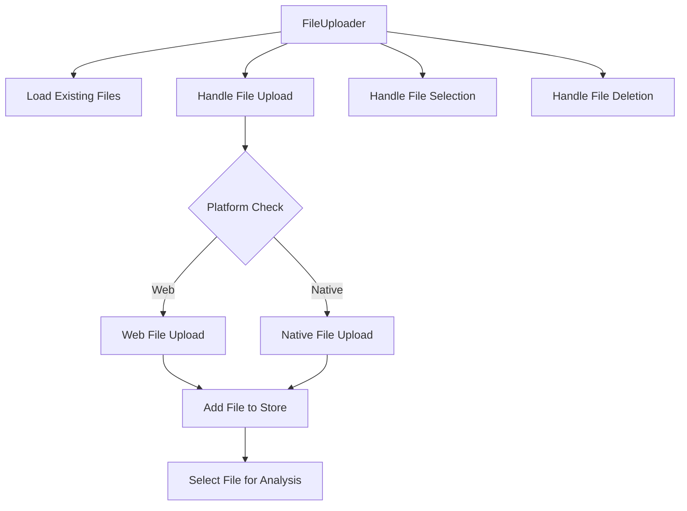

# FileUploader Component

The FileUploader component allows users to upload and manage files for malware analysis.

## Table of Contents

- [Overview](#overview)
- [Component Structure](#component-structure)
- [Props](#props)
- [State](#state)
- [Key Functions](#key-functions)
- [Platform-Specific Implementations](#platform-specific-implementations)
- [Rendering Logic](#rendering-logic)
- [Styling](#styling)
- [Usage Example](#usage-example)

## Overview

The FileUploader component is responsible for:

1. Allowing users to upload files for analysis
2. Displaying a list of uploaded files
3. Managing file selection for analysis
4. Providing file deletion functionality
5. Handling platform-specific file operations (web vs. native)



## Component Structure

The FileUploader component is structured as follows:

```jsx
export const FileUploader: React.FC<FileUploaderProps> = ({ onFileSelect }) => {
  // State hooks
  const [loading, setLoading] = useState(false);
  const [error, setError] = useState<string | null>(null);
  
  // Store hooks
  const { malwareFiles, selectedMalwareId, selectMalwareFile, addMalwareFile, removeMalwareFile } = useAppStore(...);
  
  // Effects
  useEffect(() => {
    loadMalwareFiles();
  }, []);
  
  // Functions
  const loadMalwareFiles = async () => {...};
  const handleFileUpload = async () => {...};
  const handleFileSelect = (file: MalwareFile) => {...};
  const handleFileDelete = async (fileId: string) => {...};
  
  // Render logic
  if (loading) {
    return <LoadingView />;
  }
  
  return (
    <ThemedView style={styles.container}>
      <Header />
      {error && <ErrorView />}
      <FileList />
    </ThemedView>
  );
};
```

## Props

| Prop | Type | Description |
|------|------|-------------|
| `onFileSelect` | `(file: MalwareFile) => void` | Callback function that is called when a file is selected |

## State

The component maintains the following state:

| State | Type | Description |
|-------|------|-------------|
| `loading` | `boolean` | Indicates whether the component is loading files |
| `error` | `string \| null` | Error message if loading or file operations fail |

Additionally, the component uses the following state from the global store:

| Store State | Type | Description |
|-------------|------|-------------|
| `malwareFiles` | `MalwareFile[]` | List of uploaded malware files |
| `selectedMalwareId` | `string \| null` | ID of the currently selected file |
| `selectMalwareFile` | `(id: string \| null) => void` | Function to update the selected file ID |
| `addMalwareFile` | `(file: MalwareFile) => void` | Function to add a file to the store |
| `removeMalwareFile` | `(id: string) => void` | Function to remove a file from the store |

## Key Functions

### `loadMalwareFiles`

```typescript
const loadMalwareFiles = async () => {
  try {
    setLoading(true);
    setError(null);
    
    // Check if running on web
    const isWeb = typeof document !== 'undefined';
    
    if (isWeb) {
      // On web, we can't load files from the file system
      // We'll just check if there are any files in the store
      
      // If a file is already selected, make sure it's in the malware files
      if (selectedMalwareId) {
        const selectedFile = malwareFiles.find(file => file.id === selectedMalwareId);
        if (selectedFile) {
          onFileSelect(selectedFile);
        }
      }
    } else {
      // Initialize file system
      await fileManagerService.initFileSystem();
      
      // Load existing malware files if the store is empty
      if (malwareFiles.length === 0) {
        const files = await fileManagerService.listMalwareFiles();
        files.forEach(file => {
          addMalwareFile(file);
        });
      }
      
      // If a file is already selected, make sure it's in the malware files
      if (selectedMalwareId) {
        const selectedFile = malwareFiles.find(file => file.id === selectedMalwareId);
        if (selectedFile) {
          onFileSelect(selectedFile);
        }
      }
    }
  } catch (error) {
    console.error('Error loading malware files:', error);
    setError('Failed to load malware files.');
  } finally {
    setLoading(false);
  }
};
```

### `handleFileUpload`

```typescript
const handleFileUpload = async () => {
  try {
    setLoading(true);
    setError(null);
    
    // Check if running on web
    const isWeb = typeof document !== 'undefined';
    
    if (isWeb) {
      // Web implementation using standard File API
      
      // Create a file input element
      const input = document.createElement('input');
      input.type = 'file';
      input.accept = '*/*';
      
      // Create a promise to handle the file selection
      const filePromise = new Promise<MalwareFile | null>((resolve) => {
        input.onchange = async (e) => {
          const target = e.target as HTMLInputElement;
          const files = target.files;
          
          if (files && files.length > 0) {
            const selectedFile = files[0];
            
            // Read file content for small text files
            let content = '';
            if (
              selectedFile.size < 1024 * 1024 && // Less than 1MB
              (selectedFile.type.includes('text') || 
               selectedFile.name.endsWith('.js') ||
               // ... other text file extensions
              )
            ) {
              const reader = new FileReader();
              content = await new Promise<string>((resolve) => {
                reader.onload = () => resolve(reader.result as string);
                reader.readAsText(selectedFile);
              });
            }
            
            // Create a MalwareFile object
            const fileId = Math.random().toString(36).substring(2, 15);
            const malwareFile: MalwareFile = {
              id: fileId,
              name: selectedFile.name,
              size: selectedFile.size,
              type: selectedFile.type,
              uri: URL.createObjectURL(selectedFile), // Create a blob URL
              content,
            };
            
            resolve(malwareFile);
          } else {
            resolve(null);
          }
        };
        
        // Trigger the file dialog
        input.click();
      });
      
      // Wait for file selection
      const file = await filePromise;
      
      if (file) {
        // Add file to store
        addMalwareFile(file);
        
        // Select the file
        selectMalwareFile(file.id);
        onFileSelect(file);
        
        // Show success message
        Alert.alert('Success', `File "${file.name}" uploaded successfully.`);
      }
    } else {
      // Native implementation using Expo File System
      
      // Initialize file system first
      await fileManagerService.initFileSystem();
      
      // Pick a file
      const file = await fileManagerService.pickFile();
      
      if (file) {
        // Add file to store
        addMalwareFile(file);
        
        // Select the file
        selectMalwareFile(file.id);
        onFileSelect(file);
        
        // Show success message
        Alert.alert('Success', `File "${file.name}" uploaded successfully.`);
      }
    }
  } catch (error) {
    console.error('Error uploading file:', error);
    setError(`Failed to upload file: ${error instanceof Error ? error.message : 'Unknown error'}`);
    Alert.alert('Error', `Failed to upload file: ${error instanceof Error ? error.message : 'Unknown error'}`);
  } finally {
    setLoading(false);
  }
};
```

### `handleFileSelect`

```typescript
const handleFileSelect = (file: MalwareFile) => {
  selectMalwareFile(file.id);
  onFileSelect(file);
};
```

### `handleFileDelete`

```typescript
const handleFileDelete = async (fileId: string) => {
  try {
    // Check if the file exists in the store
    const fileToDelete = malwareFiles.find(f => f.id === fileId);
    if (!fileToDelete) {
      Alert.alert('Error', 'File not found.');
      return;
    }
    
    // Check if running on web
    const isWeb = typeof document !== 'undefined';
    
    if (isWeb) {
      // On web, we just need to revoke the blob URL if it exists
      if (fileToDelete.uri && fileToDelete.uri.startsWith('blob:')) {
        URL.revokeObjectURL(fileToDelete.uri);
      }
    } else {
      // Delete file from file system
      await fileManagerService.deleteFile(fileToDelete.uri);
    }
    
    // Remove file from store
    removeMalwareFile(fileId);
    
    // If the deleted file was selected, clear selection
    if (selectedMalwareId === fileId) {
      selectMalwareFile(null);
    }
    
    // Show success message
    Alert.alert('Success', `File "${fileToDelete.name}" deleted successfully.`);
  } catch (error) {
    console.error('Error deleting file:', error);
    Alert.alert('Error', `Failed to delete file: ${error instanceof Error ? error.message : 'Unknown error'}`);
  }
};
```

## Platform-Specific Implementations

The FileUploader component uses different implementations for web and native platforms:

### Web Implementation

On web platforms, the component uses the browser's File API:

1. Creates a hidden file input element
2. Triggers a click on the input element to open the file picker dialog
3. Reads the selected file's content (for text files)
4. Creates a blob URL for the file
5. Creates a MalwareFile object and adds it to the store

### Native Implementation

On native platforms (iOS and Android), the component uses Expo's DocumentPicker and FileSystem APIs:

1. Initializes the file system
2. Uses DocumentPicker to open the file picker dialog
3. Copies the selected file to the app's documents directory
4. Creates a MalwareFile object and adds it to the store

## Rendering Logic

The component renders different views based on its state:

### Loading State

```jsx
<ThemedView style={styles.loadingContainer}>
  <ActivityIndicator size="large" color={Colors[colorScheme ?? 'light'].tint} />
  <ThemedText style={styles.loadingText}>Loading files...</ThemedText>
</ThemedView>
```

### Header

```jsx
<View style={styles.header}>
  <View style={{ flex: 1 }}></View>
  <View style={styles.buttonContainer}>
    <TouchableOpacity
      style={[styles.button, styles.uploadButton]}
      onPress={handleFileUpload}
    >
      <IconSymbol name="arrow.up.doc" size={16} color="#FFFFFF" />
      <ThemedText style={styles.buttonText}>Upload</ThemedText>
    </TouchableOpacity>
  </View>
</View>
```

### Error State

```jsx
<ThemedView style={styles.errorContainer}>
  <IconSymbol name="exclamationmark.triangle" size={16} color="#FF6B6B" />
  <ThemedText style={styles.errorText}>{error}</ThemedText>
</ThemedView>
```

### Empty State

```jsx
<ThemedView style={styles.emptyContainer}>
  <AiFillAliwangwang size={32} color="#AAAAAA" />
  <ThemedText style={styles.emptyText}>
    No files yet. Upload a file to get started.
  </ThemedText>
</ThemedView>
```

### File List

```jsx
<ThemedView style={styles.fileListContainer}>
  {malwareFiles.map(file => (
    <TouchableOpacity
      key={file.id}
      style={[
        styles.fileItem,
        selectedMalwareId === file.id && styles.selectedFileItem,
      ]}
      onPress={() => handleFileSelect(file)}
    >
      <View style={styles.fileIconContainer}>
        <IconSymbol
          name={file.type.includes('text') ? 'doc.text' : 'doc'}
          size={24}
          color={selectedMalwareId === file.id ? '#FFFFFF' : Colors[colorScheme ?? 'light'].text}
        />
      </View>
      <View style={styles.fileInfo}>
        <ThemedText
          style={[
            styles.fileName,
            selectedMalwareId === file.id && styles.selectedFileText,
          ]}
        >
          {truncateString(file.name, 20)}
        </ThemedText>
        <ThemedText
          style={[
            styles.fileSize,
            selectedMalwareId === file.id && styles.selectedFileText,
          ]}
        >
          {formatFileSize(file.size)}
        </ThemedText>
      </View>
      <TouchableOpacity
        style={styles.deleteButton}
        onPress={() => handleFileDelete(file.id)}
      >
        <FaTrash
          size={18}
          color={selectedMalwareId === file.id ? '#FFFFFF' : '#FF6B6B'}
        />
      </TouchableOpacity>
    </TouchableOpacity>
  ))}
</ThemedView>
```

## Styling

The component uses a StyleSheet for styling:

```javascript
const styles = StyleSheet.create({
  container: {
    marginVertical: 10,
    borderRadius: 8,
    padding: 10,
  },
  header: {
    flexDirection: 'row',
    justifyContent: 'space-between',
    alignItems: 'center',
    marginBottom: 10,
  },
  title: {
    fontSize: 18,
    fontWeight: 'bold',
  },
  buttonContainer: {
    flexDirection: 'row',
  },
  button: {
    flexDirection: 'row',
    alignItems: 'center',
    paddingVertical: 6,
    paddingHorizontal: 12,
    borderRadius: 4,
    marginLeft: 8,
  },
  uploadButton: {
    backgroundColor: '#4A90E2',
  },
  buttonText: {
    color: '#FFFFFF',
    fontWeight: 'bold',
    marginLeft: 4,
  },
  fileListContainer: {
    maxHeight: 300,
  },
  fileItem: {
    flexDirection: 'row',
    alignItems: 'center',
    padding: 12,
    borderRadius: 8,
    marginBottom: 8,
    backgroundColor: '#F0F0F0',
  },
  selectedFileItem: {
    backgroundColor: '#4A90E2',
  },
  fileIconContainer: {
    width: 40,
    height: 40,
    borderRadius: 20,
    justifyContent: 'center',
    alignItems: 'center',
    marginRight: 10,
  },
  fileInfo: {
    flex: 1,
  },
  fileName: {
    fontSize: 16,
    fontWeight: 'bold',
    color: '#000000',
  },
  fileSize: {
    fontSize: 14,
    opacity: 0.7,
    color: '#000000',
  },
  selectedFileText: {
    color: '#FFFFFF',
  },
  deleteButton: {
    padding: 8,
  },
  loadingContainer: {
    padding: 20,
    alignItems: 'center',
    justifyContent: 'center',
  },
  loadingText: {
    marginTop: 10,
    fontSize: 16,
  },
  errorContainer: {
    flexDirection: 'row',
    alignItems: 'center',
    padding: 10,
    backgroundColor: '#FFF0F0',
    borderRadius: 4,
    marginBottom: 10,
  },
  errorText: {
    marginLeft: 8,
    fontSize: 14,
    color: '#FF6B6B',
  },
  emptyContainer: {
    padding: 20,
    alignItems: 'center',
    justifyContent: 'center',
  },
  emptyText: {
    marginTop: 10,
    fontSize: 16,
    textAlign: 'center',
    color: '#AAAAAA',
  },
});
```

## Usage Example

```jsx
import { FileUploader } from '@/components/FileUploader';
import { MalwareFile } from '@/types';

export default function HomeScreen() {
  const [selectedFile, setSelectedFile] = useState<MalwareFile | null>(null);
  
  const handleFileSelect = (file: MalwareFile) => {
    setSelectedFile(file);
  };
  
  return (
    <View style={styles.container}>
      <FileUploader onFileSelect={handleFileSelect} />
      
      {selectedFile && (
        <Text>Selected File: {selectedFile.name}</Text>
      )}
    </View>
  );
}
