# FileUploadArea Component

**Status:** December 2025 - In Development
**Framework:** SolidJS 1.9.5
**Location:** `/athena-v2/src/components/solid/analysis/FileUploadArea.tsx`

The FileUploadArea component provides a comprehensive file management interface for malware sample uploads, featuring drag-and-drop support, file validation, quarantine storage integration, and batch analysis capabilities.

## Table of Contents

- [Overview](#overview)
- [Component Architecture](#component-architecture)
- [Reactive State Management](#reactive-state-management)
- [Upload Flow](#upload-flow)
- [File Validation](#file-validation)
- [Quarantine Integration](#quarantine-integration)
- [Drag and Drop](#drag-and-drop)
- [Usage Example](#usage-example)
- [Props and Interfaces](#props-and-interfaces)
- [Tauri Commands](#tauri-commands)

## Overview

The FileUploadArea component handles:

1. **File Upload** - Drag-and-drop or click-to-browse file upload
2. **Quarantine Storage** - Automatic quarantine of uploaded malware samples
3. **Staged Samples** - List and manage samples ready for analysis
4. **Batch Analysis** - Select multiple samples for concurrent analysis
5. **Docker Integration** - Check Docker availability for sandbox execution
6. **Analysis Configuration** - Configure analysis types and sandbox settings
7. **Progress Tracking** - Real-time upload and analysis progress
8. **Error Handling** - Clear error messages and validation feedback

```mermaid
%%{init: {
  'theme': 'base',
  'themeVariables': {
    'primaryColor': '#6d105a',
    'primaryTextColor': '#ffffff',
    'lineColor': '#333333',
    'secondaryColor': '#e8f4d4',
    'tertiaryColor': '#f9d0c4'
  }
}}%%
graph TB
    subgraph "FileUploadArea Component"
        A[FileUploadArea<br/>━━━━━━━━<br/>• SolidJS Component<br/>• Reactive State<br/>• Tauri Integration]
    end

    subgraph "User Actions"
        B[Drag & Drop<br/>━━━━━━━━<br/>• File Input<br/>• Validation]
        C[File Selection<br/>━━━━━━━━<br/>• Browse Dialog<br/>• Multi-select]
    end

    subgraph "Backend Integration"
        D[Quarantine Service<br/>━━━━━━━━<br/>• upload_to_quarantine<br/>• list_quarantined_samples<br/>• check_docker_available]
        E[Analysis Service<br/>━━━━━━━━<br/>• analyze_sample<br/>• get_analysis_stats]
    end

    subgraph "State Management"
        F[SolidJS Signals<br/>━━━━━━━━<br/>• createSignal<br/>• createEffect<br/>• analysisStore]
    end

    B --> A
    C --> A
    A --> D
    A --> E
    A --> F
```



## Component Architecture

### SolidJS Component Structure

```typescript
export const FileUploadArea: Component = () => {
  // Reactive signals for state
  const [isDragging, setIsDragging] = createSignal(false);
  const [isUploading, setIsUploading] = createSignal(false);
  const [error, setError] = createSignal<string | null>(null);
  const [stagedSamples, setStagedSamples] = createSignal<StagedSample[]>([]);
  const [selectedSamples, setSelectedSamples] = createSignal<Set<string>>(new Set());
  const [dockerAvailable, setDockerAvailable] = createSignal<boolean | null>(null);

  // Effects for lifecycle management
  onMount(() => {
    loadStagedSamples();
    checkDockerStatus();
  });

  onCleanup(() => {
    // Cleanup subscriptions
  });

  // Render with reactive JSX
  return (
    <AnalysisPanel title="File Upload & Analysis">
      {/* Component content */}
    </AnalysisPanel>
  );
};
```

### Key Interfaces

```typescript
interface StagedSample {
  sha256: string;
  original_filename: string;
  size: number;
  file_type: string;
  mime_type: string;
  status: string;
  uploaded_at: string;
  tags: string[];
}

interface AnalysisConfig {
  staticAnalysis: boolean;
  dynamicAnalysis: boolean;
  aiEnsemble: boolean;
  reverseEngineering: boolean;
  sandboxOS: 'linux' | 'windows' | 'macos';
  sandboxArch: 'x86_64' | 'arm64';
  sandboxImage: string;
  sandboxTimeout: number;
  sandboxMemory: number;
  sandboxCPU: number;
  captureNetwork: boolean;
}

interface UploadProgress {
  current: number;
  total: number;
  percentage: number;
  status: string;
}
```

## Reactive State Management

### SolidJS Signals

The component uses SolidJS signals for reactive state:

```typescript
// Drag state
const [isDragging, setIsDragging] = createSignal(false);

// Upload state
const [isUploading, setIsUploading] = createSignal(false);
const [uploadProgress, setUploadProgress] = createSignal<UploadProgress | null>(null);

// Error and success messages
const [error, setError] = createSignal<string | null>(null);
const [successMessage, setSuccessMessage] = createSignal<string | null>(null);

// Samples management
const [stagedSamples, setStagedSamples] = createSignal<StagedSample[]>([]);
const [selectedSamples, setSelectedSamples] = createSignal<Set<string>>(new Set());

// Analysis state
const [isAnalyzing, setIsAnalyzing] = createSignal(false);
const [dockerAvailable, setDockerAvailable] = createSignal<boolean | null>(null);

// Configuration
const [analysisConfig, setAnalysisConfig] = createSignal<AnalysisConfig>({
  staticAnalysis: true,
  dynamicAnalysis: true,
  aiEnsemble: true,
  reverseEngineering: false,
  sandboxOS: 'linux',
  sandboxArch: 'x86_64',
  // ... other config
});
```

### Effects and Lifecycle

```typescript
// Load samples on mount
onMount(async () => {
  await loadStagedSamples();
  await checkDockerStatus();

  // Set up event listeners if needed
});

// Cleanup on unmount
onCleanup(() => {
  // Clean up any subscriptions or event listeners
  // Release resources
});

// Reactive effects
createEffect(() => {
  // Auto-clear error messages after 5 seconds
  const errorMsg = error();
  if (errorMsg) {
    const timer = setTimeout(() => setError(null), 5000);
    onCleanup(() => clearTimeout(timer));
  }
});
```

## Upload Flow

### File Upload Process


### Upload Handler

```typescript
const handleFileSelect = async (event: Event) => {
  const input = event.target as HTMLInputElement;
  const files = input.files;

  if (!files || files.length === 0) return;

  setIsUploading(true);
  setError(null);

  try {
    for (let i = 0; i < files.length; i++) {
      const file = files[i];

      // Update progress
      setUploadProgress({
        current: i + 1,
        total: files.length,
        percentage: ((i + 1) / files.length) * 100,
        status: `Uploading ${file.name}...`
      });

      // Upload to quarantine via Tauri
      const result = await invokeCommand<UploadResult>('upload_to_quarantine', {
        filePath: file.path // In Tauri, file has path property
      });

      logger.info('File uploaded to quarantine', {
        filename: file.name,
        sha256: result.sha256
      });
    }

    // Reload staged samples
    await loadStagedSamples();
    setSuccessMessage('Files uploaded successfully!');

  } catch (err) {
    const errorMsg = err instanceof Error ? err.message : 'Upload failed';
    setError(errorMsg);
    logger.error('Upload error', { error: errorMsg });
  } finally {
    setIsUploading(false);
    setUploadProgress(null);
  }
};
```

## File Validation

### Client-Side Validation

```typescript
const validateFile = (file: File): { valid: boolean; error?: string } => {
  // Size validation (max 100MB)
  const MAX_SIZE = 100 * 1024 * 1024;
  if (file.size > MAX_SIZE) {
    return { valid: false, error: 'File exceeds 100MB limit' };
  }

  if (file.size === 0) {
    return { valid: false, error: 'File is empty' };
  }

  // Type validation (basic check)
  const allowedExtensions = [
    '.exe', '.dll', '.sys', '.bin',
    '.js', '.py', '.sh', '.bat',
    '.zip', '.rar', '.7z', '.tar',
    '.pdf', '.doc', '.xls', '.apk'
  ];

  const hasAllowedExt = allowedExtensions.some(ext =>
    file.name.toLowerCase().endsWith(ext)
  );

  if (!hasAllowedExt) {
    return {
      valid: false,
      error: 'Unsupported file type. Please upload executables, scripts, or archives.'
    };
  }

  return { valid: true };
};
```

## Quarantine Integration

### Load Staged Samples

```typescript
const loadStagedSamples = async () => {
  if (!isTauri()) {
    logger.warn('Quarantine not available in web mode');
    return;
  }

  try {
    const samples = await invokeCommand<StagedSample[]>('list_quarantined_samples');
    setStagedSamples(samples);
    logger.info(`Loaded ${samples.length} staged samples`);
  } catch (err) {
    const errorMsg = err instanceof Error ? err.message : 'Failed to load samples';
    setError(errorMsg);
    logger.error('Failed to load staged samples', { error: errorMsg });
  }
};
```

### Batch Analysis

```typescript
const handleBatchAnalysis = async () => {
  const selected = selectedSamples();
  if (selected.size === 0) {
    setError('Please select at least one sample to analyze');
    return;
  }

  setIsAnalyzing(true);
  setError(null);

  try {
    const config = analysisConfig();

    for (const sha256 of selected) {
      await invokeCommand('analyze_sample', {
        sha256,
        config: {
          static_analysis: config.staticAnalysis,
          dynamic_analysis: config.dynamicAnalysis,
          ai_ensemble: config.aiEnsemble,
          reverse_engineering: config.reverseEngineering,
          sandbox_config: {
            os: config.sandboxOS,
            arch: config.sandboxArch,
            image: config.sandboxImage,
            timeout_secs: config.sandboxTimeout,
            memory_mb: config.sandboxMemory,
            cpu_cores: config.sandboxCPU,
            capture_network: config.captureNetwork
          }
        }
      });

      logger.info('Analysis started', { sha256 });
    }

    setSuccessMessage(`Analysis started for ${selected.size} sample(s)`);
    setSelectedSamples(new Set());

  } catch (err) {
    const errorMsg = err instanceof Error ? err.message : 'Analysis failed';
    setError(errorMsg);
    logger.error('Batch analysis error', { error: errorMsg });
  } finally {
    setIsAnalyzing(false);
  }
};
```

## Drag and Drop

### Drag Event Handlers

```typescript
const handleDragEnter = (e: DragEvent) => {
  e.preventDefault();
  e.stopPropagation();
  setIsDragging(true);
};

const handleDragLeave = (e: DragEvent) => {
  e.preventDefault();
  e.stopPropagation();

  // Only set dragging false if leaving the drop zone entirely
  if (e.currentTarget === e.target) {
    setIsDragging(false);
  }
};

const handleDragOver = (e: DragEvent) => {
  e.preventDefault();
  e.stopPropagation();
};

const handleDrop = async (e: DragEvent) => {
  e.preventDefault();
  e.stopPropagation();
  setIsDragging(false);

  const files = e.dataTransfer?.files;
  if (!files || files.length === 0) return;

  // Process dropped files
  await processFiles(Array.from(files));
};
```

### JSX Rendering with Drag States

```tsx
<div
  class={`upload-dropzone ${isDragging() ? 'dragging' : ''}`}
  onDragEnter={handleDragEnter}
  onDragLeave={handleDragLeave}
  onDragOver={handleDragOver}
  onDrop={handleDrop}
>
  <Show when={!isUploading()} fallback={<UploadProgress />}>
    <div class="upload-icon">📁</div>
    <p>Drop files here or click to browse</p>
    <input
      type="file"
      multiple
      onChange={handleFileSelect}
      style={{ display: 'none' }}
      ref={fileInputRef}
    />
  </Show>
</div>
```

## Usage Example

### Basic Implementation

```tsx
import { FileUploadArea } from '@/components/solid/analysis/FileUploadArea';

export const AnalysisPage: Component = () => {
  return (
    <div class="analysis-container">
      <FileUploadArea />
    </div>
  );
};
```

### Integration with Analysis Dashboard

```tsx
import { FileUploadArea } from '@/components/solid/analysis/FileUploadArea';
import { AnalysisDashboard } from '@/components/solid/analysis/AnalysisDashboard';
import { analysisStore } from '@/stores/analysisStore';

export const MainAnalysisPage: Component = () => {
  return (
    <div class="main-analysis">
      {/* File upload section */}
      <FileUploadArea />

      {/* Analysis dashboard */}
      <Show when={analysisStore.currentJob()}>
        <AnalysisDashboard jobId={analysisStore.currentJob()!.id} />
      </Show>
    </div>
  );
};
```

## Props and Interfaces

### Component Props

```typescript
// FileUploadArea has no props - it's a standalone component
export const FileUploadArea: Component = () => { ... };
```

### State Interfaces

```typescript
interface UploadResult {
  sha256: string;
  is_duplicate: boolean;
  file_type: string;
  size: number;
  message: string;
}

interface StagedSample {
  sha256: string;
  original_filename: string;
  size: number;
  file_type: string;
  mime_type: string;
  status: string;
  uploaded_at: string;
  tags: string[];
}

interface AnalysisConfig {
  staticAnalysis: boolean;
  dynamicAnalysis: boolean;
  aiEnsemble: boolean;
  reverseEngineering: boolean;
  sandboxOS: 'linux' | 'windows' | 'macos';
  sandboxArch: 'x86_64' | 'arm64';
  sandboxImage: string;
  sandboxTimeout: number;
  sandboxMemory: number;
  sandboxCPU: number;
  captureNetwork: boolean;
}
```

## Tauri Commands

### Backend Commands Used

| Command | Purpose | Parameters | Return Type |
|---------|---------|------------|-------------|
| `upload_to_quarantine` | Upload file to quarantine | `{ filePath: string }` | `UploadResult` |
| `list_quarantined_samples` | List staged samples | None | `StagedSample[]` |
| `analyze_sample` | Start sample analysis | `{ sha256: string, config: AnalysisConfig }` | `void` |
| `check_docker_available` | Check Docker status | None | `boolean` |
| `get_analysis_stats` | Get analysis statistics | None | `AnalysisStats` |

### Command Invocation

```typescript
import { invokeCommand } from '@/utils/tauriCompat';

// Upload file
const result = await invokeCommand<UploadResult>('upload_to_quarantine', {
  filePath: '/path/to/malware.exe'
});

// List samples
const samples = await invokeCommand<StagedSample[]>('list_quarantined_samples');

// Start analysis
await invokeCommand('analyze_sample', {
  sha256: 'abc123...',
  config: analysisConfig()
});
```

## Related Documentation

- [AnalysisDashboard](./ANALYSIS_RESULTS.md) - Display analysis results
- [AIProviderStatus](./AI_MODEL_SELECTOR.md) - AI provider management
- [Architecture Overview](../ARCHITECTURE.md) - System design
- [Tauri Integration](../../athena-v2/src/utils/tauriCompat.ts) - Tauri compatibility layer
