# FileUploader Component

The FileUploader component provides a comprehensive file management interface for malware analysis, featuring drag-and-drop support, file validation, progress tracking, and seamless integration with the file manager service.

## Table of Contents

- [Overview](#overview)
- [Architecture](#architecture)
- [Upload State Machine](#upload-state-machine)
- [File Validation Flow](#file-validation-flow)
- [Drag and Drop Interaction](#drag-and-drop-interaction)
- [Component Structure](#component-structure)
- [File Manager Integration](#file-manager-integration)
- [Progress Tracking](#progress-tracking)
- [Platform-Specific Implementations](#platform-specific-implementations)
- [Rendering States](#rendering-states)
- [Styling](#styling)
- [Usage Example](#usage-example)
- [Related Documentation](#related-documentation)

## Overview

The FileUploader component is responsible for:

1. Allowing users to upload files for analysis via click or drag-and-drop
2. Displaying a list of uploaded files with metadata
3. Managing file selection for analysis
4. Providing file deletion functionality
5. Handling platform-specific file operations (web vs. native)
6. Validating file types and sizes
7. Tracking upload progress
8. Managing file storage and retrieval

```mermaid
graph TD
    subgraph "FileUploader Component"
        A[FileUploader<br/>━━━━━━━━<br/>• File Management<br/>• Upload Interface<br/>• Selection Logic]
    end
    
    subgraph "User Interactions"
        B[Click Upload<br/>━━━━━━━━<br/>• File Dialog<br/>• Selection]
        C[Drag & Drop<br/>━━━━━━━━<br/>• Drag Enter<br/>• Drop Files]
        D[File Actions<br/>━━━━━━━━<br/>• Select<br/>• Delete]
    end
    
    subgraph "File Processing"
        E[Validation<br/>━━━━━━━━<br/>• Type Check<br/>• Size Check<br/>• Security Scan]
        F[Storage<br/>━━━━━━━━<br/>• Web: Blob URL<br/>• Native: FileSystem]
    end
    
    subgraph "State Management"
        G[Zustand Store<br/>━━━━━━━━<br/>• File List<br/>• Selection<br/>• CRUD Actions]
    end
    
    B --> A
    C --> A
    D --> A
    A --> E
    E --> F
    F --> G
    
    style A fill:#e1e5ff
    style B fill:#e1f5e1
    style C fill:#e1f5e1
    style D fill:#fff4e1
    style E fill:#ffe4e1
    style F fill:#e1e5ff
    style G fill:#e1f5e1
```



## Architecture

### Component Architecture

```mermaid
graph LR
    subgraph "Component Layer"
        A[FileUploader<br/>━━━━━━━━<br/>• React Component<br/>• UI Rendering<br/>• Event Handling]
    end
    
    subgraph "State Layer"
        B[Local State<br/>━━━━━━━━<br/>• loading: boolean<br/>• uploadProgress: number<br/>• error: string<br/>• isDragging: boolean]
        C[Store State<br/>━━━━━━━━<br/>• malwareFiles: File[]<br/>• selectedMalwareId<br/>• CRUD Actions]
    end
    
    subgraph "Service Layer"
        D[File Manager<br/>━━━━━━━━<br/>• initFileSystem()<br/>• pickFile()<br/>• deleteFile()<br/>• listMalwareFiles()]
    end
    
    subgraph "Platform Layer"
        E[Web APIs<br/>━━━━━━━━<br/>• File API<br/>• Blob URLs<br/>• FileReader]
        F[Native APIs<br/>━━━━━━━━<br/>• DocumentPicker<br/>• FileSystem<br/>• Expo APIs]
    end
    
    A --> B
    A --> C
    A --> D
    D --> E
    D --> F
    
    style A fill:#e1e5ff
    style B fill:#fff4e1
    style C fill:#e1f5e1
    style D fill:#e1e5ff
    style E fill:#ffe4e1
    style F fill:#ffe4e1
```

## Upload State Machine

### File Upload Lifecycle


## File Validation Flow

### Validation Pipeline

```mermaid
flowchart TD
    Start[File Input]
    
    subgraph "Type Validation"
        CheckExt{Check<br/>Extension}
        CheckMime{Check<br/>MIME Type}
        
        AllowedTypes[Allowed Types<br/>━━━━━━━━<br/>• .exe, .dll, .sys<br/>• .js, .py, .sh<br/>• .zip, .rar, .7z<br/>• .pdf, .doc, .xls]
        
        BlockedTypes[Blocked Types<br/>━━━━━━━━<br/>• Media files<br/>• System files<br/>• Temp files]
    end
    
    subgraph "Size Validation"
        CheckSize{Size<br/>Check}
        
        SizeLimits[Size Limits<br/>━━━━━━━━<br/>• Max: 100MB<br/>• Min: 1 byte<br/>• Warn: >50MB]
    end
    
    subgraph "Security Validation"
        QuickScan{Quick<br/>Scan}
        
        SecurityChecks[Security Checks<br/>━━━━━━━━<br/>• Known signatures<br/>• Archive bombs<br/>• Path traversal<br/>• Hidden files]
    end
    
    subgraph "Content Analysis"
        ReadHeader{Read<br/>Header}
        
        ContentChecks[Content Checks<br/>━━━━━━━━<br/>• Magic bytes<br/>• File structure<br/>• Encoding check]
    end
    
    Accept[✓ Accept File]
    Reject[✗ Reject File]
    
    Start --> CheckExt
    CheckExt -->|Valid| CheckMime
    CheckExt -->|Invalid| Reject
    
    CheckMime -->|Valid| CheckSize
    CheckMime -->|Invalid| Reject
    
    CheckSize -->|Valid| QuickScan
    CheckSize -->|Too Large| Reject
    
    QuickScan -->|Safe| ReadHeader
    QuickScan -->|Suspicious| Reject
    
    ReadHeader -->|Valid| Accept
    ReadHeader -->|Invalid| Reject
    
    style Start fill:#e1e5ff
    style Accept fill:#e1f5e1
    style Reject fill:#ffe4e1
    style AllowedTypes fill:#e1f5e1
    style BlockedTypes fill:#ffe4e1
    style SizeLimits fill:#fff4e1
    style SecurityChecks fill:#ffe4e1
    style ContentChecks fill:#e1e5ff
```



## Drag and Drop Interaction

### Drag and Drop Flow


### Visual Drag States

```mermaid
graph TD
    subgraph "Normal State"
        A[Upload Area<br/>━━━━━━━━<br/>📁 Drop files here<br/>or click to browse]
    end
    
    subgraph "Drag Enter State"
        B[Upload Area<br/>━━━━━━━━<br/>✨ Drop files here<br/>Border: Animated<br/>Background: Highlight]
    end
    
    subgraph "Drag Over State"
        C[Upload Area<br/>━━━━━━━━<br/>📥 Release to upload<br/>Border: Pulsing<br/>Scale: 1.02]
    end
    
    subgraph "Processing State"
        D[Upload Area<br/>━━━━━━━━<br/>⏳ Processing files...<br/>Progress: 45%<br/>Disabled: true]
    end
    
    A -->|Drag Enter| B
    B -->|Drag Over| C
    C -->|Drop| D
    B -->|Drag Leave| A
    D -->|Complete| A
    
    style A fill:#e1e5ff
    style B fill:#fff4e1
    style C fill:#e1f5e1
    style D fill:#ffe4e1
```



## File Manager Integration

### Service Integration Flow

```mermaid
graph TB
    subgraph "FileUploader Component"
        A[Component<br/>━━━━━━━━<br/>• UI Logic<br/>• Event Handlers<br/>• State Management]
    end
    
    subgraph "File Manager Service"
        B[Service Interface<br/>━━━━━━━━<br/>• initFileSystem()<br/>• pickFile()<br/>• deleteFile()<br/>• listMalwareFiles()]
        
        subgraph "Platform Implementations"
            C[Web Implementation<br/>━━━━━━━━<br/>• File API<br/>• Blob URLs<br/>• IndexedDB]
            D[Native Implementation<br/>━━━━━━━━<br/>• Expo FileSystem<br/>• DocumentPicker<br/>• Local Storage]
        end
    end
    
    subgraph "Storage Layer"
        E[Web Storage<br/>━━━━━━━━<br/>• Blob URLs<br/>• Memory Cache<br/>• IndexedDB]
        F[Native Storage<br/>━━━━━━━━<br/>• Document Dir<br/>• File System<br/>• SQLite]
    end
    
    subgraph "State Management"
        G[Zustand Store<br/>━━━━━━━━<br/>• File Registry<br/>• Selection State<br/>• Persistence]
    end
    
    A --> B
    B --> C
    B --> D
    C --> E
    D --> F
    E --> G
    F --> G
    
    style A fill:#e1e5ff
    style B fill:#e1f5e1
    style C fill:#fff4e1
    style D fill:#fff4e1
    style E fill:#ffe4e1
    style F fill:#ffe4e1
    style G fill:#e1f5e1
```

## Progress Tracking

### Upload Progress Flow

```mermaid
sequenceDiagram
    participant UI as User Interface
    participant Component as FileUploader
    participant Progress as Progress State
    participant Service as File Service
    participant Store as Zustand Store
    
    UI->>Component: Select file
    Component->>Progress: setUploadProgress(0)
    Component->>UI: Show progress bar
    
    Component->>Service: Start upload
    
    loop Upload chunks
        Service->>Service: Process chunk
        Service->>Progress: Update progress
        Progress->>Component: onProgress(percentage)
        Component->>Progress: setUploadProgress(percentage)
        Component->>UI: Update progress bar
        
        Note over UI: Progress: 0% → 25% → 50% → 75% → 100%
    end
    
    Service->>Component: Upload complete
    Component->>Progress: setUploadProgress(100)
    Component->>Store: addMalwareFile(file)
    Component->>UI: Show success
    
    Component->>Progress: Reset after delay
    Progress->>Component: setUploadProgress(0)
    Component->>UI: Hide progress bar
```



### Progress UI States

```mermaid
graph LR
    subgraph "Initial State"
        A[Upload Button<br/>━━━━━━━━<br/>📤 Upload File<br/>Enabled: true]
    end
    
    subgraph "Uploading State"
        B[Progress Bar<br/>━━━━━━━━<br/>▓▓▓▓░░░░ 45%<br/>Cancel Button]
    end
    
    subgraph "Processing State"
        C[Processing<br/>━━━━━━━━<br/>⚙️ Processing...<br/>Indeterminate]
    end
    
    subgraph "Complete State"
        D[Success<br/>━━━━━━━━<br/>✅ Upload Complete<br/>File Added]
    end
    
    A -->|Start| B
    B -->|100%| C
    C -->|Done| D
    D -->|Reset| A
    
    style A fill:#e1e5ff
    style B fill:#fff4e1
    style C fill:#fff4e1
    style D fill:#e1f5e1
```



## Component Structure

### Component Hierarchy

```mermaid
graph TD
    subgraph "FileUploader Root"
        A[FileUploader Component]
        
        subgraph "State Management"
            B[Local State<br/>━━━━━━━━<br/>• loading<br/>• uploadProgress<br/>• error<br/>• isDragging<br/>• toast]
            C[Store State<br/>━━━━━━━━<br/>• malwareFiles<br/>• selectedMalwareId<br/>• CRUD actions]
        end
        
        subgraph "UI Components"
            D[Header<br/>━━━━━━━━<br/>• Upload Button<br/>• Title]
            E[Drop Zone<br/>━━━━━━━━<br/>• Drag Area<br/>• Instructions]
            F[File List<br/>━━━━━━━━<br/>• File Items<br/>• Actions]
            G[Toast<br/>━━━━━━━━<br/>• Success/Error<br/>• Messages]
        end
        
        subgraph "File Item"
            H[File Icon<br/>━━━━━━━━<br/>• Type Based<br/>• Dynamic]
            I[File Info<br/>━━━━━━━━<br/>• Name<br/>• Size<br/>• Type]
            J[Actions<br/>━━━━━━━━<br/>• Select<br/>• Delete]
        end
    end
    
    A --> B
    A --> C
    A --> D
    A --> E
    A --> F
    A --> G
    F --> H
    F --> I
    F --> J
    
    style A fill:#e1e5ff
    style B fill:#fff4e1
    style C fill:#e1f5e1
    style D fill:#e1e5ff
    style E fill:#e1e5ff
    style F fill:#e1e5ff
    style G fill:#fff4e1
    style H fill:#e1f5e1
    style I fill:#e1f5e1
    style J fill:#ffe4e1
```



## Platform-Specific Implementations

### Platform Detection and Routing

```mermaid
flowchart TD
    Start[File Operation Request]
    
    Check{Platform<br/>Check}
    
    subgraph "Web Platform"
        WebAPI[Web File API<br/>━━━━━━━━<br/>• HTML5 File API<br/>• FileReader API<br/>• Blob URLs]
        
        WebPick[File Input<br/>━━━━━━━━<br/>• <input type="file"><br/>• Click trigger<br/>• onChange handler]
        
        WebStore[Web Storage<br/>━━━━━━━━<br/>• Blob URLs<br/>• URL.createObjectURL<br/>• Memory storage]
        
        WebRead[File Reading<br/>━━━━━━━━<br/>• FileReader<br/>• readAsText()<br/>• readAsDataURL()]
    end
    
    subgraph "Native Platform"
        NativeAPI[Native APIs<br/>━━━━━━━━<br/>• Expo FileSystem<br/>• DocumentPicker<br/>• Platform Storage]
        
        NativePick[Document Picker<br/>━━━━━━━━<br/>• System picker<br/>• Type filters<br/>• Multi-select]
        
        NativeStore[File System<br/>━━━━━━━━<br/>• documentDirectory<br/>• copyAsync()<br/>• Persistent storage]
        
        NativeRead[File Access<br/>━━━━━━━━<br/>• readAsStringAsync<br/>• getInfoAsync<br/>• Direct access]
    end
    
    Start --> Check
    Check -->|typeof document !== 'undefined'| WebAPI
    Check -->|React Native| NativeAPI
    
    WebAPI --> WebPick
    WebAPI --> WebStore
    WebAPI --> WebRead
    
    NativeAPI --> NativePick
    NativeAPI --> NativeStore
    NativeAPI --> NativeRead
    
    style Start fill:#e1e5ff
    style WebAPI fill:#fff4e1
    style NativeAPI fill:#fff4e1
    style WebStore fill:#e1f5e1
    style NativeStore fill:#e1f5e1
```

## Rendering States

### Visual Component States

```mermaid
graph TD
    subgraph "Loading State"
        A[LoadingView<br/>━━━━━━━━<br/>🔄 ActivityIndicator<br/>📝 "Loading files..."]
    end
    
    subgraph "Empty State"
        B[EmptyView<br/>━━━━━━━━<br/>📁 No files icon<br/>📝 "No files yet"<br/>🔗 Upload prompt]
    end
    
    subgraph "File List State"
        C[Header<br/>━━━━━━━━<br/>📤 Upload Button]
        
        D[File Item 1<br/>━━━━━━━━<br/>📄 file.exe<br/>2.3 MB<br/>✓ Selected]
        
        E[File Item 2<br/>━━━━━━━━<br/>📄 malware.dll<br/>1.2 MB<br/>○ Not Selected]
        
        F[Drop Zone<br/>━━━━━━━━<br/>⚡ Drag files here<br/>or click to browse]
    end
    
    subgraph "Error State"
        G[ErrorView<br/>━━━━━━━━<br/>⚠️ Error Icon<br/>📝 Error Message<br/>🔁 Dismiss]
    end
    
    C --> D
    C --> E
    C --> F
    
    style A fill:#fff4e1
    style B fill:#e1e5ff
    style C fill:#e1e5ff
    style D fill:#e1f5e1
    style E fill:#e1e5ff
    style F fill:#fff4e1
    style G fill:#ffe4e1
```

### Mock UI Representation

```mermaid
graph TD
    subgraph "FileUploader UI"
        Header["<div style='background:#f9f9f9;padding:10px;border-radius:8px 8px 0 0;display:flex;justify-content:space-between'>
            <span style='flex:1'></span>
            <button style='background:#4A90E2;color:white;padding:6px 12px;border-radius:4px'>📤 Upload</button>
        </div>"]
        
        DropZone["<div style='border:2px dashed #ccc;padding:20px;margin:10px;border-radius:8px;text-align:center;background:#f0f8ff'>
            📁 Drop files here or click to browse<br/>
            <small>Supports: .exe, .dll, .js, .py, .zip, etc.</small>
        </div>"]
        
        File1["<div style='background:#4A90E2;padding:12px;margin:8px;border-radius:8px;display:flex;color:white'>
            <span style='margin-right:10px'>📄</span>
            <div style='flex:1'>
                <strong>suspicious.exe</strong><br/>
                <small>2.3 MB</small>
            </div>
            <span style='cursor:pointer'>🗑️</span>
        </div>"]
        
        File2["<div style='background:#F0F0F0;padding:12px;margin:8px;border-radius:8px;display:flex'>
            <span style='margin-right:10px'>📄</span>
            <div style='flex:1'>
                <strong>malware.dll</strong><br/>
                <small>1.2 MB</small>
            </div>
            <span style='cursor:pointer;color:#FF6B6B'>🗑️</span>
        </div>"]
        
        Container["<div style='background:#f9f9f9;border-radius:8px;border:1px solid #ddd'>"]
    end
    
    Container --> Header
    Container --> DropZone
    Container --> File1
    Container --> File2
```



## Props

| Prop | Type | Description |
|------|------|-------------|
| `onFileSelect` | `(file: MalwareFile) => void` | Callback function that is called when a file is selected for analysis |

## State

The component maintains the following state:

| State | Type | Description |
|-------|------|-------------|
| `loading` | `boolean` | Indicates whether the component is loading files |
| `error` | `string \| null` | Error message if loading or file operations fail |

Additionally, the component uses the following state from the global store:

| Store State | Type | Description |
|-------------|------|-------------|
| `malwareFiles` | `MalwareFile[]` | List of uploaded malware files |
| `selectedMalwareId` | `string \| null` | ID of the currently selected file |
| `selectMalwareFile` | `(id: string \| null) => void` | Function to update the selected file ID |
| `addMalwareFile` | `(file: MalwareFile) => void` | Function to add a file to the store |
| `removeMalwareFile` | `(id: string) => void` | Function to remove a file from the store |

## Key Functions

### `loadMalwareFiles`

```typescript
const loadMalwareFiles = async () => {
  try {
    setLoading(true);
    setError(null);
    
    // Check if running on web
    const isWeb = typeof document !== 'undefined';
    
    if (isWeb) {
      // On web, we can't load files from the file system
      // We'll just check if there are any files in the store
      
      // If a file is already selected, make sure it's in the malware files
      if (selectedMalwareId) {
        const selectedFile = malwareFiles.find(file => file.id === selectedMalwareId);
        if (selectedFile) {
          onFileSelect(selectedFile);
        }
      }
    } else {
      // Initialize file system
      await fileManagerService.initFileSystem();
      
      // Load existing malware files if the store is empty
      if (malwareFiles.length === 0) {
        const files = await fileManagerService.listMalwareFiles();
        files.forEach(file => {
          addMalwareFile(file);
        });
      }
      
      // If a file is already selected, make sure it's in the malware files
      if (selectedMalwareId) {
        const selectedFile = malwareFiles.find(file => file.id === selectedMalwareId);
        if (selectedFile) {
          onFileSelect(selectedFile);
        }
      }
    }
  } catch (error) {
    console.error('Error loading malware files:', error);
    setError('Failed to load malware files.');
  } finally {
    setLoading(false);
  }
};
```

### `handleFileUpload`

```typescript
const handleFileUpload = async () => {
  try {
    setLoading(true);
    setError(null);
    
    // Check if running on web
    const isWeb = typeof document !== 'undefined';
    
    if (isWeb) {
      // Web implementation using standard File API
      
      // Create a file input element
      const input = document.createElement('input');
      input.type = 'file';
      input.accept = '*/*';
      
      // Create a promise to handle the file selection
      const filePromise = new Promise<MalwareFile | null>((resolve) => {
        input.onchange = async (e) => {
          const target = e.target as HTMLInputElement;
          const files = target.files;
          
          if (files && files.length > 0) {
            const selectedFile = files[0];
            
            // Read file content for small text files
            let content = '';
            if (
              selectedFile.size < 1024 * 1024 && // Less than 1MB
              (selectedFile.type.includes('text') || 
               selectedFile.name.endsWith('.js') ||
               // ... other text file extensions
              )
            ) {
              const reader = new FileReader();
              content = await new Promise<string>((resolve) => {
                reader.onload = () => resolve(reader.result as string);
                reader.readAsText(selectedFile);
              });
            }
            
            // Create a MalwareFile object
            const fileId = Math.random().toString(36).substring(2, 15);
            const malwareFile: MalwareFile = {
              id: fileId,
              name: selectedFile.name,
              size: selectedFile.size,
              type: selectedFile.type,
              uri: URL.createObjectURL(selectedFile), // Create a blob URL
              content,
            };
            
            resolve(malwareFile);
          } else {
            resolve(null);
          }
        };
        
        // Trigger the file dialog
        input.click();
      });
      
      // Wait for file selection
      const file = await filePromise;
      
      if (file) {
        // Add file to store
        addMalwareFile(file);
        
        // Select the file
        selectMalwareFile(file.id);
        onFileSelect(file);
        
        // Show success message
        Alert.alert('Success', `File "${file.name}" uploaded successfully.`);
      }
    } else {
      // Native implementation using Expo File System
      
      // Initialize file system first
      await fileManagerService.initFileSystem();
      
      // Pick a file
      const file = await fileManagerService.pickFile();
      
      if (file) {
        // Add file to store
        addMalwareFile(file);
        
        // Select the file
        selectMalwareFile(file.id);
        onFileSelect(file);
        
        // Show success message
        Alert.alert('Success', `File "${file.name}" uploaded successfully.`);
      }
    }
  } catch (error) {
    console.error('Error uploading file:', error);
    setError(`Failed to upload file: ${error instanceof Error ? error.message : 'Unknown error'}`);
    Alert.alert('Error', `Failed to upload file: ${error instanceof Error ? error.message : 'Unknown error'}`);
  } finally {
    setLoading(false);
  }
};
```

### `handleFileSelect`

```typescript
const handleFileSelect = (file: MalwareFile) => {
  selectMalwareFile(file.id);
  onFileSelect(file);
};
```

### `handleFileDelete`

```typescript
const handleFileDelete = async (fileId: string) => {
  try {
    // Check if the file exists in the store
    const fileToDelete = malwareFiles.find(f => f.id === fileId);
    if (!fileToDelete) {
      Alert.alert('Error', 'File not found.');
      return;
    }
    
    // Check if running on web
    const isWeb = typeof document !== 'undefined';
    
    if (isWeb) {
      // On web, we just need to revoke the blob URL if it exists
      if (fileToDelete.uri && fileToDelete.uri.startsWith('blob:')) {
        URL.revokeObjectURL(fileToDelete.uri);
      }
    } else {
      // Delete file from file system
      await fileManagerService.deleteFile(fileToDelete.uri);
    }
    
    // Remove file from store
    removeMalwareFile(fileId);
    
    // If the deleted file was selected, clear selection
    if (selectedMalwareId === fileId) {
      selectMalwareFile(null);
    }
    
    // Show success message
    Alert.alert('Success', `File "${fileToDelete.name}" deleted successfully.`);
  } catch (error) {
    console.error('Error deleting file:', error);
    Alert.alert('Error', `Failed to delete file: ${error instanceof Error ? error.message : 'Unknown error'}`);
  }
};
```

## Platform-Specific Implementations

The FileUploader component uses different implementations for web and native platforms:

### Web Implementation

On web platforms, the component uses the browser's File API:

1. Creates a hidden file input element
2. Triggers a click on the input element to open the file picker dialog
3. Reads the selected file's content (for text files)
4. Creates a blob URL for the file
5. Creates a MalwareFile object and adds it to the store

### Native Implementation

On native platforms (iOS and Android), the component uses Expo's DocumentPicker and FileSystem APIs:

1. Initializes the file system
2. Uses DocumentPicker to open the file picker dialog
3. Copies the selected file to the app's documents directory
4. Creates a MalwareFile object and adds it to the store

## Rendering Logic

The component renders different views based on its state:

### Loading State

```jsx
<ThemedView style={styles.loadingContainer}>
  <ActivityIndicator size="large" color={Colors[colorScheme ?? 'light'].tint} />
  <ThemedText style={styles.loadingText}>Loading files...</ThemedText>
</ThemedView>
```

### Header

```jsx
<View style={styles.header}>
  <View style={{ flex: 1 }}></View>
  <View style={styles.buttonContainer}>
    <TouchableOpacity
      style={[styles.button, styles.uploadButton]}
      onPress={handleFileUpload}
    >
      <IconSymbol name="arrow.up.doc" size={16} color="#FFFFFF" />
      <ThemedText style={styles.buttonText}>Upload</ThemedText>
    </TouchableOpacity>
  </View>
</View>
```

### Error State

```jsx
<ThemedView style={styles.errorContainer}>
  <IconSymbol name="exclamationmark.triangle" size={16} color="#FF6B6B" />
  <ThemedText style={styles.errorText}>{error}</ThemedText>
</ThemedView>
```

### Empty State

```jsx
<ThemedView style={styles.emptyContainer}>
  <AiFillAliwangwang size={32} color="#AAAAAA" />
  <ThemedText style={styles.emptyText}>
    No files yet. Upload a file to get started.
  </ThemedText>
</ThemedView>
```

### File List

```jsx
<ThemedView style={styles.fileListContainer}>
  {malwareFiles.map(file => (
    <TouchableOpacity
      key={file.id}
      style={[
        styles.fileItem,
        selectedMalwareId === file.id && styles.selectedFileItem,
      ]}
      onPress={() => handleFileSelect(file)}
    >
      <View style={styles.fileIconContainer}>
        <IconSymbol
          name={file.type.includes('text') ? 'doc.text' : 'doc'}
          size={24}
          color={selectedMalwareId === file.id ? '#FFFFFF' : Colors[colorScheme ?? 'light'].text}
        />
      </View>
      <View style={styles.fileInfo}>
        <ThemedText
          style={[
            styles.fileName,
            selectedMalwareId === file.id && styles.selectedFileText,
          ]}
        >
          {truncateString(file.name, 20)}
        </ThemedText>
        <ThemedText
          style={[
            styles.fileSize,
            selectedMalwareId === file.id && styles.selectedFileText,
          ]}
        >
          {formatFileSize(file.size)}
        </ThemedText>
      </View>
      <TouchableOpacity
        style={styles.deleteButton}
        onPress={() => handleFileDelete(file.id)}
      >
        <FaTrash
          size={18}
          color={selectedMalwareId === file.id ? '#FFFFFF' : '#FF6B6B'}
        />
      </TouchableOpacity>
    </TouchableOpacity>
  ))}
</ThemedView>
```

## Styling

The component uses a StyleSheet for styling:

```javascript
const styles = StyleSheet.create({
  container: {
    marginVertical: 10,
    borderRadius: 8,
    padding: 10,
  },
  header: {
    flexDirection: 'row',
    justifyContent: 'space-between',
    alignItems: 'center',
    marginBottom: 10,
  },
  title: {
    fontSize: 18,
    fontWeight: 'bold',
  },
  buttonContainer: {
    flexDirection: 'row',
  },
  button: {
    flexDirection: 'row',
    alignItems: 'center',
    paddingVertical: 6,
    paddingHorizontal: 12,
    borderRadius: 4,
    marginLeft: 8,
  },
  uploadButton: {
    backgroundColor: '#4A90E2',
  },
  buttonText: {
    color: '#FFFFFF',
    fontWeight: 'bold',
    marginLeft: 4,
  },
  fileListContainer: {
    maxHeight: 300,
  },
  fileItem: {
    flexDirection: 'row',
    alignItems: 'center',
    padding: 12,
    borderRadius: 8,
    marginBottom: 8,
    backgroundColor: '#F0F0F0',
  },
  selectedFileItem: {
    backgroundColor: '#4A90E2',
  },
  fileIconContainer: {
    width: 40,
    height: 40,
    borderRadius: 20,
    justifyContent: 'center',
    alignItems: 'center',
    marginRight: 10,
  },
  fileInfo: {
    flex: 1,
  },
  fileName: {
    fontSize: 16,
    fontWeight: 'bold',
    color: '#000000',
  },
  fileSize: {
    fontSize: 14,
    opacity: 0.7,
    color: '#000000',
  },
  selectedFileText: {
    color: '#FFFFFF',
  },
  deleteButton: {
    padding: 8,
  },
  loadingContainer: {
    padding: 20,
    alignItems: 'center',
    justifyContent: 'center',
  },
  loadingText: {
    marginTop: 10,
    fontSize: 16,
  },
  errorContainer: {
    flexDirection: 'row',
    alignItems: 'center',
    padding: 10,
    backgroundColor: '#FFF0F0',
    borderRadius: 4,
    marginBottom: 10,
  },
  errorText: {
    marginLeft: 8,
    fontSize: 14,
    color: '#FF6B6B',
  },
  emptyContainer: {
    padding: 20,
    alignItems: 'center',
    justifyContent: 'center',
  },
  emptyText: {
    marginTop: 10,
    fontSize: 16,
    textAlign: 'center',
    color: '#AAAAAA',
  },
});
```

## Usage Example

```jsx
import { FileUploader } from '@/components/FileUploader';
import { MalwareFile } from '@/types';

export default function HomeScreen() {
  const [selectedFile, setSelectedFile] = useState<MalwareFile | null>(null);
  const [analysisReady, setAnalysisReady] = useState(false);
  
  const handleFileSelect = (file: MalwareFile) => {
    setSelectedFile(file);
    setAnalysisReady(true);
    console.log('File selected for analysis:', file.name);
  };
  
  return (
    <View style={styles.container}>
      <FileUploader onFileSelect={handleFileSelect} />
      
      {selectedFile && (
        <View style={styles.fileInfo}>
          <Text>Selected File: {selectedFile.name}</Text>
          <Text>Size: {formatFileSize(selectedFile.size)}</Text>
          <Text>Type: {selectedFile.type}</Text>
          {analysisReady && (
            <Button onPress={startAnalysis}>Start Analysis</Button>
          )}
        </View>
      )}
    </View>
  );
}
```

## Related Documentation

- [Architecture Overview](../ARCHITECTURE.md) - System-wide architecture and design patterns
- [API Integration](../API_INTEGRATION.md) - API layer and service integration details
- [Getting Started](../GETTING_STARTED.md) - Setup and configuration guide
- [User Guide](../USER_GUIDE.md) - End-user documentation
- [Container Isolation](../CONTAINER_ISOLATION.md) - Security and isolation features
