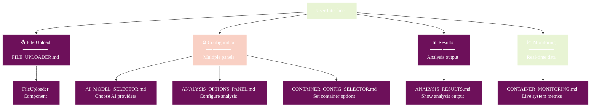

# Component Documentation

## 🧭 Navigation
- **📖 [Documentation Hub](../README.md)** ← Main navigation
- **🏗️ [Architecture](../ARCHITECTURE.md)** ← System design
- **👤 [User Guide](../USER_GUIDE.md)** ← How to use features

## Overview

This directory contains documentation for all UI components in Athena. Each component is thoroughly documented with architecture diagrams, usage examples, and integration patterns.

## 🧩 Component Map



## 📚 Component Documentation

### 📤 Input Components
| Component | File | Purpose |
|-----------|------|---------|
| **File Uploader** | [FILE_UPLOADER.md](./FILE_UPLOADER.md) | Upload malware files for analysis |

### ⚙️ Configuration Components  
| Component | File | Purpose |
|-----------|------|---------|
| **AI Model Selector** | [AI_MODEL_SELECTOR.md](./AI_MODEL_SELECTOR.md) | Choose and manage AI providers |
| **Analysis Options Panel** | [ANALYSIS_OPTIONS_PANEL.md](./ANALYSIS_OPTIONS_PANEL.md) | Configure analysis parameters |
| **Container Config Selector** | [CONTAINER_CONFIG_SELECTOR.md](./CONTAINER_CONFIG_SELECTOR.md) | Set up container isolation |

### 📊 Output Components
| Component | File | Purpose |
|-----------|------|---------|
| **Analysis Results** | [ANALYSIS_RESULTS.md](./ANALYSIS_RESULTS.md) | Display analysis output and insights |

### 📈 Monitoring Components
| Component | File | Purpose |
|-----------|------|---------|
| **Container Monitoring** | [CONTAINER_MONITORING.md](./CONTAINER_MONITORING.md) | Real-time container metrics and activity |

## 🎯 Component Architecture Patterns

### 🔄 Data Flow Pattern
All components follow a consistent data flow pattern:
1. **Props Input** - Configuration and data from parent
2. **State Management** - Local state with Redux integration  
3. **Service Integration** - API calls and business logic
4. **Event Handling** - User interactions and callbacks
5. **Render Output** - UI presentation with styling

### 🏗️ Component Structure
```
Component/
├── Component.tsx          # Main component file
├── Component.test.tsx     # Unit tests
├── Component.styles.ts    # Styling (if separate)
└── hooks/                 # Custom hooks (if any)
    └── useComponent.ts
```

## 🚀 Quick Reference

### 🆕 Adding New Components?
1. Follow the existing architecture patterns
2. Include comprehensive prop interfaces
3. Add visual diagrams to documentation
4. Write unit and integration tests
5. Update this index

### 🔍 Finding Specific Features?
- **File handling**: FileUploader component
- **AI configuration**: AIModelSelector + AnalysisOptionsPanel  
- **Security settings**: ContainerConfigSelector
- **Results display**: AnalysisResults
- **Performance monitoring**: ContainerMonitoring

### 🐛 Component Issues?
1. Check component-specific documentation
2. Review [TROUBLESHOOTING.md](../TROUBLESHOOTING.md)
3. Examine [ARCHITECTURE.md](../ARCHITECTURE.md) for system design
4. Run component tests: `/scripts/athena` → Option 11

---

**💡 Pro Tip**: Each component doc includes visual architecture diagrams, state flow charts, and integration examples. Use the navigation links to jump between related documentation!