# Component Documentation

## 🧭 Navigation
- **📖 [Documentation Hub](../README.md)** ← Main navigation
- **🏗️ [Architecture](../ARCHITECTURE.md)** ← System design
- **👤 [User Guide](../USER_GUIDE.md)** ← How to use features

## Overview

This directory contains documentation for all UI components in Athena. Each component is built with **SolidJS** (not React) and follows reactive programming patterns with TypeScript strict typing.

**Technology Stack (December 2025):**
- **Framework:** SolidJS 1.9.5
- **Backend:** Tauri 2.0
- **Language:** TypeScript 5.x
- **Build Tool:** Vite 7.1.10
- **State Management:** SolidJS Stores
- **Security:** DOMPurify for XSS protection

All components use SolidJS primitives (`createSignal`, `createEffect`, `Show`, `For`, etc.) and integrate with Tauri backend commands for real-time malware analysis.

## 🧩 Component Map

```mermaid
%%{init: {
  'theme': 'base',
  'themeVariables': {
    'primaryColor': '#6d105a',
    'primaryTextColor': '#ffffff',
    'primaryBorderColor': '#ffffff',
    'lineColor': '#333333',
    'secondaryColor': '#e8f4d4',
    'secondaryTextColor': '#333333',
    'secondaryBorderColor': '#333333',
    'tertiaryColor': '#f9d0c4',
    'tertiaryTextColor': '#333333',
    'tertiaryBorderColor': '#333333',
    'background': '#ffffff',
    'mainBkg': '#6d105a',
    'secondBkg': '#e8f4d4',
    'tertiaryBkg': '#f9d0c4',
    'textColor': '#333333',
    'fontFamily': 'Arial, sans-serif'
  }
}}%%
flowchart TD
    User[User Interface] --> Upload[📤 File Upload<br/>━━━━━━━━<br/>FILE_UPLOADER.md]
    User --> Config[⚙️ Configuration<br/>━━━━━━━━<br/>Multiple panels]
    User --> Results[📊 Results<br/>━━━━━━━━<br/>Analysis output]
    User --> Monitor[📈 Monitoring<br/>━━━━━━━━<br/>Real-time data]
    
    Upload --> FileComp[FileUploader<br/>Component]
    
    Config --> AI[AI_MODEL_SELECTOR.md<br/>Choose AI providers]
    Config --> Analysis[ANALYSIS_OPTIONS_PANEL.md<br/>Configure analysis]
    Config --> Container[CONTAINER_CONFIG_SELECTOR.md<br/>Set container options]
    
    Results --> Display[ANALYSIS_RESULTS.md<br/>Show analysis output]
    
    Monitor --> Live[CONTAINER_MONITORING.md<br/>Live system metrics]
    
    style User fill:#e8f4d4
    style Upload fill:#6d105a
    style Config fill:#f9d0c4
    style Results fill:#6d105a
    style Monitor fill:#e8f4d4
```



## 📚 Component Documentation

### 📤 Input Components
| Component | File | Purpose |
|-----------|------|---------|
| **File Uploader** | [FILE_UPLOADER.md](./FILE_UPLOADER.md) | Upload malware files for analysis |

### ⚙️ Configuration Components  
| Component | File | Purpose |
|-----------|------|---------|
| **AI Model Selector** | [AI_MODEL_SELECTOR.md](./AI_MODEL_SELECTOR.md) | Choose and manage AI providers |
| **Analysis Options Panel** | [ANALYSIS_OPTIONS_PANEL.md](./ANALYSIS_OPTIONS_PANEL.md) | Configure analysis parameters |
| **Container Config Selector** | [CONTAINER_CONFIG_SELECTOR.md](./CONTAINER_CONFIG_SELECTOR.md) | Set up container isolation |

### 📊 Output Components
| Component | File | Purpose |
|-----------|------|---------|
| **Analysis Results** | [ANALYSIS_RESULTS.md](./ANALYSIS_RESULTS.md) | Display analysis output and insights |

### 📈 Monitoring Components
| Component | File | Purpose |
|-----------|------|---------|
| **Container Monitoring** | [CONTAINER_MONITORING.md](./CONTAINER_MONITORING.md) | Real-time container metrics and activity |

## 🎯 Component Architecture Patterns

### 🔄 Data Flow Pattern
All components follow a consistent SolidJS reactive data flow:
1. **Props Input** - Configuration and data from parent (read-only)
2. **Reactive State** - `createSignal()` for local state, SolidJS stores for global state
3. **Side Effects** - `createEffect()` for reactive computations and subscriptions
4. **Tauri Integration** - Direct Tauri command invocation via `@tauri-apps/api`
5. **Reactive Rendering** - JSX with reactive primitives (`Show`, `For`, `Switch`)

### 🏗️ Component Structure (SolidJS)
```
Component/
├── Component.tsx          # Main SolidJS component
├── Component.test.tsx     # Vitest unit tests (if available)
├── Component.css          # Component-specific styles
└── types.ts               # TypeScript interfaces
```

### SolidJS Patterns Used
- **Signals:** `createSignal()` for reactive primitive values
- **Effects:** `createEffect()` for side effects and subscriptions
- **Memos:** `createMemo()` for derived computed values
- **Resources:** `createResource()` for async data fetching
- **Stores:** SolidJS stores for complex state objects
- **Cleanup:** `onCleanup()` for resource cleanup

## 🚀 Quick Reference

### 🆕 Adding New Components?
1. Follow the existing architecture patterns
2. Include comprehensive prop interfaces
3. Add visual diagrams to documentation
4. Write unit and integration tests
5. Update this index

### 🔍 Finding Specific Features?
- **File handling**: FileUploader component
- **AI configuration**: AIModelSelector + AnalysisOptionsPanel  
- **Security settings**: ContainerConfigSelector
- **Results display**: AnalysisResults
- **Performance monitoring**: ContainerMonitoring

### 🐛 Component Issues?
1. Check component-specific documentation
2. Review [TROUBLESHOOTING.md](../TROUBLESHOOTING.md)
3. Examine [ARCHITECTURE.md](../ARCHITECTURE.md) for system design
4. Run component tests: `./athena.sh test`

---

**💡 Pro Tip**: Each component doc includes visual architecture diagrams, state flow charts, and integration examples. Use the navigation links to jump between related documentation!