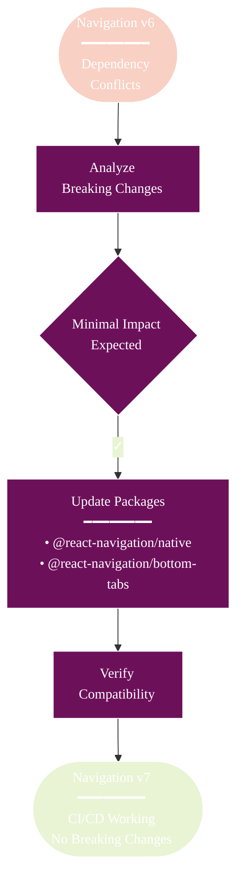

# React Navigation v7 Upgrade

## Overview

Athena has been upgraded from React Navigation v6 to v7 to maintain compatibility with Expo Router and resolve CI/CD dependency conflicts. This document details the upgrade process and changes made.

## Upgrade Summary



## Changes Made

### Package Updates

| Package | Before | After | Notes |
|---------|--------|-------|-------|
| @react-navigation/native | ^6.1.18 | ^7.0.14 | Required by expo-router |
| @react-navigation/bottom-tabs | ^6.6.1 | ^7.1.5 | Dependency alignment |
| @react-native-picker/picker | ^2.11.0 | 2.9.0 | Fixed to prevent conflicts |
| @types/react | ~18.3.23 | ~18.3.12 | Constrained for compatibility |

### Configuration Updates

**app.config.js**
```javascript
plugins: [
  'expo-router',
  'expo-secure-store',  // Added
  // ... other plugins
]
```

## Breaking Changes Assessment

### ✅ No Breaking Changes Detected

1. **Theme Configuration**: Already v7-compatible with fonts property
2. **Navigation APIs**: Using expo-router abstraction layer
3. **State Management**: No direct navigation state mutations
4. **Dependencies**: react-native-screens already at v4+

### Code Impact

**Affected Files**: Minimal
- `app/_layout.tsx` - No changes needed (themes already compatible)
- `app/(tabs)/_layout.tsx` - No changes needed (using expo-router)
- Test utilities - Already using compatible APIs

## Verification Steps

### 1. Dependency Installation
```bash
npm ci  # Should complete without ERESOLVE errors
```

### 2. Security Audit
```bash
npm audit  # Should show 0 vulnerabilities
```

### 3. Application Testing
```bash
npm start  # App should start without navigation errors
```

## Migration Guide for Developers

### If You're Updating From a Branch

1. **Clean Install Required**:
   ```bash
   rm -rf node_modules package-lock.json
   npm install
   ```

2. **Verify Versions**:
   ```bash
   npm list @react-navigation/native @react-navigation/bottom-tabs
   ```

3. **Test Navigation**:
   - All tabs should work
   - Theme switching should function
   - No console errors about navigation

### Common Issues and Solutions

**Issue**: ERESOLVE dependency conflicts
**Solution**: Use exact package versions as specified above

**Issue**: Type errors with React Navigation
**Solution**: Ensure @types/react is constrained to ~18.3.12

**Issue**: Picker component conflicts
**Solution**: Pin @react-native-picker/picker to exact version 2.9.0

## Benefits of the Upgrade

1. **CI/CD Compatibility**: Resolves npm ci errors in GitHub Actions
2. **Expo Router Alignment**: Matches internal expo-router requirements
3. **Future Proofing**: Stays current with React Navigation ecosystem
4. **Performance**: V7 includes performance improvements
5. **Type Safety**: Better TypeScript support

## Technical Details

### Why the Upgrade Was Necessary

Expo Router v4 internally depends on React Navigation v7, creating peer dependency conflicts when the project used v6. This caused CI/CD failures with ERESOLVE errors.

### Dependency Resolution Strategy

1. **Aligned with Expo SDK 52**: Used `npx expo install --fix`
2. **Pinned Critical Versions**: Exact versions for problematic packages
3. **Maintained Compatibility**: No API changes required

## Future Considerations

1. **Stay on Expo SDK Track**: Always use expo install for navigation packages
2. **Monitor Breaking Changes**: Future React Navigation updates may require code changes
3. **Test Thoroughly**: Navigation is critical infrastructure

## Related Documentation

- [React Navigation v7 Release Notes](https://reactnavigation.org/blog/2024/11/06/react-navigation-7.0/)
- [Expo Router Documentation](https://docs.expo.dev/router/introduction/)
- [Dependency Management Guide](../GETTING_STARTED.md#dependency-management)

---

**Last Updated**: 2025-05-28
**Status**: ✅ Complete
**Risk Assessment**: Low - No breaking changes detected