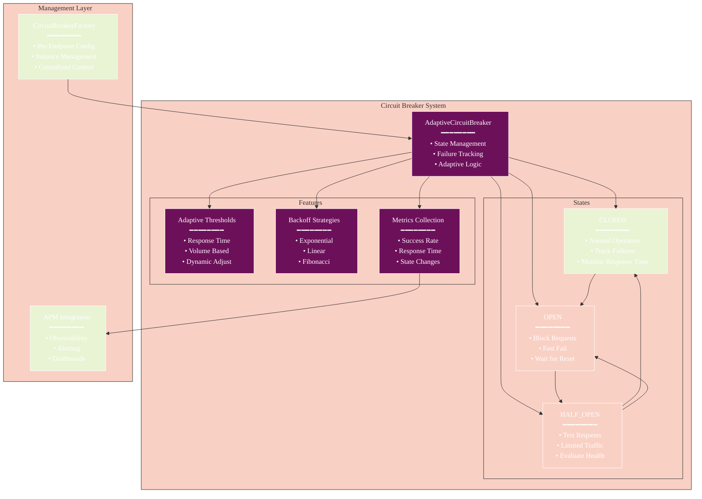
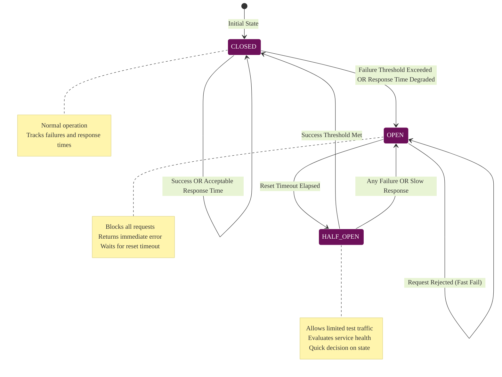
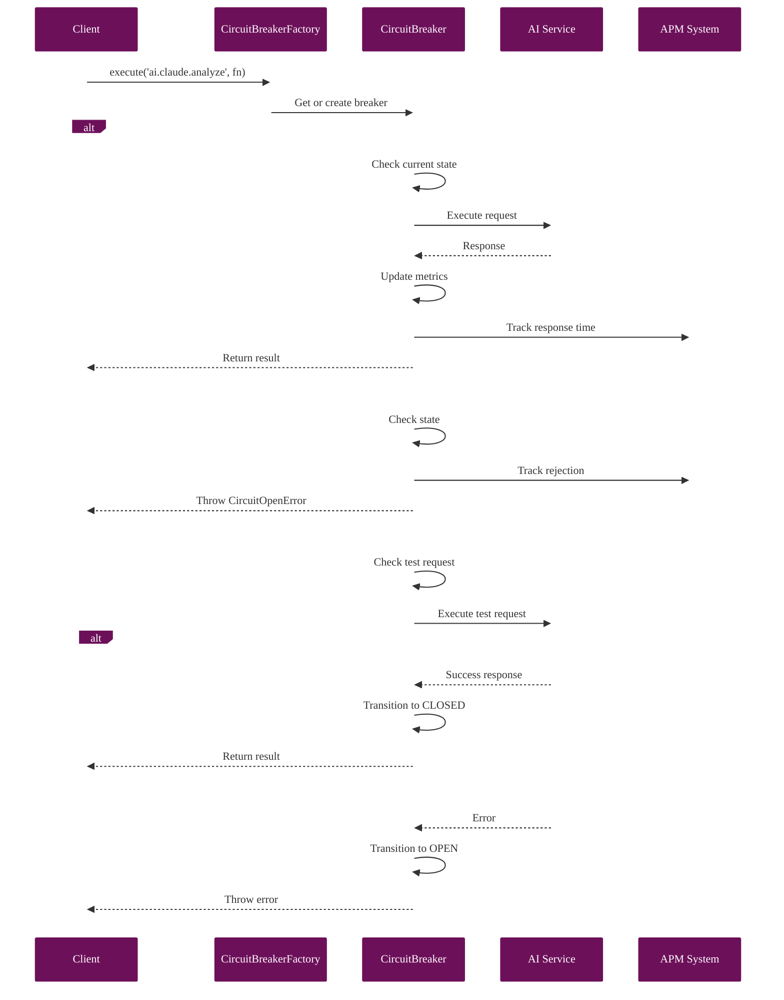
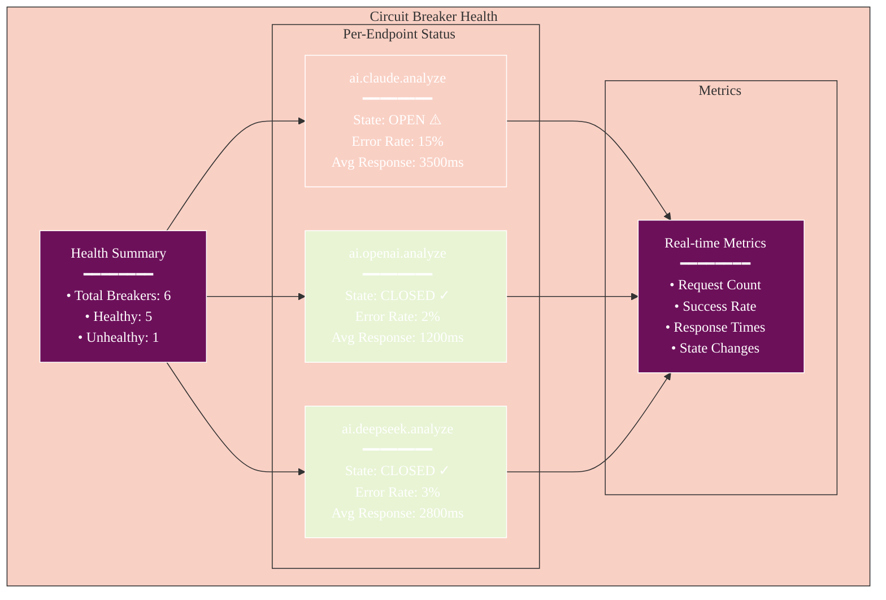
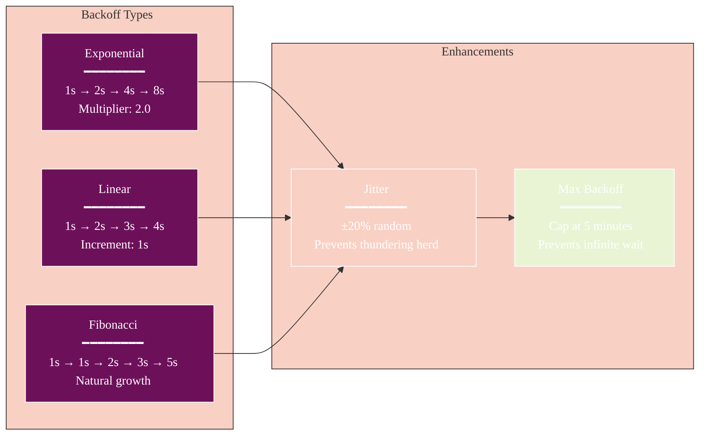

# Adaptive Circuit Breaker Implementation

**Last Updated:** December 2025
**Architecture:** Tauri 2.0 Desktop Application
**Implementation:** Rust (`src-tauri/src/ai_providers/circuit_breaker.rs`)
**Status:** Implemented

## Overview

The Athena platform implements a **Rust-based circuit breaker pattern** with automatic failure detection, state management, and recovery testing. The implementation protects AI provider integrations from cascading failures using three states (Closed, Open, HalfOpen) with configurable thresholds and Prometheus metrics integration.

## Key Features (December 2025)

### 1. Rust Implementation
- **Thread-Safe**: Uses `Arc<RwLock<CircuitState>>` for concurrent access
- **Atomic Counters**: `AtomicU32` for lock-free failure/success tracking
- **Type-Safe**: Leverages Rust's type system for state management
- **Zero-Cost Abstractions**: No runtime overhead

### 2. Three-State Machine
- **Closed**: Normal operation, tracks failures
- **Open**: Blocks requests, returns fast-fail errors
- **HalfOpen**: Tests recovery with limited requests

### 3. Automatic Recovery
- **Failure Threshold**: Opens after 3 consecutive failures
- **Success Threshold**: Closes after 2 successes in HalfOpen
- **Reset Timeout**: 30 seconds before HalfOpen retry
- **Provider-Specific**: Separate circuit per AI provider (Claude, OpenAI, DeepSeek, Gemini, Mistral, Groq)

### 4. Prometheus Metrics
- **AI_RATE_LIMIT_HITS**: Counter per provider when circuit is open
- **State Changes**: Logged for monitoring
- **Failure Counts**: Tracked for alerting

## Architecture



## State Transitions



### Components

1. **AdaptiveCircuitBreaker**: Enhanced circuit breaker with metrics
2. **CircuitBreakerFactory**: Manages per-endpoint instances
3. **Integration with APM**: Full observability

### Configuration

```typescript
// Default configuration
{
  // Basic thresholds
  failureThreshold: 3,
  successThreshold: 2,
  resetTimeout: 60000,
  
  // Adaptive features
  enableAdaptive: true,
  targetResponseTime: 1000,
  responseTimeThreshold: 2.0,
  
  // Backoff settings
  backoffStrategy: 'exponential',
  initialBackoff: 1000,
  maxBackoff: 300000,
  backoffJitter: true,
  
  // Volume thresholds
  minRequestVolume: 10,
  volumeWindow: 60000
}
```

### Per-Service Configuration

```typescript
// AI Services
'ai.claude.analyze': {
  targetResponseTime: 2000,
  responseTimeThreshold: 2.5,
  maxBackoff: 300000,
}

'ai.openai.analyze': {
  targetResponseTime: 1500,
  responseTimeThreshold: 3.0,
}

'ai.deepseek.analyze': {
  targetResponseTime: 3000,
  failureThreshold: 5, // More tolerant
}
```

## Usage

### Basic Usage

```typescript
import { circuitBreakerFactory } from '@/services/ai/circuitBreakerFactory';

// Execute with circuit breaker
const result = await circuitBreakerFactory.execute(
  'ai.claude.analyze',
  async () => {
    return await claudeService.analyze(data);
  }
);
```

### Direct Access

```typescript
// Get specific breaker
const breaker = circuitBreakerFactory.getBreaker('ai.openai.analyze');

// Execute operation
const result = await breaker.execute(async () => {
  return await openAIService.analyze(data);
});

// Check state
const state = breaker.getState(); // 'closed' | 'open' | 'half-open'

// Get statistics
const stats = breaker.getStats();
// {
//   state: 'closed',
//   failureCount: 0,
//   metrics: {
//     requestCount: 150,
//     avgResponseTime: 1250,
//     errorRate: 0.02
//   }
// }
```

## Request Flow



## Monitoring

### Health Dashboard



### APM Integration

Circuit breaker events are automatically tracked:
- `circuit_breaker.opened` - When circuit opens
- `circuit_breaker.rejected` - Rejected requests
- `circuit_breaker.response_time` - Response time histogram

### Metrics Dashboard

```typescript
const health = circuitBreakerFactory.getHealthSummary();
const allStats = circuitBreakerFactory.getAllStats();
```

## Failure Scenarios

### 1. Threshold-Based Opening
- After 3 consecutive failures (configurable)
- Circuit opens immediately
- Backoff period begins

### 2. Adaptive Opening
- Response time exceeds 2x target
- With minimum 10 requests in window
- Prevents performance degradation

### 3. Recovery Process
1. **Open State**: All requests fail fast
2. **Half-Open State**: Limited test requests
3. **Closed State**: Normal operation resumes

## Backoff Strategies



## Best Practices

### 1. Configuration
- Set realistic response time targets
- Use higher thresholds for backup services
- Enable jitter for distributed systems

### 2. Monitoring
- Track circuit breaker metrics
- Alert on sustained open states
- Monitor recovery patterns

### 3. Testing
- Load test with circuit breakers enabled
- Verify failover behavior
- Test recovery scenarios

## Load Testing

Use the k6 load tests to verify circuit breaker behavior:

```bash
# Test AI failover scenarios
npm run load-test:failover

# Full stress test
npm run load-test:stress
```

## Troubleshooting

### Circuit Won't Close
1. Check if service is actually healthy
2. Verify success threshold is reasonable
3. Check backoff multiplier hasn't grown too large

### Too Many Rejections
1. Increase failure threshold
2. Adjust response time targets
3. Consider disabling adaptive thresholds

### Performance Impact
- Circuit breaker adds <1ms overhead
- Metrics collection is asynchronous
- Memory usage scales with request history

## Future Enhancements

1. **Machine Learning**: Predict failures before they occur
2. **Distributed State**: Share circuit state across instances
3. **Custom Strategies**: Plugin architecture for backoff
4. **Advanced Metrics**: Percentile tracking, SLO integration