# Bulkhead Pattern Implementation

## Overview

The Athena platform implements the Bulkhead pattern to provide fault isolation between different services. This prevents a failure or resource exhaustion in one service from affecting others, similar to how bulkheads in a ship prevent water from flooding the entire vessel.

## Architecture

### System Architecture

```mermaid
%%{init: {
  'theme': 'base',
  'themeVariables': {
    'primaryColor': '#6d105a',
    'primaryTextColor': '#ffffff',
    'primaryBorderColor': '#ffffff',
    'lineColor': '#333333',
    'secondaryColor': '#e8f4d4',
    'secondaryTextColor': '#333333',
    'secondaryBorderColor': '#333333',
    'tertiaryColor': '#f9d0c4',
    'tertiaryTextColor': '#333333',
    'tertiaryBorderColor': '#333333',
    'background': '#ffffff',
    'mainBkg': '#6d105a',
    'secondBkg': '#e8f4d4',
    'tertiaryBkg': '#f9d0c4',
    'textColor': '#333333',
    'fontFamily': 'Arial, sans-serif'
  }
}}%%
graph TB
    subgraph "Client Requests"
        C1[Client 1]
        C2[Client 2]
        C3[Client 3]
        C4[Client N]
    end
    
    subgraph "Bulkhead Manager"
        BM[BulkheadManager<br/>━━━━━━━━<br/>• Route requests<br/>• Apply limits<br/>• Monitor health]
    end
    
    subgraph "Service Bulkheads"
        subgraph "AI Services"
            B1[Claude Bulkhead<br/>━━━━━━━━<br/>Max: 20<br/>Queue: 100]
            B2[OpenAI Bulkhead<br/>━━━━━━━━<br/>Max: 20<br/>Queue: 100]
        end
        
        subgraph "Container Ops"
            B3[Create Bulkhead<br/>━━━━━━━━<br/>Max: 5<br/>Queue: 20]
            B4[Monitor Bulkhead<br/>━━━━━━━━<br/>Max: 10<br/>Queue: 50]
        end
        
        subgraph "Database"
            B5[Read Bulkhead<br/>━━━━━━━━<br/>Max: 30<br/>Queue: 100]
            B6[Write Bulkhead<br/>━━━━━━━━<br/>Max: 15<br/>Queue: 50]
        end
    end
    
    subgraph "Global Semaphores"
        S1[CPU Intensive<br/>━━━━━━━━<br/>Permits: 5]
        S2[Memory Intensive<br/>━━━━━━━━<br/>Permits: 3]
        S3[Network I/O<br/>━━━━━━━━<br/>Permits: 50]
        S4[AI Total<br/>━━━━━━━━<br/>Permits: 30]
    end
    
    subgraph "Services"
        SVC1[Claude Service]
        SVC2[OpenAI Service]
        SVC3[Container Service]
        SVC4[Database Service]
    end
    
    C1 & C2 & C3 & C4 --> BM
    BM --> B1 & B2 & B3 & B4 & B5 & B6
    BM -.->|Acquires| S1 & S2 & S3 & S4
    B1 --> SVC1
    B2 --> SVC2
    B3 & B4 --> SVC3
    B5 & B6 --> SVC4
    
    style BM fill:#6d105a,color:#fff
    style B1 fill:#e8f4d4
    style B2 fill:#e8f4d4
    style B3 fill:#f9d0c4
    style B4 fill:#f9d0c4
    style B5 fill:#6d105a,color:#fff
    style B6 fill:#6d105a,color:#fff
```



### Bulkhead Execution Flow


### Components

1. **Bulkhead**: Thread pool isolation with queuing
2. **SemaphoreBulkhead**: Lightweight permit-based isolation
3. **BulkheadManager**: Centralized configuration and management

### Design Principles

- **Resource Isolation**: Each service gets its own thread pool
- **Queue Management**: Overflow requests are queued with timeouts
- **Graceful Degradation**: Services fail independently
- **Observable**: Full APM integration for monitoring

## Configuration

### Service-Specific Bulkheads

```typescript
// AI Services - Higher concurrency
'ai.claude': {
  maxConcurrent: 20,
  maxQueueSize: 100,
  queueTimeout: 60000, // 1 minute
}

// Container Operations - Limited concurrency
'container.create': {
  maxConcurrent: 5,
  maxQueueSize: 20,
  queueTimeout: 120000, // 2 minutes
}

// Database Operations
'db.read': {
  maxConcurrent: 30,
  maxQueueSize: 100,
  queueTimeout: 10000,
}
```

### Global Semaphores

```typescript
// Resource limits across services
'global.cpu_intensive': 5,     // Max 5 CPU-intensive operations
'global.memory_intensive': 3,   // Max 3 memory-intensive operations
'global.network_io': 50,        // Max 50 network operations
'ai.total_requests': 30,        // Max 30 total AI requests
```

## Usage Patterns

### Basic Bulkhead Usage

```typescript
import { bulkheadManager } from '@/services/pool/bulkheadManager';

// Execute with bulkhead protection
const result = await bulkheadManager.execute(
  'ai.claude',
  async () => {
    return await claudeService.analyze(data);
  }
);
```

### With Semaphore Protection

```typescript
// CPU-intensive operation
const result = await bulkheadManager.executeCpuIntensive(
  'image.processing',
  async () => {
    return await processImage(imageData);
  }
);

// Memory-intensive operation
const result = await bulkheadManager.executeMemoryIntensive(
  'data.analysis',
  async () => {
    return await analyzeLargeDataset(data);
  }
);
```

### AI Service with Global Limit

```typescript
// Automatically applies AI semaphore
const result = await bulkheadManager.executeAITask(
  'openai',
  async () => {
    return await openAIService.generateCode(prompt);
  }
);
```

### Custom Semaphore Combination

```typescript
const result = await bulkheadManager.execute(
  'complex.operation',
  async () => {
    return await performComplexTask();
  },
  {
    semaphores: ['global.cpu_intensive', 'global.memory_intensive'],
  }
);
```

## Integration with Circuit Breakers

### Circuit Breaker + Bulkhead Integration

```mermaid
%%{init: {
  'theme': 'base',
  'themeVariables': {
    'primaryColor': '#6d105a',
    'primaryTextColor': '#ffffff',
    'primaryBorderColor': '#ffffff',
    'lineColor': '#333333',
    'secondaryColor': '#e8f4d4',
    'secondaryTextColor': '#333333',
    'secondaryBorderColor': '#333333',
    'tertiaryColor': '#f9d0c4',
    'tertiaryTextColor': '#333333',
    'tertiaryBorderColor': '#333333',
    'background': '#ffffff',
    'mainBkg': '#6d105a',
    'secondBkg': '#e8f4d4',
    'tertiaryBkg': '#f9d0c4',
    'textColor': '#333333',
    'fontFamily': 'Arial, sans-serif'
  }
}}%%
flowchart TD
    Request[Incoming Request<br/>━━━━━━━━<br/>AI Analysis Task] --> CB{Circuit<br/>Breaker<br/>Open?}
    
    CB -->|Closed/Half-Open| BH{Bulkhead<br/>Capacity?}
    CB -->|Open| Fallback[Return Fallback<br/>━━━━━━━━<br/>• Cached result<br/>• Default response<br/>• Error message]
    
    BH -->|Available| Semaphore{Global<br/>Semaphore<br/>Available?}
    BH -->|Full| Queue{Queue<br/>Space?}
    
    Queue -->|Yes| Queued[Add to Queue<br/>━━━━━━━━<br/>Wait for capacity]
    Queue -->|No| Rejected[Reject Request<br/>━━━━━━━━<br/>Queue full error]
    
    Semaphore -->|Yes| Execute[Execute Task<br/>━━━━━━━━<br/>• Monitor execution<br/>• Track metrics<br/>• Handle errors]
    Semaphore -->|No| SemaphoreTimeout[Semaphore Timeout<br/>━━━━━━━━<br/>Global limit reached]
    
    Execute --> Success{Success?}
    Queued --> Execute
    
    Success -->|Yes| ReturnResult[Return Result<br/>━━━━━━━━<br/>Update metrics]
    Success -->|No| HandleError[Handle Error<br/>━━━━━━━━<br/>• Update CB state<br/>• Release resources<br/>• Log error]
    
    HandleError --> CBUpdate[Update Circuit<br/>Breaker State]
    ReturnResult --> CBUpdate
    
    style Request fill:#6d105a,color:#fff
    style Fallback fill:#f9d0c4
    style Rejected fill:#f9d0c4
    style SemaphoreTimeout fill:#f9d0c4
    style ReturnResult fill:#e8f4d4
    style Execute fill:#f9d0c4
```



The bulkhead pattern works in conjunction with circuit breakers:

```typescript
// Circuit breaker wraps bulkhead
const result = await circuitBreakerFactory.execute('ai.claude.analyze', async () => {
  return await bulkheadManager.executeAITask('claude', async () => {
    return await claudeService.analyze(data);
  });
});
```

**Execution Flow:**
1. Circuit breaker checks if service is available
2. Bulkhead checks resource availability
3. Semaphores ensure global limits
4. Task executes with full protection

## Monitoring and Metrics

### Bulkhead Health Dashboard

```mermaid
%%{init: {
  'theme': 'base',
  'themeVariables': {
    'primaryColor': '#6d105a',
    'primaryTextColor': '#ffffff',
    'primaryBorderColor': '#ffffff',
    'lineColor': '#333333',
    'secondaryColor': '#e8f4d4',
    'secondaryTextColor': '#333333',
    'secondaryBorderColor': '#333333',
    'tertiaryColor': '#f9d0c4',
    'tertiaryTextColor': '#333333',
    'tertiaryBorderColor': '#333333',
    'background': '#ffffff',
    'mainBkg': '#6d105a',
    'secondBkg': '#e8f4d4',
    'tertiaryBkg': '#f9d0c4',
    'textColor': '#333333',
    'fontFamily': 'Arial, sans-serif'
  }
}}%%
graph TB
    subgraph "Bulkhead Health Overview"
        subgraph "AI Services Health"
            AI1[Claude<br/>━━━━━━━━<br/>Active: 15/20<br/>Queue: 45/100<br/>Health: 🟢]
            AI2[OpenAI<br/>━━━━━━━━<br/>Active: 18/20<br/>Queue: 78/100<br/>Health: 🟡]
            AI3[DeepSeek<br/>━━━━━━━━<br/>Active: 8/10<br/>Queue: 12/50<br/>Health: 🟢]
        end
        
        subgraph "Container Services Health"
            C1[Create<br/>━━━━━━━━<br/>Active: 5/5<br/>Queue: 18/20<br/>Health: 🔴]
            C2[Monitor<br/>━━━━━━━━<br/>Active: 7/10<br/>Queue: 0/50<br/>Health: 🟢]
        end
        
        subgraph "Database Health"
            DB1[Read<br/>━━━━━━━━<br/>Active: 22/30<br/>Queue: 15/100<br/>Health: 🟢]
            DB2[Write<br/>━━━━━━━━<br/>Active: 12/15<br/>Queue: 8/50<br/>Health: 🟡]
        end
        
        subgraph "Global Semaphores"
            GS[Status<br/>━━━━━━━━<br/>CPU: 4/5 used<br/>Memory: 2/3 used<br/>Network: 35/50 used<br/>AI Total: 28/30 used]
        end
    end
    
    subgraph "Metrics"
        M1[Total Active: 97]
        M2[Total Queued: 176]
        M3[Rejected (1h): 23]
        M4[Avg Wait: 2.3s]
    end
    
    style AI2 fill:#f9d0c4
    style C1 fill:#6d105a,color:#fff
    style DB2 fill:#f9d0c4
    style GS fill:#6d105a,color:#fff
```

### Available Metrics

1. **Bulkhead Metrics**
   - `bulkhead.active`: Current active tasks
   - `bulkhead.queued`: Current queued tasks
   - `bulkhead.rejected`: Rejected due to full queue
   - `bulkhead.timeout`: Tasks that timed out in queue
   - `bulkhead.execution_time`: Task execution duration
   - `bulkhead.wait_time`: Queue wait time

2. **Semaphore Metrics**
   - `semaphore.available`: Available permits
   - `semaphore.timeout`: Acquisition timeouts

### Health Monitoring

```typescript
// Get overall health
const health = bulkheadManager.getHealthSummary();
// {
//   totalBulkheads: 10,
//   saturated: ['ai.claude', 'container.create'],
//   queuedTasks: 45,
//   activeTasks: 78
// }

// Get detailed statistics
const stats = bulkheadManager.getAllStats();
// Bulkhead-specific metrics for each service
```

## Best Practices

### 1. Sizing Bulkheads

- **AI Services**: Higher concurrency (15-20) due to I/O bound nature
- **Container Ops**: Lower concurrency (5-10) due to resource intensity
- **Database**: Moderate concurrency (10-30) based on connection pool
- **File Operations**: Based on disk I/O capacity

### 2. Queue Configuration

- Set queue size to 2-5x concurrent capacity
- Use shorter timeouts for user-facing operations
- Longer timeouts for background processing

### 3. Semaphore Usage

- Apply CPU semaphore for compute-intensive tasks
- Apply memory semaphore for large data processing
- Use service-specific semaphores for shared resources

### 4. Error Handling

```typescript
try {
  await bulkheadManager.execute('service', task);
} catch (error) {
  if (error.message.includes('queue is full')) {
    // Handle capacity issues
  } else if (error.message.includes('timed out')) {
    // Handle timeout
  }
}
```

## Performance Characteristics

### Overhead
- Bulkhead: ~1-2ms per execution
- Semaphore: <1ms per acquisition
- Memory: ~10KB per bulkhead + queue

### Capacity Planning

| Service Type | Concurrent | Queue Size | Timeout |
|-------------|------------|------------|---------|
| AI Primary | 20 | 100 | 60s |
| AI Backup | 10 | 50 | 90s |
| Container | 5 | 20 | 120s |
| Database Read | 30 | 100 | 10s |
| Database Write | 15 | 50 | 15s |

## Graceful Shutdown

```typescript
// During application shutdown
await bulkheadManager.drainAll();
```

This ensures:
- No new tasks are accepted
- Queued tasks are rejected
- Active tasks complete gracefully

## Troubleshooting

### High Queue Wait Times
1. Check if bulkhead is undersized
2. Look for slow operations blocking threads
3. Consider increasing concurrent capacity

### Frequent Rejections
1. Queue may be too small
2. Timeout may be too short
3. Consider implementing backpressure

### Semaphore Starvation
1. Check for permit leaks (not releasing)
2. Verify timeout configuration
3. Consider increasing permit count

## Future Enhancements

1. **Dynamic Sizing**: Adjust capacity based on load
2. **Priority Queues**: Urgent requests skip ahead
3. **Distributed Bulkheads**: Coordinate across instances
4. **Adaptive Timeouts**: Adjust based on response times