# Performance & Optimization Documentation

## 🧭 Navigation
- **📖 [Documentation Hub](../README.md)** ← Main navigation
- **🏗️ [Architecture](../ARCHITECTURE.md)** ← System design
- **🐛 [Troubleshooting](../TROUBLESHOOTING.md)** ← Performance issues

## Overview

Athena includes enterprise-grade performance optimizations and resilience patterns designed for production deployments. This section covers caching, circuit breakers, bulkhead patterns, monitoring, and configuration management.

## 📑 Performance Documentation Map

```mermaid
%%{init: {
  'theme': 'base',
  'themeVariables': {
    'primaryColor': '#6d105a',
    'primaryTextColor': '#ffffff',
    'primaryBorderColor': '#ffffff',
    'lineColor': '#333333',
    'secondaryColor': '#e8f4d4',
    'secondaryTextColor': '#333333',
    'secondaryBorderColor': '#333333',
    'tertiaryColor': '#f9d0c4',
    'tertiaryTextColor': '#333333',
    'tertiaryBorderColor': '#333333',
    'background': '#ffffff',
    'mainBkg': '#6d105a',
    'secondBkg': '#e8f4d4',
    'tertiaryBkg': '#f9d0c4',
    'textColor': '#333333',
    'fontFamily': 'Arial, sans-serif'
  }
}}%%
flowchart TD
    Start([Performance Docs]) --> Patterns{What are you<br/>looking for?}
    
    Patterns -->|Reliability| CB[🔧 Circuit Breakers<br/>━━━━━━━━<br/>Resilience patterns<br/>for AI services]
    
    Patterns -->|Resource Management| BH[🚧 Bulkhead Pattern<br/>━━━━━━━━<br/>Resource isolation<br/>and fault tolerance]
    
    Patterns -->|Speed| Cache[⚡ Redis Cache<br/>━━━━━━━━<br/>Distributed caching<br/>for performance]
    
    Patterns -->|Monitoring| APM[📊 APM Integration<br/>━━━━━━━━<br/>Application monitoring<br/>and metrics]
    
    Patterns -->|Configuration| FF[🎛️ Feature Flags<br/>━━━━━━━━<br/>Runtime configuration<br/>and A/B testing]
    
    CB --> Impl[Implementation<br/>Guide]
    BH --> Impl
    Cache --> Impl
    APM --> Impl
    FF --> Impl
    
    style Start fill:#e8f4d4
    style CB fill:#6d105a,color:#fff
    style BH fill:#f9d0c4
    style Cache fill:#e8f4d4
    style APM fill:#6d105a,color:#fff
    style FF fill:#f9d0c4
```

## 📚 Documentation Guide

### 🔧 Resilience Patterns
| Document | Purpose | When to Use |
|----------|---------|-------------|
| [**ADAPTIVE_CIRCUIT_BREAKER.md**](./ADAPTIVE_CIRCUIT_BREAKER.md) | Prevent cascading failures in AI services | AI providers failing or responding slowly |
| [**BULKHEAD_PATTERN.md**](./BULKHEAD_PATTERN.md) | Isolate resources between services | High load or resource contention |

### ⚡ Performance Optimization  
| Document | Purpose | When to Use |
|----------|---------|-------------|
| [**REDIS_CACHE_INTEGRATION.md**](./REDIS_CACHE_INTEGRATION.md) | Distributed caching for multi-instance deployments | Multiple Athena instances or frequent analysis |

### 📊 Monitoring & Configuration
| Document | Purpose | When to Use |
|----------|---------|-------------|
| [**APM_INTEGRATION.md**](./APM_INTEGRATION.md) | Application performance monitoring | Production deployments needing observability |
| [**FEATURE_FLAGS.md**](./FEATURE_FLAGS.md) | Runtime configuration and feature toggles | A/B testing or gradual feature rollouts |

## 🚀 Quick Start Guides

### 🆕 New to Performance Optimization?
1. Start with [**REDIS_CACHE_INTEGRATION.md**](./REDIS_CACHE_INTEGRATION.md) for immediate performance gains
2. Add [**APM_INTEGRATION.md**](./APM_INTEGRATION.md) for monitoring
3. Implement [**ADAPTIVE_CIRCUIT_BREAKER.md**](./ADAPTIVE_CIRCUIT_BREAKER.md) for reliability

### 🔧 Production Deployment?
1. **All patterns**: Implement circuit breakers, bulkheads, and caching
2. **Monitoring**: Set up APM integration for observability
3. **Configuration**: Use feature flags for runtime control

### 🐛 Performance Issues?
1. Check [**APM_INTEGRATION.md**](./APM_INTEGRATION.md) for monitoring setup
2. Review [**TROUBLESHOOTING.md**](../TROUBLESHOOTING.md) for common issues
3. Optimize with [**REDIS_CACHE_INTEGRATION.md**](./REDIS_CACHE_INTEGRATION.md)

## 📊 Performance Metrics

### Key Performance Indicators
- **Response Time**: < 2 seconds for cached results, < 30 seconds for new analysis
- **Availability**: > 99.9% uptime with circuit breaker protection
- **Throughput**: Handle 100+ concurrent analysis requests
- **Cache Hit Rate**: > 80% for repeated file analysis

### Monitoring Points
- AI service response times and error rates
- Cache hit/miss ratios and performance
- Resource utilization (CPU, memory, network)
- Container creation and execution times

## 🎯 Implementation Priorities

### Phase 1: Foundation
1. **Redis Caching** - Immediate performance improvement
2. **Basic APM** - Visibility into system performance

### Phase 2: Resilience  
1. **Circuit Breakers** - Protect against AI service failures
2. **Bulkhead Pattern** - Resource isolation

### Phase 3: Advanced
1. **Feature Flags** - Runtime configuration
2. **Advanced APM** - Business metrics and alerting

---

**💡 Pro Tip**: Each performance document includes implementation guides, configuration examples, and troubleshooting sections. Start with the Quick Start sections for immediate results!