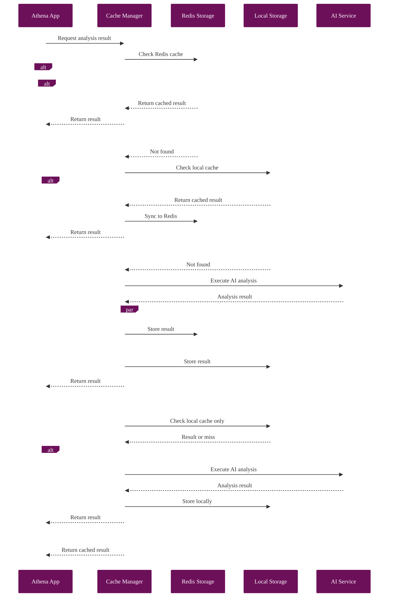
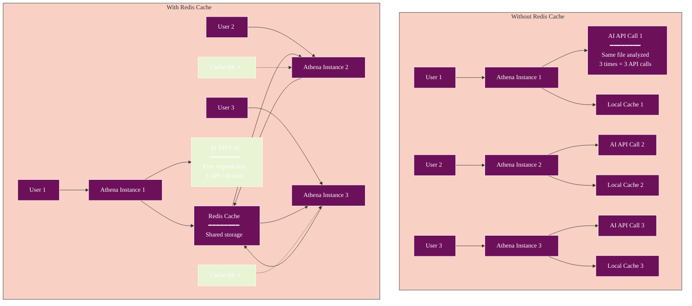

# Redis Cache Integration

## Overview

Athena supports distributed caching through Redis, providing enhanced performance and scalability for multi-instance deployments. The Redis integration seamlessly extends the existing cache system with automatic fallback to local storage.

## Features

- **Distributed Cache**: Share analysis results across multiple Athena instances
- **Automatic Fallback**: Falls back to local memory/IndexedDB when Redis is unavailable
- **Cache Synchronization**: Syncs local cache to Redis when connection is restored
- **TTL Support**: Automatic expiration of cached entries
- **Performance Monitoring**: Redis-specific metrics and statistics

## Configuration

### Environment Variables

Add these to your `.env` file:

```env
# Enable Redis caching
REDIS_ENABLED=true

# Redis connection settings
REDIS_HOST=localhost
REDIS_PORT=6379
REDIS_PASSWORD=your_password_here  # Optional
REDIS_DB=0
REDIS_KEY_PREFIX=athena:
```

### Docker Compose

Redis is included in the project's `docker-compose.yml`:

```bash
# Start Redis along with other services
docker-compose up -d redis

# Or start all services
docker-compose up -d
```

## Architecture

### Cache Storage Hierarchy

```mermaid
%%{init: {
  'theme': 'base',
  'themeVariables': {
    'primaryColor': '#6d105a',
    'primaryTextColor': '#ffffff',
    'primaryBorderColor': '#ffffff',
    'lineColor': '#333333',
    'secondaryColor': '#e8f4d4',
    'secondaryTextColor': '#333333',
    'secondaryBorderColor': '#333333',
    'tertiaryColor': '#f9d0c4',
    'tertiaryTextColor': '#333333',
    'tertiaryBorderColor': '#333333',
    'background': '#ffffff',
    'mainBkg': '#6d105a',
    'secondBkg': '#e8f4d4',
    'tertiaryBkg': '#f9d0c4',
    'textColor': '#333333',
    'fontFamily': 'Arial, sans-serif'
  }
}}%%
flowchart TD
    Service[AI Service Call<br/>━━━━━━━━<br/>• Analysis request<br/>• Provider: Claude/OpenAI<br/>• File hash: abc123] --> CM[Cache Manager<br/>━━━━━━━━<br/>• Check cache<br/>• Route to storage<br/>• Handle fallback]
    
    CM --> CheckRedis{Redis<br/>Available?}
    
    CheckRedis -->|Yes| Redis[Redis Storage<br/>━━━━━━━━<br/>• Primary cache<br/>• Distributed<br/>• Persistent]
    
    CheckRedis -->|No| Local[Local Fallback<br/>━━━━━━━━<br/>• Memory cache<br/>• IndexedDB<br/>• Instance-specific]
    
    Redis --> Found{Cache<br/>Hit?}
    Local --> Found
    
    Found -->|Yes| Return[Return Cached<br/>Result]
    Found -->|No| Execute[Execute AI<br/>Service Call]
    
    Execute --> Store[Store Result]
    Store --> StoreRedis{Redis<br/>Connected?}
    
    StoreRedis -->|Yes| BothStorage[Store in Both<br/>━━━━━━━━<br/>• Redis (primary)<br/>• Local (backup)]
    StoreRedis -->|No| LocalOnly[Store Local<br/>Only]
    
    BothStorage --> Return
    LocalOnly --> Return
    
    style Service fill:#6d105a
    style Redis fill:#e8f4d4
    style Local fill:#f9d0c4
    style Return fill:#e8f4d4
    style Execute fill:#6d105a
```

### Redis Integration Flow



### Implementation Details

1. **RedisCacheStorage**: Implements the `CacheStorage` interface
   - Handles Redis operations with automatic JSON serialization
   - Manages connection state and error handling
   - Provides fallback to local storage

2. **Cache Key Structure**: 
   - Format: `{prefix}{fileHash}:{analysisType}:{provider?}`
   - Example: `athena:analysis:abc123:deobfuscate:claude`

3. **Synchronization**:
   - Local changes are immediately written to Redis if connected
   - On reconnection, local cache is synced to Redis
   - Redis serves as the source of truth when available

## Usage

### Basic Usage

The Redis cache is automatically used when enabled:

```typescript
// Cache manager automatically uses Redis if enabled
const cacheManager = getCacheManager();

// Standard cache operations work transparently
const result = await cacheManager.get(key);
await cacheManager.set(key, value, { ttl: 3600000 });
```

### Direct Redis Cache Usage

```typescript
import { getRedisCacheManager } from '@/services/cache/redisFactory';

// Get Redis-backed cache manager
const redisCache = getRedisCacheManager({
  keyPrefix: 'custom:',
  fallbackToMemory: true
});

// Use like any cache manager
await redisCache.set('key', value);
const cached = await redisCache.get('key');
```

### Monitoring Redis Cache

```typescript
// Get Redis-specific statistics
const stats = await redisCache.getStats();
console.log({
  connected: stats.isConnected,
  size: stats.size,
  memoryUsage: stats.memoryUsage,
  localFallbackSize: stats.localFallbackSize
});
```

## Performance Benefits

### Distributed Cache Benefits



1. **Cross-Instance Sharing**: Multiple Athena instances share analysis results
2. **Reduced AI API Calls**: Cached results available to all instances
3. **Persistent Cache**: Survives application restarts
4. **Scalability**: Redis can handle millions of cached entries

## Operational Considerations

### Memory Management

Redis is configured with:
- Maximum memory: 256MB (configurable)
- Eviction policy: `allkeys-lru` (Least Recently Used)
- Persistence: Append-only file (AOF) enabled

### Monitoring

Monitor Redis health:

```bash
# Check Redis status
docker exec athena-redis redis-cli ping

# Monitor Redis stats
docker exec athena-redis redis-cli info stats

# Check memory usage
docker exec athena-redis redis-cli info memory
```

### Troubleshooting

1. **Connection Issues**:
   ```bash
   # Check Redis logs
   docker logs athena-redis
   
   # Test connection
   node scripts/test-redis-cache.js
   ```

2. **Clear Redis Cache**:
   ```bash
   # Clear all Athena cache entries
   docker exec athena-redis redis-cli --scan --pattern "athena:*" | xargs docker exec athena-redis redis-cli del
   ```

3. **Disable Redis Fallback**:
   ```env
   REDIS_ENABLED=false
   ```

## Security

1. **Network Isolation**: Redis runs in Docker network, not exposed externally
2. **Authentication**: Password protection supported (set `REDIS_PASSWORD`)
3. **Key Namespacing**: All keys prefixed to prevent conflicts
4. **No Sensitive Data**: Only analysis results cached, not raw files

## Future Enhancements

- [ ] Redis Cluster support for high availability
- [ ] Cache warming strategies
- [ ] Pub/Sub for cache invalidation
- [ ] Compression for large cache entries
- [ ] Cache analytics dashboard