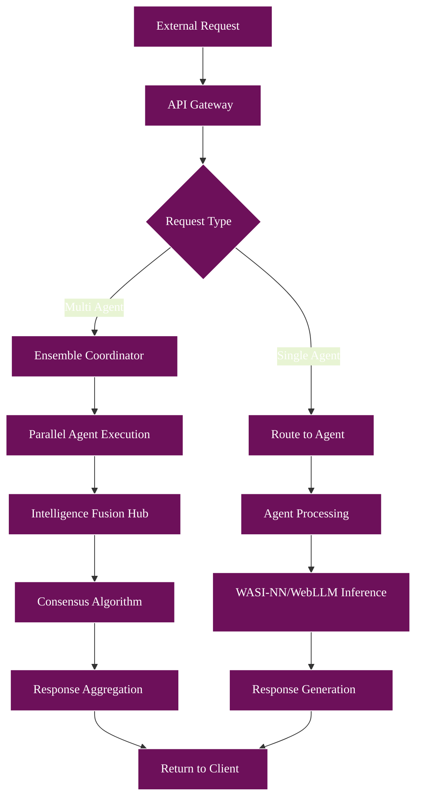
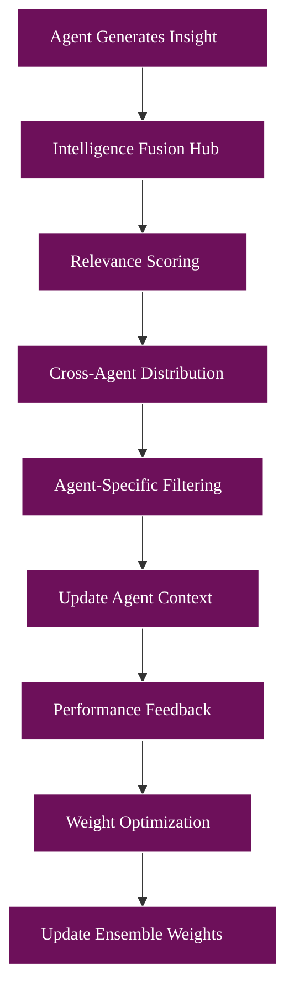

# Master Architecture Document - WASM-Native Cybersecurity AI Platform

## 🎯 Executive Overview

This document defines the complete technical architecture for a WASM-native cybersecurity AI platform featuring six specialized agents with ensemble intelligence capabilities. The system achieves < 1μs cold starts, 60% cost reduction vs. traditional containers, and 40-59% improvement in adversarial attack resistance.

## 🏗️ System Architecture Overview

### High-Level Component Diagram

```
┌─────────────────────────────────────────────────────────────────┐
│                    Global Edge Distribution                      │
│              (Fermyon Cloud + wasmCloud Lattice)               │
├─────────────────────────────────────────────────────────────────┤
│                  Athena Platform Core (Spin 2.0)               │
│  ┌─────────────┐ ┌─────────────┐ ┌─────────────┐ ┌──────────┐  │
│  │ API Gateway │ │ Ensemble    │ │ Intelligence│ │ Security │  │
│  │ (WASM)      │ │ Coordinator │ │ Fusion Hub  │ │ Manager  │  │
│  │             │ │ (WASM)      │ │ (WASM)      │ │ (WASM)   │  │
│  └─────────────┘ └─────────────┘ └─────────────┘ └──────────┘  │
│  ┌─────────────┐ ┌─────────────┐ ┌─────────────┐ ┌──────────┐  │
│  │ WASI-NN     │ │ WebLLM      │ │ Data Store  │ │ Monitor  │  │
│  │ Engine      │ │ Engine      │ │ Manager     │ │ Stack    │  │
│  │ (WASM)      │ │ (WASM)      │ │ (WASM)      │ │ (WASM)   │  │
│  └─────────────┘ └─────────────┘ └─────────────┘ └──────────┘  │
└─────────────────────────────────────────────────────────────────┘
          │                    │                    │
          ▼                    ▼                    ▼ 
┌─────────────────┐  ┌─────────────────┐  ┌─────────────────┐
│ 🦉 OWL AGENT    │  │ 🕸️ WEAVER AGENT │  │ 🛡️ AEGIS AGENT │
│ Security Tester │  │ Security Design │  │ Threat Analyst  │
│ wasmCloud Node  │  │ wasmCloud Node  │  │ wasmCloud Node  │
│ WASI-NN + WebLLM│  │ WebLLM + WASI-NN│  │ WASI-NN + WebLLM│
└─────────────────┘  └─────────────────┘  └─────────────────┘
┌─────────────────┐  ┌─────────────────┐  ┌─────────────────┐
│ 🔨 FORGE AGENT  │  │ 🏛️ POLIS AGENT  │  │ 🔬 DORU AGENT   │
│ Secure Dev      │  │ SRE Security    │  │ Malware RE      │
│ wasmCloud Node  │  │ wasmCloud Node  │  │ wasmCloud Node  │
│ WebLLM + WASI-NN│  │ WASI-NN + WebLLM│  │ WASI-NN + WebLLM│
└─────────────────┘  └─────────────────┘  └─────────────────┘
```

## 📋 Repository Structure

```
athena-cybersecurity-platform/
├── docs/                           # Architecture Documentation
│   ├── master-architecture.md
│   ├── athena-platform.md
│   ├── agent-architectures/
│   ├── infrastructure.md
│   └── implementation-plans/
├── athena-platform/                # Core Platform Repository
│   ├── components/                 # WASM Components
│   ├── capabilities/               # wasmCloud Capabilities
│   ├── deployment/                 # Multi-environment Deploy
│   ├── models/                     # Shared Data Models
│   └── tests/                      # Integration Tests
├── athena-owl/                     # Security Testing Agent
├── athena-weaver/                  # Security Design Agent  
├── athena-aegis/                   # Threat Analysis Agent
├── athena-forge/                   # Secure Development Agent
├── athena-polis/                   # SRE Security Agent
├── athena-doru/                    # Malware RE Agent
├── infrastructure/                 # Infrastructure as Code
│   ├── terraform/                  # Cloud Infrastructure
│   ├── kubernetes/                 # K8s WASM Runtime
│   ├── wasmcloud/                  # Lattice Configuration
│   └── monitoring/                 # Observability Stack
└── tools/                          # Development Tools
    ├── wasm-builder/               # WASM Build Pipeline
    ├── model-converter/            # WASI-NN Conversion
    ├── deployment-cli/             # Deployment Automation
    └── testing-framework/          # E2E Testing
```

## 🔧 Technology Stack

### Core WASM Technologies
- **Fermyon Spin 2.0**: Serverless WASM framework with Component Model
- **wasmCloud**: Distributed WASM orchestration platform
- **WASI Preview 2**: Advanced WebAssembly System Interface
- **Component Model**: Multi-language component composition
- **WASI-NN**: Standardized neural network interface
- **WebLLM**: High-performance edge LLM inference

### AI/ML Infrastructure
- **WASI-NN Providers**: ONNX, TensorFlow, PyTorch backends
- **WebGPU**: Hardware acceleration for WebLLM
- **Model Formats**: ONNX, WASI-NN, WebLLM-optimized
- **Hardware Targets**: CPU, GPU, TPU via WASI-NN

### Data & Communication
- **Message Format**: Component Model interfaces + JSON
- **Encryption**: ChaCha20-Poly1305 for agent communication
- **Authentication**: Ed25519 signatures + HMAC
- **Storage**: WASM-compatible key-value stores

### Deployment Infrastructure
- **Container Orchestration**: Kubernetes with WASM runtime
- **Edge Distribution**: Fermyon Cloud + CDN integration
- **Service Mesh**: wasmCloud lattice networking
- **Monitoring**: OpenTelemetry + Prometheus + Grafana

## 🌐 Network Architecture

### wasmCloud Lattice Configuration
```yaml
# Global lattice topology
lattice_name: "athena-production"
cluster_seed: "nats://nats.athena.global:4222"

regions:
  - name: "us-west"
    nodes: 3
    capabilities: ["wasi-nn-gpu", "webllm"]
  - name: "us-east" 
    nodes: 3
    capabilities: ["wasi-nn-gpu", "webllm"]
  - name: "eu-central"
    nodes: 2
    capabilities: ["wasi-nn-cpu", "webllm"]
  - name: "asia-pacific"
    nodes: 2
    capabilities: ["wasi-nn-cpu", "webllm"]
```

### Load Balancing Strategy
- **Geographic Routing**: Route to nearest available region
- **Capability-Aware**: Route to nodes with required AI capabilities
- **Load-Based**: Distribute based on current CPU/memory usage
- **Failure Handling**: Auto-failover to healthy nodes

## 🔐 Security Architecture

### Component-Level Security
```rust
// Security context for each WASM component
pub struct SecurityContext {
    // Capability-based permissions
    capabilities: CapabilitySet,
    // Resource limits
    memory_limit: usize,        // 50MB default
    cpu_time_limit: Duration,   // 100ms per request
    network_access: NetworkPolicy,
    file_access: FileSystemPolicy,
    // Authentication
    component_identity: ComponentIdentity,
    signing_key: Ed25519KeyPair,
}

pub struct CapabilitySet {
    can_access_wasi_nn: bool,
    can_access_webllm: bool,
    can_read_agent_data: HashSet<AgentType>,
    can_write_agent_data: HashSet<AgentType>,
    can_communicate_with: HashSet<AgentType>,
}
```

### Encryption & Authentication
- **At-Rest**: ChaCha20-Poly1305 for data storage
- **In-Transit**: TLS 1.3 for all network communication
- **Inter-Component**: Ed25519 signatures for message integrity
- **API Access**: JWT tokens with short expiration (15 minutes)

## 📊 Performance Requirements

### Target Metrics
```yaml
Performance_SLA:
  cold_start_time: "< 1 microsecond"
  warm_request_latency: "< 10 milliseconds"
  throughput_per_node: "> 15,000 requests/second"
  memory_per_agent: "< 50MB"
  cpu_efficiency: "> 80% native performance"
  
Availability_SLA:
  system_uptime: "99.9%"
  agent_availability: "99.7%"
  cross_region_failover: "< 5 seconds"
  
Accuracy_SLA:
  ensemble_improvement: "> 1.3% F1-score gain"
  adversarial_resistance: "> 40% attack reduction"
  false_positive_reduction: "> 25%"
```

### Resource Allocation
```yaml
Resource_Allocation:
  athena_platform_core: "4 vCPU, 8GB RAM"
  per_agent_instance: "2 vCPU, 4GB RAM, 1 GPU"
  wasi_nn_providers: "8 vCPU, 16GB RAM, 4 GPU"
  webllm_providers: "4 vCPU, 12GB RAM, 2 GPU"
  storage_per_agent: "100GB SSD"
```

## 🔄 Data Flow Architecture

### Request Processing Flow


### Intelligence Sharing Flow


## 🛠️ Development Workflow

### Build Pipeline
1. **Component Development**: Individual WASM components
2. **Model Training**: WASI-NN model generation
3. **Integration Testing**: Cross-component validation
4. **Performance Testing**: Load and latency validation
5. **Security Testing**: Penetration testing and audit
6. **Deployment**: Multi-environment rollout

### Testing Strategy
```yaml
Testing_Levels:
  unit_tests:
    - Individual component logic
    - WASI-NN model accuracy
    - WebLLM inference correctness
  
  integration_tests:
    - Cross-agent communication
    - Ensemble coordination
    - wasmCloud lattice behavior
  
  performance_tests:
    - Cold start measurements
    - Throughput benchmarking
    - Memory usage profiling
  
  security_tests:
    - Capability isolation validation
    - Adversarial attack resistance
    - Encryption verification
  
  end_to_end_tests:
    - Complete workflow validation
    - Multi-region deployment
    - Disaster recovery scenarios
```

## 📈 Monitoring & Observability

### Metrics Collection
```rust
pub struct PlatformMetrics {
    // Performance Metrics
    request_latency: Histogram,
    throughput: Counter,
    error_rate: Gauge,
    cold_start_time: Histogram,
    
    // AI Metrics
    model_accuracy: Gauge,
    inference_time: Histogram,
    ensemble_agreement: Gauge,
    agent_contribution: Counter,
    
    // System Metrics
    memory_usage: Gauge,
    cpu_utilization: Gauge,
    network_latency: Histogram,
    storage_utilization: Gauge,
    
    // Business Metrics
    threats_detected: Counter,
    vulnerabilities_found: Counter,
    false_positives: Counter,
    time_to_detection: Histogram,
}
```

### Alerting Configuration
```yaml
Alerting_Rules:
  performance:
    - alert: "HighLatency"
      condition: "request_latency_p95 > 100ms"
      severity: "warning"
    
    - alert: "LowThroughput" 
      condition: "throughput < 10000 req/s"
      severity: "critical"
  
  accuracy:
    - alert: "AccuracyDegradation"
      condition: "model_accuracy < 0.95"
      severity: "warning"
    
    - alert: "HighFalsePositives"
      condition: "false_positive_rate > 0.1"
      severity: "critical"
  
  system:
    - alert: "HighMemoryUsage"
      condition: "memory_usage > 80%"
      severity: "warning"
    
    - alert: "NodeDown"
      condition: "node_availability < 100%"
      severity: "critical"
```

## 🚀 Deployment Strategy

### Environments
```yaml
Environments:
  development:
    replicas: 1
    resources: "minimal"
    persistence: "temporary"
    
  staging:
    replicas: 2
    resources: "production-like"
    persistence: "7 days"
    
  production:
    replicas: 5
    resources: "full"
    persistence: "permanent"
    backup: "enabled"
```

### Rollout Strategy
1. **Blue-Green Deployment**: Zero-downtime deployments
2. **Canary Releases**: Gradual traffic shifting (5% → 25% → 100%)
3. **Feature Flags**: Runtime feature toggling
4. **Circuit Breakers**: Automatic failure isolation
5. **Rollback Procedures**: Automated rollback on failure detection

## 📋 Implementation Phases

### Phase 1: Core Infrastructure (Weeks 1-4)
- **Athena Platform Core**: API Gateway, basic coordination
- **WASI-NN Engine**: Hardware-accelerated inference
- **WebLLM Engine**: Edge LLM capabilities
- **Basic Security**: Authentication and authorization

### Phase 2: Agent Development (Weeks 5-12)
- **Doru Agent**: Malware reverse engineering (Priority 1)
- **Aegis Agent**: Threat analysis and correlation
- **Owl Agent**: Security testing and validation
- **Agent Integration**: Cross-agent communication

### Phase 3: Advanced Features (Weeks 13-16)
- **Weaver Agent**: Security design and modeling
- **Forge Agent**: Secure development assistance
- **Polis Agent**: SRE security integration
- **Ensemble Coordination**: Multi-agent workflows

### Phase 4: Production Readiness (Weeks 17-20)
- **Performance Optimization**: Sub-microsecond targets
- **Security Hardening**: Penetration testing and audit
- **Monitoring Integration**: Full observability stack
- **Documentation**: Operational runbooks

## 🔍 Success Criteria

### Technical Metrics
- **Cold Start Time**: < 1μs (measured)
- **Request Latency**: < 10ms p95 (measured)
- **Throughput**: > 15k req/s per node (measured)
- **Memory Efficiency**: < 50MB per agent (measured)
- **Accuracy**: > 1.3% F1-score improvement (validated)

### Business Metrics
- **Cost Reduction**: 60% vs. traditional containers
- **Security Improvement**: 40-59% adversarial resistance
- **Operational Efficiency**: 25% analyst time savings
- **Reliability**: 99.9% system availability
- **Developer Productivity**: 50% faster security integration

## 📚 Document Index

This master document references the following detailed technical specifications:

1. **athena-platform-architecture.md** - Core platform implementation
2. **athena-owl-architecture.md** - Security testing agent
3. **athena-weaver-architecture.md** - Security design agent
4. **athena-aegis-architecture.md** - Threat analysis agent
5. **athena-forge-architecture.md** - Secure development agent
6. **athena-polis-architecture.md** - SRE security agent
7. **athena-doru-architecture.md** - Malware RE agent
8. **infrastructure-architecture.md** - Supporting infrastructure
9. **implementation-plan.md** - Detailed build sequence
10. **testing-strategy.md** - Comprehensive testing approach

Each document provides implementation-ready specifications that development teams can execute independently while maintaining system coherence.