# Athena Testing Documentation

## 🧭 Navigation
- **📖 [Documentation Hub](../README.md)** ← Main navigation
- **🏗️ [Architecture](../ARCHITECTURE.md)** ← System design
- **🚀 [Quick Start](../QUICKSTART.md)** ← Get running quickly

## Overview

This directory contains comprehensive testing documentation for the Athena project, including unit, integration, and component testing strategies.

## Table of Contents

1. [Getting Started](./getting-started.md) - Quick start guide for running tests
2. [Testing Patterns](./patterns.md) - Common patterns and best practices
3. [Mocking Guidelines](./mocking.md) - How to mock dependencies effectively
4. [Component Testing](./component-testing.md) - Testing React Native components
5. [Service Testing](./service-testing.md) - Testing services and business logic
6. [API Testing](./api-testing.md) - Testing API integrations
7. [Store Testing](./store-testing.md) - Testing Zustand stores
8. [Integration Testing](./integration-testing.md) - Testing complete user workflows
9. [Troubleshooting](./troubleshooting.md) - Common issues and solutions

## Quick Commands

```bash
# Run all tests
npm test

# Run specific test file
npx jest path/to/test.test.ts --no-watchman

# Run tests with coverage
npm run test:coverage

# Run tests in watch mode
npm test -- --watch

# Check for circular dependencies
npx madge --circular .

# Verify production build
npm run test:production
```

## Test Statistics

As of Phase 6 completion:
- **Total Tests**: 250+ (and growing)
- **API Layer**: 51 tests ✅
- **Design System**: 17 tests ✅
- **Store**: 13 tests ✅
- **AI Services**: 82 tests ✅
- **Core Services**: 42+ tests ✅
- **Components**: 27+ tests ✅
- **Integration Tests**: 18+ tests ✅ (NEW)

## Testing Architecture

```mermaid
graph TB
    subgraph "Test Types"
        UT[Unit Tests<br/>━━━━━━━━<br/>• Services<br/>• Utilities<br/>• Hooks]
        CT[Component Tests<br/>━━━━━━━━<br/>• UI Components<br/>• Design System<br/>• User Interactions]
        IT[Integration Tests<br/>━━━━━━━━<br/>• User Workflows<br/>• API Integration<br/>• Store Integration]
        E2E[E2E Tests<br/>━━━━━━━━<br/>• Full App Flows<br/>• Real Environment<br/>• User Scenarios]
    end
    
    subgraph "Test Infrastructure"
        JEST[Jest<br/>━━━━━━━━<br/>• Test Runner<br/>• Assertions<br/>• Coverage]
        RTL[React Testing Library<br/>━━━━━━━━<br/>• Component Rendering<br/>• User Events<br/>• Queries]
        MOCK[Mock System<br/>━━━━━━━━<br/>• Module Mocks<br/>• API Mocks<br/>• Store Mocks]
    end
    
    subgraph "Test Utilities"
        FIXTURES[Test Fixtures<br/>━━━━━━━━<br/>• Mock Data<br/>• API Responses<br/>• Test Files]
        UTILS[Test Utils<br/>━━━━━━━━<br/>• Render Helpers<br/>• Store Setup<br/>• Custom Matchers]
    end
    
    UT --> JEST
    CT --> JEST
    CT --> RTL
    IT --> JEST
    IT --> RTL
    E2E --> JEST
    
    UT --> MOCK
    CT --> MOCK
    IT --> MOCK
    
    UT --> FIXTURES
    CT --> FIXTURES
    IT --> FIXTURES
    
    UT --> UTILS
    CT --> UTILS
    IT --> UTILS
    
    style UT fill:#e1f5e1
    style CT fill:#e1e5ff
    style IT fill:#fff4e1
    style E2E fill:#ffe4e1
    style JEST fill:#e1e5ff
    style RTL fill:#e1e5ff
    style MOCK fill:#fff4e1
    style FIXTURES fill:#e1f5e1
    style UTILS fill:#e1f5e1
```



## Test Execution Flow


## Test Coverage Strategy

```mermaid
graph LR
    subgraph "Coverage Targets"
        API[API Layer<br/>━━━━━━━━<br/>Target: 90%<br/>Current: 95%]
        SERVICES[Services<br/>━━━━━━━━<br/>Target: 85%<br/>Current: 88%]
        COMPONENTS[Components<br/>━━━━━━━━<br/>Target: 80%<br/>Current: 82%]
        STORE[Store<br/>━━━━━━━━<br/>Target: 90%<br/>Current: 92%]
    end
    
    subgraph "Coverage Types"
        STMT[Statement<br/>Coverage]
        BRANCH[Branch<br/>Coverage]
        FUNC[Function<br/>Coverage]
        LINE[Line<br/>Coverage]
    end
    
    API --> STMT
    API --> BRANCH
    API --> FUNC
    API --> LINE
    
    SERVICES --> STMT
    SERVICES --> BRANCH
    SERVICES --> FUNC
    SERVICES --> LINE
    
    COMPONENTS --> STMT
    COMPONENTS --> BRANCH
    COMPONENTS --> FUNC
    COMPONENTS --> LINE
    
    STORE --> STMT
    STORE --> BRANCH
    STORE --> FUNC
    STORE --> LINE
    
    style API fill:#e1f5e1
    style SERVICES fill:#e1f5e1
    style COMPONENTS fill:#e1f5e1
    style STORE fill:#e1f5e1
    style STMT fill:#e1e5ff
    style BRANCH fill:#e1e5ff
    style FUNC fill:#e1e5ff
    style LINE fill:#e1e5ff
```



## Testing Philosophy

1. **Test behavior, not implementation** - Focus on what the code does, not how
2. **Keep tests simple** - If a test is complex, the code might need refactoring
3. **Mock at boundaries** - Mock external dependencies, not internal implementations
4. **Test incrementally** - One test file at a time, verify stability after each change

## Mock Strategy

```mermaid
flowchart TB
    subgraph "Module Mocks"
        ENV[@env Module<br/>━━━━━━━━<br/>Environment vars]
        EFS[expo-file-system<br/>━━━━━━━━<br/>File operations]
        ICON[@expo/vector-icons<br/>━━━━━━━━<br/>Icon components]
        DEVICE[expo-device<br/>━━━━━━━━<br/>Device info]
    end
    
    subgraph "Service Mocks"
        API_MOCK[API Services<br/>━━━━━━━━<br/>• OpenAI<br/>• Claude<br/>• DeepSeek]
        STORE_MOCK[Store Mocks<br/>━━━━━━━━<br/>• useAppStore<br/>• State slices]
        DB_MOCK[Database<br/>━━━━━━━━<br/>• Container DB<br/>• Local storage]
    end
    
    subgraph "Test Files"
        UNIT[Unit Tests]
        COMP[Component Tests]
        INT[Integration Tests]
    end
    
    ENV --> UNIT
    ENV --> COMP
    ENV --> INT
    
    EFS --> UNIT
    EFS --> COMP
    
    ICON --> COMP
    DEVICE --> COMP
    
    API_MOCK --> UNIT
    API_MOCK --> INT
    
    STORE_MOCK --> COMP
    STORE_MOCK --> INT
    
    DB_MOCK --> UNIT
    DB_MOCK --> INT
    
    style ENV fill:#fff4e1
    style EFS fill:#fff4e1
    style ICON fill:#fff4e1
    style DEVICE fill:#fff4e1
    style API_MOCK fill:#e1e5ff
    style STORE_MOCK fill:#e1e5ff
    style DB_MOCK fill:#e1e5ff
    style UNIT fill:#e1f5e1
    style COMP fill:#e1f5e1
    style INT fill:#e1f5e1
```