# Athena Testing Documentation

## 🧭 Navigation
- **📖 [Documentation Hub](../README.md)** ← Main navigation
- **🏗️ [Architecture](../ARCHITECTURE.md)** ← System design
- **🚀 [Quick Start](../QUICKSTART.md)** ← Get running quickly

## Overview

This directory contains comprehensive testing documentation for the Athena project, including unit, integration, and component testing strategies.

## Table of Contents

1. [Getting Started](./getting-started.md) - Quick start guide for running tests
2. [Testing Patterns](./patterns.md) - Common patterns and best practices
3. [Mocking Guidelines](./mocking.md) - How to mock dependencies effectively
4. [Component Testing](./component-testing.md) - Testing React Native components
5. [Service Testing](./service-testing.md) - Testing services and business logic
6. [API Testing](./api-testing.md) - Testing API integrations
7. [Store Testing](./store-testing.md) - Testing Zustand stores
8. [Integration Testing](./integration-testing.md) - Testing complete user workflows
9. [Troubleshooting](./troubleshooting.md) - Common issues and solutions

## Quick Commands

```bash
# Run all tests
npm test

# Run specific test file
npx vitest path/to/test.test.ts

# Run tests in watch mode
npm run test:watch

# Run tests with UI
npx vitest --ui

# Check for circular dependencies
npx madge --circular .

# Verify production build
npm run test:production
```

## Test Statistics

Current Status:
- **Total Test Files**: 39 (35 unit + 4 integration)
- **Active Tests**: 550+ tests across 33 files
- **Skipped Test Suites**: 6 files
  - 2 Unit tests (localModels.test.ts, ai/manager.test.ts)
  - 4 Integration tests (see below)
- **Test Coverage**: High coverage on critical paths

### Skipped Tests
- **Unit Tests**:
  - `localModels.test.ts` - Memory issues with recursive initialization
  - `ai/manager.test.ts` - Complex initialization with intervals
- **Integration Tests**:
  - `file-upload-results-flow.test.tsx` - Complex async workflow
  - `streaming-analysis-flow.test.tsx` - Real-time progress updates  
  - `malware-analysis-workflow.test.tsx` - End-to-end workflow
  - `container-configuration-flow.test.tsx` - UI with collapsible sections

## Testing Architecture


## Test Execution Flow


## Test Coverage Strategy

```mermaid
%%{init: {
  'theme': 'base',
  'themeVariables': {
    'primaryColor': '#6d105a',
    'primaryTextColor': '#ffffff',
    'primaryBorderColor': '#ffffff',
    'lineColor': '#333333',
    'secondaryColor': '#e8f4d4',
    'secondaryTextColor': '#333333',
    'secondaryBorderColor': '#333333',
    'tertiaryColor': '#f9d0c4',
    'tertiaryTextColor': '#333333',
    'tertiaryBorderColor': '#333333',
    'background': '#ffffff',
    'mainBkg': '#6d105a',
    'secondBkg': '#e8f4d4',
    'tertiaryBkg': '#f9d0c4',
    'textColor': '#333333',
    'fontFamily': 'Arial, sans-serif'
  }
}}%%
graph LR
    subgraph "Coverage Targets"
        API[API Layer<br/>━━━━━━━━<br/>Target: 90%<br/>Current: 95%]
        SERVICES[Services<br/>━━━━━━━━<br/>Target: 85%<br/>Current: 88%]
        COMPONENTS[Components<br/>━━━━━━━━<br/>Target: 80%<br/>Current: 82%]
        STORE[Store<br/>━━━━━━━━<br/>Target: 90%<br/>Current: 92%]
    end
    
    subgraph "Coverage Types"
        STMT[Statement<br/>Coverage]
        BRANCH[Branch<br/>Coverage]
        FUNC[Function<br/>Coverage]
        LINE[Line<br/>Coverage]
    end
    
    API --> STMT
    API --> BRANCH
    API --> FUNC
    API --> LINE
    
    SERVICES --> STMT
    SERVICES --> BRANCH
    SERVICES --> FUNC
    SERVICES --> LINE
    
    COMPONENTS --> STMT
    COMPONENTS --> BRANCH
    COMPONENTS --> FUNC
    COMPONENTS --> LINE
    
    STORE --> STMT
    STORE --> BRANCH
    STORE --> FUNC
    STORE --> LINE
    
    style API fill:#e8f4d4
    style SERVICES fill:#e8f4d4
    style COMPONENTS fill:#e8f4d4
    style STORE fill:#e8f4d4
    style STMT fill:#6d105a,color:#fff
    style BRANCH fill:#6d105a,color:#fff
    style FUNC fill:#6d105a,color:#fff
    style LINE fill:#6d105a,color:#fff
```



## Recent Test Fixes

### Successfully Fixed Unit Tests
1. **FileUploader.test.tsx** - Fixed timer cleanup and mock structure
2. **useStreamingAnalysis.test.tsx** - Fixed async handling 
3. **featureFlags.test.ts** - Fixed localStorage isolation
4. **ContainerConfigSelector.test.tsx** - Changed from default to named export

### Key Changes Made
- Changed `ContainerConfigSelector` and `ContainerMonitoring` from default to named exports
- Created `__mocks__/design-system.js` for mocking design system components
- Fixed test data structures (e.g., nested `resources` object in ContainerConfig)
- Added proper timer management with `jest.useFakeTimers()` and `jest.useRealTimers()`
- Updated service function names (e.g., `removeContainer` instead of `stopContainer`)
- Fixed prop names (e.g., `onConfigChange` instead of `onChange`)

## Testing Philosophy

1. **Test behavior, not implementation** - Focus on what the code does, not how
2. **Keep tests simple** - If a test is complex, the code might need refactoring
3. **Mock at boundaries** - Mock external dependencies, not internal implementations
4. **Test incrementally** - One test file at a time, verify stability after each change
5. **Skip complex integration tests** - Until underlying functionality is complete

## Mock Strategy

```mermaid
%%{init: {
  'theme': 'base',
  'themeVariables': {
    'primaryColor': '#6d105a',
    'primaryTextColor': '#ffffff',
    'primaryBorderColor': '#ffffff',
    'lineColor': '#333333',
    'secondaryColor': '#e8f4d4',
    'secondaryTextColor': '#333333',
    'secondaryBorderColor': '#333333',
    'tertiaryColor': '#f9d0c4',
    'tertiaryTextColor': '#333333',
    'tertiaryBorderColor': '#333333',
    'background': '#ffffff',
    'mainBkg': '#6d105a',
    'secondBkg': '#e8f4d4',
    'tertiaryBkg': '#f9d0c4',
    'textColor': '#333333',
    'fontFamily': 'Arial, sans-serif'
  }
}}%%
flowchart TB
    subgraph "Module Mocks"
        ENV[@env Module<br/>━━━━━━━━<br/>Environment vars]
        EFS[expo-file-system<br/>━━━━━━━━<br/>File operations]
        ICON[@expo/vector-icons<br/>━━━━━━━━<br/>Icon components]
        DEVICE[expo-device<br/>━━━━━━━━<br/>Device info]
    end
    
    subgraph "Service Mocks"
        API_MOCK[API Services<br/>━━━━━━━━<br/>• OpenAI<br/>• Claude<br/>• DeepSeek]
        STORE_MOCK[Store Mocks<br/>━━━━━━━━<br/>• useAppStore<br/>• State slices]
        DB_MOCK[Database<br/>━━━━━━━━<br/>• Container DB<br/>• Local storage]
    end
    
    subgraph "Test Files"
        UNIT[Unit Tests]
        COMP[Component Tests]
        INT[Integration Tests]
    end
    
    ENV --> UNIT
    ENV --> COMP
    ENV --> INT
    
    EFS --> UNIT
    EFS --> COMP
    
    ICON --> COMP
    DEVICE --> COMP
    
    API_MOCK --> UNIT
    API_MOCK --> INT
    
    STORE_MOCK --> COMP
    STORE_MOCK --> INT
    
    DB_MOCK --> UNIT
    DB_MOCK --> INT
    
    style ENV fill:#f9d0c4
    style EFS fill:#f9d0c4
    style ICON fill:#f9d0c4
    style DEVICE fill:#f9d0c4
    style API_MOCK fill:#6d105a,color:#fff
    style STORE_MOCK fill:#6d105a,color:#fff
    style DB_MOCK fill:#6d105a,color:#fff
    style UNIT fill:#e8f4d4
    style COMP fill:#e8f4d4
    style INT fill:#e8f4d4
```