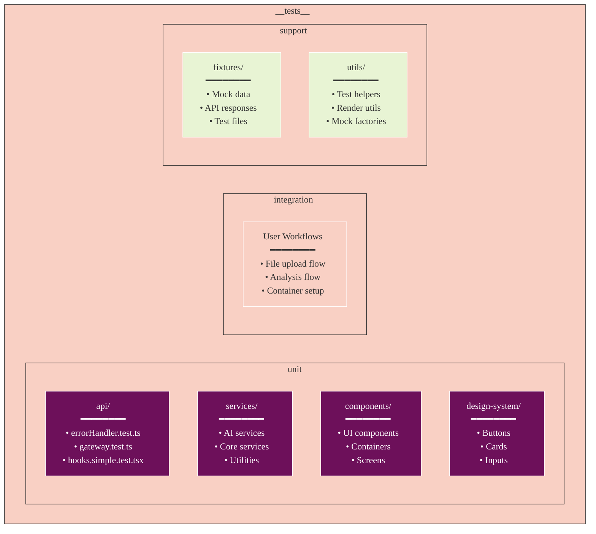
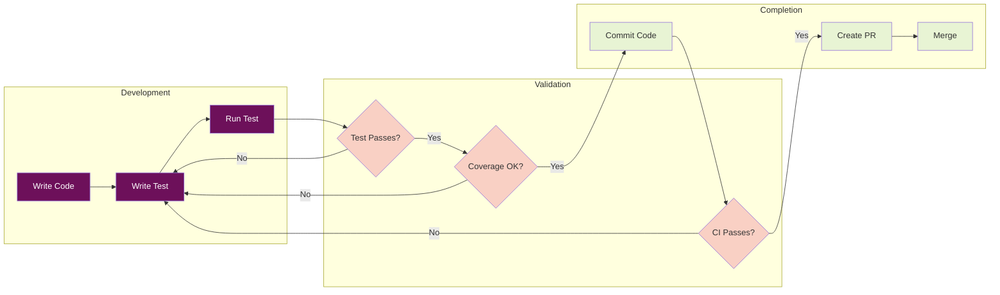

# Getting Started with Testing

## Prerequisites

- Node.js 18+ installed
- All dependencies installed (`npm install`)
- Understanding of Vitest and React Testing Library

## Running Tests

### Run All Tests
```bash
cd /workspaces/Athena/Athena
npm test
```

### Run Specific Test File
```bash
# Run a specific test file
npx vitest __tests__/unit/services/fileManager.test.ts

# Run recently fixed tests
npx vitest __tests__/unit/components/FileUploader.test.tsx
npx vitest __tests__/unit/hooks/useStreamingAnalysis.test.tsx
npx vitest __tests__/unit/services/config/featureFlags.test.ts
```

### Run Tests by Directory
```bash
# Run only unit tests (excluding integration)
npx vitest __tests__/unit/

# Run only component tests
npx vitest __tests__/unit/components/

# Run only service tests
npx vitest __tests__/unit/services/
```

### Run Tests in Watch Mode
```bash
npm run test:watch
```

### Run Tests with UI
```bash
npx vitest --ui
```

### Handling Test Timeouts
```bash
# For large test suites that may timeout
npm test -- --no-watch --testTimeout=30000

# Run tests in smaller batches
npm test -- --no-watch --maxWorkers=2
```

## Test Structure



## Test Workflow



## Writing Your First Test

1. Create a test file with `.test.ts` or `.test.tsx` extension
2. Import the module you want to test
3. Mock external dependencies
4. Write test cases using `describe` and `it` blocks

Example:
```typescript
import { myFunction } from '@/services/myService';

jest.mock('@/external/dependency');

describe('myFunction', () => {
  it('should return expected result', () => {
    const result = myFunction('input');
    expect(result).toBe('expected output');
  });
});
```

## Common Test Patterns

```mermaid
%%{init: {
  'theme': 'base',
  'themeVariables': {
    'primaryColor': '#6d105a',
    'primaryTextColor': '#ffffff',
    'primaryBorderColor': '#ffffff',
    'lineColor': '#333333',
    'secondaryColor': '#e8f4d4',
    'secondaryTextColor': '#333333',
    'secondaryBorderColor': '#333333',
    'tertiaryColor': '#f9d0c4',
    'tertiaryTextColor': '#333333',
    'tertiaryBorderColor': '#333333',
    'background': '#ffffff',
    'mainBkg': '#6d105a',
    'secondBkg': '#e8f4d4',
    'tertiaryBkg': '#f9d0c4',
    'textColor': '#333333',
    'fontFamily': 'Arial, sans-serif'
  }
}}%%
graph TB
    subgraph "Testing Patterns"
        ASYNC[Async Testing<br/>━━━━━━━━<br/>• async/await<br/>• waitFor<br/>• act wrapper]
        COMP[Component Testing<br/>━━━━━━━━<br/>• render()<br/>• fireEvent<br/>• screen queries]
        MOCK[Mocking<br/>━━━━━━━━<br/>• Module level<br/>• Before imports<br/>• Reset in afterEach]
        STORE[Store Testing<br/>━━━━━━━━<br/>• Mock useAppStore<br/>• Test actions<br/>• Test selectors]
    end
    
    subgraph "Best Practices"
        AAA[Arrange-Act-Assert<br/>━━━━━━━━<br/>• Setup test data<br/>• Execute action<br/>• Verify result]
        ISO[Test Isolation<br/>━━━━━━━━<br/>• Independent tests<br/>• Clean state<br/>• No side effects]
        DESC[Descriptive Names<br/>━━━━━━━━<br/>• Clear intent<br/>• Expected behavior<br/>• Edge cases]
    end
    
    ASYNC --> AAA
    COMP --> AAA
    MOCK --> ISO
    STORE --> ISO
    
    AAA --> DESC
    ISO --> DESC
    
    style ASYNC fill:#6d105a,color:#fff
    style COMP fill:#6d105a,color:#fff
    style MOCK fill:#f9d0c4,color:#333
    style STORE fill:#f9d0c4,color:#333
    style AAA fill:#e8f4d4,color:#333
    style ISO fill:#e8f4d4,color:#333
    style DESC fill:#e8f4d4,color:#333
```

## Next Steps

- Read [Testing Patterns](./patterns.md) for best practices
- Check [Mocking Guidelines](./mocking.md) for dependency mocking
- See [Troubleshooting](./troubleshooting.md) for common issues