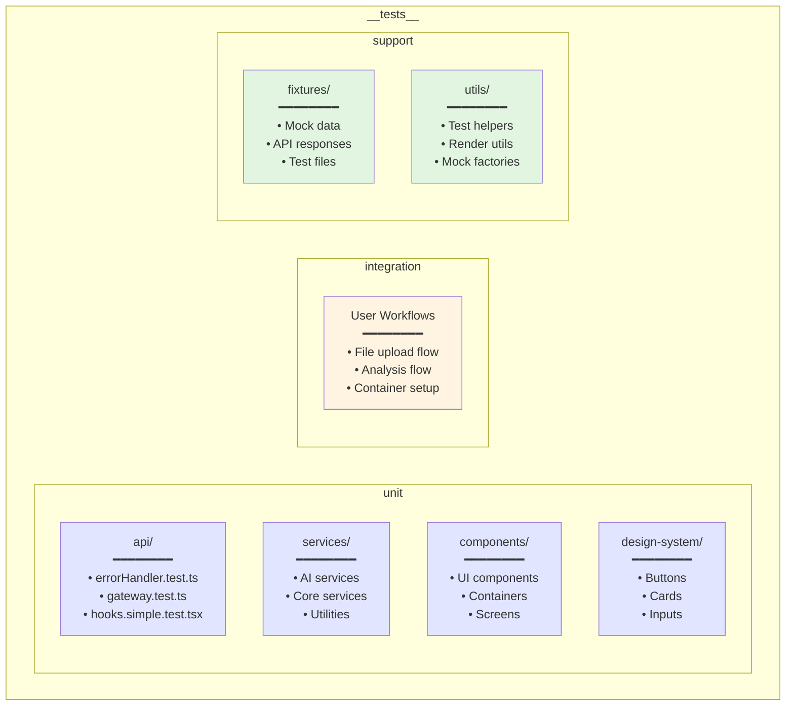
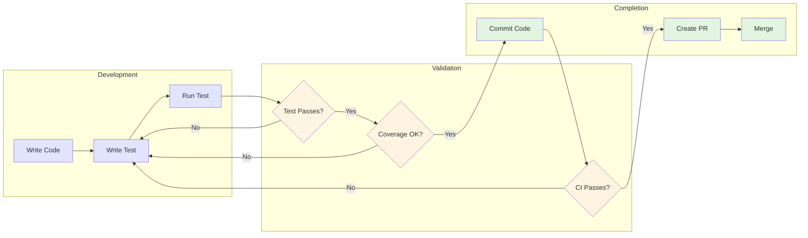

# Getting Started with Testing

## Prerequisites

- Node.js 18+ installed
- All dependencies installed (`npm install`)
- Understanding of Jest and React Testing Library

## Running Tests

### Run All Tests
```bash
cd /workspaces/Athena/Athena
npm test
```

### Run Specific Test File
```bash
npx jest __tests__/unit/services/fileManager.test.ts --no-watchman
```

### Run Tests in Watch Mode
```bash
npm test -- --watch
```

### Run Tests with Coverage
```bash
npm run test:coverage
```

## Test Structure



## Test Workflow



## Writing Your First Test

1. Create a test file with `.test.ts` or `.test.tsx` extension
2. Import the module you want to test
3. Mock external dependencies
4. Write test cases using `describe` and `it` blocks

Example:
```typescript
import { myFunction } from '@/services/myService';

jest.mock('@/external/dependency');

describe('myFunction', () => {
  it('should return expected result', () => {
    const result = myFunction('input');
    expect(result).toBe('expected output');
  });
});
```

## Common Test Patterns

```mermaid
graph TB
    subgraph "Testing Patterns"
        ASYNC[Async Testing<br/>━━━━━━━━<br/>• async/await<br/>• waitFor<br/>• act wrapper]
        COMP[Component Testing<br/>━━━━━━━━<br/>• render()<br/>• fireEvent<br/>• screen queries]
        MOCK[Mocking<br/>━━━━━━━━<br/>• Module level<br/>• Before imports<br/>• Reset in afterEach]
        STORE[Store Testing<br/>━━━━━━━━<br/>• Mock useAppStore<br/>• Test actions<br/>• Test selectors]
    end
    
    subgraph "Best Practices"
        AAA[Arrange-Act-Assert<br/>━━━━━━━━<br/>• Setup test data<br/>• Execute action<br/>• Verify result]
        ISO[Test Isolation<br/>━━━━━━━━<br/>• Independent tests<br/>• Clean state<br/>• No side effects]
        DESC[Descriptive Names<br/>━━━━━━━━<br/>• Clear intent<br/>• Expected behavior<br/>• Edge cases]
    end
    
    ASYNC --> AAA
    COMP --> AAA
    MOCK --> ISO
    STORE --> ISO
    
    AAA --> DESC
    ISO --> DESC
    
    style ASYNC fill:#e1e5ff
    style COMP fill:#e1e5ff
    style MOCK fill:#fff4e1
    style STORE fill:#fff4e1
    style AAA fill:#e1f5e1
    style ISO fill:#e1f5e1
    style DESC fill:#e1f5e1
```

## Next Steps

- Read [Testing Patterns](./patterns.md) for best practices
- Check [Mocking Guidelines](./mocking.md) for dependency mocking
- See [Troubleshooting](./troubleshooting.md) for common issues